# Conhecendo as Agências Estaduais
## Análise formal do regime jurídico das agências

---

## Divisão das dimensões
- Autonomia Institucional
- Boas Práticas Regulatórias
- Fiscalização e Julgamento
- Integridade e Governança
- Seleção dos Dirigentes

---

## Autonomia Institucional
- Previsões Expressas
  - Autonomia Administrativa (**+**)
  - Autonomia Financeira (**+**)
  - Autonomia Técnica (**+**)
  - Autonomia Patrimonial (**+**)
- Taxa de Regulação (**+**)
- Competência Normativa (**+**)
- Poder Concedente (**+**)

---

## Boas práticas regulatórias
- Agenda Regulatória (**+**)
- Análise de Impacto (**+**)
- Participação Social (**+**)

---

## Fiscalização e Julgamento
- Poder Sancionatório (**+**)
- Poder TAC (**+**)
- Multa (**+**)

---

## Integridade e governança
- Ouvidoria
  - Possui Ouvidoria (**+**)
  - Ouvidor Mandato Fixo (**+**)
- Programa de Compliance (**+**)
- Assessoria Jurídica (**+**)
- Grau e vinculação à PGE
  - Assessoria Vinculada PGE (**-**)
  - Assessores Procuradores (**-**)
  - Algum Procurador (**-**)

---

## Seleção dos Dirigentes
- Subdimensões
  - Requisitos e impedimentos
  - Processo de nomeação
  - Garantias funcionais

---

## Seleção dos Dirigentes - Subdimensões
- Requisitos e Impedimentos
  - Algum Impedimento Prévio Setor (**+**)
  - Alguma Vedação Setor Público (**+**)
  - Vedação Filiação Partidária (**+**)
  - Experiência Prévia (**+**)
  - Quarentena (**+**)

---

## Seleção dos Dirigentes - Subdimensões
- Processo de nomeação
  - Nomeação Exclusivamente pelo Governador (**+**)
  - Aprovação Assembleia (**+**)
  - Sabatina Assembleia (**+**)
  - Eleição Interna Presidente (**+**)
  - Indicação Livre Mandatos Provisórios (**-**)

---

## Seleção dos Dirigentes - Subdimensões
- Garantias funcionais
  - Mandato Definido (**+**)
  - Mandato Não-coincidente Diretores (**+**)
  - Mandato Não-coincidente Governador (**+**)
  - Prevê Casos Exoneração (**+**)
  - Prevê Procedimento Exoneração (**+**)

---

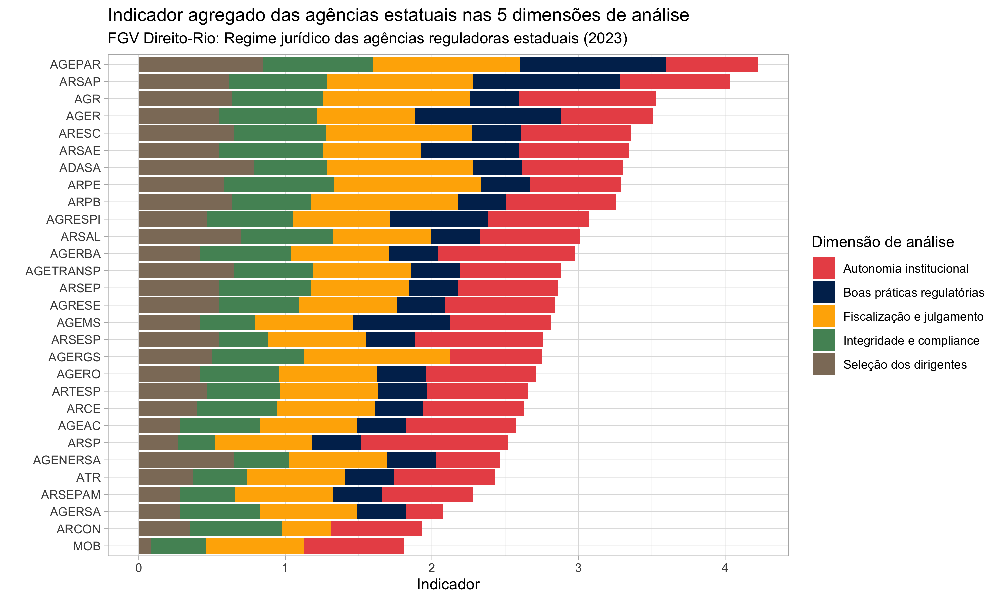

---

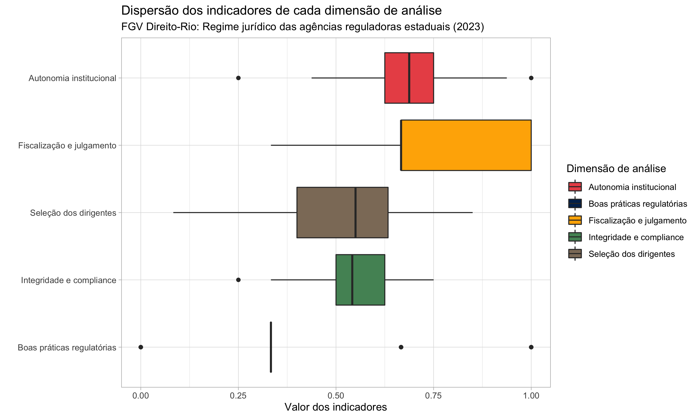

---

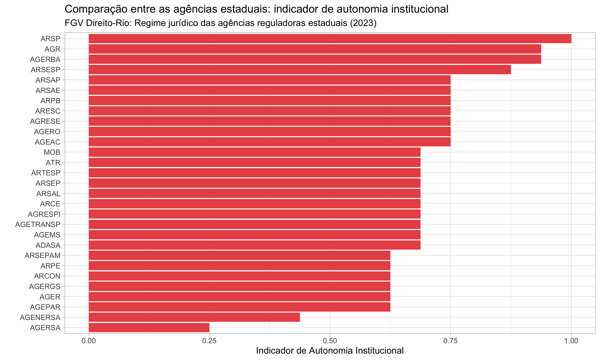

---

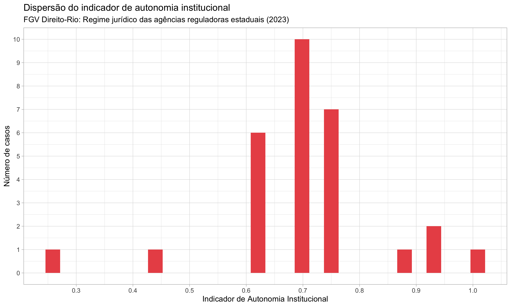

---

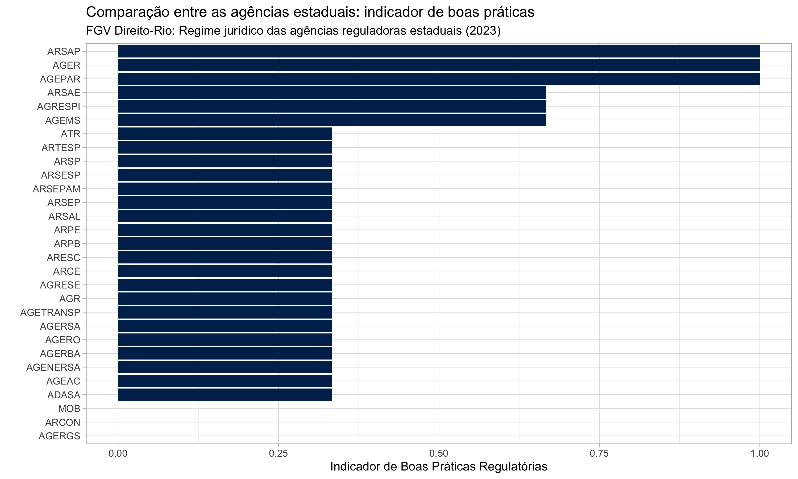

---

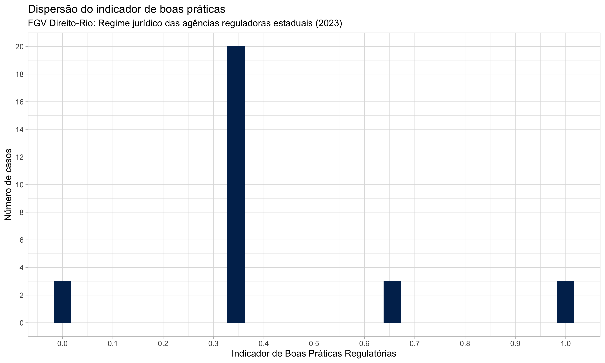

---

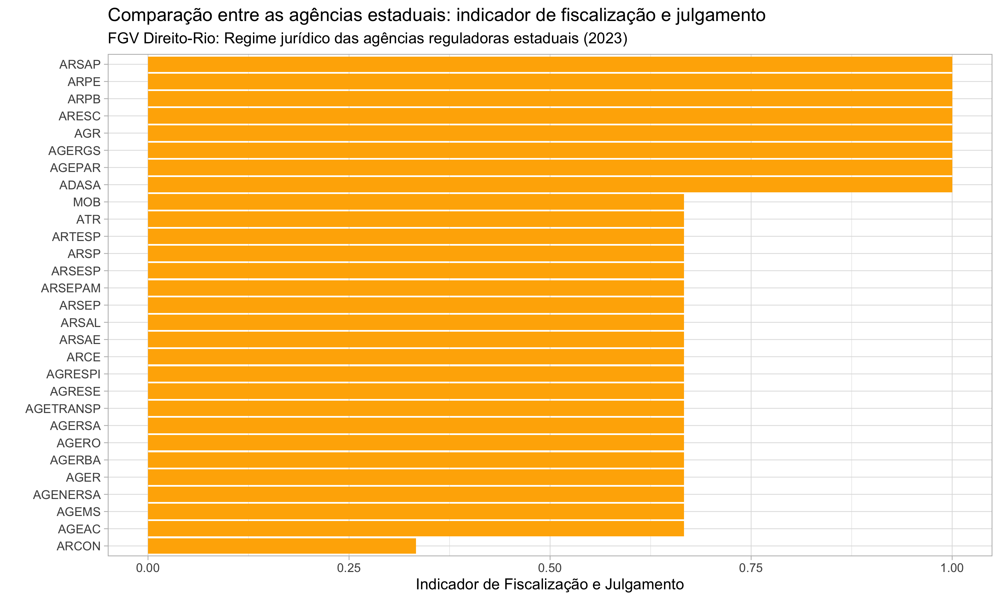

---

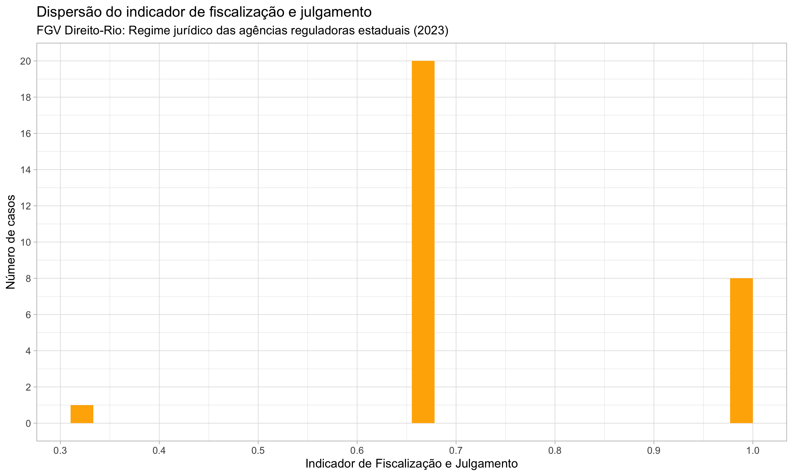

---

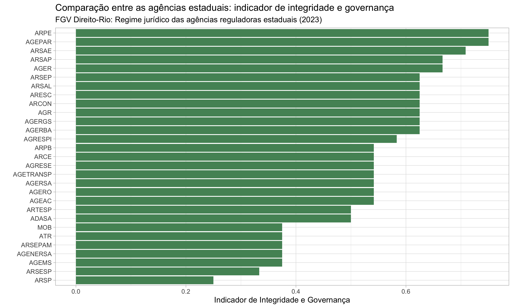

---

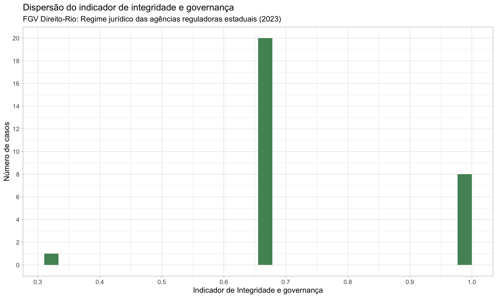

---

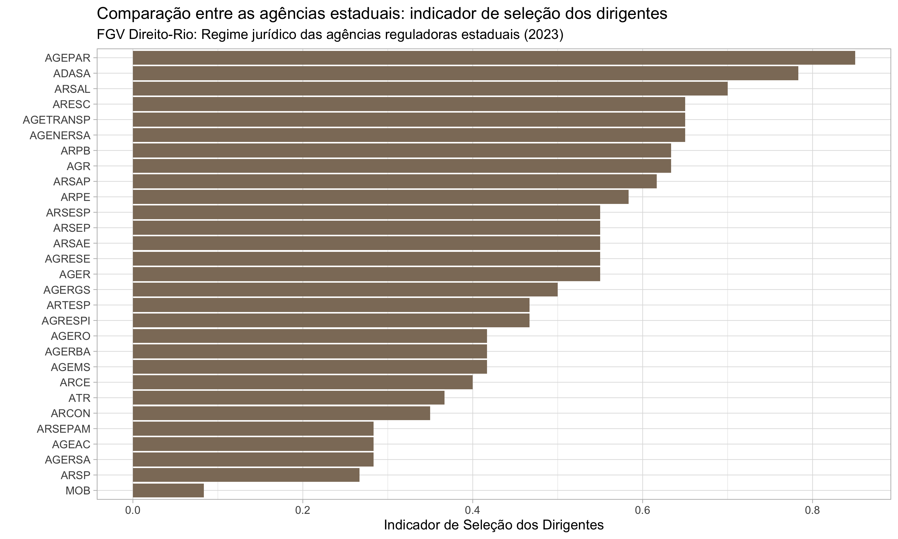

---

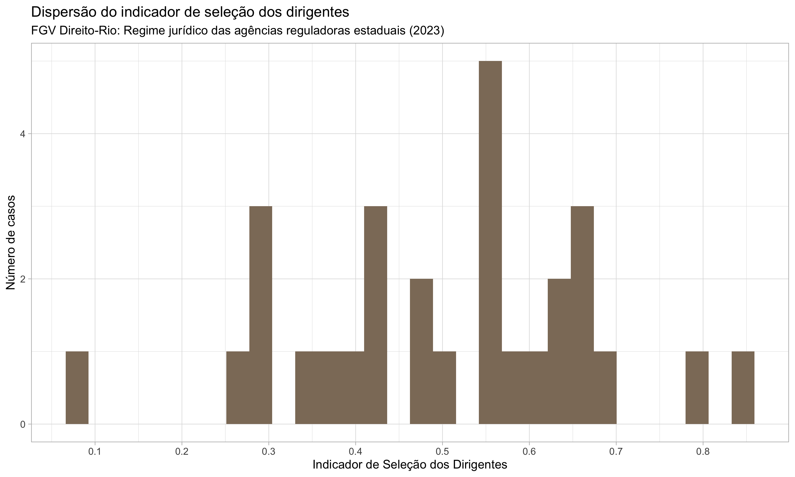

---

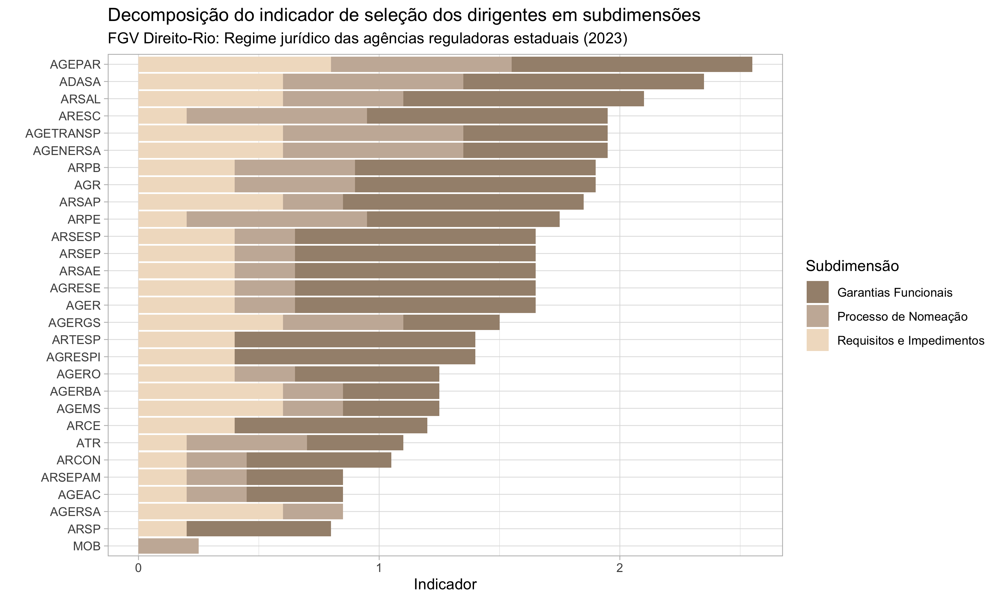

---

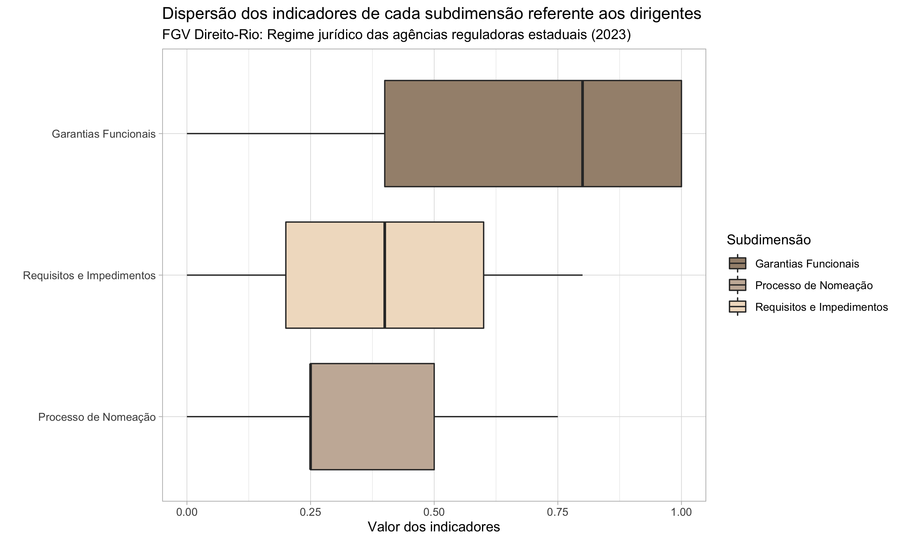

---

# <!--fit--> Voltando à análise da composição dos indicadores...

---

## Perguntas metodológicas
- Os agrupamentos de variáveis fazem sentido?
- Os nomes escolhidos são adequados?
- A composição dos valores (pelas subdimensões) é adequada?
- A categoria de dirigentes deve permanecer altamente agregada, ou deve ser desagregada?

---

## Autonomia Institucional (soma=4)
- Previsões Expressas
  - Autonomia Administrativa (**+**)
  - Autonomia Financeira (**+**)
  - Autonomia Técnica (**+**)
  - Autonomia Patrimonial (**+**)
- Taxa de Regulação (**+**)
- Competência Normativa (**+**)
- Poder Concedente (**+**)

---

## Boas práticas regulatórias (soma=3)
- Agenda Regulatória (**+**)
- Análise de Impacto (**+**)
- Participação Social (**+**)

---

## Fiscalização e Julgamento (soma=3)
- Poder Sancionatório (**+**)
- Poder TAC (**+**)
- Multa (**+**)

---

## Integridade e governança (soma=4)
- Ouvidoria
  - Possui Ouvidoria (**+**)
  - Ouvidor Mandato Fixo (**+**)
- Programa de Compliance (**+**)
- Assessoria Jurídica (**+**)
- Grau e vinculação à PGE
  - Assessoria Vinculada PGE (**-**)
  - Assessores Procuradores (**-**)
  - Algum Procurador (**-**)

---

## Seleção dos Dirigentes (soma=3)
- Subdimensões
  - Requisitos e impedimentos
  - Processo de nomeação
  - Garantias funcionais

---

## Seleção dos Dirigentes - Subdimensões
- Requisitos e Impedimentos
  - Algum Impedimento Prévio Setor (**+**)
  - Alguma Vedação Setor Público (**+**) *mudar p/ agentes políticos?*
  - Vedação Filiação Partidária (**+**)
  - Experiência Prévia (**+**)
  - Quarentena (**+**)

---

## Seleção dos Dirigentes - Subdimensões
- Processo de nomeação
  - Nomeação Exclusivamente pelo Governador (**+**)
  - Aprovação Assembleia (**+**)
  - Sabatina Assembleia (**+**)
  - Eleição Interna Presidente (**+**)
  - Indicação Livre Mandatos Provisórios (**-**)

---

## Seleção dos Dirigentes - Subdimensões
- Garantias funcionais
  - Mandato Definido (**+**)
  - Mandato Não-coincidente Diretores (**+**)
  - Mandato Não-coincidente Governador (**+**)
  - Prevê Casos Exoneração (**+**)
  - Prevê Procedimento Exoneração (**+**)
