

 

# Instrumentos Políticos de Controle Parlamentar da Burocracia Regulatória
## Poder Legislativo e Política Regulatória – 2023.1
**Profas: Natasha Salinas e Roberta Simões**
Relator: Lucas Thevenard

---
<!-- 
paginate: true 
header: Instrumentos Políticos de Controle Parlamentar da Burocracia Regulatória
footer: lucas.gomes@fgv.br | 04/04/2023
-->

## Textos da aula
* BEERMANN, Jack M. *Congressional Administration*, San Diego Law Review, vol. 43, p. 61-158, 2006, p. 121-144.
* GRIGLIO, Elena. *Parliamentary Oversight of the Executives. Tools and Procedures in Europe*. Hart Publishing, 2020. (Cap. 2, p. 23-53).
* MCCUBBINS, Mathew D.; SCHWARTZ Thomas. Congressional Oversight Overlooked: Police Patrols versus Fire Alarms. *The American Journal of Political Science*, v. 28, nº 1, 1984, p. 165-179.
* LEMOS, Leany Barreiro. Como o Congresso brasileiro controla o Executivo? O uso de requerimentos de informação, convocação de autoridades e propostas de fiscalização e controle. *In*: *Controle parlamentar na Alemanha, na Argentina e no Brasil*. Rio de Janeiro: Fundação Konrad Adenauer, 2005, p. 85-112.

---

# Congressional Administration

BEERMANN, Jack M. Congressional Administration, **San Diego Law Review**, vol. 43, p. 61-158, 2006, p. 121-144.

---

### Jack Beermann

 

- Boston University School of Law
  - Direito Administrativo
  - Perspectiva histórica
- Foi assistente do juiz Richard Cudahy do 7º Circuito da CoA
- Deu aula na Alemanha, China, Austrália, Marrocos, Portugal e Canadá.
- Foi visiting professor em Harvard.

---

## Congressional Administration

* Contexto: Disputas pelo controle da Administração:

  * "Embora já se tenha passado mais de um século desde que o estado administrativo nasceu nos Estados Unidos, ainda há muita incerteza sobre a distribuição adequada e real de poderes no governo. Há uma luta contínua entre o Presidente e o Congresso pelo controle da Administração." (p. 62)

  * Controvérsias sobre: *limites da delegação (NDD)*, *revisão judicial dos atos das agências (Chevron)*, etc.

---

## Congressional Administration

* Envolvimento do Congresso na Administração das Leis:

  * Métodos formais
  * **Métodos informais**
    * Ubiquidade e persistência
    * Ameaça de segundo plano
    * Relação entre os dois tipos de método:
      - Exemplo: obrigação formal de reportar periodicamente ao Congresso desencadeia audiências perante as comissões.

---

## Métodos informais

- Supervisão Direta
- Instituições de Supervisão
- Contatos Informais
- Histórico Legislativo
- Supervisão dos Procedimentos de Indicação
- Supervisão das Designações Orçamentárias
- Análise casuística

---

## Supervisão - definição

* "A supervisão é a face pública de uma vasta rede de contatos entre membros do Congresso (e suas equipes) e funcionários dos órgãos reguladores, incluindo os diretores das agências (e suas equipes)."
*  Atividades comuns:
   - Recebimento de informações
   - Audiências em comissões e subcomissões

---

## Supervisão - características gerais

* Generalização em razão do Legislative Reorganization Act de 1946

  * Padronização das comissões da Câmara e do Senado
  * Formação de um corpo técnico profissional
  * Função assessível para congressistas interessados em atuar junto a uma agência

---

## Supervisão - debate normativo

> Os presidentes dos comitês do Congresso são, em grande medida, executivos rivais aos secretários de gabinete cujos departamentos e escritórios pessoais eles supervisionam. (Calabresi)

* Monstro de muitas cabeças? (alto número de comissões e subcomissões)
* Remédio para o problema da delegação ampla?
* Visões muito divergentes

---

## Supervisão - para que serve as audiências?

* Recebimento de informações pelo Congresso.
* Admoestações destinadas ao eleitorado:
  - Audiências "coreografadas"
  - Demagogia, participação de eleitores
* Acordos tácitos entre a agência e a comissão
  - **Não há efeito vinculante** (decisão do caso Chadha estabelece necessidade de bicameralismo)
  - **Acordos informais** são possíveis
    - Ameaça velada: Congresso controla o orçamento e aspectos substantivos. 

---

## Supervisão – Efeitos

- Efeta a dinâmica do equilíbrio entre os poderes.
- Atos potencialmente oneroso ao Poder Executivo:
  - Possibilidade de intimar testemunhas 
  - Possibilidade de requisitar documentos

---

 

 

**Exemplo: Investigações do Departamento de Justiça que exigem sigilo:**

> As demandas públicas de membros do Congresso por informações podem colocar o Presidente em uma posição desconfortável de sentir a necessidade de manter o sigilo, enquanto os membros do Congresso afirmam que a única razão para o sigilo é evitar constrangimento político. (p. 127)

---

## Instituições de Supervisão

* **GAO: Government Accountability Office**
  - Cerca de 3.300 funcionários.
* Controlador General:
  - Mandato de 15 anos
  - Processo complexo de nomeação: Presidente escolhe de uma lista elaborada pela Câmara, com consentimento do Senado
  - Demissível por resolução conjunta do Congresso
* Relatórios focam em problemas e limitações do governo Federal
  - 83% das 2.700 recomendações foram aceitas

---

## Instituições de Supervisão

* **CRS: Congressional Research Service**
  - Cerca de 729 funcionários
* Produzem cerca de 1000 relatórios por ano e atualizam outros 4000
  - Produção de análises independentes sobre praticamente todos os temas da Administração Pública

---

## Contatos Informais

* Contato indireto (em caráter privado/individual) com funcionários da agência para influenciar suas decisões
  - Vulgo "0800"
  - Ausência de limitações legais na ausência de procedimentos formais de adjudicação ou de produção normativa
* Jurisprudência em procedimentos formais (caso *HBO* e caso *Sierra Club*)
  - Necessidade de direcionar os comentários a questões de mérito
  - Necessidade de divulgar o teor das discussões em registro público

---

## Contatos Informais

> "O entendimento da Corte reconheceu a ubiquidade das pressões do Congresso sobre as agências, mas a expectativa de que as agências conseguirão balancear as pressões do Congresso com pressões de outras fontes pode ser algo irrealista. Permitir que congressistas pressionem vigorosamente as agências em prol dos interesses de seus eleitores dá aos congressistas uma poderosa ferramente para influenciar as ações das agências na direção de suas preferências". (p. 134)

---

## Contatos Informais

- **Caso Keating**: pressões de 5 senadores para que não fossem aprovadas normas com regras restritivas relacionadas a financiamentos imobiliários e para que as instituições de Charles Keating (um importante financiador de campanhas) não fossem investigadas.
- O caso foi investigado pelo comitê de ética do Senado, mas não foi identificada nenhuma violação de lei ou do regulamento do Senado. 

---

## Contatos Informais

* Contribuições de Congressistas em processos de Participação Social.

  * Método desvantajoso se a posição tomada é contrária a parte da base eleitoral.
  * Tem a vantagem de evitar os problemas éticos e jurídicos dos contatos mais informais.

---

### OBS: Caso da revisão tarifária da CEMIG pela ANEEL

 

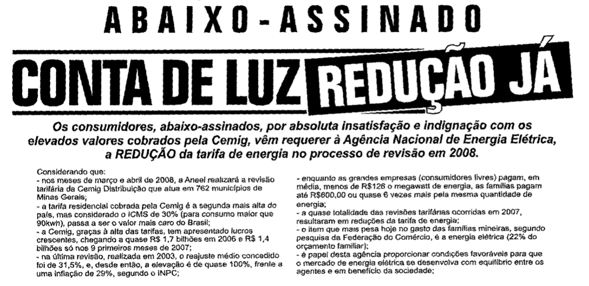

- [Vídeo da Audiência Pública](https://www.youtube.com/watch?v=TzNYFKWAtaI)
- [Assembleia Legislativa – Maioria](https://antigo.aneel.gov.br/web/guest/audiencias-publicas-antigas?p_p_id=participacaopublica_WAR_participacaopublicaportlet&p_p_lifecycle=2&p_p_state=normal&p_p_mode=view&p_p_cacheability=cacheLevelPage&p_p_col_id=column-2&p_p_col_pos=1&p_p_col_count=2&_participacaopublica_WAR_participacaopublicaportlet_ideDocumento=22732&_participacaopublica_WAR_participacaopublicaportlet_tipoFaseReuniao=fase&_participacaopublica_WAR_participacaopublicaportlet_jspPage=%2Fhtml%2Fpp%2Fvisualizar.jsp)
- [Deputados Elismar e Weliton Prado](https://antigo.aneel.gov.br/web/guest/audiencias-publicas-antigas?p_p_id=participacaopublica_WAR_participacaopublicaportlet&p_p_lifecycle=2&p_p_state=normal&p_p_mode=view&p_p_cacheability=cacheLevelPage&p_p_col_id=column-2&p_p_col_pos=1&p_p_col_count=2&_participacaopublica_WAR_participacaopublicaportlet_ideDocumento=22712&_participacaopublica_WAR_participacaopublicaportlet_tipoFaseReuniao=fase&_participacaopublica_WAR_participacaopublicaportlet_jspPage=%2Fhtml%2Fpp%2Fvisualizar.jsp)
- [Câmara Municipal de Governador Valadares](https://antigo.aneel.gov.br/web/guest/audiencias-publicas-antigas?p_p_id=participacaopublica_WAR_participacaopublicaportlet&p_p_lifecycle=2&p_p_state=normal&p_p_mode=view&p_p_cacheability=cacheLevelPage&p_p_col_id=column-2&p_p_col_pos=1&p_p_col_count=2&_participacaopublica_WAR_participacaopublicaportlet_ideDocumento=22676&_participacaopublica_WAR_participacaopublicaportlet_tipoFaseReuniao=fase&_participacaopublica_WAR_participacaopublicaportlet_jspPage=%2Fhtml%2Fpp%2Fvisualizar.jsp)

---

## Histórico Legislativo

- Instruções adicionais sobre como interpretar e aplicar a lei
  - Problema: não têm caráter normativo e não são votadas por todo o Congresso.

> "Os participantes desta comissão esperam que o Serviço de Imigração e Naturalização e o Escritório Executivo de Revisão de Imigração interpretem "dificuldade extrema envolvendo danos incomuns e graves" como um padrão mais elevado do que apenas "dificuldade extrema". O padrão deverá abranger os casos em que uma vítima provavelmente enfrentaria dificuldades genuínas e graves se fosse removida dos Estados Unidos, independentemente de o dano grave ser físico ou em decorrência de ter sido vítima de tráfico." (p. 136)

---

## Supervisão dos Procedimentos de Indicação

* A praxe do Senado é confirmar os nomes indicados pelo presidente para cargos de alto escalão, a menos que haja sérios problemas.
* Cargos mais baixos, por outro lado, são frequentemente controlados pelo Congresso.
  - Congressistas chegam a "recomendar" nomes para o Presidente.
* Outra forma de ameaça velada ao Poder Executivo: 
  - Possibilidade de não cooperar com o processo de nomeação, gerando dificuldades para o governo.

---

## Supervisão das designações orçamentárias

* Planos orçamentários das agências são bastante detalhados, mas o provisionamento de recursos em muitos casos é designado de forma genérica (as chamadas *"lump-sum appropriations"*).
* Realocações não são objeto de revisão judicial, mas podem ser controladas informalmente pelo Congresso.
* Na prática, o plano inicial constitui uma "promessa" da agência que as comissões do Congresso podem supervisionar, sendo mais ou menos lenientes com pedidos informais de realocação orçamentária.

---

## Análise casuística

- Mecanismos de controle de erros burocráticos.
- Em geral dizem respeito a questões menores, mas podem ser utilizados como forma de pressão.

---

## Voltando ao debate normativo

* **Visão do autor**: supervisão é positiva diante do aumento da ingerência do presidente sobre as agências desde Reagan. 
  - Único meio de garantir algum equilíbrio entre os Poderes em um contexto de agigantamento do Poder Executivo.
* Crítica ao caráter anti-democrático das comissões.
  - Crítica válida, mas uma resposta parcial decorre da constatação de que as comissões estão submetidas à estrutura do Congresso.

---

## Aspectos positivos da supervisão parlamentar

- Balanceamento aos poderes do Presidente
* Resposta ao problema do insulamento das agências à accountability política
  - Controle majoritário nos casos em que o Presidente não consegue influenciar as decisões da agência.

---

## Aspectos negativos da supervisão parlamentar

> Não há respostas completas às críticas feitas à supervisão parlamentar realizada pelas comissões, pois ela pode permitir um desvio excessivo dos termos do programa legislativo e das preferências do Congresso como um todo, uma vez que a supervisão não inclui a disciplina das votações públicas na maioria do Congresso. Ignorar a lacuna principal-agente entre o Congresso como um todo e aqueles que conduzem a supervisão é um pouco como dizer que, porque os empregadores não acham que vale a pena pagar pelo monitoramento que seria necessário para pegar cada ato de roubo por parte dos empregados, os empregados receberam permissão para roubar. 

---

> Mais importante ainda, embora entendamos que todos os atores do processo administrativo, incluindo o Presidente, os funcionários da agência, os juízes que conduzem a revisão judicial e os membros do Congresso, buscam seus próprios objetivos dentro do processo, isso não nos impede de criticar suas ações por se desviarem muito da intenção do Congresso conforme expressa na legislação. Há motivos para ficar atento a um sistema de supervisão que permite a membros individuais do Congresso, ou pequenos grupos dentro do Congresso, moldar a ação administrativa. Os mecanismos dentro do Congresso para disciplinar membros por abuso de sua autoridade ao frustrar a vontade do Congresso podem não ser suficientemente fortes para garantir que a supervisão reflita as prioridades do Congresso como um todo.

---

# Parliamentary Oversight of the Executives: tools and procedures in Europe

GRIGLIO, Elena. **Parliamentary Oversight of the Executives. Tools and Procedures in Europe**. Hart Publishing, 2020. (Cap. 2, p. 23-53).

---

 

## Elena Griglio
 

- Università Luiss Guido Carli di Roma
  - Departamento de Ciência Política
  - Especialista em técnica legislativa
- Produção acadêmica focada em questões constitucionais e na relação entre os poderes

---

## John Stuart Mill

- Fundamento teórico da supervisão legislativa no sistema britânico.
  - Separação de funções: controle e execução

> Em vez de governar, função para a qual ela é radicalmente despreparada, uma assembleia representativa deve vigiar e controlar o governo; lançar a luz da publicidade sobre seus atos; obrigar uma exposição completa e justificação de todos os atos que alguém considere questionáveis; censurá-los se forem condenáveis e, se os homens que compõem o governo abusarem de sua confiança ou a cumprirem de uma maneira que conflita com o sentimento deliberado da nação, expulsá-los do cargo e, expressa ou virtualmente, nomear seus sucessores.

---

## Evolução Histórica da Supervisão Legislativa na Europa
- Precursores: Reino Unido e países nórdicos.
  - **Reino Unido**: modelo baseado na ideia de divisão de tarefas do sistema representativo (Stuart Mill) e no governo de Gabinetes.
  - **Suécia**: desde 1809, Ombudsman e Comissão Constitucional exercem funções de supervisão da execução das leis. 

---

## Evolução Histórica da Supervisão Legislativa na Europa

- O modelo britânico espraiou-se, mas as outras experiências variaram bastante:
  * **Espanha**: supervisão parlamentar existe desde 1869, mas apenas com a Constituição de 1978 passa a existir na prática.
  * **França**: Sistema fortemente majoritário, predicado na ideia de "vontade geral". Mecanismos de supervisão já são discutidos no século XIX.
  * **Itália**: sistema de supervisão surge em 1848 em moldes similares ao francês, mas há um redimensionamento gradual dos poderes, que passam centrar-se no Executivo e na presunção da confiança.
  * **Alemanha**: Tradição de monarquia forte impede o desenvolvimento da função de supervisão parlamentar. O controle das legalidade é função administrativa.

---

## Avaliação geral
- Importância dos contextos históricos específicos
  * Sistema britânico dos gabinetes não foi seguido no Continente, onde se consolidou uma **visão dualista** do Executivo e do Legislativo.
  * Na França e na Itália a supervisão decorre naturalmente da soberania parlamentar.
  * Na Alemnha a supervisão se desenvolve como um instrumento defensivo do Parlamento contra a dominância do Poder Executivo.
* **Século XX**: supervisão se diferencia da função legislativa e passa a estar predicada na legitimidade democrática do legislativo e na relação de confiança com Executivo.

---

## Supervisão ou Escrutínio?

* Formas de controle legislativo variam em sistemas presidencialistas e parlamentaristas.
  * 2 fatores relevantes:
    * Qual é a fonte de legitimação do Executivo: o voto popular ou a confiança do Parlamento?
    * Qual é o escopo das funções do Legislativo: 
      - apenas legislar (legislativo puro)?
      - legislar e controlar a implementação das leis (efetivo parlamento)?

---

## Supervisão ou Escrutínio?

- Diferenças levam ao uso de termos distintos
  - **Supervisão**: revisão *ex post* da implementação de uma política.
  - **Escrutínio**: forma de controle mais geral, que inclui uma dimensão *ex ante*.
* Mais importante do que a diferenciação terminológica são as diferenças estruturais entre os sistemas.

---

### Diferenças estruturais

* No sistema presidencialista o controle extraordinário é fraco (impeachment) e o controle ordinário é forte e intrusivo. No sistema parlamentarista ambos são fortes.
* No sistema presidencialista o Legislativo tende a atuar mais de forma unitária e a competir com o Executivo, ao passo que no regime parlamentarista essa atuação está relacionada à dinâmica partidária de formação de maiorias.
* No sistema presidencialista a supervisão tem efeitos vinculantes negativos (veto), ao passo que o escrutínio no sistema parlamentarista busca guiar as ações (influência).
* A supervisão é dotada de maior grau de formalização jurídica do que o escrutínio.
* O modelo presidencial admite formas heterogêneas e múltiplas de supervisão, ao passo que o controle no modelo parlamentarista sempre leva ao Primeiro Ministro.

---

### Diferenças estruturais

 

Variável                 | Sistema Presidencialista | Sistema Parlamentarista
:------------------------|:-------------------------|:----------------------
**Horizonte Temporal**   | *ex ante*                | *ex ante* + *ex post*
**Tipo prevalente**      | ordinário                | ordinário + extraordinário
**Padrão de interação**  | competitivo              | competitivo-cooperativo
**Impacto esperado**     | poder de veto            | influência
**Deveres do Executivo** | deveres legais           | responsabilidade política
**Escopo da Supervisão** | mais amplo e heterogêneo | menos amplo

---

## Supervisão nos governos europeus contemporâneos

> Diferentes misturas dos fatores estruturais descritos criam, em cada forma nacional de governo, condições constitucionais peculiares para o exercício da supervisão parlamentar. Onde a fusão entre os poderes executivo e legislativo é maior, a supervisão se dá tanto pela cooperação entre governo e maioria parlamentar, quanto pela competição da oposição com o Executivo. Onde são introduzidos elementos de separação entre os poderes e a racionalização da fórmula de governo é maior, a função de supervisão se manifesta pela abordagem competitiva do Parlamento como um todo em relação ao Executivo. (p. 36)

---

## Tendências comuns

* Constituições escritas e a influência da teoria jurídica administrativa introduziram uma mudança de foco nos sistemas de gabinetes:
  - responsabilidade ministerial -----> supervisão parlamentar
  - concepção de supervisão / sujeição resultante da representação democrática
* Importância da relação de confiança entre Parlamento e governo, mas não apenas ela:
  - **Decisão do Tribunal Espanhol de 2018**: governo interino por quase um ano
  - Supervisão está ligada à relação com a confiança, mas não se confunde com ela (Senado também exerce funções de supervisão).

---

## Influência dos partidos

* Philip Norton: Legislativo fraco diante do Executivo por fragmentação partidária.
* Supervisão da maioria X Supervisão da oposição. 
  - A supervisão pela oposição tende a ser mais autêntica.
* Três modos de relacionamento entre o executivo e o legislativo:
  - **Intra-partido**: Relação interna à maioria parlamentar.
  - **Oposição**: Relação de conflito com os partidos de oposição.
  - **Não-partidário**: Deliberações não partidárias, comumente envolvendo interesses setoriais ou regionais que não coincidem com as divisões partidárias.
  * O modo não-partidário é o mais comumente associado com a função de supervisão, embora seja frequentemente, na prática, o menos relevante.

---

## Supervisão e Prestação de Contas (Accountability)

- Duas dimensões da prestação de contas:

  * **Dimensão procedimental**: Obrigação de responder perante o Parlamento.
  * **Dimensão substantiva**: Responsabilidade por erros perante o Parlamento.

* Dimensões bem divididas na tradição britânica:
  - Ministros devem ir ao Parlamento prestar esclarecimentos sobre seus departamentos.
  - Ministros devem resignar de seus cargos quando pessoalmente envolvidos em uma ação ou decisão problemática.

---

## Conexão da supervisão com a prestação de contas política

- **Teoria da Agência**: aplicação limitada ao modelo das democracias parlamentares.
* Prestação de contas política:
  - Supervisão política X Controle legais (Direito Administrativo).
  * Impacto da teoria dos controles legais na conceituação de supervisão política
    - Foco na imposição de sanções, ideia de subordinação
    - Gera a necessidade de justificar juridicamente a supervisão

---

## Supervisão da Administração Pública

> (...) A supervisão sobre a administração pública está excluída do escopo da supervisão parlamentar; a supervisão da administração pública em regimes parlamentares acaba sendo uma "ilusão", se comparada aos sistemas presidenciais, onde uma variedade de ferramentas de supervisão, desdobradas por meio de contatos diretos entre altos funcionários e órgãos congressuais, permitem o exercício de uma supervisão extensiva da administração pública. (p. 50)

---

# Congressional Oversight Overlooked: Police Patrols versus Fire Alarms

MCCUBBINS, Mathew D.; SCHWARTZ Thomas. Congressional Oversight Overlooked: Police Patrols versus Fire Alarms. **The American Journal of Political Science**, v. 28, nº 1, 1984, p. 165-179.

---

 

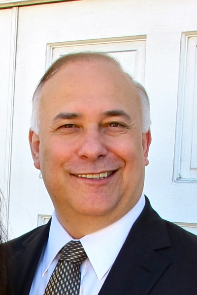

## Mathew McCubbins

- Duke University
  - Departamento de Ciência Política 
  - Escola de Direito
- Teoria da formação do poder de veto das maiorias legislativas
- Teoria do uso de alarmes de incêndio para controle da Administração Pública

---

> Estudiosos frequentemente afirmam que o Congresso negligencia sua responsabilidade de supervisão. Argumentamos que o Congresso não faz nada disso: o que parece ser uma negligência de supervisão é realmente uma preferência racional por uma forma de supervisão - que chamamos de supervisão por alarme de incêndio - em detrimento de outra forma - supervisão por patrulha policial. 

---

## Modelo – Definições iniciais

* **Política de supervisão legislativa**: quando e em que medida o Congresso busca detectar e remediar violações de objetivos legislativos pelo Executivo. 
* **Patrulha de Polícia**: o Congresso examina ativamente uma amostra de atividades executivas para sanar e desencorajar violações.
* **Alarme de Incêndio**: controle indireto, pelo qual o Congresso estabelece mecanismos que permitem o monitoramento da atividade executiva por cidadãos ou grupos de interesse que possam soar um alarme em casos de violações.

---

### Patrulha de Polícia X Alarme de Incêndio
 

Patrulha de Polícia            | Alarme de Incêndio
:------------------------------|:------------------
Direto                         | Indireto
Concentrado                    | Difuso
Ativo                          | Passivo
Substantivo                    | Procedimental
Avaliação das ações executivas | Criação de regras, procedimentos e práticas

---

## A modalidade preferida: alarmes de incêndio

> Algumas regras, procedimentos e práticas criadas pelo Congresso oferecem aos cidadãos e grupos de interesse acesso à informação e aos processos de tomada de decisão administrativa. Outros lhes dão legitimidade para contestar decisões administrativas perante agências e tribunais, ou ajudam a trazer supostas violações à atenção dos congressistas. Ainda outros facilitam ação coletiva por grupos de interesse comparativamente desorganizados. O papel do Congresso consiste em criar e aperfeiçoar esse sistema descentralizado e, ocasionalmente, intervir em resposta a reclamações. Ao invés de farejar incêndios, o Congresso coloca caixas de alarme de incêndio nas esquinas das ruas, constrói postos de bombeiros nos bairros e, às vezes, despacha seu próprio caminhão de incêndio em resposta a um alarme. (p. 166)

---

## Premissas comportamentais

* **Premissa motivacional**: congressistas buscam levar o máximo de crédito pelos benefícios aos seus eleitores e o mínimo de culpa por custos gerados para eles.
* **Premissa institucional**: agências agem como agentes do Congresso, sobretudo de comissões das quais dependem suas autorizações e designações orçamentárias.

---

### CONSEQUÊNCIAS

## 1. Congressistas tendem a preferir alarmes de incêndio

* Patrulhas de polícia disperdiçam tempo, pois são analisadas ações executivas nas quais não houve violação, ou a violação não afeta a sua base eleitoral.
* Patrulhas de polícia analisam poucos casos, sendo provável que violações relevantes aos interesses da base eleitoral não sejam analisadas.
* Há menos chance de atritos com a base ou atribuição de culpa. O custo de supervisão é terceirizado, mas o congressista não é culpado por isso.

---

## 2. Congressistas não negligenciam a função de supervisão

- Como os custos de supervisão por meio da alarmes de incêndio é baixo e os potenciais ganhos políticos são altos, congressistas têm incentivos para criar os mecanismos necessários à supervisão por alarmes de incêndios.

## 3. O Congresso adota uma política extensa e efetiva de supervisão por meio de alarmes de incêndio

- Resume as consequências 1 e 2.

---

## Uma falsa percepção

> Diante de um fato aparente que ele considera intrigante, lamentável ou digno de atenção, um cientista tem duas alternativas: (a) aceitar o fato e tentar explicá-lo, ou (b) questionar o fato aparente e tentar explicar a sua aparência. No caso em questão, os estudantes do Congresso, em sua maioria, escolheram a opção (a): eles concordam acriticamente que o Congresso negligencia sua responsabilidade de supervisão e tentam explicar semelhante negligência. (p. 169)

---

## 3 percepções equivocadas

- **COMPLEXIDADE**: diante da complexidade das políticas públicas, o Congresso teve que delegar poderes para um corpo burocrático especializado que ele não consegue supervisionar.
  * Quando há incentivos suficientes, o Congresso é capaz de resolver problemas complexos (exemplo: Tributos).
  * O Congresso pode também criar uma equipe parlamentar altamente especializada para auxiliá-lo a supervisionar as atividades executivas.

---

## 3 percepções equivocadas

- **BOM GOVERNO**: o Congresso estabeleceu um corpo técnico especializado que atende melhor ao interesse público, sendo indesejável a intervenção parlamentar calcada pelas preferências de grupos de interesses especiais.
  * Não é plausível supor que o interesse público é mais bem servido por decisões de burocratas que não podem ser submetidas ao controle majoritário.

---

## 3 percepções equivocadas

- **DESCENTRALIZAÇÃO**: a supervisão exercida pelo Congresso está fragmentada entre pequenas comissões e subcomissões e, portanto, tende a ser fraca.
  * A especialização das subcomissões aumenta a capacidade de supervisão das decisões de agências individuais.
  * Instrumentos efetivos de controle: agências dependem de designações orçamentárias e autorizações específicas.

---

## Questionamentos da premissa tecnológica

- Uma diferença apenas terminológica? Supervisão = patrulhas de polícia?
  - Conceituação seria inadequada: o problema da supervisão sempre é remetido à necessidade de garantir objetivos legislativos.
  - **Alarmes de incêndio são um instrumento mais efetivo de supervisão**.

---

## Efetividade dos alarmes de incêndio

* Objetivos legislativos são definidos em termos vagos, sendo necessário que haja reclamação de cidadãos ou grupos para se constatar a violação.
* Patrulhas de polícia examinam apenas uma amostra de ações e assim estão fadadas a ignorar muitas violações.
* Legislações que estabelecem alarmes de incêndios podem ajudar grupos desorganizados a monitorar violações.
* Indivíduos podem contribuir com o monitoramento.
* Embora seja possível argumentar que alarmes de incêndio produzem vieses, o mesmo pode ser dito das patrulhas de polícia.

---

## A discricionariedade administrativa aumentou?

- Alarmes de Incêndio como resposta racional ao aumento da delegação de funções administrativas.
  * Limitações cognitivas dos congressistas para especificar objetivos legislativos de forma suficientemente detalhada para evitar desvios.
  * Alarmes de incêndio como mecanismo que decorre da busca por práticas legislativas mais efetivas.

---

## O Congresso prefere estratégias de comando e controle?
- Estratégias de comando e controle são mais suscetíveis a intervenções casuísticas do Congresso do que estratégias de regulação por incentivos.
- Regulação por incentivos depende de agentes mais difíceis de controlar por esses métodos (juízes, autoridades fiscais, empresas e indivíduos).

---

## Como o Congresso brasileiro controla o Executivo? O uso de requerimentos de informação, convocação de autoridades e propostas de fiscalização e controle.

LEMOS, Leany Barreiro. Como o Congresso brasileiro controla o Executivo? O uso de requerimentos de informação, convocação de autoridades e propostas de fiscalização e controle. *In*: **Controle parlamentar na Alemanha, na Argentina e no Brasil**. Rio de Janeiro: Fundação Konrad Adenauer, 2005, p. 85-112.

---

 

### Leany Lemos

- Secretária Nacional do Planejamento
- Foi CEO do Banco Regional de Desenvolvimento do Extremo Sul
- Professora do IDP
- Servidora do Senado desde 1993
- Doutora pela UNB, pós-doutora por Oxford-Princeton, MBA por Harvard

---

## Formas de controle legislativo
- Retoma o debate sobre as múltiplas formas de controle político do Executivo
- Retoma o debate proposto por MacCubbins e Schwartz: não há controle ou o controle é feito de outra forma?
- No Brasil: atividades de controle têm previsão formal na CF-88 e forte amparo regimental nas duas casas do Congresso.

---

## Formas de controle político pelo Legislativo na CF-88

- Controle orçamentário (exercido como poder de veto)
- Poder de nomear, julgar, exonerar e afastar membros do Executivo
- Controle fiscal, financeiro e contábil (Congresso nomeia 2/3 do TCU)
- Poder de solicitar informações ao Executivo
- Poderes investigativos (possibilidade de instaurar CPIs)
- Outros poderes exclusivos em temas específicos
  - Exemplo: renovar e conceder concessões de rádio e televisão.

---

### Nem todos os instrumentos são iguais...
#### **CFC: um instrumento de patrulha particularmente inefetivo...**

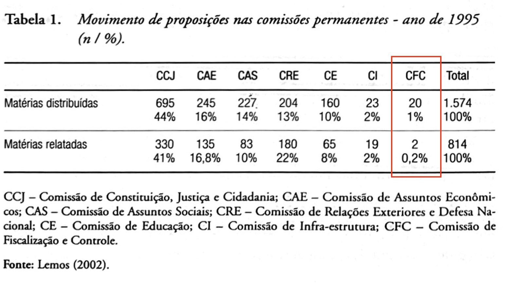

---

### Proposta de pesquisa: análise empírica do uso de instrumentos de controle
 

- **Instrumentos analisados**: requerimentos de informações, convocações de autoridades e propostas de fiscalização e controle.
- **Tendências verificadas**:
  * Crescimento do controle ao longo do tempo.
  * Uso intenso no início dos mandatos presidenciais.
  * Esvaziamento em anos eleitorais.

---

### Crescimento do controle em comparação à legislação

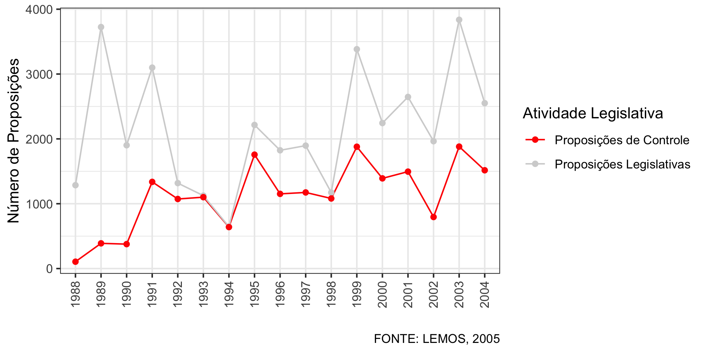

---

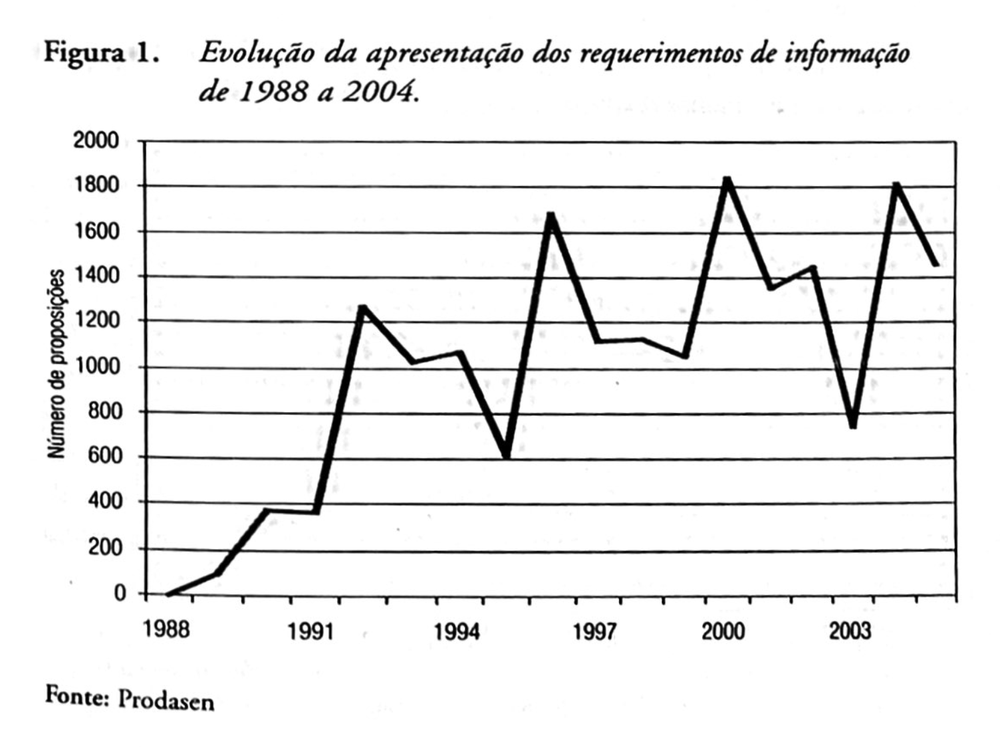

---

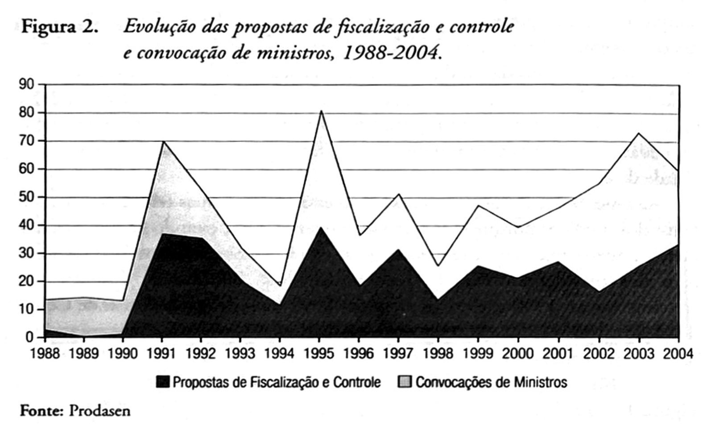

---

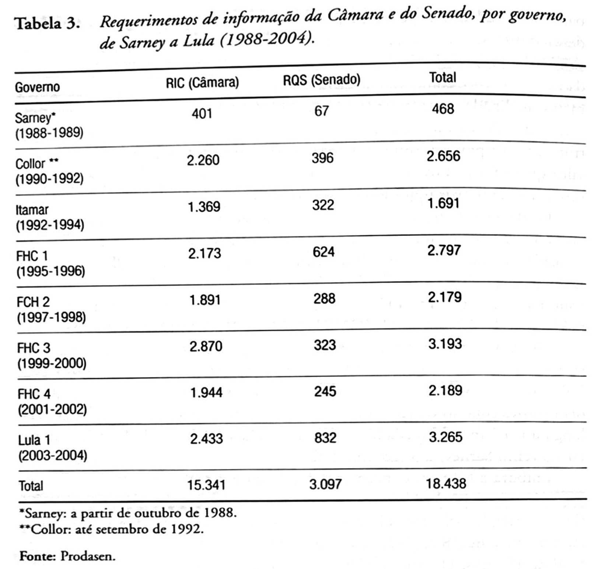

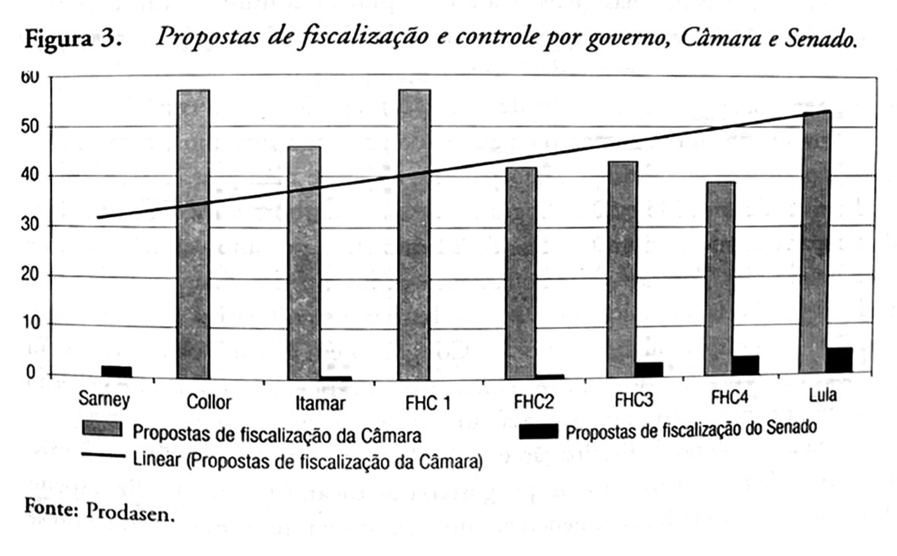

- Comprovação dos pressupostos motivacionais de MacCubbins e Schwartz?

---

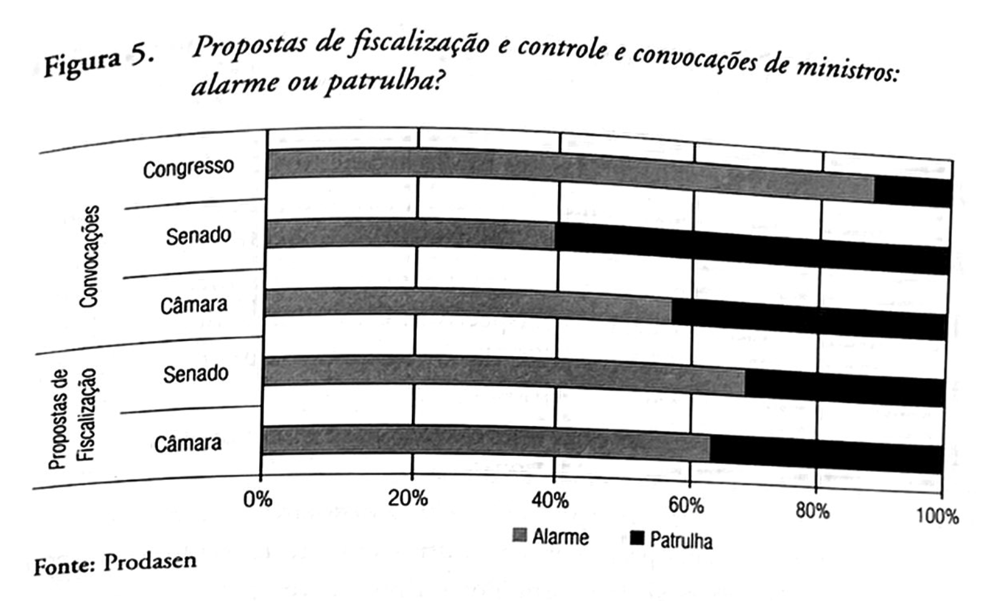

---

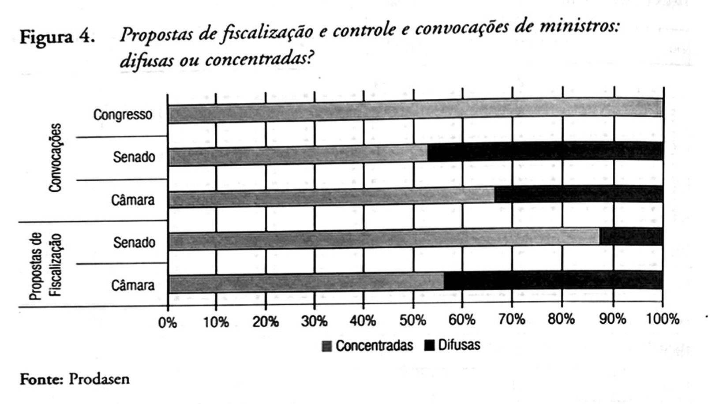

---

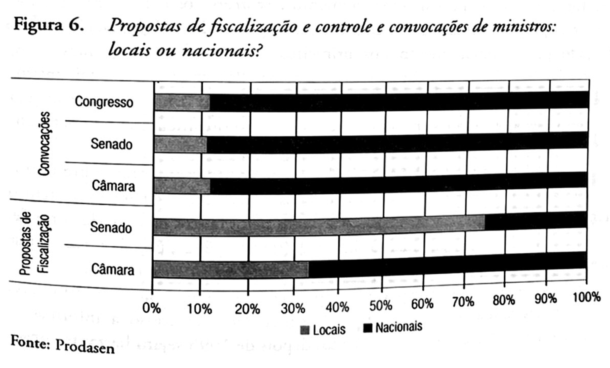

---

- BEERMANN, Jack M. *Congressional Administration*, San Diego Law Review, vol. 43, p. 61-158, 2006, p. 121-144.
- GRIGLIO, Elena. *Parliamentary Oversight of the Executives. Tools and Procedures in Europe*. Hart Publishing, 2020. (Cap. 2, p. 23-53).
- MCCUBBINS, Mathew D.; SCHWARTZ Thomas. Congressional Oversight Overlooked: Police Patrols versus Fire Alarms. *The American Journal of Political Science*, v. 28, nº 1, 1984, p. 165-179.
- LEMOS, Leany Barreiro. Como o Congresso brasileiro controla o Executivo? O uso de requerimentos de informação, convocação de autoridades e propostas de fiscalização e controle. *In*: *Controle parlamentar na Alemanha, na Argentina e no Brasil*. Rio de Janeiro: Fundação Konrad Adenauer, 2005, p. 85-112.

---

# Obrigado

