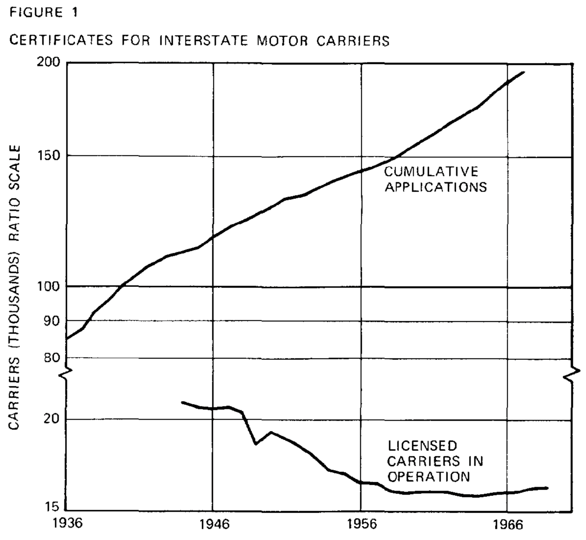
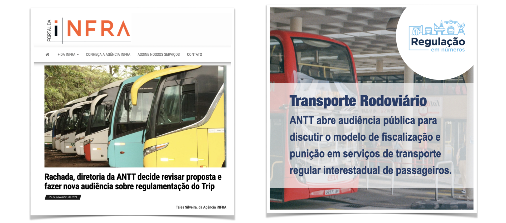

# FIARC – caso Buser 
**Regulação e Concorrência em Setores de Infraestrutura – 2023.1**

Lucas Thevenard

---
<!-- 
paginate: true 
header: Buser Brasil Tecnologia Ltda vs Decreto no 2.521/98
footer: lucas.gomes@fgv.br | 15/03/2023
-->

## Órgãos envolvidos
* SEAE – Secretaria de Acompanhamento Econômico (ME)
* FIARC – Frente Intensiva de Avaliação Regulatória e Concorrencial
* [Nova organização do ME](https://www.gov.br/economia/pt-br/imagens/organograma_ministerio-da-economia_marco.pdf)

---

## Critérios de avaliação
* **Lei no 13.874/2019, art. 4º**: 9 tipos de abuso do poder regulatório.
  * (i) Reserva de Mercado, (ii) Enunciado Anticoncorrencial, (iii) Especificação técnica não necessária ao fim almejado ... (rol exemplificativo)
* **IN SEAE nº 97/2020**: critérios objetivos para a identificação das hipóteses de abuso do poder regulatório.
* **IN SEAE nº 111/2020**: 5 critérios de avaliação da onerosidade regulatória: (i) Obrigações Regulatórias; (ii) Requerimentos Técnicos; (iii) Restrições e Proibições; (iv) Licenciamento; e (v) Complexidade Normativa.
* [Competition Assesment Toolkits (OCDE)](https://www.oecd.org/competition/assessment-toolkit.htm)

---

### O problema discutido: regra de circuito fechado do serviço de transporte rodoviário interestadual de passageiros por fretamento

---

---
## Regime Regulatório Vigente (NT 5705/2020)
- **CF-88, art. 21, XII**. Competência constitucional da União para explorar, mediante autorização, concessão ou permissão, os serviços de TRIIP.
  - **TRIIP**: Transporte Rodoviário Interestadual e Internacional de Passageiros.
- **Lei 10.233/2001, art. 26, III e VIII**: Serviço Regular X Fretamento

---
## Regime Regulatório Vigente (NT 5705/2020)
- **Serviço regular** (Res. ANTT 4.770/2015):
  - Características de serviço público (continuidade, ampla oferta, modicidade, etc.);  
  - Termo de Autorização de Serviços Regulares (TAR) e Licença Operacional (LOP) – exigência de frequência mínima.
  - Outras obrigações regulatórias: bilhete de passagem, gratuidades e descontos obrigatórios, normatização de procedimentos diversos (informações em pontos de venda, caracterização dos veículos, etc.).

---

## Regime Regulatório Vigente (NT 5705/2020)
- **Fretamento** (Res. ANTT 4.777/2015):
  - Contratação para finalidade específica (serviço não regular).
  - Termo de Autorização para Fretamento – habilitação a prestar esse tipo de serviço mediante emissão de Licença de Viagem (LV).
  - Embora haja obrigações regulatórias comuns, elas não são idênticas (exemplo: não há bilhete de viagem, não são exigidas as mesmas gratuidades).
  - Circuito fechado (lista fixa, ida e vinda) é uma característica intrínseca que diferencia as duas modalidades. 
  - Obs: empresas que prestam serviços regulares alegam assimetria regulatória.

---

## Mudanças importantes
* **Tecnologias informacionais** que viabilizam o chamado fretamento colaborativo (inovações disruptivas, Schumpeter).
* Outras formas de **controle de qualidade nas plataformas** (reputação, score, etc.).
* **Novo mercado relevante**: definição legal X substitutibilidade dos serviços.
* **Abertura do serviço de transporte regular**:
  - Lei nº 12.996/2014 alterou o regime de outorga de permissão para autorização.
  - Fim do sistema de "filé com osso".
  - OBS: DI nº 6.270, proposta pela Associação Nacional das Empresas de Transporte Rodoviário Interestadual de Passageiros (Anatrip).

---

---

---

## Theory of Economic Regulation

> (...) the immense growth of the freight hauled by trucking common carriers has been associated with a steady secular decline of the number of such carriers. The number of applications for new certificates has been in excess of 5000 annually in recent years: **a rigorous proof that hope springs eternal in an aspiring trucker's breast.**
> Stigler, 1971, p. 5.

---

## Experiência Internacional
* Fretamento colaborativo é **bem sucedido em diversos países** (Alemanha, Reino Unido, etc.).
  - Não há comprometimento da qualidade ou segurança dos serviços.
  - Obs: Flixbus é uma das líderes mundiais e já atua no Brasil.
* **Tarifas mais baratas**: no Reino Unido houve redução de cerca de 50% do valor médio das tarifas
  - Obs: Buser alega praticar preços 60% mais baratos que os prestadores regulares e que já houve uma queda de quase 30% dos preços desde sua criação.
* **Melhor aproveitamento da frota**: promoção da eficiência na alocação da frota, utilizando informações em tempo real sobre as demandas dos passageiros.

---

## Análise dos efeitos anti-concorrenciais da regra do circuito fechado (OCDE, 2017)
* **1º efeito** - limitação no número ou variedade de fornecedores
  - Aumentar significativamente os custos de entrada ou saída no mercado.
* **2º efeito** - limitação da concorrência entre empresas
  - Aumentar significativamente o custo de produção para apenas alguns fornecedores.
* **3º efeito** - diminuir o incentivo para as empresas competirem.
* **4º efeito** – Limitação das opções dos clientes e da informação disponível.
  - Limitar a capacidade dos consumidores para escolherem o fornecedor; Reduzir a mobilidade dos clientes entre fornecedores de bens ou serviços

---

## Parecer do FIARC: resumo das conclusões

A regra de circuito fechado provoca distorções concorrenciais com efeitos potencialmente negativos sobre o bem-estar do consumidor no mercado de transporte de passageiros. Isso porque ocasiona:
* restrição da forma pelo qual o agente privado deve prestar sua atividade;
* restrição da liberdade de escolha e de contratação por parte do usuário do serviço;
* geração de ociosidade da frota e da mão de obra, com efeitos negativos sobre a eficiência;

---

## Parecer do FIARC: resumo das conclusões

* ATOS NORMATIVOS COM CARÁTER ANTICOMPETITIVO (Bandeira Vermelha)
  - Decreto no 2.521/1998
  - Resolução ANTT no 4.770/2015
  - Resolução ANTT no 4.777/2015

* ATO NORMATIVO SUSCETÍVEL DE APERFEIÇOAMENTO (Bandeira Amarela)
  - Decreto no 10.157/2019

---

## Parecer do FIARC: resumo das conclusões

* Proposição de **revisão da regulamentação** do transporte rodoviário de passageiros sob fretamento, com a previsão da categoria chamada de fretamento colaborativo, ofertado via aplicativos ou plataformas digitais.
* Proposição de **harmonização de algumas obrigações** entre o segmento regular de transporte de passageiros e o fretamento colaborativo, de forma a reduzir assimetria concorrencial potencial existente entre estes segmentos.

---

### Os conflitos continuam...

