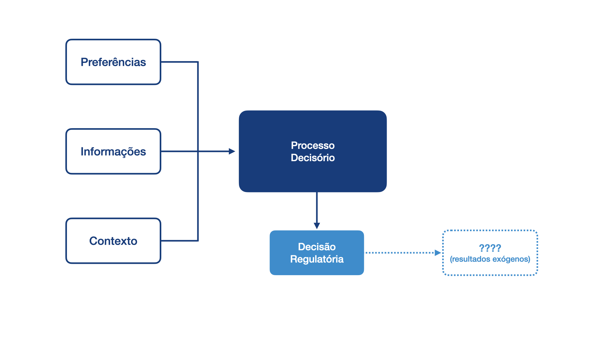
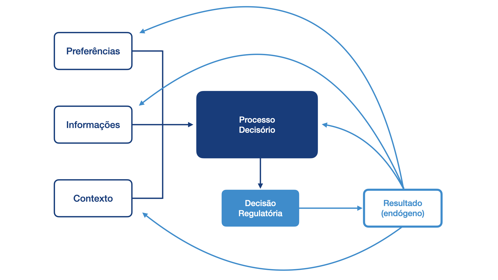
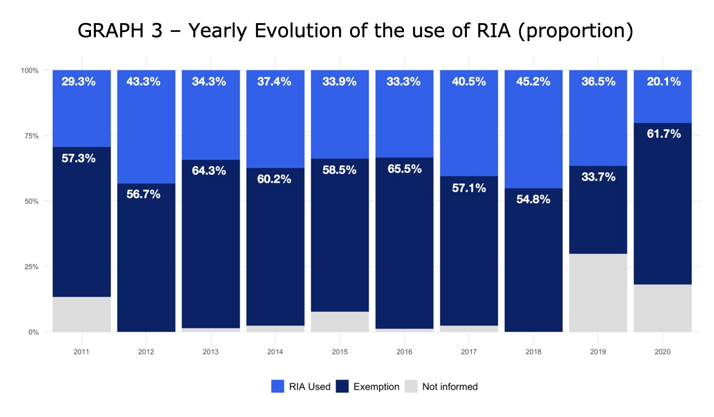
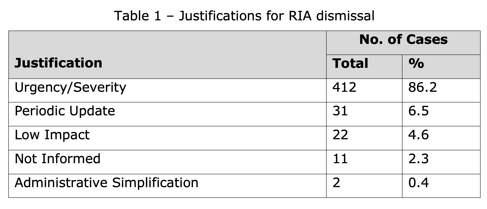
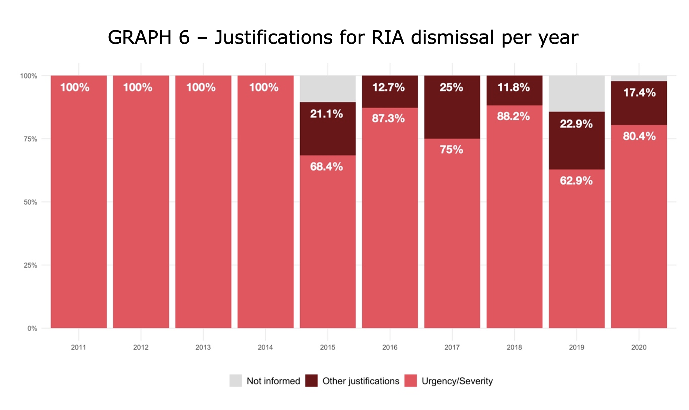
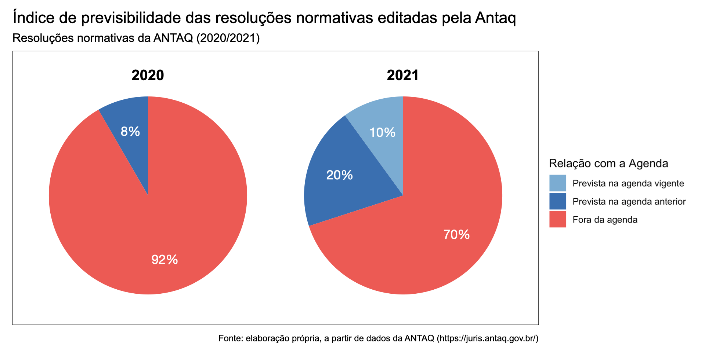

# O que se pode esperar da "boa regulação"?
**Regulação e Concorrência em Setores de Infraestrutura – 2023.1**
Lucas Thevenard

---

## Estrutura do argumento (e do artigo)
- Críticas comuns à agenda de "boa regulação": procedimentos, racionalidade e neutralidade
- Por que a reforma regulatória é uma agenda de procedimentalização.
  - Levando a incerteza a sério
  - Objetivos da procedimentalização de decisões regulatórias
- Os reais desafios
  - Custos administrativos: quando dispensar procedimentos onerosos?
  - Qualidade dos procedimentos – racionalidade e condições de aprendizagem
  - *Trade off* entre flexibilidade e controle
- Conclusão

---

<!-- 
paginate: true 
header: O que se pode esperar da "boa regulação"?
footer: lucas.gomes@fgv.br | 17/05/2023
-->

## Críticas comuns
- Foco em procedimentos, não nos resultados.
  - Modelo de checklist: fez AIR? houve participação social? etc.
- Foco excessivo em racionalidade decisória, em detrimento de outros objetivos
- Agenda não neutra: captura política, objetivo de desregular, gera custos e obstáculos para o regulador

---

>  Another way of breaking down the different aspects of regulation to be measured is to use a four-part division into inputs, processes, outputs, and outcomes. Input-based assessment of performance is common and looks to such matters as numbers of inspectors and inspections, and the resources that are devoted to control. Process- or compliance-based assessment is also carried out frequently, and this measures adherence to procedural requirements and other laws, policies, or guidelines. What are less common are output-based assessments—which measure the extent to which the goals of the specific programme are achieved—and outcome-based assessments, which evaluate the impact of the regulatory system against the broad objectives of the agency (rather than the specific programme). 

##### BALDWIN, Robert; CAVE, Martin; LODGE, Martin. **Understanding regulation: theory, strategy, and practice**. 2nd ed. New York: Oxford University Press, 2012, p. 35-36.

---

>  Surprisingly, the policy documents underlying RIA procedures in the different EU countries often do not state an explicit objective. It appears to be taken for granted that better information straightforwardly leads to ‘better’ decisions, while a normative dimension is not perceived. Such an assumed value-free concept indicates a prevalence of the rationalist concept. (...) Broadly, the concept of RIA follows a rationalist idea: the assessment is perceived as a value-free effort, objectives are provided either by the policy itself or they are lying outside the scope of RIA.

##### HERTIN, Julia; JACOB, Klaus; PESCH, Udo; et al. **The production and use of knowledge in regulatory impact assessment – An empirical analysis**. Forest Policy and Economics, v. 11, n. 5–6, 2009, p. 415.

---

## Levando a incerteza a sério

* A decisão regulatória é sempre tomada sob condições de risco/incerteza
  - Resnik: a TD não garante a melhor decisão/resultado, mas sim a racionalidade.
* Há um determinismo implícito nas críticas à agenda de melhoria regulatória?
  * Devemos exigir os melhores resultados, ou a decisão regulatória mais racional?
  * É fácil aferir se uma decisão regulatória produziu bons resultados? Como medir as consequências da política de melhoria regulatória?
  * É razoável esperar que decisões menos racionais produzam resultados melhores?
  * É legítimo deixar que decisões públicas se pautem pela intuição dos gestores públicos?

---

- **MODELO ESTÁTICO**: resultados são exógenos.

---

- **MODELO DINÂMICO**: resultados são endógenos (aprendizagem institucional).

---

## Procedimentalização e aprendizagem institucional
* A procedimentalização gera informações sobre o processo decisório e busca aumentar sua racionalidade, contribuindo para a aprendizagem institucional.
* O próprio processo de aprendizagem pode ser, até certo ponto, procedimentalizado.
  - Exemplo: Avaliação *ex post*.
  - Obs: antecipação do mecanismo de avaliação dos resultados. 

---

## O valor da procedimentalização
* Procedimentalização e racionalidade promovem – ou são condição para – outros objetivos regulatórios (transparência, *accountability*, fundamentação técnica, etc.).
* Problema da confiança e da calculabilidade – racionalidade diminui riscos regulatórios
  - Promoção de condições para investimentos de longo prazo. Importante para setores de infraestrutura.

---

> Na opinião de Fuller, um suposto sistema jurídico pode deixar de se qualificar como tal, caso passe a "introduzir mudanças tão frequentes nas regras que o sujeito não pode orientar suas ações por elas". Com esse ponto em mente, o Direito Administrativo há muito se preocupa com a consistência, ao longo do tempo, da tomada de decisões das agências, tanto na regulamentação quanto na adjudicação. Uma preocupação intimamente relacionada envolve a dependência das partes reguladas, incluindo, mas não se limitando a, atores econômicos que devem planejar investimentos de longo prazo ou outros projetos em um ambiente regulatório. Embora a consistência tenha valor mesmo à parte dos 'reliance interests' (...), ainda, como uma questão prática, proteger a confiança é um objetivo central das doutrinas do Direito Administrativo.

##### SUNSTEIN, C.; VERMEULE, A. **Lei e Leviatã: Resgatando o Estado Administrativo**. São Paulo: 2021, p. 89-90.

---

## O valor da procedimentalização
- Procedimentalização e racionalidade promovem – ou são condição para – outros objetivos regulatórios (transparência, *accountability*, fundamentação técnica, etc.).
- Problema da confiança e da calculabilidade – racionalidade diminui riscos regulatórios
  - Promoção de condições para investimentos de longo prazo. Importante para setores de infraestrutura.
* Procedimentalização pode ser uma alternativa mais flexível à imposição de limites legais, que se beneficia de instituições mais confiáveis (Levy & Spiller).
  - Maior adaptabilidade de meios e objetivos.

---

> Within any system of utility regulation, there is a tension between the ability to commit to a stable set of rules and the ability to respond flexibly to changing circumstances. Countries differ in their institutional endowments and hence in the ways in which they can resolve this tension. A first group of countries can design regulatory systems that afford the regulator substantial formal discretion to respond to changing circumstances and can use process to restrain arbitrary action. A second group of countries can restrain arbitrary action only by calling on specific substantive rules and may have to sacrifice some flexibility to achieve credible commitment. A third group may lack the domestic institutions to put in place a credible and workable regulatory system of any kind.

##### LEVY, Brian; SPILLER, Pablo T. (1994). **Regulation, institutions, and commitment in telecommunications : a comparative analysis of five country studies**. Washington, D.C. : The World Bank.

---

## Os reais desafios
- Custos administrativos: quando dispensar procedimentos onerosos?
- Qualidade dos procedimentos – racionalidade e condições de aprendizagem
- *Trade off* entre flexibilidade e controle

---

### Quando dispensar procedimentos onerosos?

---

### Quando dispensar procedimentos onerosos?

---

### Quando dispensar procedimentos onerosos?

---

### Qualidade dos Procedimentos

---

### *Trade off* entre flexibilidade e controle
> **DECRETO Nº 10.411 DE 30 DE JUNHO DE 2020**
> Art. 7º  Na elaboração da AIR, será adotada uma das seguintes metodologias específicas para aferição da razoabilidade do impacto econômico, de que trata o art. 5º da Lei nº 13.874, de 2019: 
>  I - análise multicritério;
> II - análise de custo-benefício;
> III - análise de custo-efetividade;
> IV - análise de custo;
> V - análise de risco; ou
> VI - análise risco-risco.

---

## Os reais desafios: fatores de fundo
- Assimetria informacional:
  - Rachel Potter: prevalência do regulador
- Oportunismo / Captura
- Limitações institucionais: disponibilidade de dados, de recursos humanos etc.
