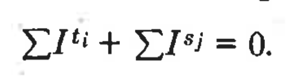

<!-- 
paginate: true 
header: Stigler: Economic theory of regulation
footer: lucas.gomes@fgv.br | 14/04/2023
-->

[Stigler: Modelos para explicar regulações anti-competitivas]( https://lthevenard.github.io/hub/slides/doutorado/tetur04/stigler/stigler.html)

---

<!--
header: Gary Becker: A theory of competition among pressure groups for political influence
-->

## The economic approach to political behavior assumes that actual political choices are determined by the efforhs of individuals and groups to further their own interests.

---

## Individuals belong to particular groups (...) that are assumed to use political influence to enhance the well-being of their members. 

## Politicians, political parties, and voters will receive little attention because they are assumed mainly to transmit the pressure of active groups.

---

---

## Political influence is not simply fixed by the political process, but can be expanded by expenditures of time and money on campaign contributions, political advertising, and in other ways that exert political pressure.

---

## (...) groups do not entirely win or lose the competition for political influence because even heavily taxed groups can raise their influence and cut their taxes by additional expenditures on political activities.

---

# Funções de influência

## I shall not try to model how different political systems translate the activities of pressure groups into political in- fluence. Instead, I deal with the end product of such a translation, called "influence functions," that relate subsidies and taxes to the pressures exerted by all groups and to other variables. 

---

---

---

## Equality between the amount raised in taxes and the amount spent on subsidies implies that aggregate influence is zero: increased influence of some groups decreases the influence of others by equal amounts. Therefore, the political game modeled in this paper is zero-sum in influence and negative-sum in taxes and subsidies because of deadweight costs.

---

# Funções de produção - condicionantes do equilíbrio competitivo

---

---

---

## PROPOSITION 1. A group that becomes more efficient at producing political pressure would be able to reduce its taxes or raise its subsidy.

## COROLLARY. The political effectiveness of a group is mainly determined not by its absolute efficiency – e.g., its absolute skill at controlling free riding – but by its efficiency relative to the efficiency of other groups.

---

## PROPOSITION 2. An increase in deadweight cost reduces the equilibrium subsidy.

*Proposition 2 implies some "tyranny of the status quo" because the political sector would not interfere much with the private distri- bution of income even when groups benefiting from interference are better organized politically than groups harmed, as long as they are not much better organized. Consequently, the importance of the private status quo does not imply that politiciâns are lackeys of the rich, and is even consistent with the poor being more effeclive politically.*

---

## Political protection against changes in the private sector is likely to be incomplete and temporary. Incomplete because the marginal deadweight cost of protection rises as the degree of protection increases; temporary because supply (and demand) becomes more elastic over time as specific investments depreciate. 

## COROLLARY. Political policies that raise efficiency are more likely to be adopted than policies that lower efficiency.

---

## PROPOSITION 3. Politically successful groups tend to be small relative to the size of the groups taxed to pay their subsidies.

---

## PROPOSITION 4. Competition among pressure groups favors efficient methods of taxation.

---

### Competição não é Pareto-eficiente...

---

## Cooperation among pressure groups is necessary to prevent the wasteful expenditures on political pressure that result from the competition for influence. Various laws and political rules may well be the result of cooperation to reduce political expenditures (...)

---

# Vários grupos (mais do mesmo)

 

---

## Increased pressure by groups h, i, and j may affect the marginal influence of other groups because of complementarity or substitution in the influence functions. Moreover, increased pressure by h and Í would lower the subsidy to or raise the taxes on other groups, who then might exert greater pressure that affects still other groups. The process continues until a new political general equilibrium is reached with possibly quite different pressures and gains by many groups.

---

# Outras diferenças? (Lucas)

- Maiores riscos associados ao investimento em eficácia política.
- Maiores obstáculos à cooperação entre os grupos para aproximar o resultado do Pareto-eficiente.

---

# E os votos dos eleitores?

---

## I claim to have presented a theory of rational political behavior, yet have hardly mentioned voting. This neglect is not accidental because I believe that voter preferences are frequently not a independent force in political behavior. These "preferences" can be manipulated and created (...)

## (...) the analysis in this paper assumes that pressure groups can "purchase" favorable votes (...)