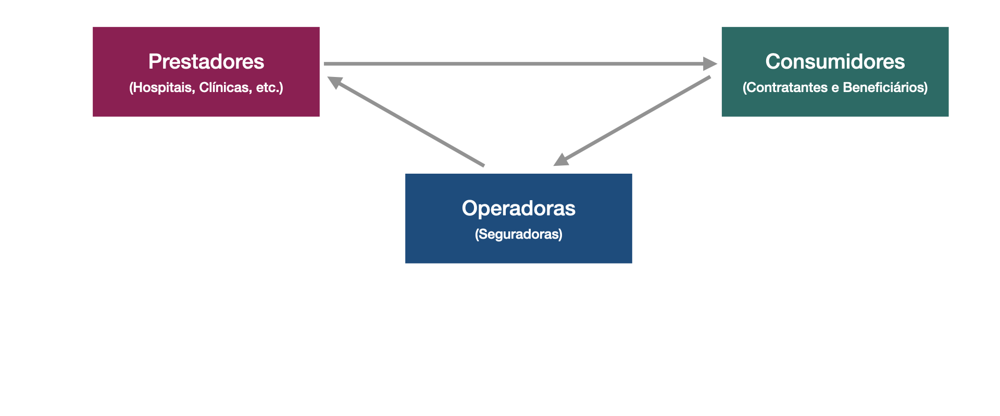
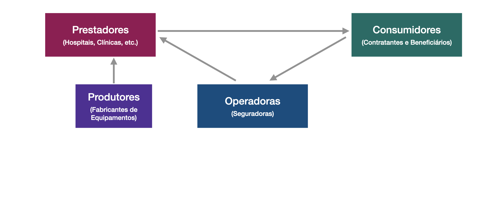
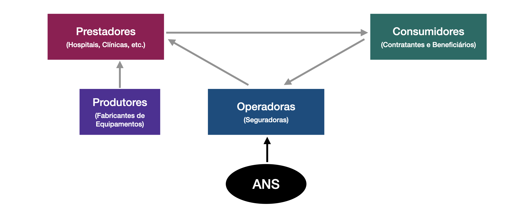
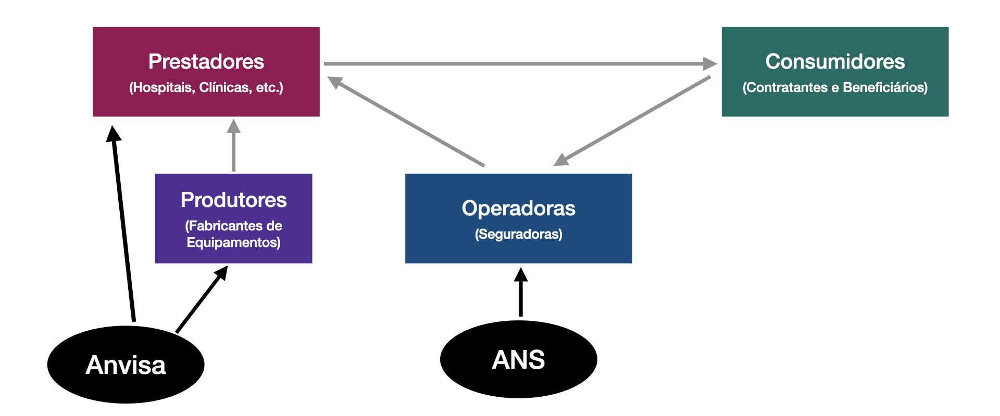
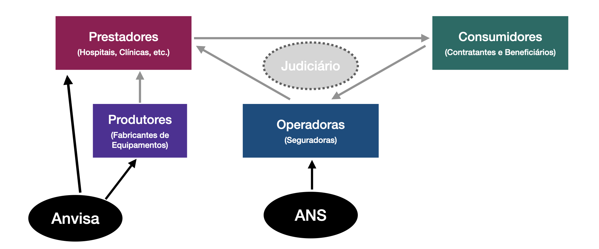

# Aula 1 - O que é AED?
**Análise Econômica do Direito – 2024.2**

Lucas Thevenard

---
<!-- 
paginate: true 
header: Aula 1 - O que é AED?
footer: lucas.gomes@fgv.br | 13/11/2024
-->

## Roteiro de aula
* O que é a AED?
* Conceitos fundamentais e introdutórios da disciplina
* Justiça e eficiência
* Racionalidade e incentivos
* Fundamentos econômicos da regulação
* Exemplo aplicado à regulação da saúde suplementar

---

**AED descritiva ou positiva**: Descreve/explica como os indivíduos se comportam de forma a buscar seus interesses, reagindo aos incentivos criados por seu meio social

**AED normativa ou prescritiva**: Busca a alternativa mais eficiente, com base nas análises econômicas descritivas

---
## AED descritiva 

* Pressupõe um modelo do comportamento humano:
  * Modelo = simplificação (mapa)
      - Obs: Ceteris Paribus
  * O Homo economicus age segundo a Teoria da Escolha Racional.
* Apesar de simples, os modelos econômicos pressupõem dinamicidade, adaptabilidade dos indivíduos a novos **incentivos**
  * **Raciocínio jurídico**: fundamenta decisões em fontes autoritativas do passado.
  * **Raciocínio econômico**: fundamenta decisões nos resultados materiais futuros.

---

"Analisar a economia tem seus desafios, mas segue uma lógica relativamente simples. Os agentes econômicos **reagem a incentivos**, entre os quais o preço das coisas. As **instituições impõem as regras** do que pode ou não ser feito e também criam **incentivos**. O que pode ser feito é ainda circunscrito pelo patrimônio e a renda e, em alguns casos e momentos, pelo acesso ao crédito. As pessoas são em geral avessas ao risco, ainda que nem sempre. E processam tudo isso buscando **maximizar o seu bem estar**, ainda que sujeitas a **vieses cognitivos** e um **acesso limitado à informação**”.

**Armando Castelar Pinheiro**, “Os anos 20: Sóbrios ou Festivos”, Valor Econômico, 20 de janeiro de 2021.

---

## AED normativa 
* Pressupõe análises econômicas descritivas
* Avalia alternativas para escolher aquela que é mais eficiente
  - Recursos são escassos, não devemos desperdiçá-los

   
---

## Eficiência e Justiça 
- Eficiência econômica vs. Distribuição
- Eficiência econômica vs. Justiça

---

## Bem-estar econômico

A economia está a serviço do **bem comum**; tem como objetivo tornar o mundo melhor. Com esse fim, tem como tarefa identificar as instituições e políticas que venham a promover o interesse geral. Em sua busca do bem-estar para a comunidade, ela engloba as dimensões individual e coletiva do sujeito, analisando as situações em que o interesse individual é compatível com essa busca de **bem-estar coletivo** e aquelas em que, ao contrário, ele constitui um entrave”.

**Jean Tirole**. Economia do Bem Comum.

---

## Justiça

“Faça então a pergunta: ‘Em que sociedade eu gostaria de viver, sabendo que poderei ser homem ou mulher, ter uma saúde boa ou ruim; ter vindo ao mundo numa família rica ou pobre; instruída ou inculta; ateia ou religiosa; crescer no centro de Paris ou no campo; querer me realizar profissionalmente ou adotar outro estilo de vida etc.? Essa maneira de se interrogar, de abstrair sua posição na sociedade e seus atributos, de se colocar ‘sob o véu de ignorância’…”

**John Rawls.** Uma Teoria da Justiça.

---

## Eficiência

* **Eficiência de Pareto**: uma política é “eficiente de Pareto” quando ela permite aumentar o bem-estar de alguém sem diminuir o de mais ninguém. Ou seja, não há conflito entre o interesse individual e o coletivo.
* **Eficiência alocativa**: Significa aumentar a produção quando o benefício marginal supera o custo marginal e alocar os produtos a quem mais os valoriza (Kaldor-Hicks).
* **Eficiência técnica**: Produzir o máximo de produto com uma certa quantidade mínima de insumos para produzir uma certa quantidade de produto.
* **Eficiência dinâmica**: Garantir o máximo de crescimento.

---

## Papel da AED

* **Stigler**: “o economista e o jurista vivem em mundos diferentes e falam diferentes línguas.”
* **AED**: aproxima o Direito de uma preocupação com a eficiência.
  * Motivos: 
    * Eficiência é também uma preocupação relevante.
    * Áreas com finalidades econômicas: **Regulação**
    * Perspectiva social ampla: problema das vítimas invisíveis.

---

## Dinâmica: leitura e discussão

- A análise econômica seria, então, incompatível com a lógica jurídica?
  - **Bruno Salama**: *O argumento econômico nas decisões judiciais*
  - **Link**: https://bit.ly/salama_aed

---

## Fundamentos econômicos da regulação

- **Alguns conceitos básicos de microeconomia**
  * Eficiência das trocas
  * As curvas de demanda e de oferta
  * Equilíbrio de mercado
  * Elasticidade: fatores determinantes
  * Bens substitutos e complementares
  * Problemas de ação coletiva
    * Bens públicos e *free riding*
    * Exemplo: vacinação

---

## Fundamentos econômicos da regulação

- **Falhas de mercado:**
  * Assimetria de informação
  * Externalidades
  * Monopólios naturais

---

## Assimetria de informação

* Ocorre quando um agente tem mais informação do que outro sobre determinada transação entre os dois
* A assimetria informacional pode impedir a realização dessa transação
  * Groucho Max: "I refuse to join a club that would have me as a member"
* Dois tipos básicos de assimetria informacional:
  * Seleção adversa
  * Risco moral (moral hazard)

---

## Seleção adversa

* Ocorre quando um agente tem mais informaçöes do que os demais sobre as características dos bens ou serviços sendo transacionados:
  * Exemplo dos automóveis usados: quão bom é o carro?
  * Exemplo dos seguros: saúde suplementar

---

## Risco moral

* Diz respeito ao esforço que uma das partes irá realizar para cumprir adequadamente a sua parte na transação contratada.
* **Seguros**: esforço para evitar sinistro à franquia.

---

## Problema do Agente-Principal

* Ocorre quando um indivíduo ou firma (o principal) contrata alguém (o agente) para realizar uma atividade, sendo que o retorno do principal com a atividade a ser realizada depende do esforço do agente, mas o nível de esforço dispendido pelo agente não é observado pelo principal.
  * Direito Societário, Servidores Públicos, entre outros.

---

## Externalidade

* Algo causado por um agente econômico a outro, afetando o bem-estar deste último, na ausência de uma transação econômica direta entre os dois.
  * Exemplo: Indústria nova instalada em uma área interiorana
    * Externalidades negativas: meio ambiente
    * Externalidades positivas: emprego

---

## Coase e o problema do custo social

* Custos de transação
* A custo zero, basta garantir dotações de direitos de propriedade estáveis e permitir livres trocas
* Exemplo: questão entre dois vizinhos sobre música alta

---

## Monopólios naturais

* Ocorre quando o custo de produção é minimizado quando alocamos todo o mercado a apenas um produtor, o monopolista.
* Resulta das características da tecnologia de produção (i.e., da função de custo)
* Regular para impedir que o Monopolista explore consumidores

---

## Regulação de monopólios naturais

"A tarefa do Estado regulador é, então, a de tentar buscar um modelo institucional que mimetize, na medida do possível, um ambiente concorrencial compatível com esse mercado, de forma a promover as eficiências produtivas do monopólio natural e a mitigar as ineficiências distributivas (alocativas)."

**Daychoun e Sampaio**, 2017, p. 60.

---

### Como identificar as raízes econômicas de um problema regulatório?

---

---

### Exemplo: Saúde Suplementar

---

### Exemplo: Saúde Suplementar

---

### Exemplo: Saúde Suplementar

---

### Exemplo: Saúde Suplementar

---

### Exemplo: Saúde Suplementar

---

## Desalinhamento de incentivos

* Ampliação sem critério das coberturas obrigatórias
* Inovação tecnológica adotada sem disciplina
* Remuneração da assistência médica pela quantidade de procedimentos utilizados
* Valoração dos serviços hospitalares por margem de lucro sobre preços de materiais e medicamentos utilizados
* **Problema de risco moral**: Beneficiários e provedores determinam custos mas não têm incentivos em limitá-los

---

## Expandindo o significado da "regulação" e suas relações com a economia

- Regulação não econômica (regulação social)
- Limitações da própria teoria econômica
  - Indivíduos não são racionais (nova lógica regulatória)

---

## O conceito de racionalidade

- A teoria da escolha racional presume racionalidade perfeita.
  * **Racionalidade perfeita**: indivíduos tomam decisões que maximizam sua utilidade esperada.
  * Presunção pouco realista em cenários reais.

---

## Herbert Simon - Racionalidade Limitada
- Simon ganhou o Nobel de Economia (1978) por ter desenvolvido o conceito de **racionalidade limitada** (‘Bounded Racionality’).
- Pesquisas com especialistas buscam entender como indivíduos de fato tomam decisões relevantes (divergências da teoria da escolha racional).

---

## Conceito de Racionalidade Limitada
- Reconhece limitações humanas que impõem custos à racionalidade
  * Limitação de foco e de atenção
  * Limitação computacional
  * Limitação informacional
* Sunstein, Jolls e Thaler: Homo economicus vs. pessoas reais
  * Racionalidade limitada
  * Auto-interesse limitado
  * Força de vontade limitada

---

## Implicações da Racionalidade Limitada

- O melhor modelo para tomada de decisões humanas em contextos econômicos e organizacionais não pode se basear em racionalidade perfeita.
  * Mudança de racionalidade absoluta para a racionalidade relativa
  * O processo de tomada de deisão é "satisfatório" em vez de "otimizador"
  * Explica fenômenos como heurísticas, viéses e regras práticas na tomada de decisão

---

## Heurísticas e vieses

- 2/3 da Média
  * Todos escolhem simultaneamente um número entre 0 e 100. Quem escolher o número mais próximo de 2/3 da média dos demais números vence
    * Qual deveria ser o resultado teórico desse jogo?
    * Por que não consideramos até o final?

---

## Aulas Pós-Graduação

- **Aula 1** - O que é a AED?
- **Aula 2** – Eficiência dos Mercados Competitivos
* **Aula 3** – Falhas de Mercado I
* **Aula 4** – Falhas de Mercado II
* **Aula 5** – Regulação e Vieses Comportamentais
* **Aula 6** – Falhas de governo
* **Aula 7** – Teoria das Organizações
