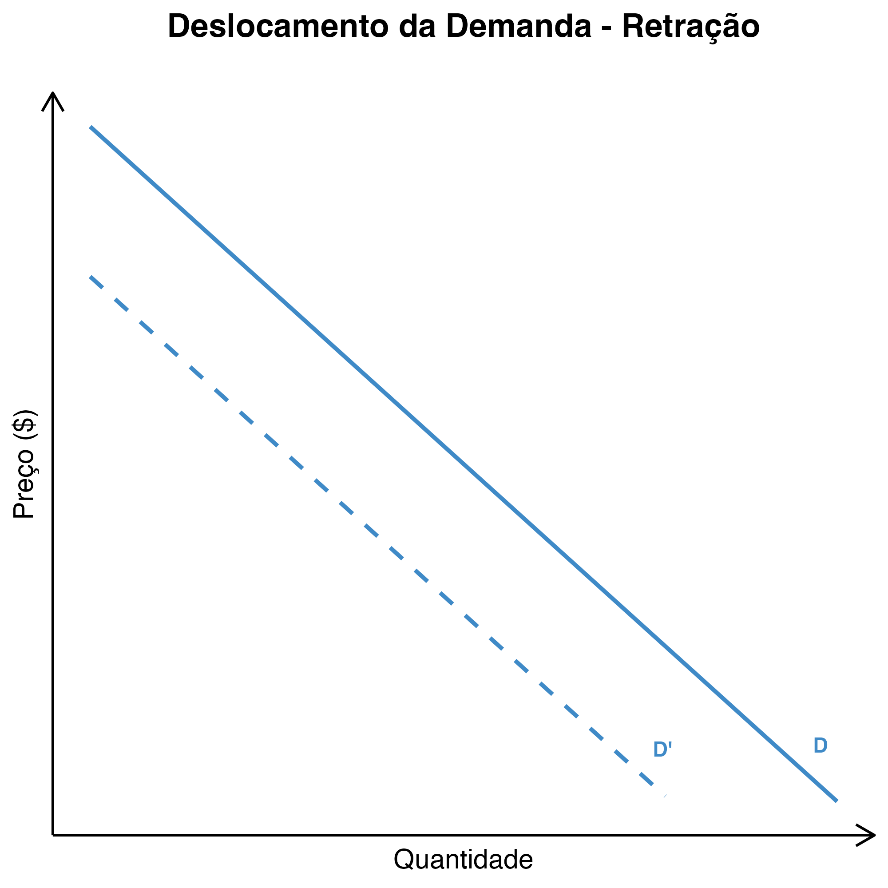

# Aula 2 - A eficiência dos mercados competitivos
**Análise Econômica do Direito – 2024.2**
Lucas Thevenard

---
<!-- 
paginate: true 
header: Aula 2 - A eficiência dos mercados competitivos
footer: lucas.gomes@fgv.br | 25/11/2024
-->

## Princípio Ceteris Paribus
- Com tudo o mais mantido constante

---

## Mercado
  - Um mercado é um grupo de compradores e vendedores de determinado bem ou serviço
  - **Compradores**
    - Como grupo, determinam a demanda pelo produto
  - **Vendedores**
    - Como grupo, determinam a oferta do produto

---

# Demanda

---

## Curva de demanda
- **Quantidade demandada**
  - Quantidade de um bem que os compradores desejam e podem comprar

---

<!-- 
header: ''
footer: ''
-->

 

---

<!-- 
paginate: true 
header: Aula 2 - A eficiência dos mercados competitivos
footer: lucas.gomes@fgv.br | 25/11/2024
-->

## Curva de demanda
- **Quantidade demandada**
  - Quantidade de um bem que os compradores desejam e podem comprar
- **Lei da demanda**: com tudo o mais mantido constante, quando o preço de um bem aumenta, a quantidade demandada diminui; quando o preço diminui, a quantidade demandada do bem aumenta.

---

<!-- 
header: ''
footer: ''
-->

 

---

<!-- 
paginate: true 
header: Aula 2 - A eficiência dos mercados competitivos
footer: lucas.gomes@fgv.br | 25/11/2024
-->

## Expansão da Demanda (Deslocamento para a Direita):
- **Aumento na Renda dos Consumidores:**
  - Ex.: Aumento do salário mínimo impulsiona a demanda por bens normais, como roupas e eletrônicos.
- **Mudança nas Preferências:**
  - Ex.: Popularização de alimentos orgânicos eleva sua demanda.
- **Expectativa de Preço Futuro Mais Alto:**
  - Ex.: Consumidores compram um carro esperando que os preços subam.
- **Aumento do preço de um bem substituto ou redução do preço de um bem complementar:**
  - Ex.: Carne se o preço do frango cai, ou manteiga se o preço do pão sobe.

---

<!-- 
header: ''
footer: ''
-->

 

---

<!-- 
header: ''
footer: ''
-->

 

---

<!-- 
paginate: true 
header: Aula 2 - A eficiência dos mercados competitivos
footer: lucas.gomes@fgv.br | 25/11/2024
-->

## Retração da Demanda (Deslocamento para a Esquerda):
- **Redução na Renda dos Consumidores:**
  - Ex.: Crises econômicas diminuem a demanda por bens de luxo, como joias.
- **Mudança nas Preferências:**
  - Ex.: Campanhas contra o uso de plástico reduzem a demanda por descartáveis.
- **Expectativa de Preço Futuro Mais Baixo:**
  - Ex.: Consumidores adiam compras esperando promoções na Black Friday.
- **Redução do preço de um bem substituto ou aumento do preço de um bem complementar:**
  - Ex.: Carne se o preço do frango cai, ou manteiga se o preço do pão sobe.

---

<!-- 
header: ''
footer: ''
-->

 

---

<!-- 
header: ''
footer: ''
-->

 

---

<!-- 
paginate: true 
header: Aula 2 - A eficiência dos mercados competitivos
footer: lucas.gomes@fgv.br | 25/11/2024
-->

## Relação entre Renda e Demanda

**Bens Normais**
- A demanda por **bens normais** aumenta conforme a renda dos consumidores cresce.
  - **Exemplos:**
    - Eletrônicos (smartphones, laptops).
    - Roupas de marcas reconhecidas.
- **Características:**
  - Relacionamento direto com a renda.
  - Maior renda → Maior consumo.

---

## Relação entre Renda e Demanda

**Bens Superiores (ou de Luxo)**
- Um tipo de bem normal cuja demanda cresce proporcionalmente mais do que o aumento da renda.
  - **Exemplos:**
    - Viagens internacionais.
    - Joias e itens exclusivos.
- **Características:**
  - Elasticidade renda da demanda > 1.
  - Consumo altamente dependente do aumento de renda.

---

## Relação entre Renda e Demanda

**Bens Inferiores**
- A demanda por **bens inferiores** diminui à medida que a renda dos consumidores aumenta.
  - **Exemplos:**
    - Alimentos básicos de menor qualidade (como macarrão instantâneo).
    - Transporte público em relação a carros próprios.
- **Características:**
  - Relacionamento inverso com a renda.
  - Maior renda → Menor consumo.

---

## Relação entre Renda e Demanda

**Bens de Necessidade**
- Produtos cuja demanda é relativamente estável, independentemente de mudanças significativas na renda.
  - **Exemplos:**
    - Água.
    - Energia elétrica.
    - Alimentos básicos de consumo diário (arroz, feijão).
- **Características:**
  - Elasticidade renda da demanda ≈ 0 (ou muito baixa).
  - Consumo é menos sensível às variações de renda.

---
## Relação entre Renda e Demanda

**Resumindo:**
- Quando a renda aumenta:
  - **Bens normais e de luxo**: Aumentam a demanda.
  - **Bens inferiores**: Diminuem a demanda.
  - **Bens de necessidade**: Pouco impacto na demanda.

---

## Elasticidade-preço da demanda
- Elasticidade é uma medida de resposta da quantidade demandada a mudanças nas variáveis do que afetam a quantidade demandada. Neste caso, estamos analisando o preço, então falamos em **elasticidade-preço da demanda**.
  * É uma medida da 'sensibilidade' dos consumidores a variações no preço.

---

<!-- 
header: ''
footer: ''
-->

 

---

<!-- 
header: ''
footer: ''
-->

 

---

<!-- 
header: ''
footer: ''
-->

 

---

<!-- 
paginate: true 
header: Aula 2 - A eficiência dos mercados competitivos
footer: lucas.gomes@fgv.br | 25/11/2024
-->

## Fatores que afetam a elasticidade da demanda

**1. Disponibilidade de Substitutos Próximos**
- Quanto mais substitutos disponíveis, maior a elasticidade.
  - Ex.: Refrigerantes têm alta elasticidade porque há muitas marcas e sabores substituíveis.
  - Ex.: Remédios essenciais possuem baixa elasticidade devido à falta de alternativas.

---

## Fatores que afetam a elasticidade da demanda

**2. Proporção da Renda Gasta no Bem**
- Bens que representam uma grande parte do orçamento tendem a ser mais elásticos.
  - Ex.: Eletrônicos de alto custo (maior elasticidade).
  - Ex.: Sal (menor elasticidade, pois representa uma fração mínima da renda).

---

## Fatores que afetam a elasticidade da demanda

**3. Necessidade do Bem**
- Bens essenciais tendem a ter demanda inelástica.
  - Ex.: Medicamentos de uso contínuo possuem baixa elasticidade.
  - Ex.: Produtos de luxo, como joias, apresentam maior elasticidade.

---

## Fatores que afetam a elasticidade da demanda

**4. Horizonte Temporal**
- A elasticidade tende a ser maior no longo prazo.
  - Ex.: Aumento no preço da gasolina pode não afetar o consumo imediatamente, mas no longo prazo os consumidores podem buscar alternativas (veículos elétricos, transporte público).

---

## Fatores que afetam a elasticidade da demanda

**5. Hábitos e Preferências dos Consumidores**
- Produtos com forte apego emocional ou cultural têm demanda menos elástica.
  - Ex.: Café em algumas culturas tem baixa elasticidade.
  - Ex.: Produtos de moda podem apresentar elasticidade maior devido às tendências.

---

# Oferta

---

## Curva de oferta
- Quantidade ofertada
  - Quantidade de um bem que os vendedores estão dispostos e aptos a vender.

---

<!-- 
header: ''
footer: ''
-->

 

---

<!-- 
paginate: true 
header: Aula 2 - A eficiência dos mercados competitivos
footer: lucas.gomes@fgv.br | 25/11/2024
-->

## Curva de oferta
- Quantidade ofertada
  - Quantidade de um bem que os vendedores estão dispostos e aptos a vender.
- **Lei da oferta**: com tudo o mais mantido constante, quando o preço de um bem aumenta, a quantidade ofertada desse bem também aumenta; quando o preço de um bem cai, a quantidade ofertada desse bem também cai

---

<!-- 
header: ''
footer: ''
-->

 

---

<!-- 
paginate: true 
header: Aula 2 - A eficiência dos mercados competitivos
footer: lucas.gomes@fgv.br | 25/11/2024
-->

## Expansão da Oferta (Deslocamento para a Direita):
- **Redução nos Custos de Produção:**
  - Ex.: Fatores técnicos reduzem a necessidade de insumos, ou eles se tornam mais baratos, reduzindo o custo do processo produtivo.
- **Melhoria na Tecnologia:**
  - Ex.: Desenvolvimento de máquinas eleva a produtividade agrícola.
- **Subvenções ou Incentivos Governamentais:**
  - Ex.: Subsídios para a produção de energia solar aumentam a oferta desse recurso.
- **Condições Climáticas Favoráveis:**
  - Ex.: Safras recordes devido ao clima ideal aumentam a oferta de grãos.

---

<!-- 
header: ''
footer: ''
-->

 

---

<!-- 
header: ''
footer: ''
-->

 

---

<!-- 
paginate: true 
header: Aula 2 - A eficiência dos mercados competitivos
footer: lucas.gomes@fgv.br | 25/11/2024
-->

## Retração da Oferta (Deslocamento para a Esquerda):
- **Aumento nos Custos de Produção:**
  - Ex.: Elevação no preço do petróleo reduz a oferta de produtos derivados.
- **Problemas na Tecnologia:**
  - Ex.: Falhas em sistemas de transporte diminuem a oferta de produtos entregues.
- **Tributação Elevada:**
  - Ex.: Aumento de impostos sobre cigarros reduz sua oferta no mercado.
- **Condições Climáticas Desfavoráveis:**
  - Ex.: Seca severa diminui a oferta de frutas e vegetais.

---

<!-- 
header: ''
footer: ''
-->

 

---

<!-- 
header: ''
footer: ''
-->

 

---

## Fatores que afetam a elasticidade da oferta

**1. Horizonte Temporal**
- A oferta é mais elástica no longo prazo do que no curto prazo.
  - Ex.: Uma fábrica pode expandir a produção de carros ao longo de anos, mas no curto prazo está limitada pela capacidade atual.

---

## Fatores que afetam a elasticidade da oferta

**2. Capacidade de Produção Ociosa**
- Empresas com capacidade ociosa têm maior elasticidade da oferta.
  - Ex.: Se uma fábrica está operando abaixo da capacidade, pode rapidamente aumentar a produção quando os preços sobem.

---

## Fatores que afetam a elasticidade da oferta

**3. Disponibilidade de Fatores de Produção**
- Quanto mais fácil e rápido for obter insumos, maior a elasticidade.
  - Ex.: Produtos que dependem de recursos abundantes (como trigo em áreas férteis) tendem a ter oferta mais elástica.
  - Ex.: Produtos que dependem de recursos raros (como metais preciosos) têm oferta inelástica.

---

## Fatores que afetam a elasticidade da oferta

**4. Facilidade de Armazenamento**
- Bens que podem ser estocados têm oferta mais elástica.
  - Ex.: Produtos não perecíveis, como grãos, podem ser armazenados e vendidos quando os preços aumentam.
  - Ex.: Produtos perecíveis, como frutas frescas, possuem oferta menos elástica.

---

## Fatores que afetam a elasticidade da oferta

**5. Mobilidade dos Fatores de Produção**
- Se os fatores de produção podem ser rapidamente realocados, a elasticidade aumenta.
  - Ex.: Terras que podem ser usadas para diferentes cultivos tornam a oferta agrícola mais elástica.
  - Ex.: Máquinas especializadas reduzem a elasticidade em setores altamente específicos.

---

## Fatores que afetam a elasticidade da oferta

**6. Natureza do Produto**
- Produtos simples de produzir têm maior elasticidade.
  - Ex.: Produtos manufaturados em larga escala, como camisetas, têm oferta mais elástica.
  - Ex.: Obras de arte exclusivas têm oferta extremamente inelástica.

---

## Fatores que afetam a elasticidade da oferta

**7. Regulações e Políticas Governamentais**
- Restrições regulatórias podem diminuir a elasticidade da oferta.
  - Ex.: Licenças ambientais podem limitar a oferta de novos empreendimentos no curto prazo.
  - Ex.: Disponibilidade de auxílios à produção ou subsídios pode aumentar a elasticidade ao facilitar a expansão da produção.

---

<!-- 
paginate: true 
header: Aula 2 - A eficiência dos mercados competitivos
footer: lucas.gomes@fgv.br | 25/11/2024
-->

# Equilíbrio de Mercado

---

## Conceito de mercado em equilíbrio
  - Situação na qual o preço do mercado atingiu o nível em que a quantidade ofertada é igual à quantidade demandada

* Quando as curvas de oferta e de demanda são justapostas, há intersecção em um ponto e o preço nessa intersecção é o preço de equilíbrio
  - **Preço de equilíbrio**: a oferta atende a demanda, não havendo pressões no mercado para que o preço mude.

---

<!-- 
header: ''
footer: ''
-->

 

---

<!-- 
paginate: true 
header: Aula 2 - A eficiência dos mercados competitivos
footer: lucas.gomes@fgv.br | 25/11/2024
-->

## Mercados em desequilíbrio 
- Quando o preço de mercado está abaixo ou acima do preço de equilíbrio, tem-se um mercado em desequilíbrio.
- **Excesso de oferta**:
  - Quando o preço de mercado está acima do preço de equilíbrio, tem-se um excesso de oferta.
  - Há mais produtos ofertados no mercado do que demanda por esses produtos. Os produtores não conseguem vender o excedente e são forçados a abaixar o preço.

---

<!-- 
header: ''
footer: ''
-->

 

---

<!-- 
paginate: true 
header: Aula 2 - A eficiência dos mercados competitivos
footer: lucas.gomes@fgv.br | 25/11/2024
-->

## Mercados em desequilíbrio 
- Quando o preço de mercado está abaixo ou acima do preço de equilíbrio, tem-se um mercado em desequilíbrio.
- **Excesso de demanda**:
  - Quando o preço de mercado está abaixo do preço de equilíbrio, tem-se um excesso de demanda.
  - Há menos produtos ofertados no mercado do que demanda por esses produtos. A escassez do produto eleva seu valor de mercado e os produtores tem um forte incentivo para elevar preços.

---

<!-- 
header: ''
footer: ''
-->

 

---

<!-- 
paginate: true 
header: Aula 2 - A eficiência dos mercados competitivos
footer: lucas.gomes@fgv.br | 25/11/2024
-->

## Eficiência dos mercados de competição perfeita
- **Mercado de competição perfeita**
  - Compradores e vendedores são tomadores de preços.
  - Bens são homogêneos.
  - Não há barreiras significativas à entrada.
* **Exemplos**:
  - Mercado da arroz, mercado do carne, mercado do milho.
* Dadas essas condições, o lucro (econômico) dos produtores é nulo e o mercado **maximiza o excedente** dos produtores e dos vendedores.

---

## Quais são os excedentes do mercado competitivo?

- **Para os consumidores**: diferença entre o que os consumidores estariam dispostos a pagar pelo bem adquirido (preço de reserva) e o que de fato eles pagaram no mercado.
- **Para os produtores**: diferença entre o preço ao qual o produtor estaria disposto a produzir certa quantidade e o preço de mercado.
  * **Obs**: segundo a teoria econômica, em um mercado perfeitamente competitivo o lucro econômico dos produtores é nulo. Isso não significa que não há lucro contábil, apenas que a remuneração dos investimentos produtivos tende a ser equivalente risco do empreendimento e ao custo de oportunidade do capital.

---

<!-- 
header: ''
footer: ''
-->

 

---

<!-- 
header: ''
footer: ''
-->

 

---

<!-- 
header: ''
footer: ''
-->

 

---

<!-- 
paginate: true 
header: Aula 2 - A eficiência dos mercados competitivos
footer: lucas.gomes@fgv.br | 25/11/2024
-->

## Exemplo de intervenção ineficiente - imposição de um teto de preços

- Se o governo intervém, por exemplo, estabelecendo um preço máximo que pode ser cobrado naquele mercado, como podemos usar o gráfico para entender os efeitos gerados sobre os excedentes dos consumidores e dos produtores?
  - Vamos supor que o preço máximo é inferior ao preço de equilíbrio no livre mercado (pois do contrário a intervenção não terá efeito nenhum).
  - O que acontecerá com as dinâmicas entre os consumidores e os produtores?

---

<!-- 
header: ''
footer: ''
-->

 

---

<!-- 
header: ''
footer: ''
-->

 

---

<!-- 
header: ''
footer: ''
-->

 

---

<!-- 
header: ''
footer: ''
-->

 

---

<!-- 
header: ''
footer: ''
-->

 

---

<!-- 
paginate: true 
header: Aula 2 - A eficiência dos mercados competitivos
footer: lucas.gomes@fgv.br | 25/11/2024
-->

## Exemplo de intervenção ineficiente - taxação

- Se o governo intervém, por exemplo, impondo uma taxa, como podemos usar o gráfico para entender os efeitos gerados sobre os excedentes dos consumidores e dos produtores?
  - O que acontecerá com os incentivos dos consumidores?
  - O que acontecerá com os incentivos dos produtores?
  - Se há um imposto, o preço pago pelo consumidor é igual ao preço recebido pelo produtor?

---

<!-- 
header: ''
footer: ''
-->

 

---

<!-- 
header: ''
footer: ''
-->

 

---

<!-- 
header: ''
footer: ''
-->

 

---

<!-- 
header: ''
footer: ''
-->

 

---

<!-- 
header: ''
footer: ''
-->

 

---

<!-- 
header: ''
footer: ''
-->

 

---

<!-- 
paginate: true 
header: Aula 2 - A eficiência dos mercados competitivos
footer: lucas.gomes@fgv.br | 25/11/2024
-->

## Aplicações práticas do que aprendemos até aqui...

- **Estática comparativa** - que acontece com o preço e com a quantidade de equilíbrio do:
  * mercado de sorvete, quando ocorre o verão mais frio dos últimos 50 anos?
  * mercado imobiliário, quando há uma crise financeira?
  * mercado de automóveis, quando há uma aumento do preço do aço?
  * mercado de celulares, quando uma nova tecnologia torna a fabricação de baterias recarregáveis mais barata?

---

## Relações entre os bens

- Maconha e drogas ilegais são bens substitutos?
- Por que poderia ser importante saber isso?
* Maconha não seria um bem complementar a outras drogas?

---

## Combate às drogas e elasticidade

- A demanda por drogas ilegais é elástica, ou inelástica?
* Por que isso pode ser importante para definir uma política de combate às drogas?

---

<!-- 
header: ''
footer: ''
-->

 

---

<!-- 
header: ''
footer: ''
-->

 

