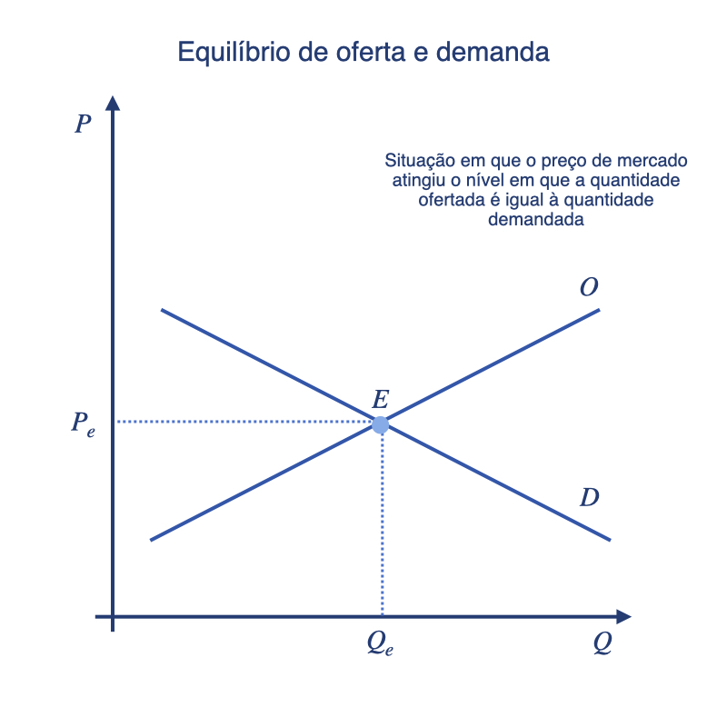
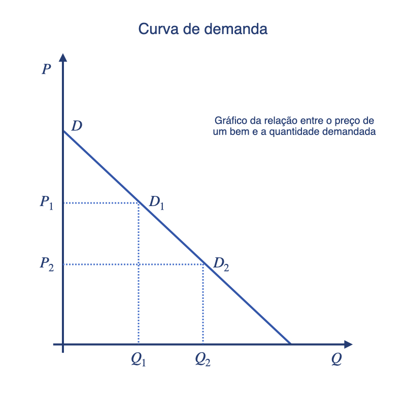
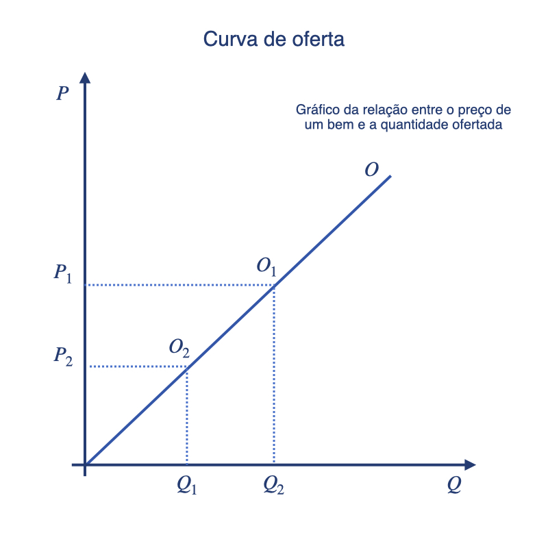
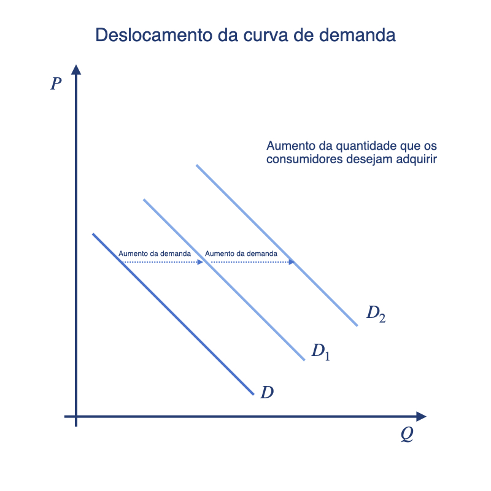
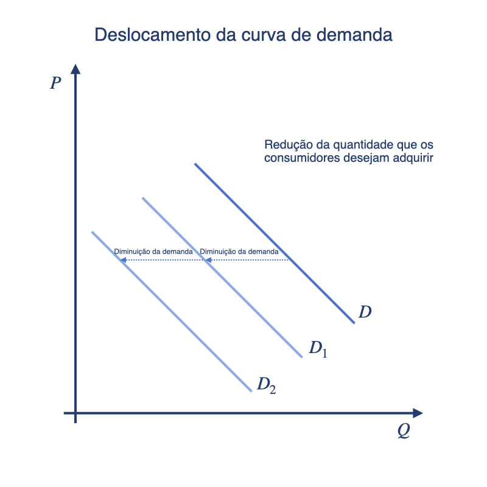
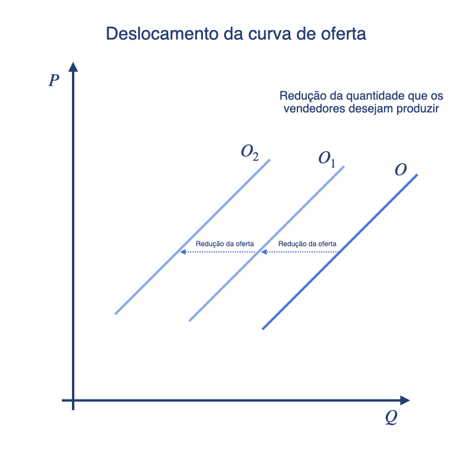

# Aula 2 - A eficiência dos mercados competitivos
**Análise Econômica do Direito – 2024.2**
Lucas Thevenard

---
<!-- 
paginate: true 
header: Aula 2 - A eficiência dos mercados competitivos
footer: lucas.gomes@fgv.br | 25/11/2024
-->

## Princípio Ceteris Paribus
- Com tudo o mais mantido constante

---
## Equilíbrio de mercado
* Equilíbrio
  * Situação na qual o preço do mercado atingiu o nível em que a quantidade ofertada é igual à quantidade demandada

* Quando as curvas de oferta e de demanda são justapostas, há intersecção em um ponto
  * O preço nessa intersecção é o preço de equilíbrio
    * Preço de equilíbrio: o que iguala a quantidade ofertada e a quantidade demandada

---

<!-- 
header: ''
footer: ''
-->

 

---

<!-- 
paginate: true 
header: Aula 2 - A eficiência dos mercados competitivos
footer: lucas.gomes@fgv.br | 25/11/2024
-->

## Equilíbrio de mercado
* Mercados em desequilíbrio 
  * Quando o preço de mercado está abaixo ou acima do preço de equilíbrio, tem-se um mercado em desequilíbrio
  * Quando o preço de mercado está acima do preço de equilíbrio, tem-se um excesso de oferta; quando o preço de mercado está abaixo do preço de equilíbrio, há um excesso de demanda
    * Dada a situação, a tendência é que haja um ajuste de preço para que o preço de equilíbrio seja atingido

---

## Equilíbrio de mercado

* Quando o preço de mercado está acima do preço de equilíbrio, tem-se um excesso de oferta; quando o preço de mercado está abaixo do preço de equilíbrio, há um excesso de demanda
  * Dada a situação, a tendência é que haja um ajuste de preço para que o preço de equilíbrio seja atingido
   
---

## Equilíbrio de mercado
* Lei da oferta e da demanda: o preço de qualquer bem se ajusta para trazer a quantidade ofertada e a quantidade demandada desse bem para o equilíbrio

---

## Eficiência dos mercados competitivos
* Mercado
  * Um mercado é um grupo de compradores e vendedores de determinado bem ou serviço
* Compradores
  * Como grupo, determinam a demanda pelo produto
* Vendedores
  * Como grupo, determinam a oferta do produto

---

  ## Eficiência dos mercados competitivos
  * Mercado competitivo
    * Mercado em que há tantos compradores e vendedores que cada um deles tem impacto insignificante sobre o preço do mercado
  * Exemplos de mercado competitivo
    - Mercado da soja
    - Mercado do petróleo
    - Mercado do milho

---

## Eficiência dos mercados competitivos
* Mercado competitivo
  * Para alcançar essa forma de competição um mercado deve apresentar duas características:
    * os bens oferecidos para venda são todos iguais
    * os compradores e vendedores são tão numerosos que nenhum é capaz de, individualmente, influenciar o preço do mercado

---

## Eficiência dos mercados competitivos
* Mercado competitivo
  * Compradores e vendedores são **tomadores de preço** 
    * Precisam aceitar o preço que o mercado determina

---

## Eficiência dos mercados competitivos
* Mercado de competição imperfeita
  - Monopólio
  - Competição monopolística
  - Oligopólio

---

## Eficiência dos mercados competitivos
- Eficiência
  * A propriedade da alocação de um recurso de maximizar o excedente total recebido por todos os membros da sociedade
    * Se uma alocação de recursos maximiza o excedente total, dizemos que tem eficiência
    * Se uma alocação não é eficiente, parte dos ganhos potenciais do comércio entre compradores e vendedores não está sendo obtida

---

## Curva de demanda
* Quantidade demandada
  * Quantidade de um bem que os compradores desejam e podem comprar
* Lei da demanda: com tudo o mais mantido constante, quando o preço de um bem aumenta, a quantidade demandada diminui; quando o preço diminui, a quantidade demandada do bem aumenta

---

## Curva de demanda
* Curva de demanda
  * Gráfico da relação entre o preço de um bem e a quantidade demandada
    * A inclinação da curva de demanda é voltada para baixo porque, com tudo o mais mantido constante, um preço mais baixo significa uma quantidade demandada maior

---

<!-- 
header: ''
footer: ''
-->

 

---

<!-- 
paginate: true 
header: Aula 2 - A eficiência dos mercados competitivos
footer: lucas.gomes@fgv.br | 25/11/2024
-->

## Curva de oferta
* Quantidade ofertada
  * Quantidade de um bem que os vendedores estão dispostos e aptos a vender
* Lei da oferta: com tudo o mais mantido constante, quando o preço de um bem aumenta, a quantidade ofertada desse bem também aumenta; quando o preço de um bem cai, a quantidade ofertada desse bem também cai

---

## Curva de oferta
* Curva de oferta
  * Gráfico da relação entre o preço de um bem e a quantidade ofertada
    * A inclinação da curva de oferta é voltada para cima porque, com tudo o mais mantido constante, um preço maior significa uma quantidade ofertada maior

---

<!-- 
header: ''
footer: ''
-->

 

---

<!-- 
paginate: true 
header: Aula 2 - A eficiência dos mercados competitivos
footer: lucas.gomes@fgv.br | 25/11/2024
-->

## Elasticidade das curvas de oferta e de demanda
* Elasticidade é uma medida de resposta da quantidade demandada ou da quantidade ofertada a uma variação em um de seus determinantes
  * Medição da reação dos consumidores frente a mudanças de variáveis

---

## Elasticidade das curvas de oferta e de demanda
* Elasticidade preço-demanda é uma medida do quanto a quantidade demandada de um bem reage a uma mudança no preço do bem em questão, calculada como a variação percentual da quantidade demandada dividida pela variação percentual do preço

---

## Elasticidade das curvas de oferta e de demanda
* A demanda é considerada **elástica** se a quantidade demandada responde substancialmente a mudanças no preço
* A demanda é considerada **inelástica** se a quantidade demandada responde pouco a mudanças no preço

---

## Elasticidade das curvas de oferta e de demanda
* Fatores que afetam a elasticidade
  - Disponibilidade de substitutos próximos
  - Bens necessários vs. bens supérfluos
  - Definição do mercado
  - Horizonte de tempo

---

## Estática comparativa
- Deslocamento ao longo da curva
- Deslocamento da curva

---

<!-- 
header: ''
footer: ''
-->

 

---

<!-- 
header: ''
footer: ''
-->

 

---

<!-- 
header: ''
footer: ''
-->

 

---

<!-- 
header: ''
footer: ''
-->

 

---

<!-- 
paginate: true 
header: Aula 2 - A eficiência dos mercados competitivos
footer: lucas.gomes@fgv.br | 25/11/2024
-->

## Bens substitutos e complementares
* Bens com substitutos próximos tendem a ter demanda mais elástica porque é mais fácil para os consumidores trocá-los por outros
  * Exemplo: manteiga e margarina
* Bens complementares são consumidos juntos, de forma que o aumento no preço de um implica a diminuição da compra do outro
  * Exemplo: impressora e cartucho

---
## Bens substitutos e complementares
- Cigarro & maconha (Mankiw)
  - **Problema Regulatório**: Cigarro e maconha são bens complementares ou substitutos?

---

## Escolha do consumidor
* A teoria da escolha do consumidor examina os _tradeoffs_ com os quais as pessoas se deparam no papel de consumidores
  - Quando um consumidor compra mais de um bem, tem de comprar menos de outros
  - Quando gasta mais de sua renda no presente e poupa menos, deve aceitar um nível de renda mais baixo no futuro

---

## Escolha do consumidor
* Restrição orçamentária: o limite de combinações de consumo de bens que o consumidor pode adquirir
  - Mostra quais combinações de bens o consumidor pode adquirir, dados a sua renda e o preço dos bens
  - A inclinação da restrição orçamentária mede a taxa à qual o consumidor pode trocar um bem pelo outro

---

## Escolha do consumidor
* A escolha do consumidor não depende apenas da sua restrição orçamentária, mas de suas **preferências** em relação aos dois bens
  - As preferências do consumidor lhe permitem escolher entre as combinações possíveis de consumo de bens que pode adquirir
    - Se ao consumidor é oferecida uma série de combinações, ele vai escolher aquela que satisfaz mais suas preferências
      - Se ambas satisfazem igualmente suas preferências, diz-se que o consumidor é **indiferente** entre as combinações.

---

## Escolha do consumidor
* A representação gráfica das preferências do consumidor se dá pela **curva de indiferença**
  - A curva de indiferença mostra as combinações de consumo que proporcionam ao consumidor o mesmo nível de satisfação
    - A inclinação em qualquer ponto de uma curva de indiferença é igual à qual o consumidor está disposto a substituir um bem pelo outro
      - Essa taxa é chamada **taxa marginal de substituição**
---

## Escolha do consumidor

---

## Escolha do consumidor
* O formato de uma curva de indiferença diz sobre a disposição de um  consumidor em trocar um bem pelo outro
  - Quando os bens são facilmente substituíveis um pelo outro, as curvas de indiferença são menos convexas
  - Quando é difícil substituir um bem pelo outro, as curvas de indiferença são muito convexas

---

## Escolha do consumidor
* O ponto em que a curva de indiferença e a restrição orçamentária se tocam é chamado de **ótimo**
  - No ponto ótimo, a inclinação da curva de indiferença é igual à inclinação da restrição orçamentária

---

## Escolha do consumidor
* Outra forma comum de representar preferências é por meio do conceito de **utilidade**
  - Utilidade é uma medida abstrata de satisfação ou felicidade que um consumidor obtém de um conjunto de bens
    - Um consumidor prefere um conjunto de bens a outro se o primeiro oferece mais utilidade que o segundo

---

## Estrutura de custos e escolha da firma
* Objetivo de uma empresa: maximizar o lucro
  - Lucro: a receita total menos o custo total
  - Receita total: o montante que uma empresa recebe pela venda da sua produção
  - Custo total: o valor de mercado dos insumos que uma empresa usa na produção

---

## Estrutura de custos e escolha da firma
* Diferentes custos
  - Custos explícitos: custos dos insumos que exigem desembolso de dinheiro por parte da empresa
  - Custos implícitos: custos dos insumos que não exigem desembolso de dinheiro por parte da empresa
  - Exemplo: farinha, ovos, batedeiras (custos explícitos de uma fábrica de bolos) e o dinheiro que alguém poderia deixar de ganhar (custo implícito, dado que a dona da fábrica poderia ganhar centenas de reais em sue emprego antigo, como advogada, com o tempo que ela agora aloca na fábrica de bolos)

---

## Estrutura de custos e escolha da firma
* Lucro: economistas e contadores medem lucro de forma diferente
  - Lucro econômico: a receita total menos o custo total, incluído tanto os custos explícitos quanto os custos implícitos
  - Lucro contábil: a receita total menos o custo explícito total
- O lucro contábil tende a ser maior que o econômico
  - Para uma empresa ser lucrativa para os economistas, ela tem que cobrir todos os custos, explícitos e implícitos

---
## Estrutura de custos e escolha da firma
* Lucro: economistas e contadores medem lucro de forma diferente
  - Lucro econômico: a receita total menos o custo total, incluído tanto os custos explícitos quanto os custos implícitos
  - Lucro contábil: a receita total menos o custo explícito total
- O lucro contábil tende a ser maior que o econômico
  - Para uma empresa ser lucrativa para os economistas, ela tem que cobrir todos os custos, explícitos e implícitos

---

## Estrutura de custos e escolha da firma
* Custos
  - Custo total
  - Custo fixo
  - Custo variável
  - Custo marginal

---

## Estrutura de custos e escolha da firma
* Custo fixo
  - Custo que não varia com a quantidade produzida
* Custo variável
  - Custo que varia com a quantidade produzida
* Custo marginal
  - Aumento no custo total decorrente da produção de uma unidade adicional

---

## Estrutura de custos e escolha da firma
* Custo total médio
  - Custo total dividido pela quantidade produzida
* Custo fixo médio
  - Custo fixo dividido pela quantidade produzida
* Custo variável médio
  - Custos variável dividido pela quantidade produzida

---

## Estrutura de custos e escolha da firma
* Decisão de paralisação
  - Decisão de curto prazo de não produzir nada durante um determinado intervalo de tempo por causa das condições atuais do mercado
- Decisão de saída 
  - Decisão de longo prazo de deixar o mercado

---

## Estrutura de custos e escolha da firma
* Paralisação e saída
  - As decisões de curto e longo prazo diferem porque a maioria das empresas não consegue se livrar do custo fixo no curto prazo, mas pode fazê-lo no longo
    - Uma empresa que paralisa suas atividades temporariamente continua a ter de arcar com os custos fixos, ao passo que a outra, que sai do mercado, deixa de pagar tanto os custos fixos quanto os variáveis
  
---

## Estrutura de custos e escolha da firma
* Escolha pela paralisação das atividades
  - Uma empresa opta por paralisar suas atividades se o preço do bem for menor do que o custo variável médio de produção
    - Se o preço que a empresa recebe não cobrir o custo variável médio, a empresa ficará em melhor posição se suspender a produção
      - Ela perderá dinheiro, mas perderá ainda mais se decidir continuar no mercado

---

## Estrutura de custos e escolha da firma
* A decisão da empresa de sair do mercado no longo prazo é semelhante à decisão de paralisar as atividades
  - Se a empresa sair, perderá toda a receita da venda de seu produto, mas economizará os custos de produção, fixos e variáveis
    - A empresa sai do mercado se a receita que obteria com o mercado for menor do que seus custos totais

---

## Estrutura de custos e escolha da firma
* O critério de entrada é exatamento o oposto do critério de saída