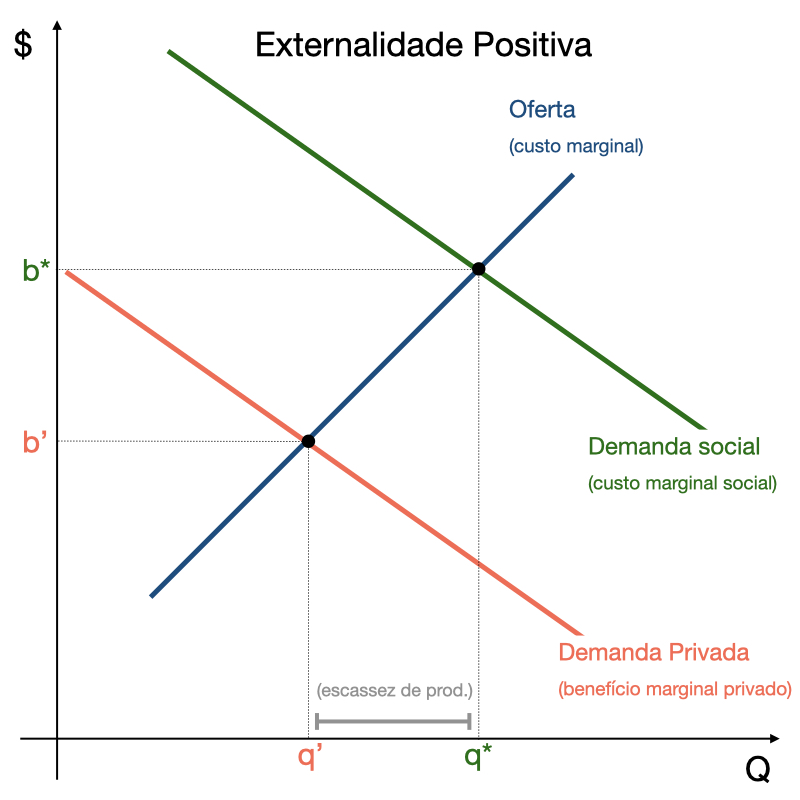
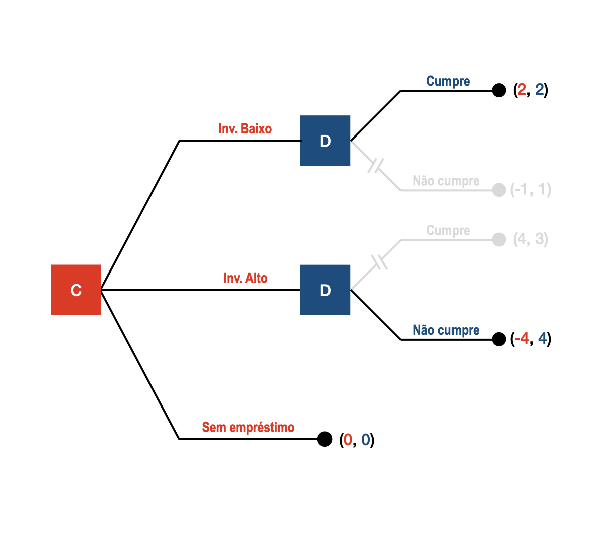
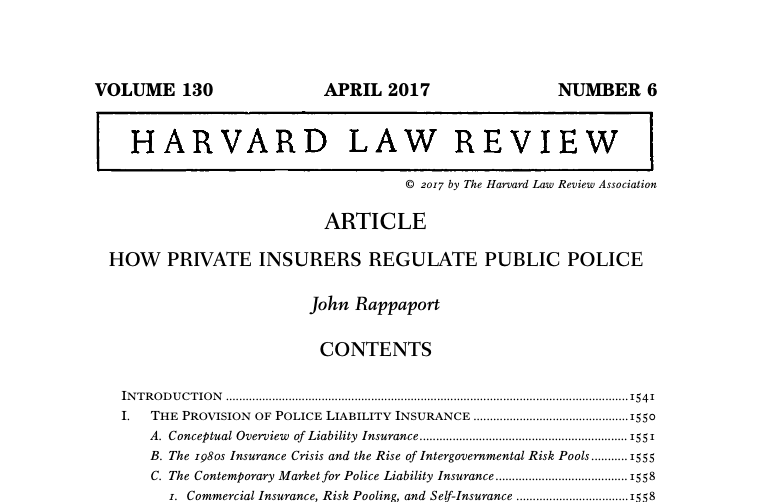

# Aula 4 - Falhas de Mercado II
**Análise Econômica do Direito – 2024.2**
Lucas Thevenard

---
<!-- 
paginate: true 
header: Aula 4 - Falhas de Mercado II
footer: lucas.gomes@fgv.br | 02/12/2024
-->

## Recapitulando...

---

<!-- 
header: ''
footer: ''
-->

1. **Mercado em equilíbrio maximiza os excedentes**

---

2. **As forças do mercado tendem a corrigir desequilíbrios**

 

---

3. **Intervenções estatais tendem a produzir desequilíbrios**

 

---

<!-- 
paginate: true 
header: Aula 2 - A eficiência dos mercados competitivos
footer: lucas.gomes@fgv.br | 25/11/2024
-->

### Mas então, por que a regulação seria necessária?

 

* Mercados não são perfeitos:
  - Mercados não são competitivos.
  - Mercados são incompletos.
  - Mercados possuem falhas específicas: externalidades, falhas de informação.

---

## Falhas de mercado estudadas

---

## Falhas de mercado estudadas

**Lei 12.529/2011** 

> "Art. 9º. Compete ao Plenário do Tribunal [do CADE], dentre outras atribuições previstas nesta Lei:"
> (...)  X - apreciar processos administrativos de atos de concentração econômica, na forma desta Lei, fixando, quando entender conveniente e oportuno, acordos em controle de atos de concentração; 

---

## Falhas de mercado estudadas

- **Concorrência imperfeita**.
  - Monopólios (controle de atos de concentração).
  - Oligopólios (combate ao cartel).
    - **Obs**: Novas formas de defesa da concorrência (Competition and Markets Authority no Reino Unido).

---

## Falhas de mercado estudadas

**Constituição Federal de 1988**

> Art. 25. Os Estados organizam-se e regem-se pelas Constituições e leis que adotarem, observados os princípios desta Constituição.
> (...) § 2º Cabe aos Estados explorar diretamente, ou mediante concessão, os serviços locais de gás canalizado, na forma da lei, vedada a edição de medida provisória para a sua regulamentação.

---

## Falhas de mercado estudadas

- **Concorrência imperfeita**.
  - Monopólios (controle de atos de concentração).
  - Oligopólios (combate ao cartel).
    - **Obs**: Novas formas de defesa da concorrência (Competition and Markets Authority no Reino Unido).
- **Monopólios Naturais**.
  - Muitos exemplos em setores de infraestrutura.

---

## Falhas de mercado estudadas

**Constituição Federal de 1988**

> Art. 149-A. Os Municípios e o Distrito Federal poderão instituir contribuição, na forma das respectivas leis, para o custeio, a expansão e a melhoria do serviço de iluminação pública e de sistemas de monitoramento para segurança e preservação de logradouros públicos, observado o disposto no art. 150, I e III.

---

## Falhas de mercado estudadas

- **Concorrência imperfeita**.
  - Monopólios (controle de atos de concentração).
  - Oligopólios (combate ao cartel).
    - **Obs**: Novas formas de defesa da concorrência (Competition and Markets Authority no Reino Unido).
- **Monopólios Naturais**.
  - Muitos exemplos em setores de infraestrutura.
- **Bens Públicos**.
  - Problema do free rider. Difícil regular porque não há a referência de valor.

---

## Falhas de mercado estudadas

> Se considerarmos o Judiciário como um recurso (resource system) e a prestação jurisdicional (serviço público adjudicatório) como um fruto desse recurso, pois uma sentença ou um acórdão advém do Judiciário, mas seu uso e gozo não diminuem o principal, veremos que o sistema judicial possui as características de um recurso comum de livre acesso. Como visto acima, um recurso é considerado comum quando é inclusivo (não-excludente), mas rival, ou seja, é muito difícil excluir usuários não-autorizados, o que pode levar ao livre acesso, e a utilização do recurso por um indivíduo diminui a utilidade para os outros usuários. O Judiciário brasileiro goza dessas duas características: ele é inclusivo (não-excludente) e rival. (GICO JR, 2012)

---

## Falhas de mercado estudadas

- **Concorrência imperfeita**.
  - Monopólios (controle de atos de concentração).
  - Oligopólios (combate ao cartel).
    - **Obs**: Novas formas de defesa da concorrência (Competition and Markets Authority no Reino Unido).
- **Monopólios Naturais**.
  - Muitos exemplos em setores de infraestrutura.
- **Bens Públicos**: Problema do free rider. Difícil regular porque não há a referência de valor.
- **Recursos Comuns**: Sobreutilização.

---

### Externalidades

---

## O que são Externalidades?

Externalidades são efeitos de uma atividade econômica que impactam positiva ou negativamente terceiros que não estão diretamente envolvidos na transação.

**Características principais:**
- Podem ser positivas (benefícios) ou negativas (custos).
- Não são refletidas no preço de mercado.

---

## Externalidades Negativas

Ocorrem quando uma atividade gera custos para terceiros não envolvidos.

---

<!-- 
header: ''
footer: ''
-->

---

<!-- 
header: ''
footer: ''
-->

---

<!-- 
header: ''
footer: ''
-->

---

<!-- 
header: ''
footer: ''
-->

---

<!-- 
header: ''
footer: ''
-->

---

<!-- 
header: ''
footer: ''
-->

---

<!-- 
paginate: true 
header: Aula 2 - A eficiência dos mercados competitivos
footer: lucas.gomes@fgv.br | 25/11/2024
-->

## Externalidades Negativas

Ocorrem quando uma atividade gera custos para terceiros não envolvidos.

**Exemplos:**
- Poluição do ar causada por fábricas.
- Congestionamentos no trânsito.
- Ruídos de obras em áreas residenciais.

**Solução:**
- Intervenção regulatória ou fiscal (impostos sobre poluidores).

---

## Externalidades Positivas

Ocorrem quando uma atividade gera benefícios para terceiros não envolvidos.

---

<!-- 
header: ''
footer: ''
-->

---

<!-- 
header: ''
footer: ''
-->

---

<!-- 
header: ''
footer: ''
-->

---

<!-- 
header: ''
footer: ''
-->

---

<!-- 
header: ''
footer: ''
-->

---

<!-- 
header: ''
footer: ''
-->

---

<!-- 
paginate: true 
header: Aula 2 - A eficiência dos mercados competitivos
footer: lucas.gomes@fgv.br | 25/11/2024
-->

## Externalidades Positivas

Ocorrem quando uma atividade gera benefícios para terceiros não envolvidos.

**Exemplos:**
- Educação pública melhora a força de trabalho e reduz crimes.
- Vacinação protege a comunidade de epidemias.
- Pesquisa científica básica promove avanços tecnológicos.

**Solução:**
- Subsídios ou incentivos governamentais.

---

## Internalidade

- Custos ou benefícios de uma transação causados por uma das partes e sentidos pela outra, mas que não são considerados nos termos de troca estipulados para a dita transação.
- Pode resultar de problemas de risco moral, mas também de **ações que não são observáveis por uma terceira parte** e, portanto, não podem ser contempladas em contratos

---

## Taxa Pigouviana

**O que é?**

A **taxa pigouviana** é um imposto aplicado a atividades que geram externalidades negativas, com o objetivo de alinhar o custo privado ao custo social.

 

**Objetivo**

- **Internalizar externalidades:** Fazer com que os agentes econômicos considerem os custos que impõem à sociedade em suas decisões.
- **Reduzir ineficiências:** Ajustar a quantidade produzida ou consumida para o nível socialmente ótimo.

---

## Taxa Pigouviana

- Exemplos
  - **Imposto sobre carbono:** Para compensar os impactos das emissões de gases de efeito estufa.
  - **Taxas sobre resíduos sólidos:** Para desincentivar o descarte inadequado e promover a reciclagem.
  - **Pedágio urbano:** Para reduzir congestionamentos e a poluição em áreas urbanas.

---

## Coase - O problema do custo social

- Externalidades tem a ver com as limitações do mecanismo dos contratos.
  - No artigo **"O Problema do Custo Social"** (1960), Ronald Coase utiliza um exemplo clássico para ilustrar a interação entre externalidades e direitos de propriedade.

---

## Uma Fábrica e uma Fazenda
- Uma fábrica gera fumaça que prejudica uma fazenda vizinha, reduzindo sua colheita.
  - Quem está errado, o poluidor ou o fazendeiro? Externalidades são mesmo unilaterais?

---

## Interdependência Econômica

 - O problema não é apenas a fábrica poluir, mas a interação entre as duas atividades.
 - Ambos têm direitos legítimos: a fábrica de operar e o fazendeiro de produzir.

---

## Solução Privada (Sem Intervenção)
 - Se os custos de transação forem baixos, as partes podem negociar e sempre chegar a uma solução eficiente, independente da alocação dos direitos.

- A fábrica gera 1000 de lucro e causa um prejuízo de 500 ao fazendeiro.
  - O que acontece se o fazendeiro tiver direito de não sofrer poluição? 
  - O que acontece se a fábrica tiver o direito de poluir?
- A fábrica gera 500 de lucro e causa um prejuízo de 1000 ao fazendeiro.
  - O que acontece se o fazendeiro tiver direito de não sofrer poluição? 
  - O que acontece se a fábrica tiver o direito de poluir?
- A solução eficiente é sempre alcançada? A distribuição se mantém equivalente?

---

## Implicações do Teorema de Coase

- Quando os direitos de propriedade estão bem definidos e os custos de transação são baixos, o mercado resolve o problema das externalidades.
- Intervenção governamental (ex.: impostos ou regulações) pode ser desnecessária em tais casos.

## Limitações do Exemplo

- **Altos custos de transação:** Negociações podem não ocorrer.
- **Múltiplos afetados:** Dificulta acordos privados.
- **Informação assimétrica:** Uma das partes pode não saber o real custo ou benefício.

---

## Coase também revoluciona a compreensão das firmas

A **Teoria da Firma**, desenvolvida por Ronald Coase em seu artigo seminal **"The Nature of the Firm" (1937)**, busca responder a duas questões fundamentais:

1. **Por que existem firmas?**
   - Se os mercados podem coordenar atividades econômicas, por que as firmas surgem?

2. **Qual é o tamanho ideal de uma firma?**
   - O que determina os limites entre transações internas (dentro da firma) e externas (no mercado)?

---

## Custo de Transação – Conceito Central

A principal resposta de Coase está nos **custos de transação**, que são os custos associados ao uso do mercado para realizar trocas.

- **Exemplos de custos de transação**:
  - Buscar informações sobre preços e fornecedores.
  - Negociar e redigir contratos.
  - Monitorar e assegurar o cumprimento dos contratos.

---

### Argumento Central de Coase:

 

- Firmas existem porque podem reduzir custos de transação, organizando atividades internamente.
  - Substituição do mecanismo de contratos do mercado por uma estrutura hierárquica de comando no interior da firma.

---

## Quando usar o mercado ou internalizar?

1. **Mercado:**
   - É preferido quando os custos de transação são baixos.
   - Exemplo: Compra de matérias-primas padronizadas.

2. **Firma:**
   - É preferida quando os custos de transação no mercado são altos.
   - Exemplo: Produção interna de componentes específicos.

**O tamanho da firma cresce até o ponto em que os custos de organizar internamente são iguais aos custos de usar o mercado.**

---

## Exemplos de decisão entre firma e mercado:

- **Montadoras de carros:**
  - Decidem fabricar componentes internamente (redução de custos de transação) ou comprá-los de fornecedores externos.

- **Gig Economy:**
  - Plataformas como Uber usam contratos de curto prazo em vez de empregar motoristas diretamente, reduzindo custos organizacionais.

- **Terceirização:**
  - Empresas terceirizam atividades como limpeza ou TI quando os custos de transação são menores do que os custos de manter equipes internas.

---

## Implicações da Teoria da Firma

- **Perspectiva econômica inovadora:**
   - Destacou a importância dos custos de transação para explicar a existência e os limites das firmas.
   - Falhas do sistema de contratos (ou processos que aumentam custos de transação) geram menor nível de especialização do mercado.
     * **Verticalização**: Firma passa a incorporar uma atividade que antes lhe era externa, porque os custos de transação aumentaram.
       - Verticalização pode ser uma forma de contornar falhas de mercado, como assimetrias de informação, ou reduzir riscos.
       - Há uma profunda relação da economia da informação desenvolvida por Coase e a teoria da regulação.

---

## Problema da Assimetria de Informações

 

**O que é?**

 

A **assimetria de informações** ocorre quando uma das partes em uma transação possui mais ou melhores informações do que a outra, gerando desequilíbrios e ineficiências no mercado.

---

## Exemplo 1 - economia das trocas de informações

- Pedro vende sua casa para João.
  - Pedro queria vender a casa desde que recebesse, no mínimo, 250 mil reais.
  - João estava disposto a pagar até 300 mil pela casa.
  - Eles negociam a venda da casa pelo preço de 280 mil reais.
    - Esse contrato é eficiente?
    - Qual foi o excedente de Pedro nessa transação? E o de João?

---

## Exemplo 1 - economia das trocas de informações

- Agora suponha que ao entrar na sua nova casa, João descobre um problema estrutural no imóvel, en razão do qual será forçado a investir mais 75 mil em reformas da casa. 
  - E agora, esse contrato foi eficiente? Ele deveria ter ocorrido?
  * Se Pedro soubesse do problema estrutural, ele deveria ser obrigado por lei a informar esse problema a João? Por que?
  * O que vai acontecer em uma sociedade na qual os vendedores não tenham a obrigação de informar os compradores desse tipo de problema? 

---

## Exemplo 2 - economia das trocas de informações

- Elon Musk é um grande empresário e empreendedor de renome. Em um de seus empreendimentos, ele desenvolve uma tecnomologia capaz de prever onde existem jazidas de minérios preciosos e descobre uma dessas jazidas em um pequeno sítio no interior do Nordeste, de propriedade do Sr. Anastácio.
  - O Sr. Anastácio, sem ter conhecimento da existência das jazidas, avalia seu imóvel em 200 mil reais. Elon Musk, sabendo que há minérios preciosos no imóvel, atribui a ele um valor de 25 milhões de reais.
  - Eles negociam a venda do imóvel por 280 mil reais.
    - Esse contrato é eficiente?
    - Qual foi o excedente de Elon Musk nessa transação? E o do Sr. Anastácio?

---

## Exemplo 2 - economia das trocas de informações

- Ao tomar conhecimento do verdadeiro valor do imóvel, após tê-lo vendido a Elon Musk, o Sr. Anastácio, furioso, busca anular o negócio em juízo. Ele não sabia o valor do imóvel que estava vendendo e foi ludibriado pelo empresário.
  - Seria economicamente eficiente anular esse contrato?
  * O que vai acontecer em uma sociedade na qual compradores como Elon Musk sejam forçados a divulgar informações sobre o valor do empreendimento antes de comprá-lo? 

---

---

---

---

---

---

---

---

 

## Solução do Jogo 
- (Investe Baixo, Cumpre)
- É o ótimo de pareto?
  - Não! (2, 2) X (4, 3)
  - **RISCO MORAL**

---

## Principal x Agente e Risco Moral
- Relações do tipo Principal x Agente.
- Muitas aplicações jurídicas: 
  - Seguros e previdência, 
  - Direito Societário,
  - Licitações,
  - Representação política e funções estatais,
  - Etc.

---

## Jogo do empréstimo e o problema do Risco Moral
- Soluções possíveis?
  * Solução normativa (regulação).
  * Monitoramento e controle.
  * Redimensionamento dos payoffs (incentive design).
  * Garantias (commitment strategies).

---

## Garantias e comprometimento (commitment strategies)

 

* Episódios de “queima de navios” (William na invasão da Normandia,  Hernán Cortéz na invasão do novo mundo).
* Tentativa de exclusão voluntária de cursos de ação possíveis.
  - Novamente, ter menos opções de ação pode ser uma vantagem estratégica, como vimos com o jogo dos porquinhos.

---

## Garantias e comprometimento (commitment strategies)

 

- Dr Strangelove (Dr. Fantástico): a máquina do fim do mundo (doomsday machine) soviética tinha uma falha.
* É preciso que a outra parte saiba. Sem o conhecimento da outra parte, não há nenhum sentido.
* Obs: em jogos com informação limitada, comprometimento pode ser utilizado como mecanismo de sinalização.

---

## Seleção Adversa e o artigo "The Market for Lemons" (Akerlof, 1970)

**Contexto**

No artigo clássico de George Akerlof, **"The Market for Lemons"**, o autor explora como a assimetria de informações pode levar à **seleção adversa** e ao colapso de mercados.

---

## O Problema: Mercado de Carros Usados

**Dois Tipos de Carros:**
   - **"Pêssegos"**: Carros de alta qualidade.
   - **"Limões"**: Carros de baixa qualidade.

**Assimetria de Informações:**
   - O vendedor sabe a verdadeira qualidade do carro.
   - O comprador não consegue distinguir entre "pêssegos" e "limões" antes da compra.

---

## O Problema: Mercado de Carros Usados

**O que acontece quando vendedores sabem mais que os compradores?**
  - Suponha que no mercado há 50% de pêssegos com preço médio de $1400 e 50% de limões com preço médio de $600.
    - Qual valor os compradores devem oferecer por um carro, se eles não sabem se estão comprando um pêssego ou um limão?
    * **Mecanismo da Seleção Adversa**: compradores oferecem preços baixos para compensar o risco de comprar um "limão".
       - Vendedores de "pêssegos" não aceitam preços baixos e saem do mercado.
       - O mercado fica dominado por "limões" (baixa qualidade).

---

## Conceito de Seleção Adversa

**Definição:**
- A **seleção adversa** ocorre quando a assimetria de informações leva a uma seleção desproporcional de produtos ou indivíduos de baixa qualidade em um mercado.

**Impacto:**
- Redução na qualidade média dos bens ou serviços oferecidos.
- Possível colapso do mercado.

---

## Exemplos Reais

- **Seguros:** Indivíduos de maior risco são mais propensos a contratar seguros, elevando os custos para as seguradoras.
  - Problema intergeracional no setor de seguro de saúde.
- **Crédito:** Instituições financeiras podem evitar empréstimos para bons clientes devido à dificuldade de distinguir entre bons e maus pagadores.
  - Problema do financiamento cruzado e dos altos spreads em razão de proteções aos devedores.

---

## Possíveis Soluções

1. **Sinalização:**
   - Garantias ou certificados que indicam a qualidade do produto.
   - Exemplo: Garantias para carros usados.

2. **Screening:**
   - Procedimentos de avaliação ou triagem.
   - Exemplo: Histórico de crédito em empréstimos.

3. **Regulação:**
   - Políticas para aumentar a transparência e reduzir a assimetria.
   - Exemplo: Leis de proteção ao consumidor.

---

### O interessante exemplo do setor de seguros: falhas de mercado e mecanismos regulatórios

---

## Seguros como Ferramenta de Regulação

Os **seguros** são instrumentos que transferem riscos de indivíduos ou empresas para uma seguradora, promovendo estabilidade e previsibilidade econômica.

**Por que seguros são relevantes na regulação?**
- Incentivam comportamentos mais seguros.
- Internalizam custos de riscos específicos.
- Reduzem incertezas em setores críticos.

---

<!-- 
header: ''
footer: ''
-->

---

<!-- 
paginate: true 
header: Aula 2 - A eficiência dos mercados competitivos
footer: lucas.gomes@fgv.br | 25/11/2024
-->

## Problemas de contratos de seguros por responsabilidade civil

- **Risco Moral** - conduta se torna mais arriscada porque o segurado sabe que está sob a proteção do seguro.
- **Seleção Adversa** - os segurados mais propensos a serem responsabilizados têm mais incentivos à contratação do seguro.

---

## Mecanismos de redução de riscos 

- Especialização das seguradoras.
- Exigência de condutas e garantias.
  - Nos EUA as seguradoras oferecem cursos de treinamento aos policiais e manuais destinados a diminuirem os casos de violência policial.
  - Grading de risco gera incentivos para que o indivíduo adapte sua conduta para pagar prêmios menores.

---

## Benefícios dos Seguros como Regulação

## Benefícios Econômicos e Sociais

- Estímulo ao comportamento preventivo:
- Internalização de custos sociais.
- Estabilidade econômica.
- Incentivo à transparência

---

## Limitações

1. **Acesso desigual:**
   - Prêmios elevados podem excluir populações vulneráveis.

2. **Regulação de seguradoras:**
   - Necessidade de supervisão para evitar abusos e garantir a solvência das empresas.

3. **Cobertura insuficiente:**
   - Riscos emergentes podem não ser adequadamente cobertos (ex.: cibersegurança).

