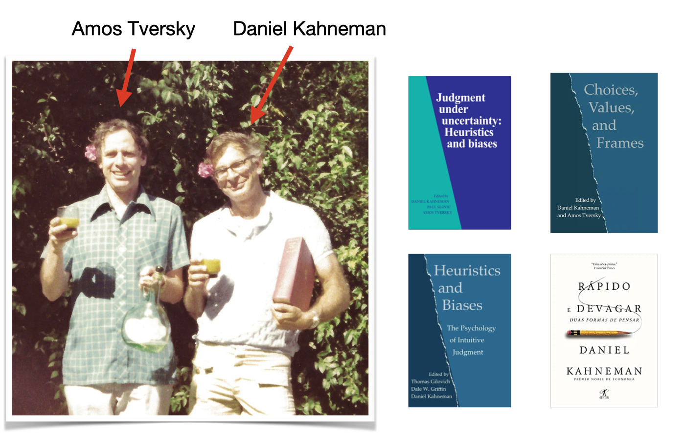
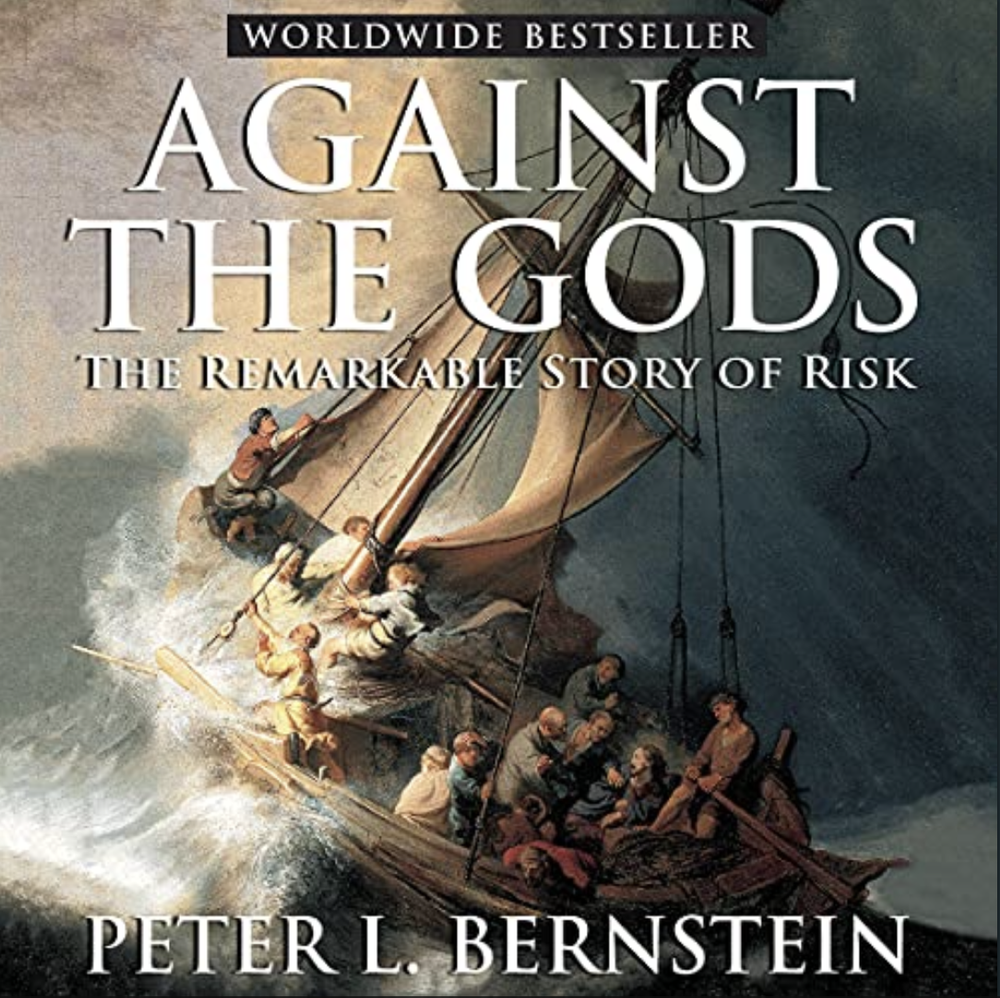

# Aula 5 - Regulação e Vieses Comportamentais
**Análise Econômica do Direito – 2024.2**
Lucas Thevenard

---
<!-- 
paginate: true 
header: Aula 5 - Regulação e Vieses Comportamentais
footer: lucas.gomes@fgv.br | 02/12/2024
-->

## Roteiro
- Heurísticas e vieses comportamentais
- Julgamentos sob condição de incerteza
- Teoria do Prospecto
- Nudge

---

# 1. Heurísticas e vieses comportamentais

---

---

---

## Kahneman: prevalência do sistema 1
- Detectar que um objeto está mais distante que outro. 
- Orientar-se em relação à fonte de um som repentino.
- Completar a expressão “pão com...”
- Fazer “cara de aversão” ao ver uma foto horrível.
- Detectar hostilidade em uma voz.
- Responder 2+2=?
- Ler palavras em grandes cartazes.
- Compreender sentenças simples.

---

## Kahneman: prevalência do sistema 2
- Manter-se no lugar para o tiro de largada numa corrida.
- Concentrar-se na voz de determinada pessoa em uma sala cheia e barulhenta.
- Procurar uma mulher de cabelos brancos.
- Sondar a memória para identificar um som surpreendente.
- Manter uma velocidade de caminhada mais rápida do que o natural para você.
- Contar as ocorrências da letra a numa página de texto.
- Dizer a alguém seu número de telefone.
- Preencher um formulário de imposto.

---

## Origem da distinção entre sistema 1 e sistema 2
- Michael Posner e Charles Snyder – Teoria do controle cognitivo:
  - Posner, M. I., & Snyder, C. R. R. (2004). Attention and Cognitive Control. In D. A. Balota & E. J. Marsh (Eds.), Cognitive psychology: Key readings (pp. 205–223). Psychology Press. 
- Tentativa de distinguir objetivamente processos automáticos e controlados
-  Posteriormente, Keith Stanovich e Richard West cunharam as expressões "Sistema 1" e "Sistema 2"
   -  Stanovich, K. E., & West, R. F. (2000). Individual differences in reasoning: Implications for the rationality debate? Behavioral and Brain Sciences, 23(5), 645-665.

---

## Processos automáticos (Posner & Snyder)
- São desencadeados involuntariamente;
- Requerem apenas uma pequena quantidade de recursos cognitivos;
- Não podem ser interrompidos voluntariamente; e
- Acontecem inconscientemente.

---

## Processos controlados (Posner & Snyder)
- São desencadeados intencionalmente;
- Requerem uma quantidade considerável de recursos cognitivos;
- Podem ser interrompidos voluntariamente; e
- Acontecem conscientemente.

---

## Compreensão crítica teoria 
- **John Bargh**: A maior parte dos processos cognitivos não satisfazem às quatro condições estabelecidas (nem automáticos, nem controlados)

## Erros/simplificações comuns
- Ideia de que os sistemas estão representados em nossa estrutura cerebral
- Ideia de que o sistema 1 antecede o sistema 2
- Ideia de que o sistema 1 é responsável por vieses, enquanto o sistema 2 produz decisões racionais

---

## Heurísticas e vieses comportamentais:
* Heurísticas são “atalhos mentais” que adotamos para simplificar certos processos mentais.
* Em alguns casos, esses ‘atalhos’ geram desvios cognitivos sistemáticos com efeitos adversos sobre forma como seres humanos se comportam em geral, os chamados **vieses comportamentais**.
* O estudo de vieses pode ser relevante porque, por afetarem consistentemente o comportamento humano, esses desvios geram **consequências sociais relevantes**.

---

## O sistema 1 é um vilão?

- Heurísticas são irracionais?
- Por que precisamos de “2 formas de pensar”?

---

### IMPORTANTE
### Heurísticas ≠ Vieses!
 

* Heurísticas são necessárias e eficientes, na medida em que reduzem custos cognitivos permitindo que decisões e análises complexas sejam simplificadas.
* Vieses ocorrem, excepcionalmente, quando heurísticas falham de forma previsível, levando a erros sistemáticos de julgamento.

---

## Estudos comportamentais e o Direito

* **Regulação**: Comportamentos previsivelmente irracionais podem ser antecipados e considerados na formulação de políticas públicas.
  * Pode ser necessário intervir em situações em que agentes econômicos se beneficiam sistematicamente de vieses cognitivos dos indivíduos.
  * **Consequencialismo**: as reais consequências de uma decisão podem depender de desvios comportamentais. Como prever comportamentos reais?

---

[Projeto Adoce: Acordos após ingestão de Dextrose Observados em Conciliações Judiciais (processuais) e Extrajudiciais (pré-processuais).](https://amaerj.org.br/wp-content/uploads/2019/10/Projeto-Adoce.pdf)

---

# 2. Julgamentos sob condições de incerteza

---

## Três tipos de heurísticas em julgamentos sob condição de incerteza

- O que são heurísticas de representatividade?

---

## Três tipos de heurísticas em julgamentos sob condição de incerteza

- **Heurísticas de representatividade**
  - Qual é a probabilidade que o evento/objeto A pertença à classe ou processo B?

---

## Três tipos de heurísticas em julgamentos sob condição de incerteza

- O que são heurísticas de representatividade?
- O que são heurísticas de disponibilidade?

---

## Três tipos de heurísticas em julgamentos sob condição de incerteza

- **Heurísticas de representatividade**
  - Qual é a probabilidade que o evento/objeto A pertença à classe ou processo B?
- **Heurísticas de disponibilidade**
  - Qual é a frequência com a qual certo tipo de evento ocorre? Qual é a plausibilidade de um evento em particular?

---

## Três tipos de heurísticas em julgamentos sob condição de incerteza

- O que são heurísticas de representatividade?
- O que são heurísticas de disponibilidade?
- O que são heurísticas de ancoragem?

---

## Três tipos de heurísticas em julgamentos sob condição de incerteza

- **Heurísticas de representatividade**
  - Qual é a probabilidade que o evento/objeto A pertença à classe ou processo B?
- **Heurísticas de disponibilidade**
  - Qual é a frequência com a qual certo tipo de evento ocorre? Qual é a plausibilidade de um evento em particular?
- **Heurísticas de ancoragem**
  - Qual é o valor de A, dado o valor B?

---

## Probabilidades condicionais (Bayes)
- Existe um teste que identifica se uma pessoa tem uma doença genética. O teste tem uma acurácia de 80%.
  - Em 20% dos casos positivos ele dá falso negativo.
  - Em 20% dos casos negativos ele dá falso positivo.
-  Você recebe positivo no teste. É provável que você esteja doente?
* E se a doença genética atinge 5% da população?
  - Para testar, vamos construir um exemplo de uma população com 300 pessoas.

---

---

---

## Falácia bayesiana – Exemplo
* 300 indivíduos na população.
  * Têm a doença (5%): 15
    * Verdadeiro positivo (80%): 12
    * Falso negativo (20%): 3
  * Não têm a doença (95%): 285
    * Verdadeiro negativo (80%): 228
    * Falso positivo (20%): 57
* **Chances de o positivo ser verdadeiro**: verdadeiros positivos / total de positivos
  - $\frac{12}{(57+12)} = \frac{12}{69} \approx 17,4\%$

---

## Representatividade

> "Steve é muito tímido e retraído, invariavelmente prestativo, mas com pouco interesse nas pessoas ou no mundo real. De índole dócil e organizada, tem necessidade de ordem e estrutura, e uma paixão pelo detalhe. Há maior probabilidade de Steve ser um bibliotecário ou um fazendeiro?"

* A maior parte dos entrevistados responderam que Steve era um bibliotecário, ainda que haja 20x mais fazendeiros do que bibliotecários nos Estados Unidos.
* Viés decorrente da desconsideração das probabilidades antecedentes quando fazemos um julgamento.

---

## Representatividade

- Engenheiro ou advogado?

> Analise, a seguir, a descrição de um profissional (Dick) retirado aleatoriamente de um grupo contendo 20 pessoas, sendo 6 delas engenheiros e o restante advogados. Indique qual considera ser a chance de Dick ser um advogado ou um engenheiro.
> ...
> "Dick é um homem de 30 anos de idade. É casado e não tem filhos. Um homem de grande capacidade e elevada motivação, promete ser muito bem-sucedido em sua área. Ele é estimado pelos colegas."

---

## Representatividade

- Engenheiro ou advogado?
  - Qual foi a probabilidade atribuída pelos participantes?
* Descrição destinada a não favorecer nenhum resultado. 
  - **Resultado**: diversos participantes escolheram 50% de Dick ser engenheiro ou advogado, mesmo com a informação de que apenas 30% eram engenheiros.

---

### Representatividade:
### Qual é a probabilidade que o evento ou objeto A pertença à classe ou processo B?
 

---

## Representatividade

* Imagine um vaso cheio de bolas, das quais 2/3 são de uma cor e 1/3 de outra.
  * O indivíduo A tirou 5 bolas do vaso, e descobriu que 4 eram vermelhas e 1 era branca.
  * O indivíduo B tirou 20 bolas e descobriu que 12 eram vermelhas e 8 eram brancas.
* Qual dos dois indivíduos deve se sentir mais confiante de que o vaso não contém 2/3 de bolas brancas? 
  * A maior parte das pessoas acha que A deveria estar mais confiante, quando na verdade B deveria estar mais confiante.

---

## Representatividade – Tamanho amostral
- O caso das bolas mostra que as pessoas consideram menos provável uma prevalência de bolas brancas quando a proporção de vermelhas é maios.
  - Indivíduo A: 80% de vermelhas
  - Indivíduo B: 60% de vermelhas
- No entanto, ao fazerem essa análise **desconsideram o tamanho da amostra utilizada**.
  - 20 bolas pelo indivíduo B, ou seja, 4x mais do que o indivíduo A

---

## Representatividade
- Observe três notas de um aluno, selecionadas ao acaso de seu boletim, a seguir:
  - **Aluno A**:
    - 8,0
    - 8,0
    - 8,0
  - **Aluno B**:
    - 7,0
    - 8,2
    - 8,8
- Quão fácil é prever o CR de cada aluno? Qual é o mais previsível?

---

## Representatividade – validade
- **Ilusão de validade**: nível excessivamente alto de confiança em padrões repetitivos.
- **Problema**: observações redundantes ou correlacionadas têm menos importância do que observações independentes.

---

## Representatividade
- Você está observando a roleta em um casino. Você nota que sairam casas pretas nas últimas 5 rodadas da roleta. 
- O que é mais provável de sair na próxima rodada, preto ou vermelho?
* Problema conhecido: falácia do jogador.
  - Seres humanos erram sistematicamente ao lidar com probabilidades. 

---

## Representatividade
- Considere lances sucessivos de uma moeda para obter cara (K) ou coroa (C), qual das sequências a seguir é mais provável?

* Ambas têm a mesma chance de ocorrer: $\frac{1}{2^6}=\frac{1}{64}$

---

### Problema de Monty Hall (apresentador)

---

---

### Regressão à Média
- Efeito disciplinar, ou tendência estatística natural?

---

## Heurística de representatividade
- Insensibilidade a probabilidades antecedentes
- Insensibilidade ao tamanho amostral
- Insensibilidade à previsibilidade
- Ilusão de validade
- Erros de probabilidade
- Desconsideração da regressão à média

---

## Disponibilidade
- O que é mais perigoso?

---

## Disponibilidade
- Do que as pessoas têm mais medo?
  - De andar de carro?
  - Ou de andar de avião?

---

## Disponibilidade – recuperabilidade
- Listas de celebridades divididas entre homens e mulheres.
- Após a leitura, era perguntado se a lista possuía mais homens ou mais mulheres.
* Na lista em que os homens eram celebridades mais conhecidas, a maior parte dos participantes achou que havia mais homens, mesmo quando o oposto era verdade.
* Na lista em que as mulheres eram as celebridades mais famosas, o contrário ocorreu.

---

## Disponibilidade – ajuste de busca
- Perguntou-se o que era mais comum: palavras que iniciam com uma certa letra (b, r, a, etc) ou que têm aquela letra na terceira posição.
* Dificuldade de se fazer buscas mentais por palavras que têm uma letra na terceira posição.
* Resultado: entrevistados respondiam que palavras iniciando com aquela letra eram mais comuns, mesmo nos casos em que isso não se verifica em língua inglesa (r ou k, por exemplo).

---

## Disponibilidade – imaginabilidade
- Estimativas de quantos comitês de k membros podem ser escolhidos entre 10 pessoas, sendo 2 ≥ k ≥ 8.
- Para calcular, devemos usar a fórmula de combinações:

$$\binom{10}{k} = \frac{10!}{k!(10-k)!}$$

* Essa operação atinge o seu valor máximo para k = 5, chegando a 252 comitês distintos. Mas em que casos você acha que os participantes previram mais combinações possíveis?
  * As pessoas estimaram menos combinações possíveis para os menores valores de k.

---

## Disponibilidade – correlação ilusória ou associativa
- Quando existem poucos fatores associados, ou associações pouco significativas, é provável que elas sejam sobredimensionadas.
* Exemplo: teste do ‘desenhe um humano’. Pessoas fazem previsões precipitadas sobre doenças mentais com base no teste.
  * Reconstrução do ‘folclore clínico’ que existiu no passado no laboratório. 
* Obs: Cesare Lombroso e a teoria do ‘homem delinquente’.

---

## Heurística de disponibilidade
- Vieses de recuperabilidade de ocorrências.
- Vieses devido a ajustes de busca.
- Vieses de imaginabilidade.
- Correlação ilusória ou associativa.

---

## Ancoragem
- Dois grupos de estudantes do colegial estimaram, em 5 segundos, uma expressão numérica que foi escrita no quadro-negro.
  * O primeiro grupo estimou o produto de:
    - $8 \times 7 \times 6 \times 5 \times 4 \times 3 \times 2 \times 1$
  * O segundo grupo estimou o produto de:
    - $1 \times 2 \times 3 \times 4 \times 5 \times 6 \times 7 \times 8$
  * A estimativa mediana para a sequência ascendente foi 512, enquanto a estimativa mediana para a sequência descendente foi 2.250. 
    - **Ajuste insuficiente**: A resposta correta é 40.320.

---

## Ancoragem
- Experimento pedia para participantes estimarem o número de países africanos que fazem parte da ONU.
  - Um grupo partia de 10 e subia de 5 em 5
  - Um grupo partia de 65 e descia de 5 em 5
* Qual foram as estimativas médias de cada grupo?
  * Grupo que partiu de 10: média estimada de 25 países
  * Grupo que partiu de 65: média estimada de 45 países
* Referência de partida, quando há ajustes sucessivos de valoração, tende a gerar um efeito sobre o resultado final.

---

## Ancoragem
- O que é mais provável?
  * (i) extrair uma bola de gude vermelha de um saco contendo 50% de bolas vermelhas e 50% de bolas brancas; 
  * (ii) extrair uma bola de gude vermelha sete vezes em sucessão de um saco contendo 90% de bolas vermelhas e 10% de bolas brancas; e 
  * (iii) extrair uma bola vermelha pelo menos uma vez em sete tentativas sucessivas de um saco contendo 10% de bolas vermelhas e 90% de bolas brancas.
* (i) 50%; (ii) 48%; (iii) 52%
  - Participantes preferiram apostar em (ii) do que em (i) e em (i) do que em (iii).

---

## Ancoragem - disjunção / conjunção de eventos
- **Viés**: as pessoas tendem a superestimar a probabilidade de eventos conjuntivos e a subestimar a probabilidade de eventos disjuntivos. 

---

## Ancoragem - disjunção / conjunção de eventos
* **Problema do planejamento**: realizar uma tarefa complexa exige a avaliação de uma sequência de passos necessários (evento conjuntivo). 
  - Tendemos a superestimar a probabilidade de sucesso do plano.
* **Problema do risco**: Riscos de acidentes podem envolver cenários em que diversas medidas de seguranças concomitantes devem ser garantidas, pois se apenas uma delas falhar há o acidente (evento disjuntivo).
  -  Tendemos a subestimar riscos nesses casos.

---

## Heurística de Ancoragem
- Ajuste insuficiente.
- Avaliação de eventos conjuntivos e disjuntivos.

---

## Recapitulando: Julgamentos sob incerteza
* **Heurísticas de representatividade**
  * Qual é a probabilidade que o evento/objeto A pertença à classe ou processo B?
* **Heurísticas de disponibilidade**
  * Qual é a frequência com a qual certo tipo de evento ocorre? Qual é a plausibilidade de um evento em particular?
* **Heurísticas de ancoragem**
  * Qual é o valor de A, dado o valor B?

---

# 3. Teoria da Perspectiva (Prospect Theory)

---

---

## Uma teoria sobre a avaliação de apostas

> “What is the point of investing so much effort in a theory if its domain of application is so restricted and artificial? The answer is that choice between gambles is the fruit fly of decision theory. It is a very simple case, which contains many essential elements of much larger problems.”
> Kahneman, D.; Tversky, A. **Choices, values and frames**, p. 14.

---
## Crítica "interna" à teoria da utilidade esperada

> “We did not challenge the philosophical analysis of choices in terms of beliefs and desires that underlies utility theory, nor did we question the normative models of rational choice offered by von Neumann and Morgenstern and later by Savage.”
> Kahneman, D.; Tversky, A. **Choices, values and frames**, p. 14.

---

<!-- 
header: .
footer: .
-->

---

<!-- 
header: Aula 12 – Implicações das ciências comportamentais para o Direito
footer: lucas.gomes@fgv.br | 30/05/2023
-->

## Teoria da Perspectiva x Teoria da Utilidade Esperada
- Não-linearidade dos pesos decisórios
- Função de valor dependente de referências
- Efeitos de enquadramento
- Utilidade de experiência vs. Utilidade de decisão

---

## Não-linearidade dos pesos decisórios
- Três variações da probabilidade em 0,01 (1%)
  * $0 \% \implies 1\%$
  * $99 \% \implies 100\%$
  * $51 \% \implies 52\%$
* Elas parecem ser equivalentes?

---

---

---

---

## Não-linearidade dos pesos decisórios
- **Limiares categóricos**: Nossa percepção a respeito de probabilidades parece ser influenciada por categorias pré-estabelecidas como "muito provável", "pouco provável", "certo", ou "impossível".
* A não-linearidade dos pesos decisórios decorre do fato de que nossas percepções a respeito dessas categorias não estão distribuídas de forma homogênea ao longo do intervalo das probabilidades (0, 1).

---

## Função de valor
- Você aceitaria a aposta a seguir?
  - 50% de chance de perder R$ 2.000,00.
  - 50% de chance de ganhar R$ 2.000,00.
* E que tal a seguinte aposta?
  - 50% de chance de perder R$ 2.000,00.
  - 50% de chance de ganhar R$ 2.300,00.
* Há alguma irracionalidade na decisão de não aceitar a segunda aposta?

---

---

## Dependência de referência

- **Problema 1**: Para além do seu patrimônio, você recebeu US$ 1.000. Agora lhe pedem para escolher entre duas opções: 
  - A: ter 50% de chance de ganhar outros US$ 1.000 ou 
  - B: receber US$ 500 com certeza.

* **Problema 2**: Para além do seu patrimônio, você recebeu US$ 2.000. Agora lhe pedem para escolher entre duas opções: 
  - C: ter 50% de chance de perder US$ 1.000 ou 
  - D: perder US$ 500 com certeza

* Se A = C e B = D, por que B foi mais escolhida no primeiro problema e C no segundo?

---

## Dependência de referência
* **Função de valor em forma do S**
  - Côncava em relação aos ganhos
  - Convexa em relação às perdas
  * Expressa uma tendência acentuada de **aversão a perdas** (loss aversion)
* Não consideramos estados de riqueza, mas sim variações relativas (perdas e ganhos).

---

 

---

> "Os animais, incluindo as pessoas, se empenham mais para impedir perdas do que para obter ganhos. No mundo dos animais territoriais, esse princípio explica o sucesso dos defensores. Um biólogo observou que “quando o detentor de um território é desafiado por um rival, o possuidor quase sempre vence a disputa — em geral, em questão de segundos”. Nos assuntos humanos, a mesma regra simples explica grande parte do que acontece quando as instituições tentam se reformar, em “reorganizações” e “reestruturação” de companhias, e nos esforços para racionalizar a burocracia, simplificar o código tributário ou reduzir custos médicos."

---

> (...) Como concebidos inicialmente, os planos para reforma quase sempre produzem muitos vencedores e alguns perdedores, para atingir uma melhoria global. No entanto, se as partes afetadas têm alguma influência política, perdedores potenciais serão mais ativos e determinados do que vencedores potenciais; o resultado tenderá em favor deles e inevitavelmente será mais dispendioso e menos eficaz do que inicialmente planejado. (...) Aversão à perda é uma poderosa força conservadora que favorece mudanças mínimas do status quo nas vidas tanto das instituições como dos indivíduos.”
> Kahneman, Daniel. **Rápido e devagar, duas formas de pensar**, p. 214. 

---

## Manipulando escolhas
**Problema 3**. Você aceitaria uma aposta que oferece 10% de chance de ganhar $95 e 90% de chance de perder $5.
**Problema 4**. Você pagaria $5 para participar de uma loteria que oferece 10% de chance de ganhar $100 e 90% de chance de não ganhar nada?
* Em 42% dos casos o respondente respondeu de forma distinta aos dois problemas.
* Dentre eles, 76% rejeitaram a oferta do problema 3, mas aceitaram a do problema 4.

---

## Manipulando escolhas
**Problema 5**: Escolha entre:
- **E**. 25% de chance de ganhar $240 e 75% de chance de perder $760, ou
- **F**. 25% de chance de ganhar $250 e 75% de chance de perder $750, ou
* **Resultado**: 100% dos participantes escolheram a opção F.

---

**Problema 6**: Imagine que você está diante do seguinte par de escolhas concomitantes. Primeiro examine as duas escolhas, depois indique as opções que prefere.
**Escolha 1**:
- **G**. Um ganho certo de $240.
- **H**. 25% de chance de ganhar $1000 e 75% de chance de não ganhar nada.

**Escolha 2**:
- **I**. Uma perda certa de $750.
- **J**. 75% de chance de perder $1000 e 25% de chance de não perder nada.
* **Resultado**: 73% dos participantes escolheram as opções G e J, apenas 3% escolheram as opções H e I. Os demais escolheram outras combinações.

---

## Exemplo de efeito sobre transações econômicas
**Custos afundados**
- Dois ávidos fãs de esportes planejam viajar 40 milhas para ver um jogo de basquete. Um deles pagou a passagem; o outro estava a caminho de comprar uma passagem quando conseguiu uma de graça de um amigo.
* Uma nevasca é anunciada para a noite do jogo. Qual dos dois portadores de ingressos tem mais chances de enfrentar a nevasca para ver o jogo?

---

## Efeito de enquadramento
**Problema 7**: Imaginem que os Estados Unidos estão se preparando para o surto de uma doença asiática incomum, que se espera que mate 600 pessoas. Foram propostos dois programas alternativos para combater a doença. Suponha que as estimativas científicas precisas sobre as consequências dos programas sejam as seguintes:
- Se o programa A for adotado, 200 pessoas serão salvas.
- Se o programa B for adotado, há 1/3 de chance de que as 600 pessoas sejam salvas e 2/3 de chances de que ninguém seja salvo.
* **Resultado**: 72% dos respondentes preferiram o programa A. 

---

## Efeito de enquadramento
**Problema 8**: Mesmo enunciado anterior, mas agora as opções são:
- Se o programa C for adotado, 400 pessoas morrerão.
- Se o programa D for adotado, há 1/3 de chance de que ninguém morra e 2/3 de chances de que 600 pessoas morram.
* **Resultado**: 78% dos respondentes preferiram o programa B. 

---

## O que você prefere?
- Se você tivesse sofrido um acidente grave e estivesse à beira da morte, o que você prefereria?
  - Uma cirurgia que tem 50% de chance de salvar a sua vida?
  - Uma cirurgia que tem 50% de chance de levar à sua morte?

---

## Conceito de "enquadramento" (framing)
- **Dois significados**:
  * Forma como o problema é elaborado/apresentado ao decisor (ação externa a ele)
  * Forma como o problema é absorvido e compreendido pelo decisor (processos mentais internos)
    - Edição e contabilidade mental.
* A teoria conclui que decisores não utilizam observações gerais, nem formulações textuais para decidir. Eles utilisam representações mentais do problema.
  - Efeitos de enquadramento às vezes parecem ilusões diópticas.

---

## E os especialistas?
**Problem 9**: Médicos receberam estatísticas sobre os resultados de dois tratamentos para o câncer de pulmão: cirurgia e radiação. As taxas de sobrevida em cinco anos favorecem claramente a cirurgia, mas no curto prazo a cirurgia é mais arriscada do que a radiação.
- Sobre a cirurgia, metade recebeu a informação:
  - "A taxa de sobrevida em um mês é de 90%".
- A outra metade recebeu a informação:
  - “Há uma mortalidade de 10% no primeiro mês".

---

## E os especialistas?
**Problem 9**: Médicos receberam estatísticas sobre os resultados de dois tratamentos para o câncer de pulmão: cirurgia e radiação. As taxas de sobrevida em cinco anos favorecem claramente a cirurgia, mas no curto prazo a cirurgia é mais arriscada do que a radiação.
- Sobre a cirurgia, metade recebeu a informação:
  - "A taxa de sobrevida em um mês é de 90%". (**84%**)
- A outra metade recebeu a informação:
  - “Há uma mortalidade de 10% no primeiro mês". (**50%**)

---

## Utilidade de experiência vs. Utilidade de decisão
- **Teoria da Decisão**: Utilidade revelada por escolhas, decorrente de um processo de hierarquização de alternativas (Utilidade de decisão).
* **Jeremy Bentham**: associa a utilidade ao prazer/dor efetivamente experimentado pelos indivíduos (Utilidade de experiência).

---

  

## Utilidade
- Abordagem baseada na memória
- Abordagem baseada no momento

---

## Experiências de dor e prazer
- Desconsideração da duração.
- Efeito de pico.
- Violações da regra de dominância.

---

## Utilidade, experiência e memória
- As preferências dos indivíduos são dinâmicas, não estáticas. 
- Aprendemos sobre nossos gostos com nossas escolhas.
  * Esse processo de aprendizado, no entanto, é imperfeito. 
    - Decisões intertemporais podem ser sensivelmente impactadas por divergências e inconsistências nas nossas preferências.

---

## Efeitos sobre transações econômicas
**Avaliação relativa**
- Imagine que você saiu para comprar uma jaqueta e uma calculadora. Após adquirir a jaqueta por $125, você está prestes a comprar a calculadora por $15, quando o vendedor lhe informa que o produto está disponível por $10 em outra filial, que fica a 20 minutos de distância.
* Você iria à outra loja?
* Outros exemplos:
  - **Efeito dotação** (*endowment effect*).
  - **Desconto hiperbólico** (*hyperbolic discounting*).

---

## Recapitulando: Teoria da Perspectiva (Prospect Theory)
- Não-linearidade dos pesos decisórios
- Função de valor dependente de referências
- Efeitos de enquadramento
- Utilidade de experiência vs. Utilidade de decisão

---

# 4. Nudges e o Problema da Cafeteria

---

## Nudge
**O Problema da Cafeteria**
 * Os agentes privados podem tomar escolhas efetivamente livres?
   - Quais são as consequências práticas do efeito enquadramento para as relações sociais?
   * Se concluímos que não existem escolhas livres, o que devemos fazer?

---

## O dilema de Carolyn (arquitetura de escolhas)
- Garantir a saúde dos alunos?
- Garantir neutralidade (ordem aleatória)?
- Garantir escolhas autênticas (que as crianças teriam escolhido)?
- Maximizar o lucro?
- Privilegiar fornecedores que ofereçam suborno?

---

### Doadores de Órgãos

  

 * **Importância da opção default**
   - Exemplo dos planos previdenciários em uma universidade.
   - Vem sendo aplicado a diversos contextos regulatórios.

---

## Paternalismo libertário
* Influenciar, mas não restringir a liberdade de escolha.
  - Intervenção sobre a da arquitetura da escolha.
  

## Arquiteto de escolhas
* Regulador instrumentaliza efeitos de enquadramento e vieses cognitivos em favor de valores socialmente desejáveis.
  - Há um problema de transparência?

---

### Lições da análise comportamental para o Direito?

### Quais são as consequências da ideia de racionalidade limitada e dos vieses comportamentais que estudamos para o Direito?