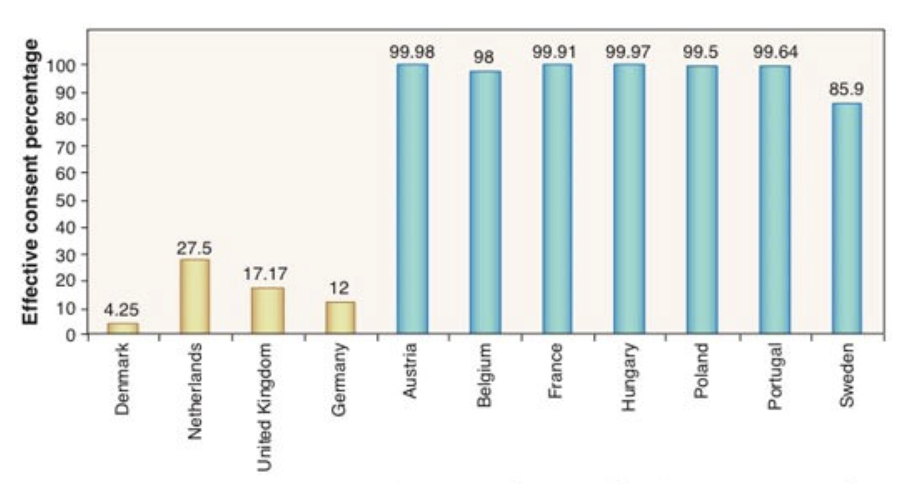

# Aula 6 - Falhas de governo
**Análise Econômica do Direito – 2024.2**
Lucas Thevenard

---
<!-- 
paginate: true 
header: Aula 6 - Falhas de governo
footer: lucas.gomes@fgv.br | 09/12/2024
-->

## Roteiro
- Continuando a análise das teorias comportamentais
  - Recapitulação
  - Teoria do Prospecto (continuação)
  - Nudge
- Falhas de Governo
  - Teorias da Regulação
  - Vieses dos Reguladores

---

# 1. Continuando a análise das teorias comportamentais

---

## Conceitos básicos

- Sistema 1 vs. Sistema 2 (origem, limitações)
- Heurísticas vs. Vieses
- Vieses vs. Teoria da Escolha Racional

---

## Três tipos de heurísticas em julgamentos sob condição de incerteza

- **Heurísticas de representatividade**
  - Qual é a probabilidade que o evento/objeto A pertença à classe ou processo B?
- **Heurísticas de disponibilidade**
  - Qual é a frequência com a qual certo tipo de evento ocorre? Qual é a plausibilidade de um evento em particular?
- **Heurísticas de ancoragem**
  - Qual é o valor de A, dado o valor B?

---

## Vieses que podem resultar da heurística de representatividade
- Insensibilidade a probabilidades antecedentes
- Insensibilidade ao tamanho amostral
- Insensibilidade à previsibilidade
- Ilusão de validade
- Erros de probabilidade
- Desconsideração da regressão à média

---

## Vieses que podem resultar da heurística de disponibilidade
- Vieses de recuperabilidade de ocorrências.
- Vieses devido a ajustes de busca.
- Vieses de imaginabilidade.
- Correlação ilusória ou associativa.

---

## Vieses que podem resultar da heurística de Ancoragem
- Ajuste insuficiente.
- Avaliação de eventos conjuntivos e disjuntivos.

---

## Teoria da Perspectiva (Prospect Theory)

## Importância
- Contestação mais direta da teoria da escolha racional (apostas como 'the fruit fly of decision theory')

## Quatro resultados importantes 
- Não-linearidade dos pesos decisórios

---

---

---

---

---

 

---

## Efeito de enquadramento

**Problem 9**: Médicos receberam estatísticas sobre os resultados de dois tratamentos para o câncer de pulmão: cirurgia e radiação. As taxas de sobrevida em cinco anos favorecem claramente a cirurgia, mas no curto prazo a cirurgia é mais arriscada do que a radiação.
- Sobre a cirurgia, metade recebeu a informação:
  - "A taxa de sobrevida em um mês é de 90%". (**84%**)
- A outra metade recebeu a informação:
  - “Há uma mortalidade de 10% no primeiro mês". (**50%**)

---

## Utilidade de experiência vs. Utilidade de decisão
- **Teoria da Decisão**: Utilidade revelada por escolhas, decorrente de um processo de hierarquização de alternativas (Utilidade de decisão).
* **Jeremy Bentham**: associa a utilidade ao prazer/dor efetivamente experimentado pelos indivíduos (Utilidade de experiência).

---

  

## Utilidade
- Abordagem baseada na memória
- Abordagem baseada no momento

---

## Experiências de dor e prazer
- Desconsideração da duração.
- Efeito de pico.
- Violações da regra de dominância.

---

## Utilidade, experiência e memória
- As preferências dos indivíduos são dinâmicas, não estáticas. 
- Aprendemos sobre nossos gostos com nossas escolhas.
  * Esse processo de aprendizado, no entanto, é imperfeito. 
    - Decisões intertemporais podem ser sensivelmente impactadas por divergências e inconsistências nas nossas preferências.

---

## Efeitos sobre transações econômicas
**Avaliação relativa**
- Imagine que você saiu para comprar uma jaqueta e uma calculadora. Após adquirir a jaqueta por $125, você está prestes a comprar a calculadora por $15, quando o vendedor lhe informa que o produto está disponível por $10 em outra filial, que fica a 20 minutos de distância.
- Você iria à outra loja?

---

## Recapitulando: Teoria da Perspectiva (Prospect Theory)
- Não-linearidade dos pesos decisórios
- Função de valor dependente de referências
- Efeitos de enquadramento
- Utilidade de experiência vs. Utilidade de decisão

---

## Outros vieses importantes
- Efeito dotação
* Desconto hiperbólico
* Efeito Preço-Zero
* Dissonância Cognitiva
  - Viés de confirmação
* Viés de retrospectiva
* Viés de otimismo

---

# 4. Nudges e o Problema da Cafeteria

---

## O problema da cafeteria

> Carolyn é directora dos serviços de restauração do agrupamento escolar de uma grande cidade. É responsável por centenas de escolas e por centenas de milhares de crianças que comem nos refeitórios destas mesmas escolas.
> Um dia, ela e o seu amigo Adam, consultor de gestão, uma pessoa com uma boa visão estratégica e que trabalhou para algumas cadeias de supermercados, tiveram uma ideia interessante - levar a cabo algumas experiências na escola sem mudar o cardápio, com vista a determinar se a forma como os alimentos eram dispostos influenciava as escolhas das crianças.

---

## O problema da cafeteria

> Com base na sua experiência de organização dos corredores nos supermercados, Adam achou que os resultados seriam surpreendenes. E tinha toda a razão. Com esta simples operação de mudança da disposição dos alimentos no refeitório, Carolyn aprendeu uma grande lição: as crianças em idade escolar, tal como os adultos, podem ser fortemente influenciadas por pequenas mudanças no contexto. Esta influência pode ser aproveitada para o melhor ou para o pior. Carolyn sabe, por exemplo, que é possível aumentar o consumo de alimentos saudáveis e reduzir o consumo de alimentos pouco saudáveis.

---

 

## Nudge
**O Problema da Cafeteria**
 * Os agentes privados podem tomar escolhas efetivamente livres?
   - Quais são as consequências práticas de vieses comportamentias como o efeito enquadramento para as relações sociais?
   * Se concluímos que não existem escolhas livres, o que devemos fazer?

---

## O dilema de Carolyn (arquitetura de escolhas)
- **Se concluímos que não existem escolhas livres, o que devemos fazer?**
  - Garantir a saúde dos alunos (maximizar um bem social)?
  - Garantir neutralidade (ordem aleatória)?
  - Garantir escolhas autênticas (o que as crianças teriam escolhido)? 
  - Maximizar o lucro das cafeterias?
  - Privilegiar fornecedores que ofereçam suborno?

---

## Paternalismo libertário
* Influenciar, mas não restringir a liberdade de escolha.
  - Intervenção sobre a da arquitetura da escolha.
  

## Arquiteto de escolhas
* Regulador instrumentaliza efeitos de enquadramento e vieses cognitivos em favor de valores socialmente desejáveis.
  - Há um problema de transparência?

---

## Algumas estratégias conhecidas

- Aumentar a saliência das opções.
* Oferecer boas opções default.
* Simplificar informações e utilizar efeitos de enquadramento.
* Utilizar efeitos de *social proofing* e *peer comparison*.
* Mecanismos de compromisso e antecipação da escolha.
* Mecanismos de feedback positivo e negativo.

---

### Saliência

---

### Opção Default

---

### Simplificação da informação e efeitos de enquadramento

---

  

## O caso da regulação da Anvisa de rotulagem de alimentos

- Forte oposição da indústria à mudança do modelo de rotulagem de alimentos.
- Modelo inicialmente proposto pela Anvisa: hexágono.
  - Robusta comprovação científica de que o modelo do hexágono aumentava a saliência das informações.
  - Ameaças da indústria de judicializar o tema e proposta de projeto de lei no Congresso.
  - Anvisa: modelo da lupa como solução de compromisso (RDC nº 429/2020).

---

# 2. Falhas de Governo

---

## Vamos iniciar com esse caso…

Uma legislação local proíbe a construção de postos de gasolina nos estacionamentos de supermercados, teatros, shoppings, escolas e hospitais públicos.

- Lei Complementar n. 294/00 do Distrito Federal:
**Art 2º § 3º**: Fica expressamente vedada a edificação de postos de abastecimento, lavagem e lubrificação nos estacionamentos de supermercados, hipermercados e similares, bem como de teatros, cinemas, shopping centers, escolas e hospitais públicos.

Quais são as razões por trás desse regulamento? O que o regulamento tenta alcançar?

---

Lei Complementar n. 294/00 do Distrito Federal:
**Art 2º § 3º**: Fica expressamente vedada a edificação de postos de abastecimento, lavagem e lubrificação nos estacionamentos de supermercados, hipermercados e similares, bem como de teatros, cinemas, shopping centers, **escolas** e **hospitais públicos**.

 

- Proteção de escolas e hospitais? Combate a acidentes em locais populosos?
- Em termos econômicos: 
  - Redução de externalidades negativas resultantes dos acidentes?
  - Segurança como um bem público que deve ser promovido pelo Estado?
  - Controle de riscos excessivos em razão de vieses comportamentais?

---

## Agora considere o seguinte…

- O Carrefour anunciou sua intenção de entrar no mercado de postos de gasolina, usando os lotes de estacionamento de seus supermercados.

* Em resposta, os proprietários de postos de gasolina tiveram várias reuniões com políticos locais para obstruir isso.
  - Representantes das empresas de postos de gasolina pressionaram a promulgação de uma legislação local.
  - As empresas até mesmo redigiram os termos da legislação: foi provado que o texto inicial proposto no Congresso foi enviado por representantes das empresas.

* **Agora, responda novamente: quais são as razões por trás desse regulamento? O que o regulamento tenta alcançar?**

---

---

## Teorias da regulação
- **Baldwin**: Justificativas técnicas vs. Reais causas da regulação
- Necessidade de uma teoria crítica e geral para explicar a regulação

---

## Teorias da regulação

- Teorias do Interesse Público
- Teorias dos Grupos de Interesse

---

## Teorias da regulação

- **Teorias do Interesse Público**
  - De acordo com esta teoria, os regulamentos serão aprovados para alcançar o interesse público.
  - Ênfase na confiabilidade e altruísmo dos reguladores especializados
  - Quais são os problemas com essa visão?
    * Muito ingênua? Podemos realmente confiar no desinteresse dos reguladores?
    * Se os mercados e os humanos falham, por que o governo falharia? Podemos realmente confiar em seus conhecimentos?
    * O que é interesse público? 

---

## Stiglitz: restrições práticas à eficiência da regulação
- Stiglitz identifica 4 restrições que poderiam impedir mesmo um agente público altruísta e comprometido com o interesse público de atingir uma boa regulação.
  * Informações limitadas;
  * Controle limitado sobre as respostas de agentes privados no mercado;
  * Controle limitado sobre a própria burocracia;
  * Desvios de interesse resultantes do processo político.

---

## Teorias dos grupos de interesse

- De acordo com essas teorias, a regulação nunca é (ou muito raramente é) sobre o interesse público.
* A regulação é fruto dos embates de interesses entre grupos sociais organizados em torno de interesses comuns.

---

## Teorias dos grupos de interesse

- Teoria da Escolha Pública (ou Captura)
- Teoria do Triângulo de Ferro
- Teoria dos Núcloes Vazios
- Teoria das Coalizões de Defesa de Interesses
- Teoria das Redes Temáticas

---

## Teoria da Escolha Pública (ou Captura)

- **Stigler (1971): Economic Theory of Regulation**
  - Agentes econômicos 'compram' a regulação.
  - Segundo a teoria, empresas privadas seriam os principais catalizadores da política regulatória dos Estados.
    - *Regulação é "capturada" pela indústria*: interesses da sociedade como um todo são colocados de lado em prol dos interesses de um grupo econômico específico que quer obter lucros de monopolista (*rent seeking*).
* Contexto de início da formação do movimento da desregulação nos países capitalistas, que assumiria grande influência política na década seguinte.
  - Reino Unido: Margareth Tatcher (1979).
  - Estados Unidos: Reagan.

---

## Stigler - Teoria da Escolha Pública

- **Como os agentes econômicos se beneficiam da regulação?**
  - Subsídios diretos.
  * Barreiras à entrada de competidores.
  * Efeitos indiretos, sobre bens complementares e substitutos.
  * Controle de preços.
* Interesse principal: impedir a competição, garantindo lucros de oligopolista/monopolista.

---

## Stigler - Teoria da Escolha Pública

- **Por que as indústrias conseguem influenciar as escolhas públicas?**
  - Assimetria de interesses favorece uma maior força política da indústria (assimetria de interesses):
    * Indústria regulada:
      - Alto interesse no resultado da regulação (*high stakes*).
      - São poucos e, portanto, têm baixos custos para se organizarem em prol de seus interesses (*low transaction costs*).
    * Consumidores/cidadãos em geral:
      - Baixo interesse individual no resultado da regulação (*low stakes*).
      - São muitos e, portanto, têm altos custos para se organizarem em prol de seus interesses (*high transaction costs*).

---

## Stigler - Teoria da Escolha Pública

- **Por que os agentes públicos atuam em prol da indústria?**
  - Agentes públicos como indivíduos racionais auto-interessados.
    - Atores políticos agem de forma a maximizar sua influência/poder político.
    - Agentes privados conseguem afetar os interesses pessoais dos agentes públicos:
      - Oferta de empregos no setor privado (fenômeno conhecido como 'portas giratórias').
      - Financiamento de campanhas políticas.
      - Uso da mídia e do sistema jurídico para constranger as escolhas.

---

## Croley - Críticas à Teoria da Captura

**1. Visão Redutiva e Determinista**

- A teoria simplifica excessivamente a relação entre agências e grupos de interesse.
- Não considera a autonomia burocrática e a capacidade das agências de agir de forma independente.

**2. Ignora Outras Pressões Políticas**

- A captura não é a única influência: políticos, público e mídia também moldam a regulação.
- As agências operam em um ambiente de múltiplos vetores de pressão.

---

## Croley - Críticas à Teoria da Captura

**3. Falhas na Explicação Empírica**

- Não explica porque, em muitos casos, as agências adotam regulações contrárias aos interesses dos regulados.
- Estudos de caso mostram resultados regulatórios que favorecem o interesse público.

---

## Outras teorias de grupos de interesse

- Teoria do Triângulo de Ferro
- Teoria dos Núcloes Vazios
- Teoria das Coalizões de Defesa de Interesses
- Teoria das Redes Temáticas

---

## Teoria do Triângulo de Ferro

- A teoria do triângulo de ferro amplia a formulação original da teoria da captura, propondo que três grupos formam um triângulo fechado que controla o processo de formulação das políticas regulatórias:
  - Agentes econômicos, 
  - Atores políticos (Congresso, no caso dos EUA), e 
  - Órgãos reguladores.

* Tais grupos mantêm relações cordiais contínuas e de baixa visibilidade (inner circles).
  -  **Objetivo**: concertação para garantir que nenhuma política pública viole frontalmente seus interesses mais básicos (**poder de veto**).

---

## Teoria dos Núcleos Vazios

- Importante pesquisa empírica (Heinz, Laumann, Salisbury & Nelson, 1990).
  - Objetivo de identificar os círculos íntimos que influenciavam a formulação de políticas públicas nos EUA em 4 áreas:
    - legislação trabalhista,
    - política agrícola,
    - política energética e
    - saúde pública.
- Entrevistas com 300 representantes de grupos privados, 300 agentes públicos e 800 lobistas dessas áreas.

---

## Teoria dos Núcleos Vazios

- Achados da pesquisa:
  - Gama de relações interpessoais e grupos de interesses extremamente heterogênea e complexa em todos os quatro setores estudados.
  * Não foi possível identificar claramente quais agentes sociais possuíam maior nível de influência sobre as agendas (ausência de 'círculos íntimos').
  * **Núcleos vazios (*Hollow Cores*)**:  no centro da rede de interesses mobilizados nos processos de formulação de políticas públicas raramente encontramos poucos atores de grande peso com alta capacidade de influência.

---

## Teoria dos Núcleos Vazios

- **Implicações da ideia de 'núcleos vazios' para a Teoria da Escolha Pública**:
  - Não é fácil constatar a existência de captura nos setores regulados.
  - Enmbora os grupos privados realizem investimentos para tentar influenciar os resultados regulatórios, como prevê a teoria da captura, esses investimentos são de alto risco, com resultados incertos e uma probabilidade relativamente baixa de sucesso.

---

## Teorias que reconhecem a importância das ideias: ACF e Redes Temáticas

- **A Teoria das Coalizões de Defesas de Interesses (ACF)**:
  - Grupos de interesse se formam por coalizões dinâmicas, influenciadas por vários fatores, incluindo conhecimentos específicos sobre determinado setor.
  - Exemplo: profissionais de um setor verificam um alto risco ambiental na atividade e se unem a ativistas ambientais para impedir uma política pública permissiva.
- **A Teoria das Redes Temáticas**:
  - A formulação de uma política pública depende de ideias. Importância da formação de conceitos e convicções compartilhados na formação dos grupos.
  - Ideia de *comunidades epistêmicas*, com propostas e ideais comuns.

---

## Vieses comportamentais dos reguladores
- Os vieses comportamentais também afetam os reguladores?
* Cooper e Kovacic (2012)
  - Miopia (consideração apenas de um conjunto limitado de opções)
  - Tendência à confirmação
  - Tendência à manutenção do *status quo*

---

## Vieses comportamentais dos reguladores

- **Vieses subjacentes à miopia institucional**
  - A heurística da disponibilidade leva decisores a priorizarem informações disponíveis e facilmente memoráveis (salientes) ao tomarem suas decisões, mesmo quando essas informações não são adequadas à análise
    - Na prática, reguladores influenciados por essa heurística tenderão a sobrevalorizar eventos recentes e, particularmente, eventos salientes, julgando que estes são mais frequentes e representativos da realidade do que eles de fato são. 

---

## Vieses comportamentais dos reguladores

- **Vieses subjacentes à miopia institucional**
  - A heurística da representatividade leva decisores a sobrestimarem as probabilidades de certos eventos com base em amostras pequenas e sem considerar as probabilidades antecedentes. 
    - Esse fenômeno tende a contribuir para um excesso de confiança em alternativas que funcionaram em alguns poucos casos, ainda que elas não sejam tão bem substanciadas. 

---

## Vieses comportamentais dos reguladores

- **Vieses subjacentes à miopia institucional**
  - O viés de retrospectiva leva o decisor a sobrestimar a probabilidade ex ante de um evento ocorrer, dado que ele de fato ocorreu. 
    - Na prática, decisores tenderão a achar que deveriam ter agido para evitar danos (ou deixado de agir quando sua ação levou a danos) mesmo que no momento da ação essas consequências não fossem previsíveis.

---

## Vieses comportamentais dos reguladores

- **Vieses subjacentes à tendência à confirmação**
  - O viés de confirmação consiste na tendência de que indivíduos analisem problemas de forma a priorizar o que confirme suas crenças e valores prévios.
    - Isso ocorre tanto na etapa de **seleção de informações** para resolver o problema (buscamos evidências que confirmam nossas intuições ou suposições e evitamos evidências contrárias), como na etapa de **interpretação das informações** obtidas (damos mais credibilidade a dados que confirmam nossas hipóteses e crenças).
    - Essa tendência leva o regulador a formar um conjunto inflexível de convicções acerca de sua regulação. O regulador pode então realizar leituras equivocadas das evidências disponíveis para confirmar escolhas prévias.

---

## Vieses comportamentais dos reguladores

- **Vieses subjacentes à tendência à confirmação**
  - O efeito dotação consiste na sobrevalorização de bens ou ativos que detemos: não estamos dispostos a nos desfazer de bens a menos que recebamos mais do que estaríamos dispostos a pagar pelo bem em primeiro lugar. 
  - O viés de aversão a perdas sugere que a forma como um problema é apresentado é importante para as decisões que tomamos, pois os indivíduos tendem a dar mais peso a potenciais perdas do que a potenciais ganhos.
    - Ambos podem levariam o regulador a ser pouco propenso a mudar o status quo regulatório, fazendo com que políticas regulatórias sejam excessivamente condicionadas por escolhas iniciais.

---

## Mecanismos para mitigar vieses comportamentais em escolhas públicas

- Insulamento (*insulation*)
- Desinviesamento (*de-biasing*)
- Revisão adversarial (*adversarial review*)

---

## Caso Buser X FIARC

- **O problema discutido**: regra de circuito fechado do serviço de transporte rodoviário interestadual de passageiros por fretamento

---

---
## Regime Regulatório Vigente (NT 5705/2020)
- **CF-88, art. 21, XII**. Competência constitucional da União para explorar, mediante autorização, concessão ou permissão, os serviços de TRIIP.
  - **TRIIP**: Transporte Rodoviário Interestadual e Internacional de Passageiros.
- **Lei 10.233/2001, art. 26, III e VIII**: Serviço Regular X Fretamento

---
## Regime Regulatório Vigente (NT 5705/2020)
- **Serviço regular** (Res. ANTT 4.770/2015):
  - Características de serviço público (continuidade, ampla oferta, modicidade, etc.);  
  - Termo de Autorização de Serviços Regulares (TAR) e Licença Operacional (LOP) – exigência de frequência mínima.
  - Outras obrigações regulatórias: bilhete de passagem, gratuidades e descontos obrigatórios, normatização de procedimentos diversos (informações em pontos de venda, caracterização dos veículos, etc.).

---

## Regime Regulatório Vigente (NT 5705/2020)
- **Fretamento** (Res. ANTT 4.777/2015):
  - Contratação para finalidade específica (serviço não regular).
  - Termo de Autorização para Fretamento – habilitação a prestar esse tipo de serviço mediante emissão de Licença de Viagem (LV).
  - Embora haja obrigações regulatórias comuns, elas não são idênticas (exemplo: não há bilhete de viagem, não são exigidas as mesmas gratuidades).
  - Circuito fechado (lista fixa, ida e vinda) é uma característica intrínseca que diferencia as duas modalidades. 
  - Obs: empresas que prestam serviços regulares alegam assimetria regulatória.

---

## Mudanças importantes
* **Tecnologias informacionais** que viabilizam o chamado fretamento colaborativo (inovações disruptivas, Schumpeter).
* Outras formas de **controle de qualidade nas plataformas** (reputação, score, etc.).
* **Novo mercado relevante**: definição legal X substitutibilidade dos serviços.
* **Abertura do serviço de transporte regular**:
  - Lei nº 12.996/2014 alterou o regime de outorga de permissão para autorização.
  - Fim do sistema de "filé com osso".
  - OBS: ADI nº 6.270, proposta pela Associação Nacional das Empresas de Transporte Rodoviário Interestadual de Passageiros (Anatrip).

---

---

---

## Theory of Economic Regulation

> (...) the immense growth of the freight hauled by trucking common carriers has been associated with a steady secular decline of the number of such carriers. The number of applications for new certificates has been in excess of 5000 annually in recent years: **a rigorous proof that hope springs eternal in an aspiring trucker's breast.**
> Stigler, 1971, p. 5.

---

## Experiência Internacional
* Fretamento colaborativo é **bem sucedido em diversos países** (Alemanha, Reino Unido, etc.).
  - Não há comprometimento da qualidade ou segurança dos serviços.
  - Obs: Flixbus é uma das líderes mundiais e já atua no Brasil.
* **Tarifas mais baratas**: no Reino Unido houve redução de cerca de 50% do valor médio das tarifas
  - Obs: Buser alega praticar preços 60% mais baratos que os prestadores regulares e que já houve uma queda de quase 30% dos preços desde sua criação.
* **Melhor aproveitamento da frota**: promoção da eficiência na alocação da frota, utilizando informações em tempo real sobre as demandas dos passageiros.

---

## Análise dos efeitos anti-concorrenciais da regra do circuito fechado (OCDE, 2017)
* **1º efeito** - limitação no número ou variedade de fornecedores
  - Aumentar significativamente os custos de entrada ou saída no mercado.
* **2º efeito** - limitação da concorrência entre empresas
  - Aumentar significativamente o custo de produção para apenas alguns fornecedores.
* **3º efeito** - diminuir o incentivo para as empresas competirem.
* **4º efeito** – Limitação das opções dos clientes e da informação disponível.
  - Limitar a capacidade dos consumidores para escolherem o fornecedor; Reduzir a mobilidade dos clientes entre fornecedores de bens ou serviços

---

## Parecer do FIARC: resumo das conclusões

A regra de circuito fechado provoca distorções concorrenciais com efeitos potencialmente negativos sobre o bem-estar do consumidor no mercado de transporte de passageiros. Isso porque ocasiona:
* restrição da forma pelo qual o agente privado deve prestar sua atividade;
* restrição da liberdade de escolha e de contratação por parte do usuário do serviço;
* geração de ociosidade da frota e da mão de obra, com efeitos negativos sobre a eficiência;

---

## Parecer do FIARC: resumo das conclusões

* ATOS NORMATIVOS COM CARÁTER ANTICOMPETITIVO (Bandeira Vermelha)
  - Decreto no 2.521/1998
  - Resolução ANTT no 4.770/2015
  - Resolução ANTT no 4.777/2015

* ATO NORMATIVO SUSCETÍVEL DE APERFEIÇOAMENTO (Bandeira Amarela)
  - Decreto no 10.157/2019

---

## Parecer do FIARC: resumo das conclusões

* Proposição de **revisão da regulamentação** do transporte rodoviário de passageiros sob fretamento, com a previsão da categoria chamada de fretamento colaborativo, ofertado via aplicativos ou plataformas digitais.
* Proposição de **harmonização de algumas obrigações** entre o segmento regular de transporte de passageiros e o fretamento colaborativo, de forma a reduzir assimetria concorrencial potencial existente entre estes segmentos.

---

### Os conflitos continuam...

---

---

