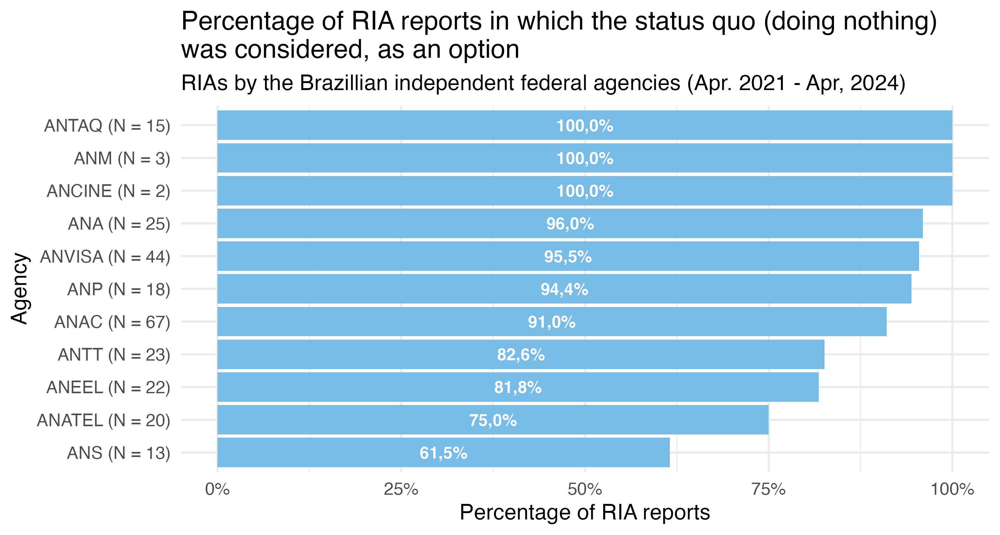

  

# How many are too few? 
## Analyzing the diversity of regulatory options considered in Brazil's RIAs 

 

***Lucas Thevenard***
***Fávio Saab***

 

<b>Society for Benefit-Cost Analysis</b>. March 2025, Washington, DC.

---
<!-- 
paginate: true 
header: How many are too few? 
footer: lucas.gomes@fgv.br | March, 2025
-->

## Context
* RIA as a tool to enhance the rationality of regulatory decisions.
  - Ensures that evaluative criteria and methods are transparent.
* **April 2021**: RIAs became mandatory in Brazil.
  - **Growing pains**: institutional and methodological challenges.
  - A research agenda to evaluate the implementation of RIAs in Brazil:
    * **Is RIA actually being used when it matters?** *Use of justifications not to conduct RIA (exemptions).*
    * **Has the usage of RIA been effective to enhance the rationality of decisions?** *Quality if RIAs (methodological rigour, social participation, etc.)*

---

## Problem statement

* **Problem**: What has been the range of alternatives considered in Brazillian RIAs?
* **Scope**: RIAs from the Brazillian federal independent regulatory agencies in the three years after RIAs became mandatory.

---

## Methodology

* 1. Identification of normative acts approved by eacg of the 11 Brazilian agencies, between April 15, 2021 and April 15, 2024.
* 2. Formal requests to the agencies asking for the reports, when used.
* 3. Tabulation and examination of the RIA reports.
* 4. Analysis and discussion of the range of options considered in the reports.

---

# Results

---

#### **Usage of RIAs varied greatly from agency to agency.**

\* The number of acts with RIA reports is larger then the number of RIA reports, as in some cases the same RIA was used to substantiate more then one normative act.

Agency                       | Normative Acts | Acts with RIA Reports* | %
-----------------------------|:--------------:|:-----------:|:------:
ANAC (Civil Aviation)        | 143            | 67          | 47%
ANVISA (Health)              | 563            | 44          | 8%
ANA (Water and Sanitation)   | 121            | 25          | 21%
ANTT (Land Transportation)   | 38             | 23          | 61%
ANEEL (Electrical Energy)    | 123            | 22          | 18%
ANATEL (Telecomunications)   | 22             | 20          | 91%
ANP (Oil and Gas)            | 125            | 18          | 14%
ANTAQ (Water Transportation) | 47             | 15          | 32%
ANS (Health Insurance)       | 169            | 13          | 8%
ANM (Mining)                 | 24             | 3           | 13%
ANCINE (Cinema)              | 40             | 2           | 5%
**TOTAL**                    | **1415**       | **252**     | **18%**

---

#### **The analysis of the *status quo* (doing nothing) should be present in all RIAs, but only three agencies used it consistently (in all cases).**

 

---

#### **The number of options considered varied greatly, not only from agency to agency, but also, in some agencies, from report to report (std = 6.8, for the universe).**

---

#### **In many cases (65 reports), agencies analyzed only one or two options.**

 

---

## Discussion: How many are too few?

* **Not considering the *status quo* means the analysis is lacking at least one option which is crucial to consider.**
  - There is no valid justification to not consider keeping the *status quo* as an option.
  - The *status quo* is a crucial baseline for the analysis.
* **Less then 3 is certainly too few.**
  - It means using RIA only to confirm a pre-established solution, comparing it with the status quo (or even worse if the *status quo* is absent of the analysis).
  -  Using RIA in this manner is not useful, just wastes public resources.

---

## Discussion: The more the merrier?

* **Is there an upper limit to the number of options that should be considered?**
  - In 10 cases more than 20 options were considered.
  * Does analyzing too many options compromise the operationalization of the RIA?
  * Analyzing the feasibility of options before comparing them can reduce this problem.

* **Can we find an optimal range of options to consider in the Brazillian experience?**
  - Our next research agenda: testing if the number of options considered affects the quality of RIA reports in Brazil.

---

# Thank You.

