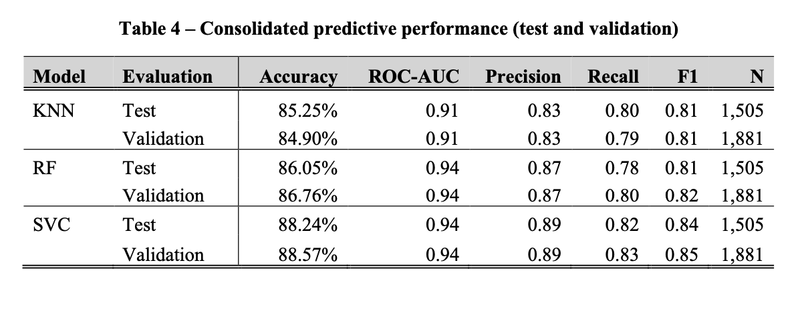
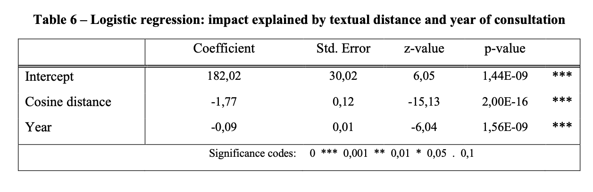
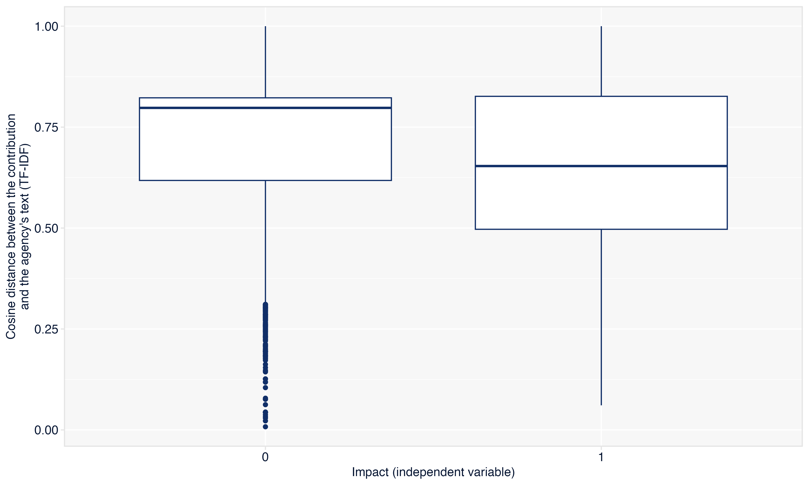
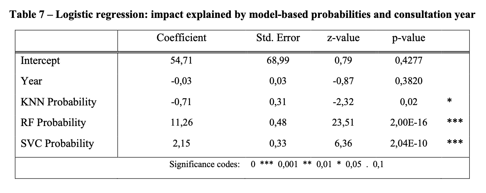
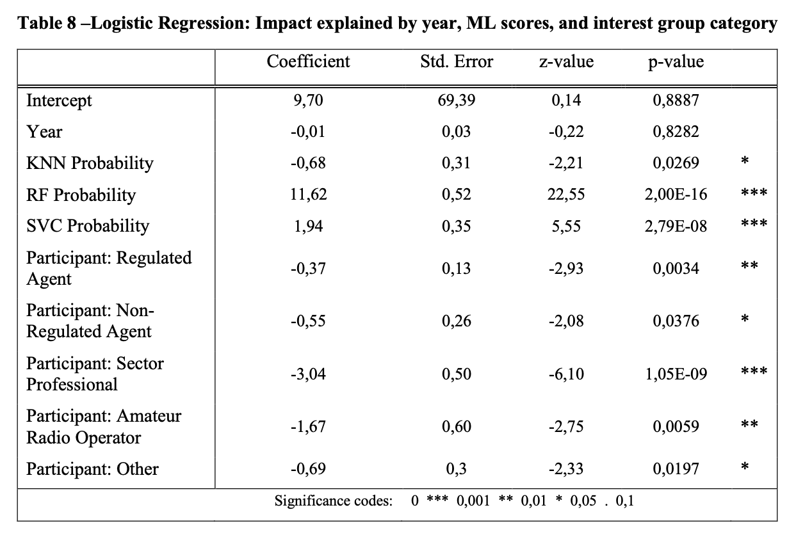

  

# Who gets heard?
## Language, interests, and the influence of textual public input in the regulatory decision-making process of the Brazillian telecommunications sector

 

***Lucas Thevenard***

---
<!-- 
paginate: true 
header: Who gets heard?
footer: lucas.gomes@fgv.br | May 7th, 2025
-->

## Motivation
* Anvisa and Aneel's public consultations
  - Do participants' need to "speak the language" of the agency to get heard? 
* A new way to analyse the content of contributions
  - Text mining and machine learning models of textual analysis

---

## Participation assymetry in the literature

- Evidence that some groups (most notably, the business sector) are overrepresented in public consultations
  - Coglianese, 2006; Yackee, 2006; Silva, 2012, Salinas *et al.*, 2020.
- Interest group theories
  - Capture theory and the Iron Triangle
  - "Hollow core", ACF and policy networks

---

## Why Anatel?
- High level of transparency and accessible data.
- Full text of contributions, responses, and participant IDs.
- Strategic sector: digital communications and telecom.

---

## Three hypothesis of this study

 

**Hypothesis 1**: Contributions with similar textual content receive similar regulatory responses.

 

**Hypothesis 2**: Contributions that are textually closer to the agency’s discourse are more likely to be accepted.

 

**Hypothesis 3**: Once textual content is accounted for, group affiliation loses explanatory power.

---

## Data collection
- 1,456 consultations from 1999 to 2022
  - Only 488 consultations received formal, itemized responses from the agency.
- From 2013 onward, of the 15,679 contributions that received a response, 9,404 (approximately 60%) were accompanied by a classification.

---

---

## Final universe
- 9,404 contributions received by Anatel since 2013 that were accompanied by a classified response.
- Simplification of impact categories:
    - Accepted, partially accepted, not accepted, and not applicable ---> 0 x 1
- Classification of Interest group affiliation:
  - (1) regulated economic agents, (2) non-regulated economic agents, (3) sector professionals, (4) amateur radio operators, (5) interested individuals, and (6) others.

---

## Limitations of the data
- Reliability
- Representativeness
- Validity

---

# Text Representation

---

### What is TF-IDF?

**TF-IDF (Term Frequency–Inverse Document Frequency)** is a numerical statistic used in text mining and Natural Language Processing (NLP) to reflect how important a word is to a document in a collection or corpus.

It combines two metrics: Term Frequency (TF) and Inverse Document Frequency (IDF).

---

### 1. Term Frequency (TF)

Measures how frequently a term appears in a document.

$$
\text{TF}(t, d) = \frac{f_{t,d}}{\sum_{k} f_{k,d}}
$$

Where:
- $( f_{t,d} )$ is the number of times term $( t )$ appears in document $( d )$
- The denominator is the total number of terms in document $( d )$

---

### 2. Inverse Document Frequency (IDF)

Measures how important a term is by reducing the weight of terms that appear in many documents.

$$
\text{IDF}(t, D) = \log \left( \frac{N}{|\{d \in D: t \in d\}|} \right)
$$

Where:
- $( N )$ is the total number of documents in the corpus $( D )$
- $( |\{d \in D: t \in d\}| )$ is the number of documents where term $( t )$ appears

---

### TF-IDF Formula

 

$$
\text{TF-IDF}(t, d, D) = \text{TF}(t, d) \times \text{IDF}(t, D)
$$

This score increases with the frequency of a term in a document but is offset by how common the term is across the corpus.

- **Intuition**:
  - Common words (like “the”, “and”) get low scores.
  - Terms that are frequent in a document but rare across the corpus get high scores.
  - Documents (contributions) become vectors in a high-dimensional space, where each dimension corresponds to a term in the vocabulary.

---

## Predictive modelling

- [Open code](https://lthevenard.github.io/hub/slides/outros/balla/predictive.html) is available for all the modelling stages.

---

## Explanatory modeling (Model 1)

- Cosine distance as a textual distance metric

        

---

## Explanatory modeling (Model 1)

- Cosine distance as a textual distance metric

---

---

## Explanatory modeling (Model 2)

---

---

## Going back to our hypothesis

 

**Hypothesis 1**: Contributions with similar textual content receive similar regulatory responses.

 

**Hypothesis 2**: Contributions that are textually closer to the agency’s discourse are more likely to be accepted.

 

**Hypothesis 3**: Once textual content is accounted for, group affiliation loses explanatory power.

---

## Some additional analysis

- Is it technical language that matters?
- Repetition and impact: which groups are more likely to repeat their arguments?
- Group cohesion: internal and external textual distances across interest groups

---

# Thank You.

