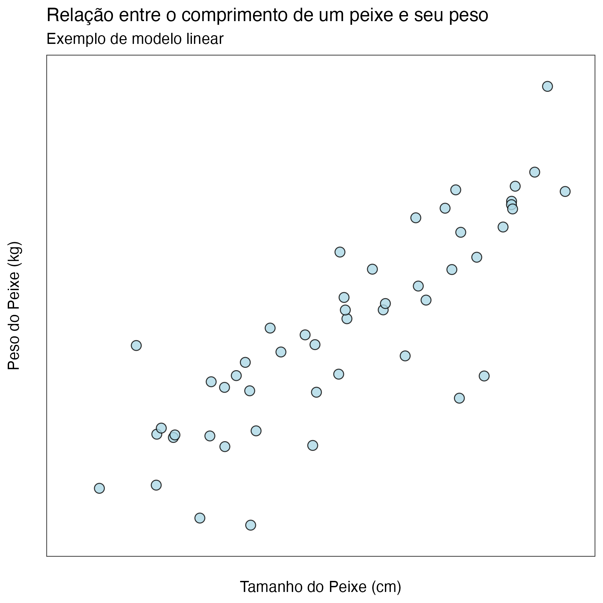
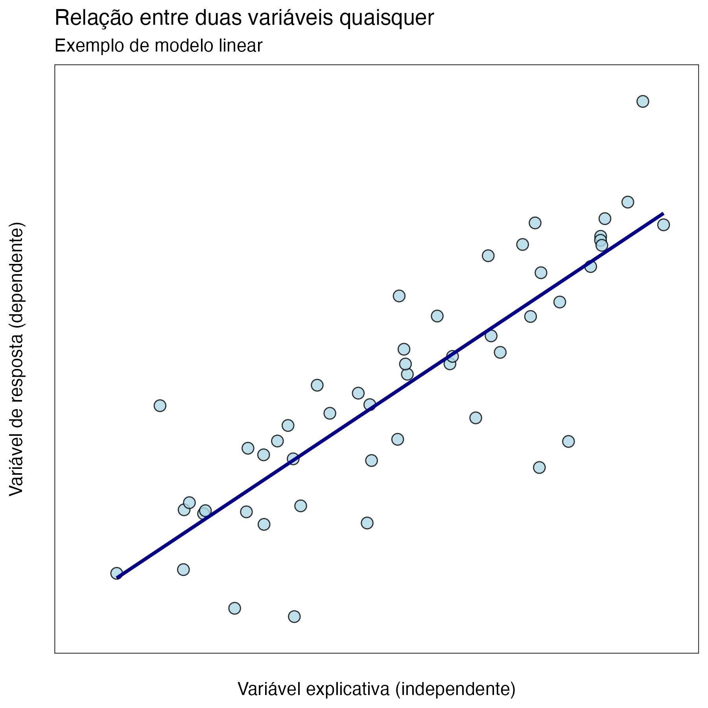
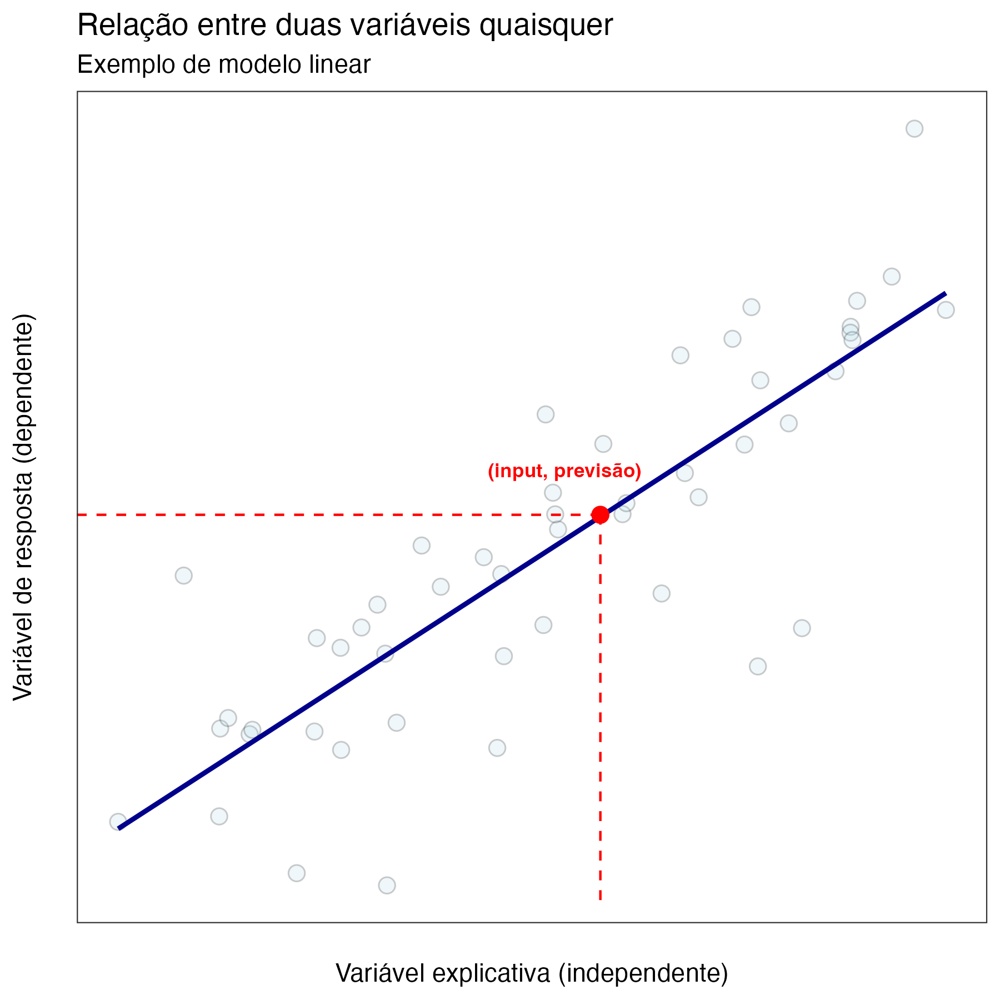

# O que é um modelo linear?
**Lucas Thevenard**

---
<!-- 
paginate: true 
footer: lucas.gomes@fgv.br | 2024
-->

## O que é um modelo linear?
- Vivemos em uma época marcada pelo uso intensivo de dados. Ouvimos com frequência falar sobre "modelos", sobre "machine learning" e sobre "inteligência artificial" sem necessariamente compreender concretamente o que esses termos designam. Estes slides são um material introdutório simples que explica o primeiro desses conceitos: "O que é um modelo?". Mais especificamente, vamos explicar o que é um modelo linear, pois esse é o tipo de modelo mais comum. 

---

## Um exemplo simples
- Vamos começar com um exemplo intuitivo: a relação entre o tamanho e o peso de vários peixes da mesma espécie.
- No gráfico ao lado, cada ponto representa as medições de um peixe diferente. O eixo x indica o tamanho do peixe e o eixo y indica o seu peso.
- **Partindo do gráfico, qual você diria que é a relação entre o tamanho e o peso dos peixes?**

---

## Tendência linear
- Podemos usar uma linha para tentar "resumir" a relação entre essas variáveis que, como podemos ver, é uma relação crescente (quanto maior o tamanho do peixe, maior tende a ser seu peso).
- No gráfico ao lado, traçamos a linha de forma a minimizar as distâncias entre os pontos (nossas medições reais) e a nossa linha (que tenta capturar a tendência dos pontos).

---

## Temos um modelo!
- Vamos supor que um novo peixe aparece e sabemos que ele mede 60 cm, mas não sabemos qual é o seu peso. 
- Podemos usar o que aprendemos para estimar o peso provável desse peixe! Basta verificar a qual peso a nossa reta associa o tamanho que medimos. Neste exemplo, o peso provável do peixe seria 1,25 kg.

---

## Generalizando
- Agora vamos imaginar que queremos relacionar duas variáveis quaisquer. 
- A variável que representa o input que nosso modelo preditivo receberá é chamada de '**explicativa**' ou '**independente**' e será colocada no eixo x.
- A variável que será prevista pelo modelo é chamada de '**de resposta**' ou '**dependente**' e será colocada no eixo y.

---

## A reta é o nosso modelo!
- A reta que traçamos é uma função, ela recebe valores da variável explicativa e fornece uma previsão para a variável de resposta.
- O que chamamos de modelo, nesse caso, será simplesmente a equação dessa reta. Ela nos fornece uma forma simples de estimar um valor da variável dependente a partir da variável independente.

---

## A reta é o nosso modelo!
- A reta que traçamos é uma função, ela recebe valores da variável explicativa e fornece uma previsão para a variável de resposta.
- O que chamamos de modelo, nesse caso, será simplesmente a equação dessa reta. Ela nos fornece uma forma simples de estimar um valor da variável dependente a partir da variável independente.

---

## Equação da reta

Se o nosso modelo é a reta (ou melhor, a equação da reta), vamos ver em um pouco mais de detalhes quais são as suas componentes. Toda reta pode ser descrita por uma equação como esta:

 

$$y = I + \beta x$$

 

em que $I$ é o **intercepto** da reta no eixo y e $\beta$ é o **coeficiente linear**, que determina a inclinação da reta. Esse coeficiente, em particular, é muito relevante, pois ele dimensiona quanto a variável dependente ($y$) é impactada à medida que a variável independente ($x$) varia. Por exemplo, na equação acima, se $\beta = 2$, então a cada 1 unidade a mais de x, y crescerá em 2 unidades.

---

## E se tivermos mais variáveis explicativas?

O modelo linear que vimos aqui é o mais simples, pois ele utiliza apenas uma variável independente para prever a variável de resposta. Chamamos esse tipo de modelo de **regressão linear simples**. Mas, existem também a **regressão linear múltipla**, que utiliza várias variáveis independentes. Nesse caso, além do intercepto, precisaremos estipular um coeficiente linear para cada variável independente. Para $n$ variáveis:

  

$$y = I + \beta_1 x_1 + \beta_2 x_2 + \beta_3 x_3 + ...+ \beta_n x_n$$

---

## Há muito mais, mas você já sabe o que é um modelo!

Claro que nestes slides apenas introduzimos, de forma bastante superficial, as técnicas de modelagem estatística. Existem outros modelos (não-lineares), além de vários ajustes que podem ser feitos para aprimorar os modelos, para incluir variáveis categóricas na análise, métricas que indicam a qualidade do modelo seu poder, etc. etc. etc.
Mas o essencial (que é a lógica) do principal tipo de modelo utilizado em diversas aplicações práticas você já entendeu! E agora você sabe exatamente o que é um modelo. Espero quando você veja esse termo no futuro não fique confuso com suposições abstratas, mas lembre-se que o modelo nada mais é do que uma equação que usamos com uma finalidade específica, e que você já sabe até mesmo como ela pode ser construída!
