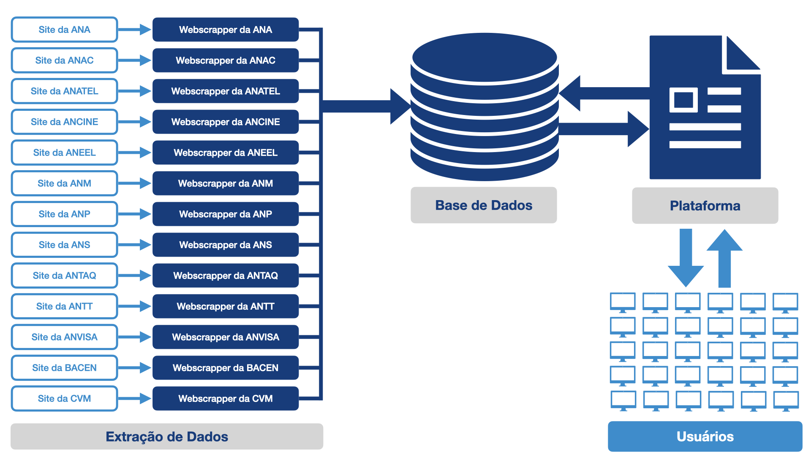
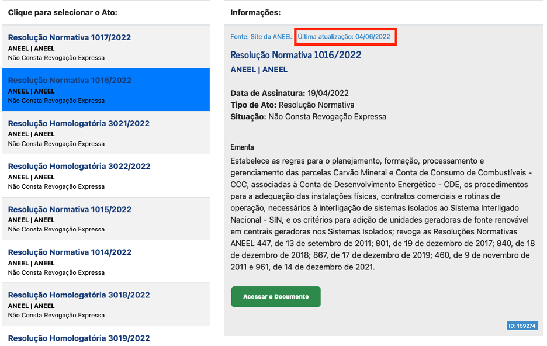

# Monitor Regulatório 
**Regulação em Números**
Lucas Thevenard

---
<!-- 
paginate: true 
header: Monitor Regulatório
footer: lucas.gomes@fgv.br | 14/06/2023
-->

## Monitor Regulatório
- Pipeline de dados
- Limitações técnicas e modelo alternativo
- Estágio Atual
- Equipe, proposta de expansão

---

### Pipeline de dados

---

## Limitações técnicas do Monitor Regulatório
- **Dependência de dados e sistemas externos**
  - interrupção da disponibilidade ou acessibilidade
  - mudanças dos canais de acesso
* **Taxa de atualização**
  - Inclusão de novas normas
  - Atualização dos dados das normas (exemplo: vigência)

---

### Informações sobre atualização na plataforma

---

## Limitações técnicas do Monitor Regulatório
- **Dependência de dados e sistemas externos**
  - interrupção da disponibilidade ou acessibilidade
  - mudanças dos canais de acesso
- **Taxa de atualização**
  - Inclusão de novas normas
  - Atualização dos dados das normas (exemplo: vigência)
* **Coerência e escopo temático**
  - Coerência das informações prestadas
  - Escopo temático: complexidade cresce com o número de fontes de dados.

---

## Alternativa ao modelo proposto
- Expansão das bases mediante parcerias.
- Menores custos, menos autonomia.
  - Resolveria o problema da dependência externa?
  - Resolveria o problema da taxa de atualização?
  - Resolveria o problema da coerência e escopo temático?

---

## Estágio atual
- 6 agências coletadas.
- Mais de 50.000 atos normativos na base.
- Plataforma em versão preliminar de teste: 
  - [RegMonitor](https://lthevenard.shinyapps.io/monitor_regulatorio/)

---

## Equipe
- Lucas (Regnum) + José Luiz e Camila Lopes (CTS)
- Necessidade de um programador dedicado.
  - Suporte, melhorias, desenvolvimento continuado.
  - Outras demandas do RegNum
    - Estruturação das bases de dados.
    - Suporte para gráficos, coletas de dados, etc.
