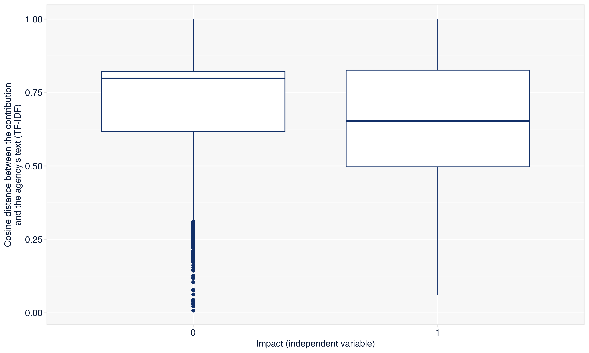

  

# Machine Learning e NLP
## Grupo de Estudos sobre IA e Regulação
 

***Lucas Thevenard***

---

<!-- 
paginate: true 
header: Grupo de Estudos sobre IA e Regulação
footer: lucas.gomes@fgv.br | 03/06/2025
-->

## Roteiro:
- **Parte 1 - Machine Learning e LLMs**
  - Modelos explicativos e preditivos
  - Tipos de Aprendizagem em ML
  - Transformers e LLMs: Introdução

- **Parte 2 - Exemplo de pesquisa aplicada: Who says it or what is said?**

---

<!-- 
_paginate: false 
_footer: ""
-->

# Parte 1. Machine Learning e LLMs
## 1.1. Modelos explicativos e preditivos

---

## Dois tipos de modelos:  

- Modelos estatísticos, em geral, podem ter **dois grandes objetivos**:
  - **Explicar** relações causais ou estatísticas entre variáveis.
  - **Prever** valores ou eventos futuros com base em padrões aprendidos.
- **Explicativos vs. Preditivos**
  - Embora ambos usem dados e estatísticas, eles **têm objetivos diferentes**.
  - A distinção é **fundamental para entender ML** e suas aplicações.

---

## Modelos Explicativos

**Objetivo**: Compreender relações entre variáveis.
**Exemplo**: "Como a escolaridade influencia a renda?"

- **Características**:
  - Foco em **interpretação dos coeficientes**.
  - Baseados em **teorias causais**.
  - Assumem estrutura estatística bem especificada.
  - Menos tolerância a **viés de especificação**.

---

<!-- 
_paginate: false 
_footer: ""
-->

## Como a escolaridade influencia a renda?

---

<!-- 
_paginate: false 
_footer: ""
-->

## Como a escolaridade influencia a renda?

---

## Um "modelo" é uma equação matemática que relaciona variáveis explicativas a uma variável de reposta

 

* **Equação da reta**: $y = ax + b$

* **No nosso modelo:** $\text{Renda} = \beta_1 \cdot \text{Escolaridade} + \beta_0$

* **E generalizando (modelos lineares)...**
  * $y = \beta_0 + \beta_1 x_1 + \beta_2 x_2 + ... + \beta_n x_n$

---

## Voltando... Modelos Explicativos!

**Objetivo**: Compreender relações entre variáveis.
**Exemplo**: "Como a escolaridade influencia a renda?"

- **Características**:
  - Foco em **interpretação dos coeficientes**.
  - Baseados em **teorias causais**.
  - Assumem estrutura estatística bem especificada.
  - Menos tolerância a **viés de especificação**.

---

## Modelos Preditivos

**Objetivo**: Acertar o valor de Y dado X.
**Exemplo**: "Qual será a renda deste indivíduo, dados X, Y, Z?"

- **Características**:
  - Foco em **performance preditiva** (ex: acurácia, erro quadrático).
  - Pode usar modelos complexos e "caixa-preta".
  - Nem sempre se preocupa com **explicação causal**.
  - Mais tolerante a **viés, desde que a previsão funcione**.

---

## E onde entra o Machine Learning?

- **Machine Learning é predominantemente preditivo.**
- O foco é **generalizar bem para novos dados**.
- Mas técnicas de ML também podem ser adaptadas para:
  - **explicações locais** (ex: SHAP, LIME)
  - **descoberta de padrões** úteis para explicação

---

<!-- 
_paginate: false 
_footer: ""
-->

# Parte 1. Machine Learning e LLMs
## 1.2. Tipos de Aprendizagem em ML

---

## Tipos de Aprendizagem em Machine Learning

- Em Machine Learning, os algoritmos podem ser classificados de acordo com o tipo de **aprendizado**.
- Os dois principais tipos são:
  - **Aprendizagem Supervisionada**
  - **Aprendizagem Não Supervisionada**

---

## Aprendizagem Supervisionada

**Objetivo**: Prever um valor de saída (variável dependente) com base em entradas rotuladas.

**Como funciona**:
- O modelo é treinado com dados que possuem **entradas e saídas conhecidas**.
- Aprende a **associar padrões de entrada às saídas**.

---

## Algoritmos Supervisionados Comuns

- **Regressão**: Regressão Linear; Regressão Logística (para classificação binária)

- **Árvores de Decisão**: Decision Tree; Random Forest

- **Outros**:
  - Support Vector Machines (SVM);
  - K-Nearest Neighbors (KNN);
  - Redes Neurais (quando supervisionadas)

---

## Aprendizagem Não Supervisionada

**Objetivo**: Encontrar padrões ou estruturas ocultas **sem rótulos de saída**.

**Como funciona**:
- O modelo recebe apenas as **entradas** e tenta identificar estruturas ou agrupamentos nos dados.

---

## Algoritmos Não Supervisionados Comuns

**Clusterização (Agrupamento)**: K-Means; DBSCAN; Hierarchical Clustering

**Redução de Dimensionalidade**: PCA (Principal Component Analysis); t-SNE

---

## Comparando os dois tipos

| Característica             | Supervisionada                      | Não Supervisionada                   |
|---------------------------|-------------------------------------|--------------------------------------|
| Dados de saída disponíveis| Sim                                 | Não                                  |
| Objetivo principal         | Previsão (regressão/classificação) | Descoberta de padrões                |
| Tipos de algoritmos        | Regressão, SVM, Árvores             | K-Means, PCA, Apriori                |

---

## Há outros tipos também!

**Aprendizagem Semi-Supervisionada**:
- Usa uma pequena quantidade de dados rotulados + muitos dados não rotulados.
- Tenta combinar o melhor dos dois mundos.

**Aprendizagem por Reforço**:
- Um agente aprende **interagindo com o ambiente**.
- Recebe **recompensas ou penalidades** por suas ações.
- Usado em jogos, robótica, sistemas de recomendação.

---

<!-- 
_paginate: false 
_footer: ""
-->

# Parte 1. Machine Learning e LLMs
## 1.3. Transformers e LLMs

---

# Introdução a Transformers e LLMs

- Nos últimos anos, os modelos de linguagem passaram por uma revolução com a chegada dos **Transformers**.
- Eles são a base dos **Large Language Models (LLMs)**, como o ChatGPT.
- Esses modelos têm transformado áreas como NLP, tradução automática, resumo de textos e geração de linguagem.

---

## O que é um Transformer?

- Arquitetura proposta em 2017 por Vaswani et al. no artigo “Attention is All You Need”.

- Baseado no mecanismo de **attention**:
  - Permite que o modelo “preste atenção” a diferentes partes da entrada ao gerar a saída.

- Diferente de RNNs, os Transformers:
  - Processam dados em **paralelo** (mais eficientes).
  - Lidam melhor com **dependências de longo prazo**.

---

## Como funciona o mecanismo de Attention?

- A atenção permite que o modelo calcule **pesos** entre palavras de entrada.
  - Exemplo: Na frase "O gato comeu o peixe", ao prever "peixe", o modelo pode dar mais peso à palavra "comeu".

---

## E os LLMs (Large Language Models), como são treinados?

- Utilizam **aprendizado não supervisionado**: predição da próxima palavra.
  - Competição com um modelo de classificação.

- Fase de ajuste fino (**fine-tuning**) pode adaptar o modelo a tarefas específicas.

---

## Tamanho é documento?

- LLMs são modelos de linguagem com **bilhões de parâmetros**, treinados em grandes corpora de texto.

* Caso do GPT-2 na Open AI: expectativa de queda de performance com o aumento do tamanho do modelo, mas na prática, a performance continua melhorando.

* Resultado:
  - Aprendem padrões linguísticos complexos.
  - Geram texto coerente e contextualizado.
  - Respondem perguntas, traduzem, resumem, etc.

---

## Do GPT ao ChatGPT

- Adaptação do GPT para **interações conversacionais**.
- Etapas adicionais:
  1. **Fine-tuning supervisionado** com exemplos de diálogos humanos.
  2. **Aprendizado por Reforço com Feedback Humano (RLHF)**: humanos avaliam respostas e o modelo aprende a se alinhar às preferências humanas.
* **Resultado pretendido**: respostas mais úteis, seguras e alinhadas com o contexto do usuário.

* **Resumo**: ChatGPT = GPT treinado + alinhamento com diálogo humano + aprendizado supervisionado + RLHF

---

## Limitações e Desafios dos LLMs

- O treinamento exige:
  - Uso massivo de dados
  - Poder computacional elevado (GPUs/TPUs)
  - Técnicas de otimização avançadas

**Desvantagens**:
- Alto custo computacional e potenciais violações de direitos autorais
- Tendência a "alucinar", inventar fatos (no ChatGPT, por exemplo)
- Viés nos dados de treinamento
- Falta de explicabilidade

---

<!-- 
_paginate: false 
_footer: ""
-->

# Parte 2. Exemplo de pesquisa aplicada
## Who says it or what is said?

---

## Motivation
* Anvisa and Aneel's public consultations
  - Do participants' need to "speak the language" of the agency to get heard? 
* A new way to analyse the content of contributions
  - Text mining and machine learning models of textual analysis

---

## Participation assymetry in the literature

- Evidence that some groups (most notably, the business sector) are overrepresented in public consultations
  - Coglianese, 2006; Yackee, 2006; Silva, 2012, Salinas *et al.*, 2020.
- Interest group theories
  - Capture theory and the Iron Triangle
  - "Hollow core", ACF and policy networks

---

## Why Anatel?
- High level of transparency and accessible data.
- Full text of contributions, responses, and participant IDs.
- Strategic sector: digital communications and telecom.

---

## Three hypothesis of this study

 

**Hypothesis 1**: Contributions with similar textual content receive similar regulatory responses.

 

**Hypothesis 2**: Contributions that are textually closer to the agency’s discourse are more likely to be accepted.

 

**Hypothesis 3**: Once textual content is accounted for, group affiliation loses explanatory power.

---

## Data collection
- 1,456 consultations from 1999 to 2022
  - Only 488 consultations received formal, itemized responses from the agency.
- From 2013 onward, of the 15,679 contributions that received a response, 9,404 (approximately 60%) were accompanied by a classification.

---

---

## Final universe
- 9,404 contributions received by Anatel since 2013 that were accompanied by a classified response.
- Simplification of impact categories:
    - Accepted, partially accepted, not accepted, and not applicable ---> 0 x 1
- Classification of Interest group affiliation:
  - (1) regulated economic agents, (2) non-regulated economic agents, (3) sector professionals, (4) amateur radio operators, (5) interested individuals, and (6) others.

---

## Limitations of the data
- Reliability
- Representativeness
- Validity

---

# Text Representation

---

### What is TF-IDF?

**TF-IDF (Term Frequency–Inverse Document Frequency)** is a numerical statistic used in text mining and Natural Language Processing (NLP) to reflect how important a word is to a document in a collection or corpus.

It combines two metrics: Term Frequency (TF) and Inverse Document Frequency (IDF).

---

### 1. Term Frequency (TF)

Measures how frequently a term appears in a document.

$$
\text{TF}(t, d) = \frac{f_{t,d}}{\sum_{k} f_{k,d}}
$$

Where:
- $( f_{t,d} )$ is the number of times term $( t )$ appears in document $( d )$
- The denominator is the total number of terms in document $( d )$

---

### 2. Inverse Document Frequency (IDF)

Measures how important a term is by reducing the weight of terms that appear in many documents.

$$
\text{IDF}(t, D) = \log \left( \frac{N}{|\{d \in D: t \in d\}|} \right)
$$

Where:
- $( N )$ is the total number of documents in the corpus $( D )$
- $( |\{d \in D: t \in d\}| )$ is the number of documents where term $( t )$ appears

---

### TF-IDF Formula

 

$$
\text{TF-IDF}(t, d, D) = \text{TF}(t, d) \times \text{IDF}(t, D)
$$

This score increases with the frequency of a term in a document but is offset by how common the term is across the corpus.

- **Intuition**:
  - Common words (like “the”, “and”) get low scores.
  - Terms that are frequent in a document but rare across the corpus get high scores.
  - Documents (contributions) become vectors in a high-dimensional space, where each dimension corresponds to a term in the vocabulary.

---

## Predictive modelling

- [Open code](https://lthevenard.github.io/hub/slides/outros/balla/predictive.html) is available for all the modelling stages.

---

## Explanatory modeling (Model 1)

- Cosine distance as a textual distance metric

        

---

## Explanatory modeling (Model 1)

- Cosine distance as a textual distance metric

---

---

## Explanatory modeling (Model 2)

---

---

## Going back to our hypothesis

 

**Hypothesis 1**: Contributions with similar textual content receive similar regulatory responses.

 

**Hypothesis 2**: Contributions that are textually closer to the agency’s discourse are more likely to be accepted.

 

**Hypothesis 3**: Once textual content is accounted for, group affiliation loses explanatory power.

---

## Some additional analysis

- Is it technical language that matters?
- Repetition and impact: which groups are more likely to repeat their arguments?
- Group cohesion: internal and external textual distances across interest groups
