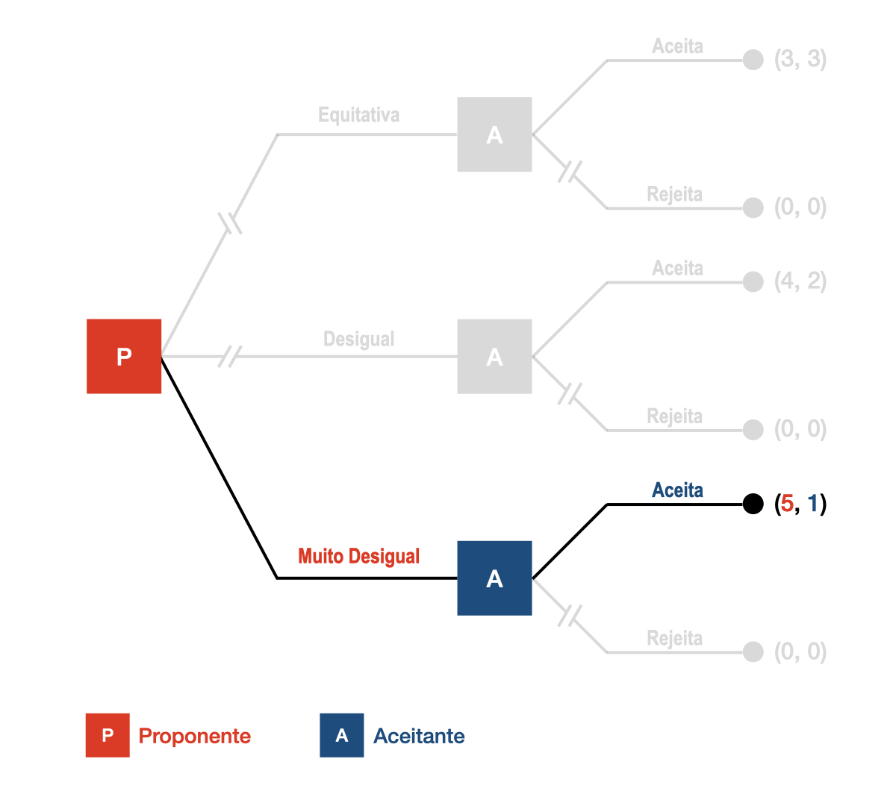
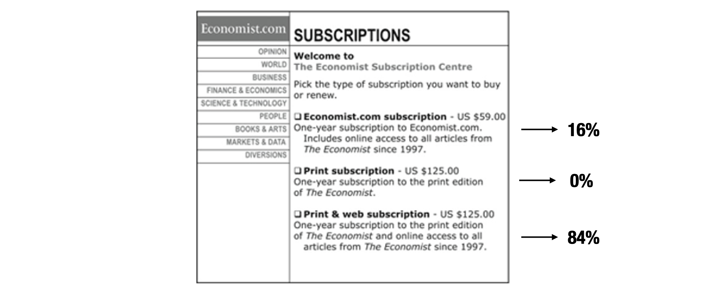
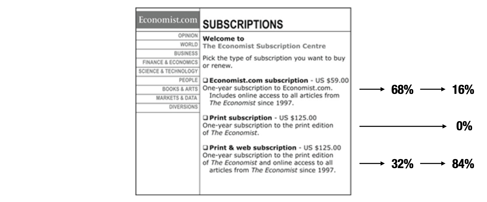
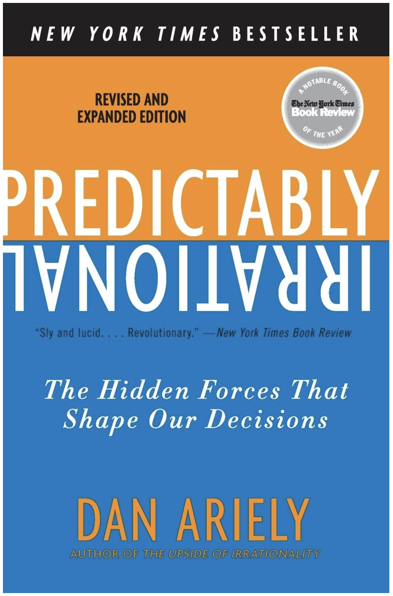

# Processo Seletivo 2: dicussão da Literatura
**PPAD - 2024**
Lucas Thevenard

---
<!-- 
paginate: true 
header: Processo Seletivo 2: Dicussão da Literatura
footer: lucas.gomes@fgv.br | 12/09/2024
-->

## Bibliografia Discutida

- Diver: The optimal precision of administrative rules
- Stigler: The theory of economic regulation
- Coglianese: Empirical analysis and Administrative Law
- Jolls, Sunstein & Thaler: A behavioural approach to Law and Economics

---

## Acesse os slides:
 

**https://bit.ly/ppad_2024**

---

# Diver: The optimal precision of administrative rules

---

## Diver: The optimal precision of administrative rules

- Problema analisado: desenho de regras regulatórias
  - Análise *in lege ferenda*, não *in lege data*: como **devem ser** as regras?
  * **Obs**: perspectiva "sociológica" e "econômica" da teoria da regulação. 
* Qual deve ser o grau de precisão ótimo de uma regra regulatória
  - Necessidade de equilibrar precisão e flexibilidade.
    * Regras devem ser específicas o suficiente para guiar o comportamento dos agentes econômicos e garantir uma aplicação isonômica.
    * Regras devem ser flexíveis o suficiente para considerar circusntâncias distintas e exceções (**trade-off** necessário).

---

## Diver: The optimal precision of administrative rules
- O dilema (trade-off) observado por Diver está ligado a **três dimensões** de uma regra regulatória que não conseguimos conciliar.
  * **Normas transparentes (transparent)**: com linguagem/significado claro para os seus destinatários.
  * **Normas acessíveis (accesible)**: objetivas e fáceis de aplicar a casos concretos, ou seja, a situações reais.
  * **Normas congruentes (congruent)**: fiéis ao objetivo regulatório que lhes dá origem.

---

## Diver: The optimal precision of administrative rules
 

Vamos supor que o regulador do setor de aviação tenha uma ideia aproximada de um objetivo regulatório: **os pilotos devem se aposentar quando o custo social de permitir que eles continuem, medido pelo risco de acidentes que possam causar multiplicado por suas consequências, exceder o benefício social, medido pelos custos evitados de não ter que encontrar e treinar um substituto**.

---

**Proposta I**: Nenhuma pessoa pode pilotar um avião comercial após seu sexagésimo aniversário.

**Proposta II**: Nenhuma pessoa pode pilotar um avião comercial se representar um risco irrazoável de acidente.

**Proposta III**: Nenhuma pessoa pode pilotar um avião comercial se se enquadrar em uma das seguintes categorias. (Em seguida, são apresentadas tabelas exibindo todas as combinações de valores para diversas variáveis, incluindo anos e nível de experiência, horas de voo registradas, idade, altura, peso, pressão arterial, frequência cardíaca, visão e outros sinais vitais, que desqualificariam um piloto de continuar elegível para pilotar aeronaves.)

---

**Proposta I**: Nenhuma pessoa pode pilotar um avião comercial após seu sexagésimo aniversário.
 

- *Regras regulatórias específicas, mas pouco detalhadas*:
  - Alta transparência e acessibilidade, mas baixa congruência.
  - Problema da **sobre-inclusão** e da **sub-inclusão**.

---

**Proposta II**: Nenhuma pessoa pode pilotar um avião comercial se representar um risco irrazoável de acidente.
 

- *Regras regulatórias fiéis ao objetivo regulatório, mas que utilizam termos ambíguos ou linguagem aberta/principiológica*:
  - Alta congruência e acessibilidade, mas baixa transparência.
  - Problema do **compliance** (cumprimento) das regras pelos regulados.
  - Liberdade gerencial? Paradoxo de Schwartcz.
  - **Kaplow**: custos *ex ante* e *ex post*. 

---

**Proposta III**: Nenhuma pessoa pode pilotar um avião comercial se se enquadrar em uma das seguintes categorias. (extenso detalhamento em seguida.)
- *Regras regulatórias muito específicas e detalhadas, que tentam cobrir diversas hipóteses concretas*:
  - Alta congruência e transparência, mas baixa acessibilidade.
  - Problema dos **custos de produção normativa**.
    - **Kaplow**: custos *ex ante* e *ex post*. 
    - Problema informacional, rigidez, custos burocráticos para os regulados, complexidade, etc.

---

## Diver: The optimal precision of administrative rules

- Dimensões e trade-offs do design normativo:
  - **Transparência**, **Acessibilidade** e **Congruência**.
  - Problemas regulatórios decorrentes:
    - Problemas de **cumprimento das regras** (**compliance**);
    - Problemas de **sobre-inclusão** e **sub-inclusão**;
    - Problemas dos **custos de produção normativa** e engessamento da regulação.

---

# Stigler: The theory of economic regulation

---

## Stigler: The theory of economic regulation

* Teoria econômica clássica: regulação como um mecanismo para corrigir falhas de mercado.
  - Podemos chamar isso de "justificativa técnica" da regulação
* Para Stigler, a **causa real** da regulação é: A indústria "compra" a regulação
  - Indústria como demandante de regulação
  - Estado como ofertante de regulação
  - Teoria da **captura**, **rent-seeking**
* Por que a indústria estaria interessada em comprar regulação?

---

## Stigler: The theory of economic regulation

- Interesses da indústria na regulação, segundo Stigler.
  * Subsídios diretos
  * Controle da entrada de firmas rivais (barreiras à entrada)
  * Efeitos sobre bens complementares e substitutos
  * Fixação de preços

---

#### **Controle da entrada de firmas rivais (barreiras à entrada)**

---

#### **Controle da entrada de firmas rivais (barreiras à entrada)**
 

---

#### **Controle da entrada de firmas rivais (barreiras à entrada)**

---

#### **Controle da entrada de firmas rivais (barreiras à entrada)**

---

#### **Efeitos sobre bens complementares e substitutos**

/i.s3.glbimg.com/v1/AUTH_1f540e0b94d8437dbbc39d567a1dee68/internal_photos/bs/2023/T/G/cF1RSiRNOC5sPLLgj71Q/arroz-e-feijao.jpg)

---

#### **Efeitos sobre bens complementares e substitutos**

 

---

#### **Fixação de preços - preço mínimo**
 

---

#### **Fixação de preços - preço máximo**
 

---

## Stigler: The theory of economic regulation

- Interesses da indústria na regulação, segundo Stigler.
  - Subsídios diretos
  - Controle da entrada de firmas rivais (barreiras à entrada)
  - Efeitos sobre bens complementares e substitutos
  - Fixação de preços
* Mas como a indústria consegue "capturar" a regulação?
  - Teoria da escolha pública: *rent seeking*, *revolving doors*.

---

## Teoria da Escolha Pública - Rent Seeking

- Rent Seeking significa "busca de rendas", os agentes econômicos buscam manter ganhos excessivos por meio da captura do aparato regulatório.
* Mecanismo essencial: assimetria de interesses
  * **Consumidores e cidadãos**: *low stakes and high transaction costs* (baixo interesse e altos custos de transação).
  * **Agentes econômicos regulados**: *high stakes and low transaction costs* (alto interesse e baixos custos de transação).

---

## Teoria da Escolha Pública - Revolving Doors

- A Teoria da Escolha Pública questiona os interesses idôneos dos agentes públicos.
  - **Políticos são agentes racionais**: querem maximizar seu poder político.
  - **Burocratas são agentes racionais**: querem maximizar suas oportunidades de carreira, prestígio, ganhar dinheiro, etc.
* ***Revolving doors*** (**portas giratórias**): fenômeno da contratação de agentes públicos por empresas do mesmo setor.
  * Deu origem, inclusive, a regras de  quarentena em cargos de diretoria de órgãos reguladores.

---

---

# Coglianese: Empirical Analysis and Administrative Law

---

## Coglianese: Empirical Analysis and Administrative Law

- O papel da análise empírica na produção de regras regulatórias.
  * Pesquisa empírica como forma de melhorar a eficácia, a eficiência e a legitimidade da governança regulatória.
    * Contexto de formação da agenda de melhoria regulatória (OCDE):
      * Planejamento regulatório;
      * Análises de Impactos Regulatórios *ex ante* (AIR) e *ex post* (ARR);
      * Engajamento de partes interessadas (participação social).

---

> "*Propostas de reforma baseiam-se, de forma explícita ou implícita, em um conjunto de afirmações sobre como algum resultado no mundo seria diferente (geralmente para melhor) se as reformas fossem adotadas. (...)
> Do ponto de vista daqueles interessados em desenho institucional e política regulatória, a análise empírica é essencial para determinar como as instituições e os procedimentos afetam a tomada de decisões regulatórias. Por exemplo, ao decidir se deve impor ou manter exigências de que as agências realizem análises de custo-benefício antes de emitir novas regras, a questão chave é se as decisões regulatórias melhoram em relação a critérios pretendidos e mensuráveis quando essas exigências são impostas.*"

---

## Coglianese: Empirical Analysis and Administrative Law

- Três áreas principais de análises empíricas:
  - Análise econômica das novas regulações;
  - Revisão judicial de normas regulatórias;
  - Produção negociada de normas (*negotiated rulemaking*).

---

---

## Coglianese: Empirical Analysis and Administrative Law

- Três áreas principais de análises empíricas:
  - Análise econômica das novas regulações;
  - Revisão judicial de normas regulatórias;
  - Produção negociada de normas (*negotiated rulemaking*).

---

## Coglianese: Empirical Analysis and Administrative Law

- **Análise econômica das novas regulações**:
  -  Principal reclamação sobre regulação: impõe custos excessivos às atividades econômicas.
     -  Necessidade de mudar a alocação de gastos e realizar análises custo-benefício
     -  Incentivar as agências a buscarem as estratégias menos custosas, confrontarem seus problemas e considerarem soluções diversas

---

## Coglianese: Empirical Analysis and Administrative Law

- **Análise econômica das novas regulações**:
  - Etapas para que a análise econômica gere eficiência:
    - (i) a agência deve chegar a estimativas precisas dos custos e benefícios de diferentes opções regulatórias; 
    - (ii) a agência deve escolher de acordo com os resultados da análise;
    - (iii) as decisões que as agências tomam com base em análises econômicas devem ser mais eficientes do que aquelas que elas tomariam sem a análise.
  * A pesquisa empírica também pode ser usada para determinar se e como o processo de requerimento por uma análise econômica muda os resultados regulatórios.

---

## Coglianese: Empirical Analysis and Administrative Law

- **Análise econômica das novas regulações**:
  - Alguns problemas típicos das análises econômicas.
    * Qualidade das análises (vontade, fontes, metodologia, recursos humanos).
    * Problema da inovação: como/quando regular?
    * Agências não seguem os resultados das análises:
      - Racionalidade limitada?
      - Resistência ideológica à quantificação?
      - Restrições normativas (internas e externas)?

---

## Coglianese: Empirical Analysis and Administrative Law

- **Revisão judicial de normas regulatórias**:
  * Grau de deferência judicial?
  * Grau de ossificação regulatória por medo do controle?
  * Necessidade de se atentar à importância relativa das decisões controladas.
  * Problema dos efeitos dinâmicos (interação estratégica).

---

> Este trabalho é resultado de pesquisa desenvolvida no âmbito do Projeto Regulação em Números, da FGV Direito Rio, buscando compreender se e como o Supremo Tribunal Federal (STF) exerce controle sobre as agências reguladoras federais em instância recursal. Para isso, foram analisados, quantitativa e qualitativamente, todos os 2.896 processos envolvendo agências reguladoras federais no STF cujas demandas foram apreciadas em sede recursal entre 1996 e 2017. Uma primeira conclusão é a de que o STF raramente avalia o mérito das controvérsias jurídicas sobre as agências reguladoras em sede recursal (2,8% dos recursos), em jurisprudência defensiva. Uma segunda conclusão é mais relevante e menos conhecida: nos poucos casos em que o mérito da controvérsia constitucional é enfrentado (85), o STF adota postura deferente à agência, acolhendo sua tese em 88,7% dos casos.

---

## Coglianese: Empirical Analysis and Administrative Law

- **Produção negociada de normas (*negotiated rulemaking*)**:
  * Uma produção de norma negociada é o procedimento pelo qual a regulação é negociada por representantes do governo, do setor privado e de organizações não governamentais antes da decisão da agência para que seja elaborada uma proposta de regulação
  * Busca de consenso/unanimidade
    - Acelerar o processo de elaboração da norma e diminuir os riscos de litigância posterior
  * Estudos empíricos não comprovam a tese de que diminui o tempo para elaborar a norma e subsequente litigância

---

## Coglianese: Empirical Analysis and Administrative Law

- **Produção negociada de normas (*negotiated rulemaking*)**:
  - Regulação em Números:
    - De que modo e com que propósito a participação social é usada?
    - As consultas e audiências são transparentes?
    - O tempo de participação é adequado? Como a consulta afeta o tempo de produção da regulação?
    - Quem participa?
    - Quem influencia as decisões da agência (quem é ouvido)?

---

## Coglianese: Empirical Analysis and Administrative Law

- Três áreas principais de análises empíricas:
  - Análise econômica das novas regulações;
  - Revisão judicial de normas regulatórias;
  - Produção negociada de normas (*negotiated rulemaking*).

---

# Jolls, Sunstein & Thaler: A behavioural approach to Law and Economics

---

## Jogo do Ultimato

- **Proponente escolhe a divisão (com quantos fica).**
  - Pode escolher qualquer valor inteiro entre 1 e 6.
- **Aceitante decide se aceita a proposta**
  - Caso aceite, eles dividem da forma como o proponente propôs.
  - Caso recuse, ninguém recebe nada.

---

---

---

---

---

---

---

---

---

---

## Jogo do Ultimato
- A teoria econômica prevê que qualquer oferta superior a zero deveria ser aceita pelo segundo jogador.
* Güth et al*: (1982). "An experimental analysis of ultimatum bargaining". Journal of Economic Behavior & Organization. 3 (4): 367–388.
  - Resultados experimentais divergentes da previsão teórica, replicados em inúmeros experimentos posteriores.
* Quando os participantes fazem parte de uma mesma comunidade, ofertas ‘justas’ (50%-50%) são frequentes e ofertas inferiores a 30% do valor são rejeitadas.
* Mesmo entre desconhecidos, há um elevado número de ofertas acima do mínimo e ofertas muito baixas tendem a ser rejeitadas.

---

## Jogo do Ultimato
- Rejeição de divisões injustas: 
  - Importante resultado social – **indivíduos estão dispostos a rejeitar injustiças**, mesmo quando essa postura não gera maximização de seus ganhos.
* Possíveis causas:
  * **Punição altruista** – efeito pedagógico sobre o primeiro jogador para eliminar posturas semelhantes no futuro.
  * **Falta de auto-controle** – resposta motivada pelo desejo exacerbado de castigar o primeiro jogador pela injustiça causada.

---

## Jogo do Ultimato
* Morewedge, Krishnamurti e Ariely: **testes realizados com indivíduos embriagados** revelou uma propensão maior à rejeição de ofertas injustas de indivíduos sóbrios.
##### Morewedge, Carey K.; Krishnamurti, Tamar; Ariely, Dan (2014-01-01). "Focused on fairness: Alcohol intoxication increases the costly rejection of inequitable rewards". Journal of Experimental Social Psychology. 50: 15–20. doi:10.1016/j.jesp.2013.08.006 

---

## Jogo do Ultimato
- Potenciais efeitos neurológicos:
  * Sanfey et al.: ofertas injustas ativam **áreas do cérebro associadas ao sentimento de nojo e desgosto**.
  * Zak, Stanton e Ahmadi: estudos demonstrando que **ofertas generosas têm fundo emocional** e que a administração de certas drogas (ocitocina) aumenta substancialmente a propensão do primeiro jogador a melhorar suas ofertas.
##### Sanfey, Alan; Rilling; Aronson; Nystrom; Cohen (13 June 2003). "The Neural Basis of Economic Decision-Making in the Ultimatum Game". Science. 300 (5626): 1755–1758. doi:10.1126/science.1082976
##### Zak, P.J., Stanton, A.A., Ahmadi, S. (2007). Brosnan, Sarah (ed.). "Oxytocin Increases Generosity in Humans". PLOS ONE. 2 (11): e1128.

---

## 2/3 da Média
* Todos escolhem simultaneamente um número entre 0 e 100. Quem escolher o número mais próximo de 2/3 da média dos demais números vence.
* Qual deveria ser o resultado teórico desse jogo?
* Por que não consideramos até o final

---

## Herbert Simon – Racionalidade Limitada

- Simon ganhou o Nobel de Economia (1978) por ter desenvolvido o conceito de **racionalidade limitada** ('Bounded Rationality').
* Pesquisas com especialistas buscam entender como indivíduos de fato tomam decisões relevantes (divergências da teoria da escolha racional).

##### Simon, H. A. (1955). A behavioral model of rational choice. The quarterly journal of economics, 69(1), 99-118.
##### Simon, H. A. (1972). Theories of bounded rationality. Decision and organization, 1(1), 161-176.

---

## O conceito de racionalidade

- A teoria da escolha racional presume racionalidade perfeita. 
  - **Racionalidade Perfeita**: indivíduos tomam decisões que maximizam sua utilidade esperada.
- Presunção pouco realista em cenários reais.

---

## Conceito de Racionalidade Limitada
- Reconhece limitações da humanas que impõem altos custos à racionalidade
  * Limitação de foco e atenção
  * Limitação computacional
  * Limitações informacionais
* Sunstein, Jolls e Thaler: Homo aeconomicus VS. Pessoas reais
  - Racionalidade limitada
  - Auto-interesse limitado
  - Força de vontade limitada

---

## TER x Racionalidade Limitada

---

## TER x Racionalidade Limitada

---

## TER x Racionalidade Limitada

---

## TER x Racionalidade Limitada

---

## TER x Racionalidade Limitada

---

## Implicações da Racionalidade Limitada

* O melhor modelo para tomada de decisões humanas em contextos econômicos e organizacionais não pode basear-se em racionalidade perfeita
  * Mudança de racionalidade absoluta para racionalidade relativa
  * O processo de tomada de decisão é 'satisfatório' (satisfacing) em vez de 'otimizador' (optimizing)
  * Explica fenômenos como heurísticas, viéses e regras práticas na tomada de decisão
* **Racionalidade Limitada na Economia Moderna e Psicologia**
  - O conceito influenciou a Economia Comportamental, a Psicologia Cognitiva e a Teoria Organizacional

---

---

---

## Kahneman: prevalência do sistema 1
- Detectar que um objeto está mais distante que outro. 
- Orientar-se em relação à fonte de um som repentino.
- Completar a expressão “pão com...”
- Fazer “cara de aversão” ao ver uma foto horrível.
- Detectar hostilidade em uma voz.
- Responder 2+2=?
- Ler palavras em grandes cartazes.
- Compreender sentenças simples.

---

## Kahneman: prevalência do sistema 2
- Manter-se no lugar para o tiro de largada numa corrida.
- Concentrar-se na voz de determinada pessoa em uma sala cheia e barulhenta.
- Procurar uma mulher de cabelos brancos.
- Sondar a memória para identificar um som surpreendente.
- Manter uma velocidade de caminhada mais rápida do que o natural para você.
- Contar as ocorrências da letra a numa página de texto.
- Dizer a alguém seu número de telefone.
- Preencher um formulário de imposto.

---

## Compreensão crítica
- A teoria dos sistemas 1 e 2 já foi muito contestada. Ela se baseia em uma outra teoria que diferencia os processos cognitivos "automáticos" e "controlados".
  - **John Bargh**: A maior parte dos processos cognitivos não satisfazem às condições previstas (não são nem automáticos, nem controlados)

## Erros/simplificações comuns
- Ideia de que os sistemas estão representados em nossa estrutura cerebral
- Ideia de que o sistema 1 antecede o sistema 2
- Ideia de que o sistema 1 é responsável por vieses, enquanto o sistema 2 produz decisões racionais

---

## Heurísticas e vieses comportamentais:
* Heurísticas são “atalhos mentais” que adotamos para simplificar certos processos mentais.
* Em alguns casos, esses ‘atalhos’ geram desvios cognitivos sistemáticos com efeitos adversos sobre forma como seres humanos se comportam em geral, os chamados **vieses comportamentais**.
* O estudo de vieses pode ser relevante porque, por afetarem consistentemente o comportamento humano, esses desvios geram **consequências sociais relevantes**.

---

## O sistema 1 é um vilão?

- Heurísticas são irracionais?
- Por que precisamos de “2 formas de pensar”?

---

### IMPORTANTE
### Heurísticas ≠ Vieses!
 

* Heurísticas são necessárias e eficientes, na medida em que reduzem custos cognitivos permitindo que decisões e análises complexas sejam simplificadas.
* Vieses ocorrem, excepcionalmente, quando heurísticas falham de forma previsível, levando a erros sistemáticos de julgamento.

---

## Estudos comportamentais e o Direito

* **Regulação**: Comportamentos previsivelmente irracionais podem ser antecipados e considerados na formulação de políticas públicas.
  * Pode ser necessário intervir em situações em que agentes econômicos se beneficiam sistematicamente de vieses cognitivos dos indivíduos.
  * **Consequencialismo**: as reais consequências de uma decisão podem depender de desvios comportamentais. Como prever comportamentos reais?

---

## Voltando para o texto:

**Racionalidade limitada**: As habilidades cognitivas do ser humano são finitas. Inclusive, pode ser até entendido que o ser humano age racionalmente diante de suas próprias limitações cognitivas. No entanto, ainda que o ser humano aja racionalmente no sentido de economizar tempo, ainda faz previsões e toma decisões diferentes daqueles que o modelo tradicional de racionalidade estabelece.

**Força de vontade limitada (Bounded willpower)**: As pessoas costumeiramente escolhem agir de forma que sabem que estão em conflito com interesses a longo prazo. 

**Interesse próprio limitado**: As pessoas agem como se ligassem para as outras em algumas circunstâncias.

---

## Comportamento dos agentes

- **Jogo do Ultimato - comportamentos altruístas?**
  - A maioria das pessoas continuam dando gorjetas mesmo em restaurantes fora da cidade os quais não pretendem voltar.
  * Em áreas rurais nos EUA, é comum que fazendeiros coloquem seus produtos em uma mesa perto da estrada. Há, na mesa, um caixa, em que só se pode colocar dinheiro, não tirar, que é presa à mesa. 
    * Esses fazendeiros parecem ter entendido um modelo certeiro sobre a natureza humana, porque acham que pessoas o suficiente vão se voluntariar para pagar pelos produtos que estão à disposição, ao mesmo tempo que sabe que, caso fosse muito fácil pegar o dinheiro posto, alguém o faria.

---

## Comportamento dos agentes

- **Jogo do Ultimato - comportamentos altruístas?**
  - **Teoria de Rabin**: Podemos dizer que, a partir de uma generalização do modelo de Rabin, as pessoas têm preferências por:
    - (i) seus próprios payoffs materiais;
    - (ii) os payoffs materiais de pessoas que conhecem bem;
    - (iii) o bem-estar de algum estranhos cujos interesses estão em jogo;
    - (iv) sua própria reputação; e
    - (v) que tipo de pessoas elas desejam ser.

---

## Comportamento dos agentes

- **Barganha sobre ordens legais (Bargaining Around Court Orders)**

-	**Teorema de Coase**: Uma das aplicações do Teorema de Coase é que, quando há um julgamento, as partes estão mais dispostas a barganhar um resultado diferente se esse é preferível em relação ao definido pelo tribunal e os custos de transação e os efeitos financeiros são baixos.

* Mas então, por que com frequeência as negociações falham?

---

## Comportamento dos agentes

- **Barganha sobre ordens legais (Bargaining Around Court Orders)**
- Falha nas negociações:

  - Conceitos de justiça que servem aos agentes: Ainda que as pessoas busquem ser justas, o interesse próprio continua sendo importante. Em discussões sobre justiça, as partes podem escolher ver a situação pela lente mais favorável à sua situação, o que pode errar erros de julgamento e consubstanciar um viés do interesse próprio.

  - Exemplo: Há muitos casos de negociações falhas em divórcios, disputa por custódia de crianças e até em disputas comerciais, em que os interesses próprios interferem em acordos.

---

[Projeto Adoce: Acordos após ingestão de Dextrose Observados em Conciliações Judiciais (processuais) e Extrajudiciais (pré-processuais).](https://amaerj.org.br/wp-content/uploads/2019/10/Projeto-Adoce.pdf)

---

## Exemplos de heurísticas e vieses

* Heurística de representatividade
* Heurística de disponibilidade
* Heurística da ancoragem
* Aversão a perdas
* Viés de enquadramento
* Efeito dotação
* Dissonância Cognitiva

---

### Obrigado.