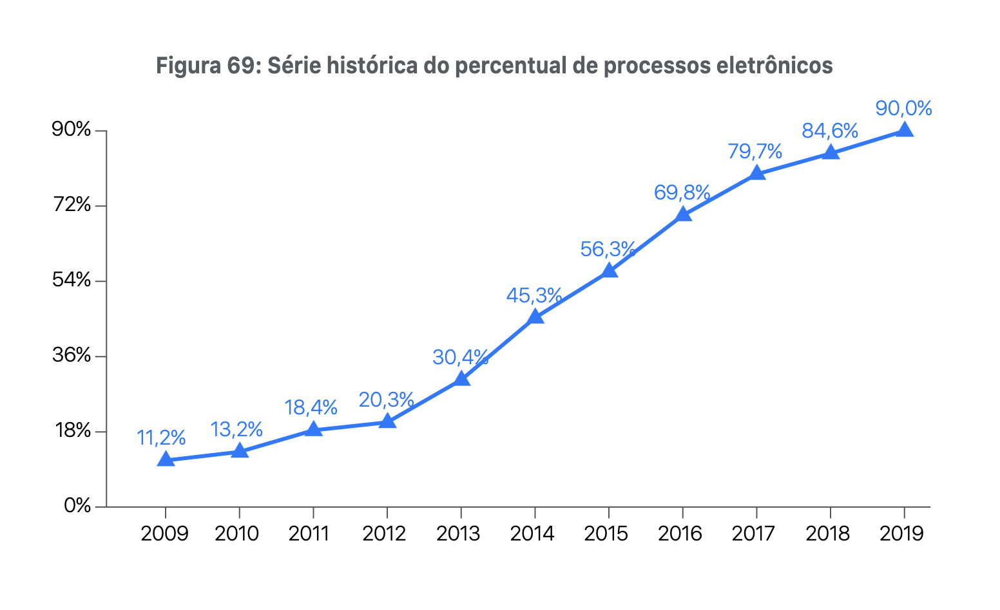
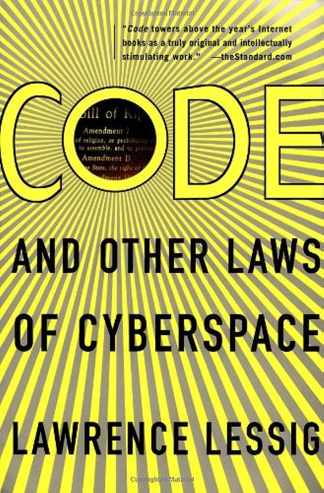

# Aula 1 – Direito e Tecnologia 
**Programação para Advogados – 2023.2**
José Luiz Nunes e Lucas Thevenard

---
<!-- 
paginate: true 
header: Aula 1 – Direito e Tecnologia 
footer: jose.luiz@fgv.br | lucas.gomes@fgv.br | 08/08/2023
-->

## Roteiro de aula
- O que é programação?
- Por que advogados precisam saber programar?
- Como vai funcionar o curso?

---

# 1. O que é programação?

---

## O que é "programar"
* A programação refere-se a um processo tecnológico para dizer a um computador quais tarefas executar a fim de resolver problemas. 
* Podemos pensar na programação como uma colaboração entre humanos e computadores, na qual:
  - os humanos criam instruções para um computador seguir (**código**) 
  - em uma linguagem que os computadores possam entender (**linguagem de programação**).

---

### O que é uma linguagem de programação?

---

---

---

## O papel de uma linguagem de programação

* O que o computador "entende"?
  - Código de máquina.
  - Extremamente complexo e inacessível para seres humanos.
* Qual é o papel de uma linguagem de programação.
  - Prover uma linguagem compreensível para que um ser humano possa dar instruções ao computador.
  - Ao ser executada, em algum momento terá de se tornar linguagem de máquina.
  * **Abstração**: processos computacionais complexos são "abstraídos" em conceitos mais simples que usamos ao programar.

---

---

---

---

## Voltando à definição...
- "A programação refere-se a um processo tecnológico para dizer a um computador quais tarefas executar a fim de resolver problemas."
  * Não se trata apenas de escrever o código.
    - O código (texto) pode importar menos do que o resultado a ser atingido.
    * Resolução do problemas envolve pensamento abstrato e depende de várias etapas:
      - Entender o problema.
      - Entender os passos necessários à solução do problema.
      - Decidir como implementar essas etapas em código.

---

# 2. Por que advogados precisam saber programar?

---

### A programação é uma nova forma de afalbetização?

---

## Coding Literacy (Douglas Rushkoff)

Quando adquirimos a linguagem, não apenas aprendemos a ouvir, mas também a falar. Quando adquirimos o texto, não apenas aprendemos a ler, mas também a escrever. Agora que temos computadores, estamos aprendendo a usá-los, mas não a programá-los. Quando não somos alfabetizados em código, precisamos aceitar os dispositivos e softwares que usamos com as limitações e agendas que seus criadores incorporaram neles.

---

## Coding Literacy (Douglas Rushkoff)

Mesmo sem optar por se tornar um profissional ou ser um desenvolvedor de software em tempo integral, entender como algo que afeta (quase) tudo ao nosso redor funciona é realmente importante para que não nos tornemos subordinados da tecnologia. O que o conceito de "coding literacy" também nos ensina não é apenas uma nova 'linguagem'. Programar nos ensina a pensar de maneiras diferentes, a identificar, decompor e resolver problemas, a reutilizar coisas que outros criaram e integrá-las ao nosso próprio processo de criação. Programar ensina habilidades que vão além do código, habilidades relacionadas à solução de problemas, ao design, à modelagem.

---

### Benefícios de programar
* **Dominar as ferramentas digitais** para:
  - Trabalhar de forma mais autônoma e eficiente (GUI vs. Code),
  - Automatizar tarefas repetitivas,
  - Produzir resultados melhores (usar dados para embasar decisões!).
* **Entender novas tecnologias** que transformam a sociedade e o Direito.
* Desenvolver **raciocínio lógico e capacidade de abstrair problemas**.

---

## Por que advogados precisam saber programar?
- Por que, cada vez mais, eles precisam:
  - **Dominar ferramentas digitais** e
  - **Entender novas tecnologias**.
- Advogados sempre precisaram também ter bom **raciocínio lógico e capacidade de abstrair problemas**.

---

### Importância das ferramentas digitais

---

##### **CNJ**, Relatório Justiça em Números de 2020, p. 115

---

---

##### **CNJ**, Relatório Justiça em Números de 2023, p. 19

---

## Iniciativas do Programa Justiça 4.0
* Implantação do Juízo 100% Digital e do Balcão Virtual;
* Desenvolvimento da Plataforma Digital do Poder Judiciário (PDPJ-Br), com possibilidade de ampliar o grau de automação do processo judicial eletrônico e o uso de o uso de inteligência artificial (IA);
* Colaboração para a implantação do sistema Codex, que tem duas funções principais:
alimentar o DataJud de forma automatizada e transformar em texto puro as decisões e
petições, a fim de ser utilizado como insumo de modelo de inteligência artificial.

---

---

---

---

## Prova OAB XXVIII (2019)

**Q12**. *Numerosas decisões judiciais, contrariando portarias de órgãos ambientais e de comércio exterior, concederam autorização para que sociedades empresárias pudessem
importar pneus usados.*

*Diante disso, o Presidente da República ingressa com Arguição de Descumprimento de Preceito Fundamental (ADPF), sustentando que tais decisões judiciais autorizativas da
importação de pneus usados teriam afrontado preceito fundamental, representado pelo direito à saúde e a um meio ambiente ecologicamente equilibrado.*

*A partir do caso narrado, indique qual das afirmativas a seguir está correta.*

---

**A**) A ADPF não se presta para impugnar decisões judiciais, pois seu objeto está adstrito às leis ou a atos normativos federais e estaduais de caráter geral e abstrato, assim entendidos aqueles provenientes do Poder Legislativo em sua função legislativa.

**B**) A ADPF tem por objetivo evitar ou reparar lesão a preceito fundamental resultante de ato do Poder Público, ainda que de efeitos concretos ou singulares; logo, pode impugnar decisões judiciais que violem preceitos fundamentais da Constituição, desde que observada a subsidiariedade no seu uso.

**C**) Embora as decisões judiciais possam ser impugnadas por ADPF, a alegada violação do direito à saúde e a um meio  ambiente ecologicamente equilibrado não se insere no conceito de preceito fundamental, conforme rol taxativo constante na Lei Federal nº 9.882/99.

**D**) A ADPF não pode ser admitida, pois o Presidente da República, na qualidade de chefe do Poder Executivo, não detém legitimidade ativa para suscitar a inconstitucionalidade de ato proferido por membros do Poder Judiciário, sob pena de vulneração ao princípio da separação dos poderes.

---

### [ChatGPT](https://chat.openai.com/)
##### [Respota anterior](https://chat.openai.com/share/1e9cf54f-4dc6-4e10-89ab-a2bbb82e2e15)

---

---

---

---

### [ChatGPT](https://chat.openai.com/)
##### [Respota anterior](https://chat.openai.com/share/950d927c-546d-41e3-a28d-df7d50e295f4)

---

### Importância de entender as novas tecnologias

---

## O direito "cibernético" é um "direito do cavalo"?

##### Frank Easterbrook

##### Lawrence Lessig

---

## Direito e Arquitetura
- **Lessig**: "*I agree that our aim should be courses that 'illuminate the entire law,' but unlike Easterbrook, I believe that there is an important general point that comes from thinking in particular about how law and cyberspace connect. This general point is about the limits on law as a regulator and about the techniques for escaping those limits.*"
  * **Direito e arquitetura**: 
    - Arquitetura do mundo físico como elemento que molda comportamentos e assim limita o Direito.
    - Exemplo do acesso a conteúdos impróprios por menores.

---

## Direito e Arquitetura
- **Lessig**: Formas de regulação do comportamento.
  * Direito,
  * Normas Sociais,
  * Mercado,
  * Arquitetura.
* **Direito e arquitetura**: 
  - Arquitetura do mundo físico como elemento que molda comportamentos e assim limita o Direito.
  - Exemplo do acesso a conteúdos impróprios por menores.

---

## Lessig: Code is Law

- **Code is Law**: a tecnologia cria arquiteturas que "regulam" a sociedade.
  * Uber regula o comportamento dos passageiros e motoristas durante a viagem.
  * YouTube, TikTok, Twitter (etc.) regulam os conteúdos postados em suas plataformas.
* **Law is Code**: Para regular essas atividades, o Direito deve cada vez mais entender a tecnologia.

---

## Direito e Tecnologia – alguns problemas contemporâneos

1. **Regulação da Inteligência Artificial e Aprendizagem de Máquinas**:
Como os governos estão lidando com as considerações éticas e impactos sociais da IA? Que leis estão sendo criadas para governar a tomada de decisões automatizada e a discriminação algorítmica?

1. **Direitos de Propriedade Intelectual na Era Digital**:
Como as leis de propriedade intelectual estão se adaptando ao avanço tecnológico dos meios digitais, software e internet? Isso inclui preocupações sobre direitos autorais, patentes e marcas registradas em uma paisagem digital em constante evolução.

---

## Direito e Tecnologia – alguns problemas contemporâneos

3. **Legislação de Cibersegurança e Cibercrime**:
Quais leis estão sendo desenvolvidas para combater ameaças cibernéticas? Essa área cobre tudo, desde ataques cibernéticos patrocinados pelo estado até hacking individual e cyberbullying, junto com os quadros legais necessários para processamento e prevenção.

4. **Privacidade e Proteção de Dados**:
Com a explosão da coleta e armazenamento de dados, como as leis estão evoluindo para proteger os direitos de privacidade dos indivíduos? Isso inclui tópicos como LGPD e outras regulamentações destinadas a proteger informações pessoais.

---

## Direito e Tecnologia – alguns problemas contemporâneos

5. **Desafios Legais da Blockchain e Criptomoedas**:
Quais questões legais estão surgindo com o crescimento das finanças descentralizadas e tecnologia blockchain? Isso inclui o status legal das criptomoedas, contratos inteligentes e como as leis tradicionais se aplicam a um mundo descentralizado.

6. **Regulação da Biotecnologia e Engenharia Genética**:
Como as leis estão sendo formuladas para supervisionar os rápidos avanços na biotecnologia, incluindo modificação genética, clonagem e medicina personalizada? Isso engloba considerações éticas e riscos potenciais tanto para os indivíduos quanto para o ambiente.

---

## Direito e Tecnologia – alguns problemas contemporâneos

7. **Acessibilidade e Tecnologia nos Processos Legais**:
Como a tecnologia está transformando o próprio processo legal? Isso inclui o uso de tribunais virtuais, documentação eletrônica e como a tecnologia pode tanto habilitar quanto dificultar o acesso à representação legal e justiça.

8. **Regulamentação das Redes Sociais e Plataformas Online**:
Como governos e sistemas legais estão lidando com a influência massiva das empresas de mídia social? Isso inclui debates sobre moderação de conteúdo, liberdade de expressão, desinformação e responsabilidades legais dos gigantes da tecnologia.

---

# 3. Como vai funcionar o curso?

---

## Estrutura do Curso
- As primeiras 3 aulas são teóricas.
  - Aula 1. Direito e Tecnologia
  - Aula 2. Como estudar o direito a partir de dados
  - Aula 3. Introdução à Ciência da Computação
- A partir da 4ª aula será um curso aplicado de programação.

---

## Como vai funcionar as aulas do curso de programação?
- Conteúdo organizado em **projetos**.
* **Primeira parte da aula**: 
  - Conceitos de programação e sintaxe apresentados por meio dos projetos.
* **Segunda parte da aula**:
  - Exercícios de fixação da sintaxe de programação utilizada. 
* **IMPORTANTE**: necessário interagir com o material ANTES da aula.

---

## Como esperamos que vocês estudem?
- Interagir com o material de apoio antes da aula.
- Comparecer e prestar atenção à parte expositiva da aula.
- Realizar os exercícios em aula (maior parte da nota)
- Realizar os exercícios para casa

---

## Nota
- 50% : Provas escritas presenciais sem consulta.
- 50% : Exercícios de fixação realizados em sala.
  - Possibilidade de faltar até 2 exercícios por prova (redistribuição dos pontos).
- +10% (extra) : Entrega de cadernos de exercícios entre as provas

---

### Acesse o link e responda ao breve formulário

### http://bit.ly/451ktJO

