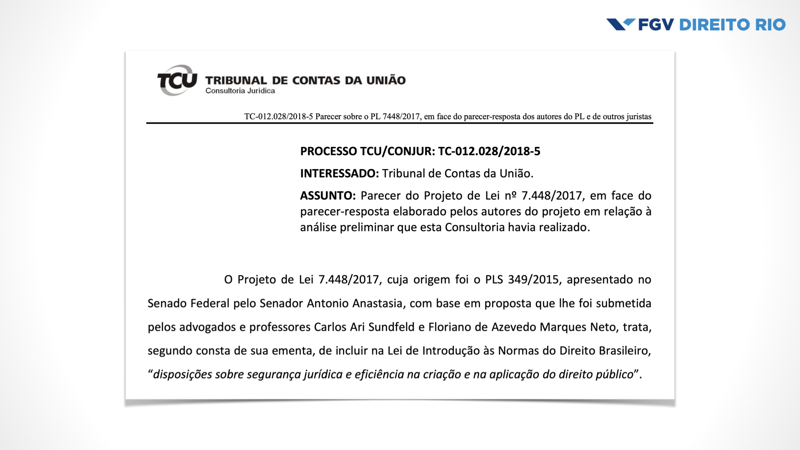
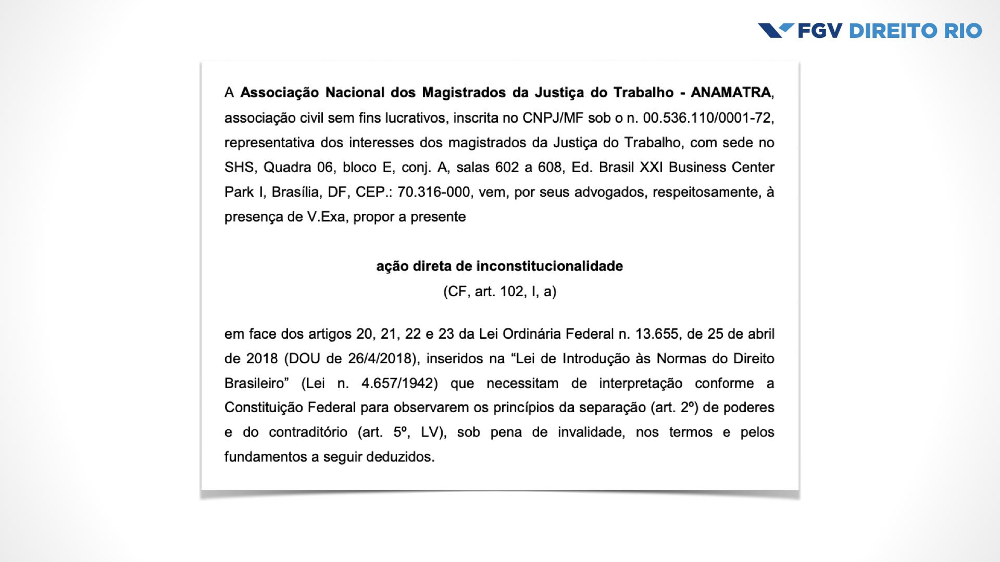

<style>
section {
  background-image: url(default_bg.png);
}
h1 {
  font-size: 200%;
  color: #003E7E;
}
h2 {
  font-size: 150%;
  color: #003E7E;
}
h3 {
  font-size: 150%;
  color: #003E7E;
}
header {
  color: #058ED0;
  font-size: 85%;
}
footer {
  color: black;
  font-size: 60%;
}
a {
  color: #058ED0;
}
strong {
  color: #003E7E;
}
blockquote {
  background: #f9f9f9;
  font-style: italic;
  font-family: Verdana;
  font-size: 80%;
  line-height: 170%;
  border-left: 10px solid #ccc;
  margin: 1.5em 20px;
  padding: 1.2em 30px;
  quotes: "\201C""\201D""\2018""\2019";
}
blockquote p {
  display: inline;
}
section::after {
  content: attr(data-marpit-pagination) ' / ' attr(data-marpit-pagination-total);
  color: #003E7E;
  font-size: 60%;
}
</style>


# Aula 2 - O Direito e suas consequências
#### Teoria da Decisão – 2023.1
Lucas Thevenard

---
<!-- 
paginate: true 
header: Aula 2 - O Direito e suas consequências
footer: lucas.gomes@fgv.br | 28/02/2023
-->


### Observação
- Recapitulando algumas orientações pedagógicas...
- Horário de atendimento:
  - Terças, das 8:00 às 9:00.
  - E-mails: [lucas.gomes@fgv.br](mailto:lucas.gomes@fgv.br)
- Roteiro do curso > I. Teoria da Decisão, consequencialismo e Direito > Aula 2 – O Direito e suas consequências: tipos de consequencialismo jurídico

---

## Recapitulando...
* Definição de Teoria da Decisão (5 elementos)
* Direito vs. consequencialismo
  * Incompatibilidade? (Passado vs. Futuro)
* **Compatibilidade**: 4 argumentos
  * Juízes pautam suas decisões por consequências (pesquisa AMB);
  * Há previsão no Direito Posto (LINDB, arts. 5º e 20);
  * Métodos tradicionais de exegese jurídica exigem considerações consequencialistas (proporcionalidade em sentido estrito);
  * Decisões jurídicas podem produzir substanciais efeitos no mundo (exemplo do texto?).

---

> "Se, portanto, por um lado, parece haver boas razões conceituais ou econômicas para evitar considerações consequencialistas em processos reais de tomada de decisão jurídica, parece, por outro, inevitável que o direito conviva com raciocínios dessa natureza. Pensar o raciocínio jurídico — com especial destaque para o raciocínio judicial — de uma maneira metodologicamente rigorosa a partir de uma perspectiva consequencialista se faz necessário, por isso, para além de disputas normativas ou conceituais sobre o direito ou o tipo de postura decisória judicial desejável em um estado de direito (ainda que não independentemente delas). É essa visão que nos leva à teoria da decisão."
> Leal, p. 89

---

## Recapitulando...
* **Limpando o terreno**:
  * Consequências jurídicas vs. consequências fáticas (“efeitos no mundo”)
  * Consequencialismo não é… utilitarismo, AED, etc.
  * Apenas um tipo de argumento.
* **Estrutura**:
  - _Ponto de vista_: A ação X é desejável
  - _Porque_: A ação X produz a consequência Y (afirmação empírica/positiva)
  - _E_: A consequência Y é desejável (afirmação normativa)

---

## Roteiro de aula
* Desafios dos argumentos consequencialistas
* Posturas consequencialistas

---


# 1. Desafios dos argumentos consequencialistas

---

## Algumas perguntas difíceis...
- Por que e quando utilizar argumentos consequencialistas?
- Argumentos consequencialistas _contra legem_ são legítimos?
- É possível ser um consequencialista rigoroso?
- É **racional** tentar sê-lo? Quais são as **consequências do consequencialismo?**

---

Alexandre Aragão, [Simpósio “LINDB e Administração Pública](https://www.youtube.com/watch?v=uK3E5CJA7Y8)” (EMERJ, 16/08/2019) 

> “De que pressuposto epistemológico/científico partia a LINDB [antes da reforma]? Do pressuposto de que a atividade de interpretação e aplicação do Direito era uma atividade declaratória e de que o Direito era um ramo do conhecimento que se bastava a si próprio: o Direito como uma ciência pura. Questões econômicas, estatísticas e sociais não interessavam ao Direito. Poderiam até inspirar o legislador, mas após a positivação da regra, não interessavam mais ao Direito. (…) A interpretação e aplicação do Direito era vista como uma atividade meramente cognoscitiva, ou seja, de apenas conhecer e revelar o conteúdo que já estava na Lei."

---

Alexandre Aragão, [Simpósio “LINDB e Administração Pública](https://www.youtube.com/watch?v=uK3E5CJA7Y8)” (EMERJ, 16/08/2019) 

> "O que a LINDB nova muda como pressuposto é que ela assume a interpretação do Direito como uma atividade volitiva, de exercício de vontade, de conteúdo criativo. E, assumindo essa natureza inevitável da atividade de interpretação e aplicação do Direito, ela passa a disciplinar como essa criação do Direito no caso concreto – especialmente pelo Judiciário, na hora de aplicar as leis – deve ser exercida.”

---

## Qual é a função da interpretação jurídica?
* Direito como...
  * promotor de segurança e estabilizador social de expectativas normativas.
* _De lege data_ VS. _de lege ferenda_

---

Alexandre Aragão, [Simpósio “LINDB e Administração Pública](https://www.youtube.com/watch?v=uK3E5CJA7Y8)” (EMERJ, 16/08/2019) 

> “O artigo 20, parágrafo único dispõe que as medidas judiciais – isso aqui, os juízes estão com muito medo disso aqui – que as medidas judiciais devem ser comparadas com outras medidas em tese possíveis. Eu já estive em alguns eventos aqui de juízes e eles estão preocupados: ‘mas aí a gente vai ter que ficar imaginando as outras alternativas?’ ‘Nós vamos ter capacidade institucional de ficar cogitando que outras medidas, em tese, seriam possíveis, e aí ponderar uma relação de custo e benefício de cada uma delas, em relação à que eu pretendo tomar na sentença, ou na liminar’? Está-se construindo de colocar com a parte esse ônus, de certa maneira probatório, de que aquela medida judicial pleiteada, comparada com outras, é a que tem as consequências práticas também menos onerosas.”

---



---

[**TCU: Parecer TC-012.028/2018-5**](https://cdn.oantagonista.net/uploads/2018/04/PL-7448-2017-Inteiro-teor-Altera-LINDB-Parecer-Conjur-2018-04-20.pdf)

> "Em face do todo o exposto, entendemos que a insegurança jurídica e a ineficiência da Administração Pública não são problemas que se resolvem com a criação de critérios de interpretação das normas, especialmente quando referidos critérios, pela sua textura aberta, trazem grande potencial para promover o efeito inverso do desejado, ou seja, mais insegurança jurídica e ineficiência." 

---


---

[**STF: Anamatra impugna dispositivos da Lei de Introdução às Normas do Direito Brasileiro que afrontam independência judicial**](https://www.anamatra.org.br/imprensa/noticias/28173-stf-anamatra-impugna-dispositivos-da-lei-de-introducao-as-normas-do-direito-brasileiro-que-afrontam-independencia-judicial)

> "(...) os artigos 20 a 23 da Lei n. 13.655/18, inseriram normas na LINDB que estão impondo, como condição de validade de algumas decisões judiciais, a indicação (a) das consequências práticas destas, (b) das alternativas existentes, (c) dos obstáculos e dificuldades ao cumprimento por agentes públicos, e (d) de regime de transição."
> "Da mesma forma, estão impondo que os magistrados atuem sem provocação das partes e em substituição tanto ao Poder Executivo (administração pública) para atuar em nítido caráter consultivo, como ao Poder Legislativo (para legislar no caso concreto), o que exorbita da atividade jurisdicional e das competências do Poder Judiciário."


---

## Componentes e dimensões de argumentos consequencialistas
* **Dimensões**:
  * Positiva: quais são as consequências das alternativas de ação disponíveis?
  * Normativa: quais consequências são mais ou menos desejáveis?
* **Componentes**:
  * Alternativas de ação (dimensão positiva)
  * Consequências vinculadas às alternativas (dimensão positiva)
  * Relação de preferência entre as consequências (dimensão normativa)

---

## Componentes e dimensões de argumentos consequencialistas

```
                       A.1  –––––––––>  C.1

                                         >

                       A.2  –––––––––>  C.2
```

**Descrição**: 2 alternativas de decisão (A1, A2) associadas com setas a 2 consequências (C1, C2) ordenadas quanto às preferências do decisor (C1 > C2).

---

## Problemas da Dimensão Positiva
- Especificação de problemas decisórios
  - Identificação das alternativas de decisão
  - Identificação das possíveis consequências/eventualidades
- Desconhecimento do futuro: erros de prognose
- Cadeias de eventos e a falácia do efeito-dominó

---

## Como vocês escolheram estudar direito?
* Consideraram as todas as alternativas decisórias?
* Analisaram as consequências possíveis dessas alternativas?
* Como escolheram organizar o processo decisório?
  * Até quando buscar mais informações?
  * Qual horizonte de tempo deve ser considerado?
  * Como simplificar o problema decisório? O que é relevante?

---

## Dilema da especificação de problemas decisórios
- Resnik: Campanha de vacinação contra a gripe suína nos EUA em 1975.
  - Especialistas não consideraram a hipótese que ocorreu: a vacina paralizou uma parte da população.

---

## Dilema da especificação de problemas decisórios
* **Resnik**: A questão acerca de como devemos especificar um problema decisório é, em si, um problema decisório.
  * Decisão de segunda ordem: 
    * Como aplicar a TD ao problema de como decidir? Como aplicar a TD ao problema de como decidir como decidir? E assim por diante ...
  * Redução ao infinito: limite lógico objetivo à possibilidade de se fundamentar racionalmente uma decisão.

---

### O desconhecimento do futuro
* Luhmann: assimetria fundamental entre o 'presente futuro' e o 'futuro presente'.
  * Integração temporal: perspectivas fenomenológica e modal da temporalidade
  * Presente futuro: Star Trek, cartões dos chocolates Hildebrand, etc.

---

### Como o Supremo afetará a economia brasileira se considerar os planos econômicos inconstitucionais?

- Efeitos estimados variavam de R$ 2,5 bilhões a R$ 1 trilhão à época da decisão (Leal).
  - IDEC: [R$ 8,4 bilhões](https://idec.org.br/o-idec/sala-de-imprensa/release/idec-demonstra-que-bancos-devem-r-8-4-bi-em-aces-de-planos-economicos)
  - PGR: [R$ 24 bilhões](https://www.conjur.com.br/2014-jul-18/pgr-entregara-segunda-feira-calculo-planos-economicos)
    - Obs: [PGR reduz em R$ 420 bi estimativa de lucro de bancos durante planos](https://g1.globo.com/economia/noticia/2014/07/pgr-reduz-em-r-420-bi-estimativa-de-lucro-de-bancos-com-planos.html)
  - Febraban: [R$ 149 bilhões](https://www.conjur.com.br/2016-ago-12/impacto-planos-economicos-bilhoes-advogado)
  - Bacen: [R$ 1 trilhão](https://www.conjur.com.br/2014-jul-18/pgr-entregara-segunda-feira-calculo-planos-economicos)
- Comportamentos oportunísticos? Argumentos _ad terrorem_?

---

**REsp 363.943, voto min. Humberto Gomes de Barros**

> Cheguei a essa conclusão, após receber um pedido de medida cautelar, formulado por um pequeno município do Estado do Rio de Janeiro, no propósito de proibir a empresa de eletricidade local, de cortar o fornecimento de energia elétrica a qualquer residência localizada no território do Município, cujo morador deixasse de pagar a conta de luz. A teor da petição, o corte, em tal circunstância, traduziria atentado à dignidade humana.
> Neguei a liminar, com o argumento de que a proibição acarretaria aquilo a que se denomina “efeito dominó”. Com efeito, ao saber que o vizinho está recebendo energia de graça, o cidadão tenderá a trazer para si o tentador benefício. Em pouco tempo, ninguém mais honrará a conta de luz.

---

**REsp 363.943, voto min. Humberto Gomes de Barros**

> Ora, se ninguém paga pelo fornecimento, a empresa distribuidora de energia não terá renda. Em não tendo renda, a distribuidora não poderá adquirir os insumos necessários à execução dos serviços concedidos e, finalmente, entrará em insolvência. Falida, a concessionária, interromperia o fornecimento a todo o município, deixando às escuras, até a iluminação pública. (...)

---


**REsp 363.943, voto min. Humberto Gomes de Barros**

> Com efeito, a distribuição de energia é feita, em grande maioria, por empresas privadas que não estão obrigadas a fazer benemerência em favor de pessoas desempregadas. A circunstância de elas prestarem serviços de primeira necessidade não as obriga ao fornecimento gratuito. Ninguém se anima em afirmar que as grandes redes de supermercados e as farmácias – fornecedoras de alimentos e medicamentos – devem entregar gratuitamente, suas mercadorias aos desempregados. O corte é doloroso, mas não acarreta vexame. Vergonha maior é o desemprego e a miséria que ele acarreta. Em linha de coerência, deveríamos proibir o patrão de despedir empregados. O fornecimento gratuito de bens da vida constitui esmola. Negamos empregos a nosso povo e o apascentamos com esmolas. Nenhuma sociedade pode sobreviver, com seus integrantes vivendo de esmolas.

---

## Recapitulando: problemas da dimensão positiva
* Especificação de problemas decisórios
  * Identificação das alternativas de decisão
  * Identificação das alternativas possíveis
* Desconhecimento do futuro: erros de prognose
* Cadeias de eventos e a falácia do efeito-dominó

---

## Problemas da dimensão normativa
* Seleção dos critérios de valoração
* Definição do sentido concreto desses critérios
* Resolução de conflitos entre os critérios escolhidos

---

## Voltando ao problema da escolha da carreira
- Seleção dos critérios de valoração
- Definição do sentido concreto desses critérios
- Resolução de conflitos entre os critérios escolhidos

---


# 2. Posturas consequencialistas

---

## Ser ou não ser?
- Só há uma forma de adotar argumentos consequencialistas?
- Argumentos consequencialistas são necessariamente _contra legem_?
- Em quais circunstâncias é possível usar argumentos consequencialistas?

---

## Classificações das posturas consequencialistas: 
* Quanto à **adequação à legislação vigente**
  - Consequencialismo _Secundum legem_;
  - Consequencialismo _Praeter legem_;
  - Consequencialismo _Contra legem_.
* Quanto ao **peso na fundamentação da decisão**
  - Consequencialismo forte;
  - Consequencialismo fraco;
  - Consequencialismo residual.

---

## Quanto à adequação à legislação vigente
- Analogia com o caso dos costumes (fonte do Direito):

  - **Costumes _Secundum legem_**: A lei estipula a observância de costumes.
  - **Costumes _Praeter legem_**: A lei não prevê solução para o caso, surge a necessidade de preencher lacunas legais.
  - **Costumes _Contra legem_**: Uso dos costumes contra lei que ainda estaria formalmente vigente, quando a lei cai em completo desuso.

---

## Quanto à adequação à legislação vigente
- **Consequencialismo _Secundum legem_**: Análise das consequências está prevista em lei.
- **Consequencialismo _Praeter legem_**: A lei não prevê solução para o caso, surge a necessidade de preencher lacunas legais.
- **Consequencialismo _Contra legem_**: Decisão baseia-se em argumentos consequencialistas ainda que estes estejam em contradição com a lei.

---

## Quanto ao peso na fundamentação da decisão
* **Consequencialismo forte**:
  * [Leal, 2018](https://www.publicacoes.uniceub.br/RBPP/article/view/4779): “... uma decisão é adequada se, e somente se, não se encontra uma decisão alternativa cujas consequências sejam preferíveis às suas...”
    * Quais tipos de argumentos, quanto à adequação à legislação, um consequencialista forte pode fazer?

---

## Quanto ao peso na fundamentação da decisão
* **Consequencialismo fraco**:
  * [Leal, 2018](https://www.publicacoes.uniceub.br/RBPP/article/view/4779): “... as consequências podem ser utilizadas ao lado de outros argumentos institucionais, mas nunca com peso superior a esses ...”
    * Quais tipos de argumentos, quanto à adequação à legislação, um consequencialista fraco pode fazer?

---

## Quanto ao peso na fundamentação da decisão
* **Consequencialismo residual**:
  * [Leal, 2018](https://www.publicacoes.uniceub.br/RBPP/article/view/4779): “... as consequências exercem um papel residual nas decisões, sendo utilizadas, somente, quando argumentos institucionais não forem capazes de determinar uma solução ...”
    * Quais tipos de argumentos, quanto à adequação à legislação, um consequencialista residual pode fazer?

---

## Gradação de possibilidade de tensão com o Estado de Direito
* Nível de tensão:
  * Contra legem > praeter legem > secundum legem
  * Forte > fraco > residual
* O que pode gerar situações de tensão são cenários em que as consequências sejam muito sensíveis, estimulando a adoção de posturas fortes e argumentos _contra legem_.


---

**Adicionamos mais uma argumento à defesa da compatibilidade entre consequencialismo e Estado de Direito**
* 5 argumentos pela compatibilidade
  * Juízes pautam suas decisões por consequências (pesquisa AMB);
  * Há previsão no Direito Posto (LINDB, arts. 5º e 20);
  * Métodos tradicionais de exegese jurídica exigem considerações consequencialistas (proporcionalidade em sentido estrito);
  * Decisões jurídicas podem produzir substanciais efeitos no mundo;
  * **Posturas consequencialistas podem ser adequadas à legislação (secundum legem e praeter legem) e compatíveis com argumentos institucionais (consequencialismo fraco e residual).**

---

## Questão de prova do semestre passado
Considere o seguinte trecho do voto proferido pelo ministro Celso de Mello no MS 25.668-1/DF:

> “É, portanto, com apoio na Constituição e nas leis – e não na busca pragmática de resultados – que se deverá promover a solução do justo equilíbrio entre as relações de tensão que emergem do estado de permanente conflito entre o princípio da autoridade, de um lado, e o valor da liberdade e dos demais direitos e garantias individuais, do outro."

---

> "O que simplesmente se revela intolerável – e não tem sentido, por divorciar-se dos padrões ordinários de submissão à rule of law [no sentido de Estado de Direito] – é a insinuação, de todo paradoxal, contraditória e inaceitável, de que o respeito pela autoridade da Constituição e das leis configuraria fator ou elemento de frustração da eficácia da investigação social” (grifos no original)."

**A)**	A partir da afirmação do ministro do Supremo Tribunal Federal e com base nas discussões travadas em sala, apresente dois argumentos capazes de justificar por que não é possível assumir facilmente que existe uma relação de tensão necessária entre Estado de direito e a “busca pragmática de resultados” levada adiante por juízes. (**2,0 pontos**)

---

## ADI-4/1991

- **CF-88, Art. 192, § 3º** (redação à época) As taxas de juros reais, nelas incluídas comissões e quaisquer outras remunerações direta ou indiretamente referidas à concessão de crédito, não poderão ser superiores a doze por cento ao ano; a cobrança acima deste limite será conceituada como crime de usura, punido, em todas as suas modalidades, nos termos que a lei determinar.
- **Parecer SR nº 70/1988** – o § 3º do art. 192 não tem eficácia plena e aplicabilidade imediata.

---

**Parecer SR nº 70/1988**
> “Neste momento da vida nacional, a economia encontra-se sob forte turbulência inflacionária, con seqüente de antiga patologia financeira que se arras ta há mais de dez anos, impulsionada por várias causas, contra as quais o atual Governo vem lutando com tenacidade para evitar, a todo o custo, a hiperinflação e, a médio prazo, para baixar as taxas deste mons tro desintegrador dos equilíbrios sociais.
> “(…) a taxa de juros de uma economia capitalista deve refletir a taxa de retorno esperada dos diversos segmentos que a compõem, bem como as expectativas e, de modo geral, as forças de mercado, sob o risco de impor distorções ou gerar desvios de conseqüências mais nefastas que o 'mal' que se pretende combater com a fixação.” 

---

**Parecer SR nº 70/1988: consequências imediatas**
- desintermediação financeira;
- perda de transparência;
- desestímulo à poupança financeira;
- estímulo ao endividamento;
- fuga de capitais para operações especulativas;
- dificuldade na condução da política monetária pelo Bacen;
- aumento do risco de hiperinflação;
- incompatibilidade com o sistema de taxas flutuantes que vigora no mercado financeiro internacional, 
- entre outras (...)

---

## Resultado da ADI-4/1991

- O STF decidiu que o § 3º do art. 192 **não tem aplicabilidade plena e imediata**.
- Justificativa jurídica: o termo “juros reais” não está legalmente disciplinado, é necessário editar uma lei complementar para que a norma constitucional possa ser aplicada.


---


**Voto do Ministro Carlos Velloso**

> “Os estudiosos de hermenêutica constitucional ensinam que as normas constitucionais que contenham vedações, proibições ou que declarem direitos são, de regra, de eficácia plena.  (…)
> De outro lado, pode ocorrer que uma norma constitucional se refira a instituto de conceito jurídico indeterminado. Isto tornaria inaplicável a norma constitucional? Não. É que a norma dependeria, apenas, de "interpretação capaz de precisar e concretizar o sentido de conceitos jurídicos indeterminados", interpretação que daria à norma "sentido operante, atuante” (…).
> É o caso da "taxa de juros reais" inscrita no § 3o do art. 192 da Constituição, que tem conceito jurídico indeterminado, e que, por isso mesmo, deve o juiz concretizar-lhe o conceito, que isto constitui característica da função jurisdicional (…)” 
