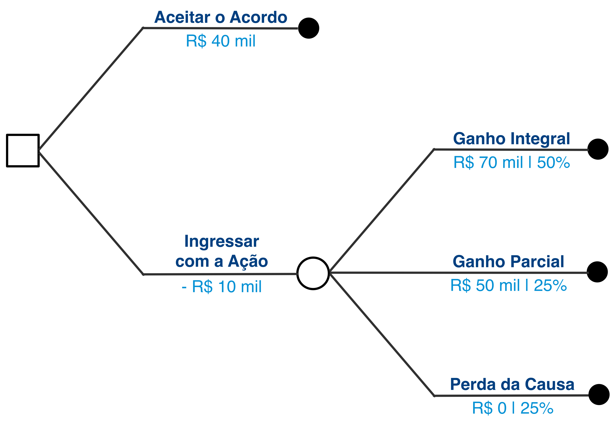
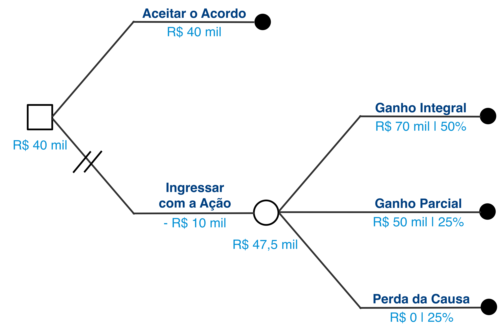
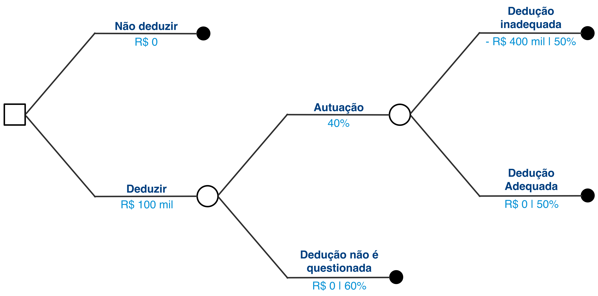
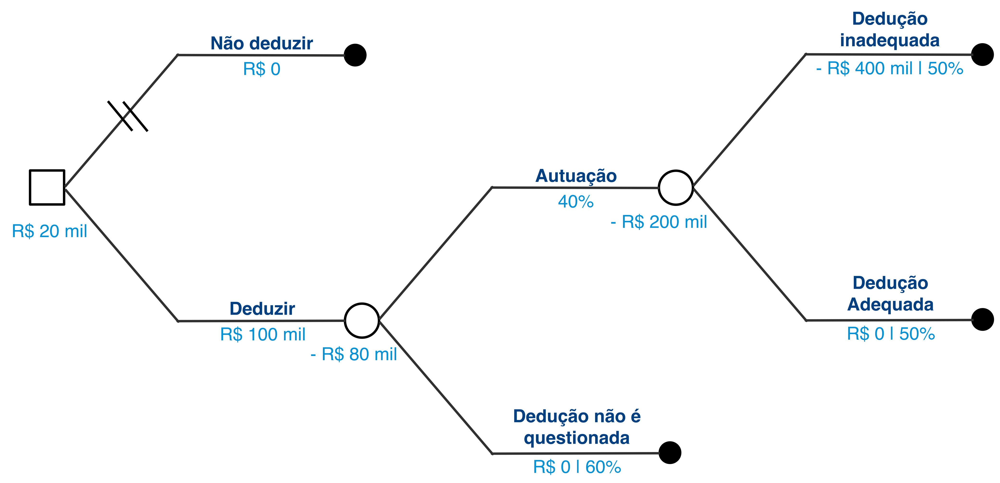
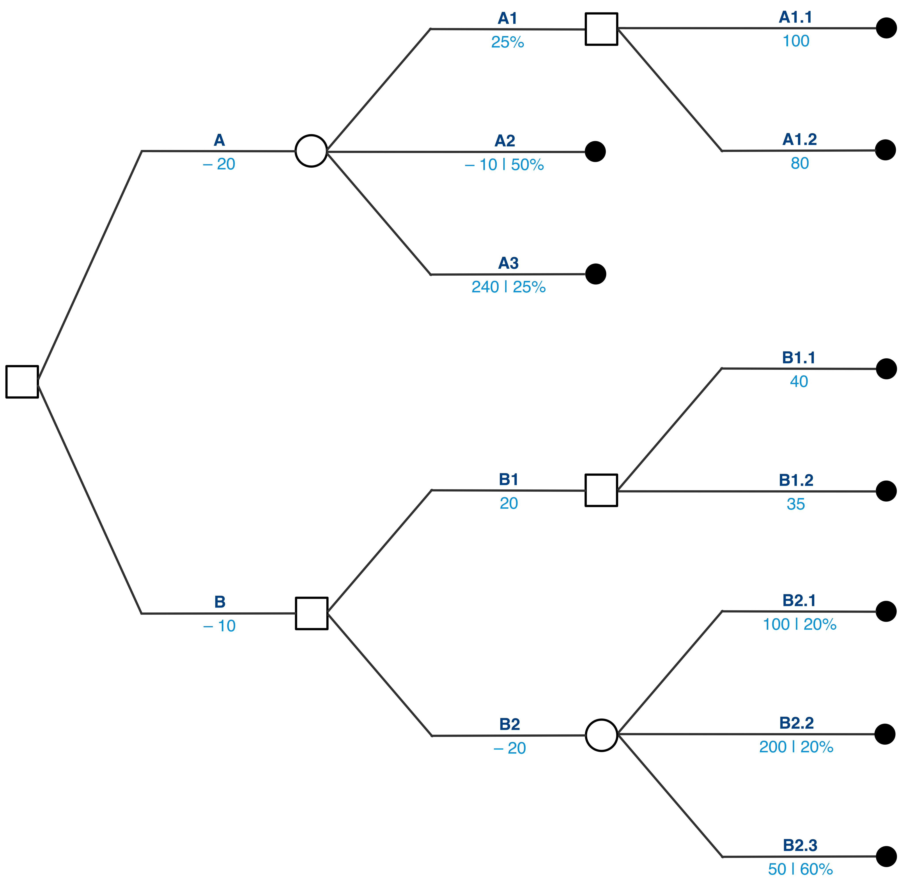
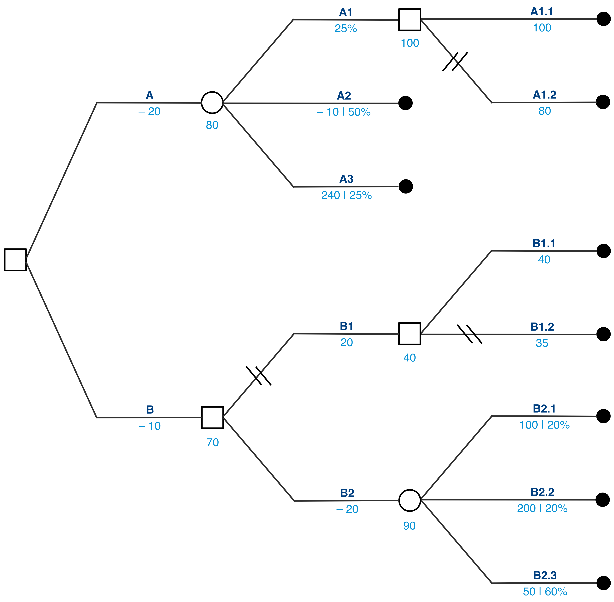
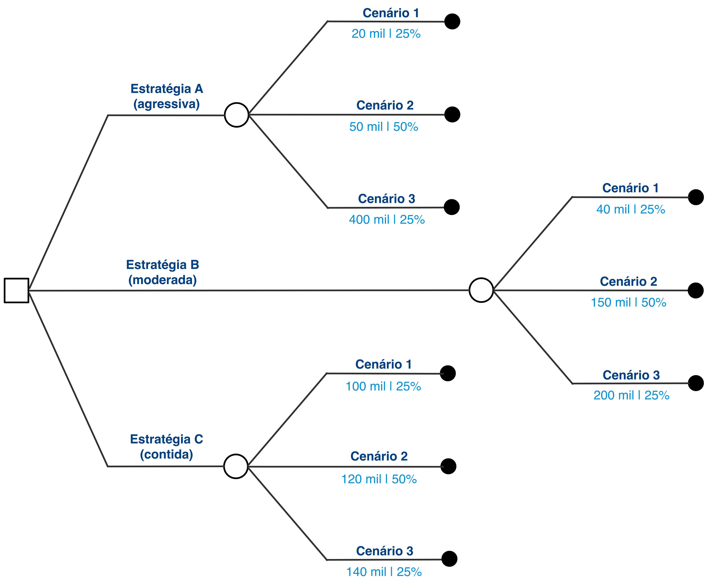
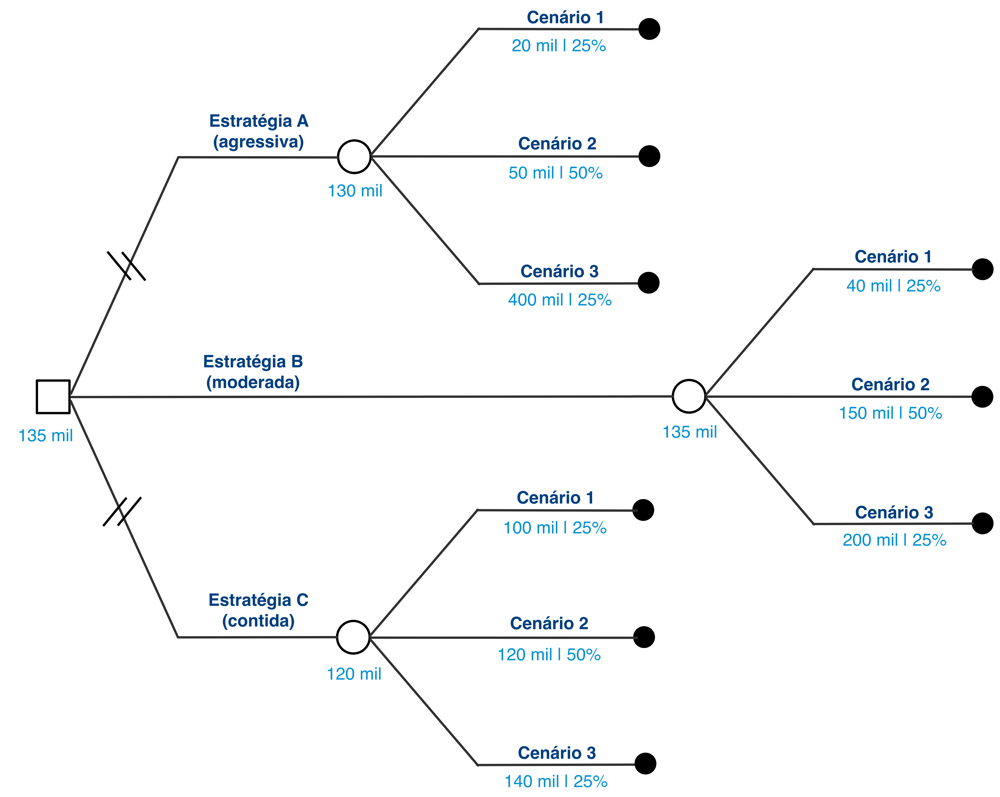

# Aula 4 – Decisão Racional sob Condições de Ignorância I 
**Teoria da Decisão – 2023.1**
Lucas Thevenard

---
<!-- 
paginate: true 
header: Decisão Racional sob Condições de Ignorância I
footer: lucas.gomes@fgv.br | 14/03/2023
-->

# Respostas dos exercícios

---

## Exercício 1: Acidente de trânsito
- Ganho de causa integral: R$ 70.000,00 | 50% de chance
- Ganho de causa parcial: R$ 50.000,00 | 25% de chance
- Chance de perder a causa: 25%
- Ação custa R$ 10.000,00
- Acordo oferecido: R$ 40.000,00
- O que fazer?

---

---

### Valor Esperado
 

$$(0,5 \times 70) + (0,25 \times 50) + (0,25 \times 0)$$
 

$$35 + 12,5 + 0 = 47,5$$
---

---

## Exercício 2: Conselho Tributário
- Dedução pouparia R$ 100 mil.
- Autuação (40% de chance):
  - Inadequação da dedução (50% de chance):
    - Restituir o valor deduzido;
    - Pagar uma multa no valor de R$ 300.000,00.

---

---

### Autuação
 

$$(0,5 \times - 400) + (0,6 \times 0) = -200$$
 

### Deduzir
 

$$(0,4 \times -200) + (0,6 \times 0) = -80$$

---

---

<!-- 
paginate: false 
header: ''
footer: ''
-->

---

<!-- 
paginate: true 
header: Decisão Racional sob Condições de Ignorância I
footer: lucas.gomes@fgv.br | 14/03/2023
-->

### Exercício 3
 

$$(0,25 \times 100) + (0,5 \times -10) + (0,25 \times 240)$$
$$25 - 5 + 60 = 80$$
 

$$(0,2 \times 100) + (0,2 \times 200) + (0,6 \times 50)$$
$$20 + 40 + 30 = 90$$

---

<!-- 
paginate: false 
header: ''
footer: ''
-->

---

<!-- 
paginate: true 
header: Decisão Racional sob Condições de Ignorância I
footer: lucas.gomes@fgv.br | 14/03/2023
-->

## Roteiro da aula

* **Modelo de Decião Racional sob Condição de Ignorância (MDRI)**
  * Maximin
  * Minimax
  * Regra do Otimismo
  * Postulado da Razão Insuficiente

---

## Recapitulando: Certeza, Risco, Ignorância
- **Certeza** – consequências unívocas e certas para cada alternativa de decisão.
- **Risco** – pode haver múltiplos Estados do Mundo associados a uma alternativa de decisão, mas conseguimos estimar as probabilidades.
- **Ignorância** – não conseguimos estimar as probabilidades para os Estados do Mundo, apenas avaliar quais resultados são mais ou menos desejáveis.

#### Obs: nomenclaturas variam (diferentes usos do termo 'incerteza').

---

### Vamos voltar ao exemplo da compra do imóvel e representá-lo na forma normal, sem as probabilidades
 

Alternativas         | B está contaminado | B não está contaminado
---------------------|:------------------:|:----------------------:
Compra imediata de A | - R$ 300 mil       | - R$ 300 mil 
Compra imediata de B | - R$ 400 mil       | - R$ 200 mil
Teste Prévio         | - R$ 345 mil       | - R$ 245 mil 

#### **E agora, como decidir?**

---

## Métodos de decisão sob ignorância
* **Maximin**: Escolho a alternativa que tem o melhor "pior caso". Ou seja, minimizo as minhas chances de me dar muito mal.
* **Minimax**: Escolho a alternativa que tem menos chances de me causar muito arrependimento. Ou seja, escolho o menor nivel máximo de arrependimento.
* **Regra do otimismo**: Avalio o melhor e o pior resultado de cada alternativa com base em um "nível de otimismo".
* **Postulado da razão insuficiente**: Partindo da suposição de que todas os EDMs têm a mesma chance de ocorrer, comparamos o valor médio das alternativas.

---

# 1. Maximin

_Escolho a alternativa que tem o melhor "pior caso". Ou seja, minimizo as minhas chances de me dar muito mal._

---

### Maximin
 

Alternativas         | B está contaminado | B não está contaminado
---------------------|:------------------:|:---------------------:
Compra imediata de A | - R$ 300 mil       | - R$ 300 mil
Compra imediata de B | - R$ 400 mil       | - R$ 200 mil
Teste Prévio         | - R$ 345 mil       | - R$ 245 mil

---

### Maximin
 

Alternativas         | B está contaminado | B não está contaminado
---------------------|:------------------:|:---------------------:
Compra imediata de A | **- R$ 300 mil ✶** | **- R$ 300 mil ✶** 
Compra imediata de B | **- R$ 400 mil ✶** | - R$ 200 mil
Teste Prévio         | **- R$ 345 mil ✶** | - R$ 245 mil

---

### Maximin
 

Alternativas | B está contaminado | B não está contaminado
-|:-:|:-:
**Compra imediata de A  ✶✶** | **- R$ 300 mil ✶** | **- R$ 300 mil ✶** 
Compra imediata de B         | **- R$ 400 mil ✶** | - R$ 200 mil
Teste Prévio                 | **- R$ 345 mil ✶** | - R$ 245 mil

 

#### **Solução (Maximin)**: Compra imediata de A

---

## Maximin

- **Definição**: Escolho a alternativa que tem o melhor "pior caso". Ou seja, minimizo as minhas chances de me dar muito mal.
- **Método Léxico**: resolução progressiva dos casos de 'empate' entre piores cenários (considerando o próximo pior cenário).

---

### Maximin
 

Alternativas | EDM1 | EDM2 | EDM3
:-----------:|:----:|:----:|:----:
A            | 4    | 6    | 8 
B            | 8    | 4    | 5
C            | 3    | 4    | 13

---

### Maximin
 

Alternativas | EDM1       | EDM2    | EDM3
:-----------:|:----------:|:-------:|:----:
A            | **4 ✶**    | 6       | 8 
B            | 8          | **4 ✶** | 5
C            | **3 ✶**    | 4       | 13

---

### Maximin
 

Alternativas     | EDM1       | EDM2    | EDM3
:---------------:|:----------:|:---------:|:----:
A                | ~~- 4 -~~  | 6         | 8 
B                | 8          | ~~- 4 -~~ | 5
~~- C  -~~       | ~~- 3 -~~  | ~~- 4 -~~ | ~~- 13 -~~

---

### Maximin
 

Alternativas | EDM1       | EDM2    | EDM3
:-----------:|:----------:|:---------:|:----:
A            | ~~- 4 -~~  | **6 ✶**   | 8 
B            | 8          | ~~- 4 -~~ | **5 ✶**
~~- C  -~~   | ~~- 3 -~~  | ~~- 4 -~~ | ~~- 13 -~~

---

### Maximin
 

Alternativas | EDM1       | EDM2    | EDM3
:-----------:|:----------:|:---------:|:----:
**A ✶✶**     | ~~- 4 -~~  | **6 ✶**   | 8 
B            | 8          | ~~- 4 -~~ | **5 ✶**
~~- C  -~~   | ~~- 3 -~~  | ~~- 4 -~~ | ~~- 13 -~~

 

#### **Solução (Maximin Léxico)**: A

---

### Maximin
 

Alternativas | EDM1 | EDM2 | EDM3 | EDM4
:-----------:|:----:|:----:|:----:|:----:
A            | 2    | 40   | 50   | 12
B            | 12   | 7    | 10   | 5
C            | 4    | 3    | 8    | 10
D            | 8    | 8    | 9    | 5

---

### Maximin
 

Alternativas | EDM1    | EDM2    | EDM3 | EDM4
:-----------:|:-------:|:-------:|:----:|:----:
A            | **2 ✶** | 40      | 50   | 12
B            | 12      | 7       | 10   | **5 ✶**
C            | 4       | **3 ✶** | 8    | 10
D            | 8       | 8       | 9    | **5 ✶**

---

### Maximin
 

Alternativas | EDM1      | EDM2       | EDM3       | EDM4
:-----------:|:---------:|:----------:|:----------:|:----------:
~~- A -~~    | ~~- 2 -~~ | ~~- 40 -~~ | ~~- 50 -~~ | ~~- 12 -~~
B            | 12        | 7          | 10         | ~~- 5 -~~
~~- C -~~    | ~~- 4 -~~ | ~~- 3 -~~  | ~~- 8 -~~  | ~~- 10 -~~
D            | 8         | 8          | 9          | ~~- 5 -~~

---

### Maximin
 

Alternativas | EDM1      | EDM2       | EDM3       | EDM4
:-----------:|:---------:|:----------:|:----------:|:----------:
~~- A -~~    | ~~- 2 -~~ | ~~- 40 -~~ | ~~- 50 -~~ | ~~- 12 -~~
B            | 12        | **7 ✶**    | 10         | ~~- 5 -~~
~~- C -~~    | ~~- 4 -~~ | ~~- 3 -~~  | ~~- 8 -~~  | ~~- 10 -~~
D            | **8 ✶**   | **8 ✶**    | 9          | ~~- 5 -~~

---

### Maximin
 

Alternativas | EDM1      | EDM2       | EDM3       | EDM4
:-----------:|:---------:|:----------:|:----------:|:----------:
~~- A -~~    | ~~- 2 -~~ | ~~- 40 -~~ | ~~- 50 -~~ | ~~- 12 -~~
B            | 12        | **7 ✶**    | 10         | ~~- 5 -~~
~~- C -~~    | ~~- 4 -~~ | ~~- 3 -~~  | ~~- 8 -~~  | ~~- 10 -~~
**D ✶✶**     | **8 ✶**   | **8 ✶**    | 9          | ~~- 5 -~~

 

#### **Solução (Maximin)**: Alternativa D

---

# 2. Minimax

_Escolho a alternativa que tem menos chances de me causar muito arrependimento. Ou seja, escolho o menor nivel máximo de arrependimento._

---

### Minimax
 

Alternativas | EDM1 | EDM2 | EDM3 | EDM4
:-----------:|:----:|:----:|:----:|:----:
A            | 2    | 40   | 50   | 12
B            | 12   | 7    | 10   | 5
C            | 4    | 3    | 8    | 10
D            | 8    | 8    | 9    | 5

- Será que não podemos nos arrepender de não ter escolhido a opção A? 
* Como podemos calcular/medir nosso arrependimento para evitá-lo?

---

### Minimax
 

Alternativas | EDM3 
:-----------:|:----:
A            | 50   
B            | 10   
C            | 8  
D            | 9 

- Será que não podemos nos arrepender de não ter escolhido a opção A? 
- Como podemos calcular/medir nosso arrependimento para evitá-lo?

---

### Minimax

### Opções

____ | EDM1 | EDM2 | EDM3 | EDM4
:---:|:----:|:----:|:----:|:----:
A    | 2    | 40   | 50   | 12
B    | 12   | 7    | 10   | 5
C    | 4    | 3    | 8    | 10
D    | 8    | 8    | 9    | 5

### Arrependimento

EDM1    | EDM2    | EDM3    | EDM4
:------:|:-------:|:-------:|:-------:
12 - 2  | 40 - 40 | 50 - 50 | 12 - 12
12 - 12 | 40 - 7  | 50 - 10 | 12 - 5
12 - 4  | 40 - 3  | 50 - 8  | 12 - 10
12 - 8  | 40 - 8  | 50 - 9  | 12 - 5

---

### Minimax

### Opções

____ | EDM1 | EDM2 | EDM3 | EDM4
:---:|:----:|:----:|:----:|:----:
A    | 2    | 40   | 50   | 12
B    | 12   | 7    | 10   | 5
C    | 4    | 3    | 8    | 10
D    | 8    | 8    | 9    | 5

### Arrependimento

EDM1 | EDM2 | EDM3 | EDM4
:---:|:----:|:----:|:----:
10   | 0    | 0    | 0
0    | 33   | 40   | 7
8    | 37   | 42   | 2
4    | 32   | 41   | 7

---

### Minimax

### Opções

____ | EDM1 | EDM2 | EDM3 | EDM4
:---:|:----:|:----:|:----:|:----:
A    | 2    | 40   | 50   | 12
B    | 12   | 7    | 10   | 5
C    | 4    | 3    | 8    | 10
D    | 8    | 8    | 9    | 5

### Arrependimento

EDM1     | EDM2 | EDM3     | EDM4
:-------:|:----:|:--------:|:----:
**10 ✶** | 0    | 0        | 0
0        | 33   | **40 ✶** | 7
8        | 37   | **42 ✶** | 2
4        | 32   | **41 ✶** | 7

---

### Minimax

### Opções

____     | EDM1 | EDM2 | EDM3 | EDM4
:-------:|:----:|:----:|:----:|:----:
**A ✶✶** | 2    | 40   | 50   | 12
B        | 12   | 7    | 10   | 5
C        | 4    | 3    | 8    | 10
D        | 8    | 8    | 9    | 5

### Arrependimento

EDM1     | EDM2 | EDM3     | EDM4
:-------:|:----:|:--------:|:----:
**10 ✶** | 0    | 0        | 0
0        | 33   | **40 ✶** | 7
8        | 37   | **42 ✶** | 2
4        | 32   | **41 ✶** | 7

#### **Solução (Minimax)**: Alternativa A

---

### Minimax

### Opções

Opções    | Contaminado | Limpo
----------|:-----------:|:------:
Terreno A | - 300       | - 300
Terreno B | - 400       | - 200
Teste     | - 345       | - 245

---

### Minimax

### Opções

Opções    | Contaminado | Limpo
----------|:-----------:|:------:
Terreno A | - 300       | - 300
Terreno B | - 400       | - 200
Teste     | - 345       | - 245

### Arrependimento

Contaminado      | Limpo
:---------------:|:------:
\- 300 - (- 300) | - 200 - (- 300)
\- 300 - (- 400) | - 200 - (- 200)
\- 300 - (-345)  | - 200 - (- 245)

---

### Minimax

### Opções

Opções    | Contaminado | Limpo
----------|:-----------:|:------:
Terreno A | - 300       | - 300
Terreno B | - 400       | - 200
Teste     | - 345       | - 245

### Arrependimento

Contaminado | Limpo
:----------:|:------:
0           | 100
100         | 0
45          | 45

---

### Minimax

### Opções

Opções    | Contaminado | Limpo
----------|:-----------:|:------:
Terreno A | - 300       | - 300
Terreno B | - 400       | - 200
Teste     | - 345       | - 245

### Arrependimento

Contaminado | Limpo
:----------:|:------:
0           | **100 ✶**
**100 ✶**   | 0
**45 ✶**    | **45 ✶**

---

### Minimax

### Opções

Opções       | Contaminado | Limpo
-------------|:-----------:|:------:
Terreno A    | - 300       | - 300
Terreno B    | - 400       | - 200
**Teste ✶✶** | - 345       | - 245

### Arrependimento

Contaminado | Limpo
:----------:|:------:
0           | **100 ✶**
**100 ✶**   | 0
**45 ✶**    | **45 ✶**

#### **Solução (Minimax)**: Realizar o Teste

---

## Minimax

- **Definição**: Escolho a alternativa que tem menos chances de me causar muito arrependimento. Ou seja, escolho o menor nivel máximo de arrependimento.
- **Método Léxico**: resolução progressiva dos casos de 'empate' entre maiores níveis de arrependimento (considerando o próximo maior arrependimento).

---

### Minimax

### Opções

__ | EDM1 | EDM2 | EDM3
:--|:----:|:----:|:----:
A  | 12   | 8    | 6
B  | 6    | 14   | 7
C  | 2    | 8    | 10

---

### Minimax

### Opções

__ | EDM1 | EDM2 | EDM3
:--|:----:|:----:|:----:
A  | 12   | 8    | 6
B  | 6    | 14   | 7
C  | 2    | 8    | 10

### Arrependimento

EDM1    | EDM2    | EDM3
:------:|:-------:|:------:
12 - 12 | 14 - 8  | 10 - 6
12 - 6  | 14 - 14 | 10 - 7
12 - 2  | 14 - 8  | 10 - 10

---

### Minimax

### Opções

__ | EDM1 | EDM2 | EDM3
:--|:----:|:----:|:----:
A  | 12   | 8    | 6
B  | 6    | 14   | 7
C  | 2    | 8    | 10

### Arrependimento

EDM1 | EDM2 | EDM3
:---:|:----:|:----:
0    | 6    | 4
6    | 0    | 3
10   | 6    | 0

---

### Minimax

### Opções

__ | EDM1 | EDM2 | EDM3
:--|:----:|:----:|:----:
A  | 12   | 8    | 6
B  | 6    | 14   | 7
C  | 2    | 8    | 10

### Arrependimento

EDM1    | EDM2    | EDM3
:------:|:-------:|:----:
0       | **6 ✶** | 4
**6 ✶** | 0       | 3
**10 ✶**| 6       | 0

---

### Minimax

### Opções

__ | EDM1 | EDM2 | EDM3
:--|:----:|:----:|:----:
A  | 12   | 8    | 6
B  | 6    | 14   | 7
C  | 2    | 8    | 10

### Arrependimento

EDM1       | EDM2      | EDM3
:---------:|:---------:|:----:
0          | ~~- 6 -~~ | 4
~~- 6 -~~  | 0         | 3
~~- 10 -~~ | ~~- 6 -~~ | ~~- 0 -~~

---

### Minimax

### Opções

__ | EDM1 | EDM2 | EDM3
:--|:----:|:----:|:----:
A  | 12   | 8    | 6
B  | 6    | 14   | 7
C  | 2    | 8    | 10

### Arrependimento

EDM1       | EDM2      | EDM3
:---------:|:---------:|:--------:
0          | ~~- 6 -~~ | **4 ✶**
~~- 6 -~~  | 0         | **3 ✶**
~~- 10 -~~ | ~~- 6 -~~ | ~~- 0 -~~

---

### Minimax

### Opções

__        | EDM1 | EDM2 | EDM3
:---------|:----:|:----:|:----:
A         | 12   | 8    | 6
**B ✶✶**  | 6    | 14   | 7
C         | 2    | 8    | 10

### Arrependimento

EDM1       | EDM2      | EDM3
:---------:|:---------:|:--------:
0          | ~~- 6 -~~ | **4 ✶**
~~- 6 -~~  | 0         | **3 ✶**
~~- 10 -~~ | ~~- 6 -~~ | ~~- 0 -~~

#### **Solução (Minimax Léxico)**: Alternativa B

---

# 3. Regra do otimismo

_Avalio o melhor e o pior resultado de cada alternativa com base em um "nível de otimismo"._

---

### Regra do Otimismo
 

Opções    | Contaminado | Limpo
----------|:-----------:|:------:
Terreno A | - 300       | - 300
Terreno B | - 400       | - 200
Teste     | - 345       | - 245

$$V_x = a Max + (1 - a) Min \,\,\, | \,\,\, a = 0,7$$

 

---

### Regra do Otimismo
 

Opções    | Contaminado | Limpo
----------|:-----------:|:------:
Terreno A | - 300       | - 300
Terreno B | - 400       | - 200
Teste     | - 345       | - 245

$$V_x = a Max + (1 - a) Min \,\,\, | \,\,\, a = 0,7$$

 

$$V_A = (0,7 \times -300) + (0,3 \times -300) = -300$$
$$V_B = (0,7 \times -200) + (0,3 \times -400) = -260$$
$$V_T = (0,7 \times -245) + (0,3 \times -345) = -275$$

---

### Regra do Otimismo
 

Opções           | Contaminado | Limpo
-----------------|:-----------:|:------:
Terreno A        | - 300       | - 300
**Terreno B ✶✶** | - 400       | - 200
Teste            | - 345       | - 245

$$V_x = a Max + (1 - a) Min \,\,\, | \,\,\, a = 0,7$$

 

$$V_A = (0,7 \times -300) + (0,3 \times -300) = -300$$
$$V_B = (0,7 \times -200) + (0,3 \times -400) = -260$$
$$V_T = (0,7 \times -245) + (0,3 \times -345) = -275$$

#### **Solução (Regra do Otimismo)**: Compra imediata do Terreno B

---

## Obs: Regra do Otimismo e Maximin
 * A regra do otimismo é uma generalização do modelo Maximin.

 * No modelo Maximin, temos um resultado que pressupõe nível de otimismo zero:

   * $V_x = a Max + (1 - a) Min \,\,\, | \,\,\, a = 0$

   * $V_x = 0 Max + (1 - 0) Min \implies Vx = Min$

---

### Regra do Otimismo
 

__ | EDM1 | EDM2 | EDM3 | EDM4
---|:----:|:----:|:----:|:----:
A  | 35   | 100  | 35   | 35
B  | 20   | 30   | 50   | 70
C  | 45   | 35   | 60   | 70
D  | 20   | 140  | 20   | 20

$$V_x = a Max + (1 - a) Min \,\,\, | \,\,\, a = 0,2$$

 

---

### Regra do Otimismo
 

__ | EDM1 | EDM2 | EDM3 | EDM4
---|:----:|:----:|:----:|:----:
A  | 35   | 100  | 35   | 35
B  | 20   | 30   | 50   | 70
C  | 45   | 35   | 60   | 70
D  | 20   | 140  | 20   | 20

$$V_x = a Max + (1 - a) Min \,\,\, | \,\,\, a = 0,2$$

 

$$V_A = (0,2 \times 100) + (0,8 \times 35) = 48$$
$$V_B = (0,2 \times 70) + (0,8 \times 20) = 30$$
$$V_C = (0,2 \times 70) + (0,8 \times 35) = 42$$
$$V_D = (0,2 \times 140) + (0,8 \times 20) = 44$$

---

### Regra do Otimismo
 

__       | EDM1 | EDM2 | EDM3 | EDM4
---------|:----:|:----:|:----:|:----:
**A ✶✶** | 35   | 100  | 35   | 35
B        | 20   | 30   | 50   | 70
C        | 45   | 35   | 60   | 70
D        | 20   | 140  | 20   | 20

$$V_x = a Max + (1 - a) Min \,\,\, | \,\,\, a = 0,2$$

 

$$V_A = (0,2 \times 100) + (0,8 \times 35) = 48$$
$$V_B = (0,2 \times 70) + (0,8 \times 20) = 30$$
$$V_C = (0,2 \times 70) + (0,8 \times 35) = 42$$
$$V_D = (0,2 \times 140) + (0,8 \times 20) = 44$$

#### **Solução (Regra do Otimismo)**: Alternativa A

---

### Regra do Otimismo
 

__ | EDM1 | EDM2 | EDM3 | EDM4
---|:----:|:----:|:----:|:----:
A  | 35   | 100  | 35   | 35
B  | 20   | 30   | 50   | 70
C  | 45   | 35   | 60   | 70
D  | 20   | 140  | 20   | 20

$$V_x = a Max + (1 - a) Min \,\,\, | \,\,\, a = 0,6$$

---

### Regra do Otimismo
 

__ | EDM1 | EDM2 | EDM3 | EDM4
---|:----:|:----:|:----:|:----:
A  | 35   | 100  | 35   | 35
B  | 20   | 30   | 50   | 70
C  | 45   | 35   | 60   | 70
D  | 20   | 140  | 20   | 20

$$V_x = a Max + (1 - a) Min \,\,\, | \,\,\, a = 0,6$$

 
 
$$V_A = (0,6 \times 100) + (0,4 \times 35) = 74$$
$$V_B = (0,6 \times 70) + (0,4 \times 20) = 50$$
$$V_C = (0,6 \times 70) + (0,4 \times 35) = 56$$
$$V_D = (0,6 \times 140) + (0,4 \times 20) = 92$$

---

### Regra do Otimismo
 

__        | EDM1 | EDM2 | EDM3 | EDM4
----------|:----:|:----:|:----:|:----:
A         | 35   | 100  | 35   | 35
B         | 20   | 30   | 50   | 70
C         | 45   | 35   | 60   | 70
**D ✶✶**  | 20   | 140  | 20   | 20

$$V_x = a Max + (1 - a) Min \,\,\, | \,\,\, a = 0,6$$

 
 
$$V_A = (0,6 \times 100) + (0,4 \times 35) = 74$$
$$V_B = (0,6 \times 70) + (0,4 \times 20) = 50$$
$$V_C = (0,6 \times 70) + (0,4 \times 35) = 56$$
$$V_D = (0,6 \times 140) + (0,4 \times 20) = 92$$

#### **Solução (Regra do Otimismo)**: Alternativa D

---

# 4. Postulado da razão insuficiente

_Partindo da suposição de que todas os EDMs têm a mesma chance de ocorrer, comparamos o valor médio das alternativas._

---

### Postulado da razão insuficiente
 

__ | EDM1 | EDM2 | EDM3 | EDM4
---|:----:|:----:|:----:|:----:
A  | 35   | 100  | 35   | 35
B  | 20   | 30   | 50   | 70
C  | 45   | 35   | 60   | 70
D  | 20   | 140  | 20   | 20

---

### Postulado da razão insuficiente
 

__ | EDM1 | EDM2 | EDM3 | EDM4
---|:----:|:----:|:----:|:----:
A  | 35   | 100  | 35   | 35
B  | 20   | 30   | 50   | 70
C  | 45   | 35   | 60   | 70
D  | 20   | 140  | 20   | 20

 
$$V_A = \frac{35+100+35+35}{4}$$

$$V_B = \frac{20+30+50+70}{4}$$

$$V_C = \frac{45+35+60+70}{4}$$

$$V_D = \frac{20+140+20+20}{4}$$

---

### Postulado da razão insuficiente
 

__ | EDM1 | EDM2 | EDM3 | EDM4
---|:----:|:----:|:----:|:----:
A  | 35   | 100  | 35   | 35
B  | 20   | 30   | 50   | 70
C  | 45   | 35   | 60   | 70
D  | 20   | 140  | 20   | 20

 
$$V_A = \frac{35+100+35+35}{4} = \frac{205}{4}$$

$$V_B = \frac{20+30+50+70}{4} = \frac{170}{4}$$

$$V_C = \frac{45+35+60+70}{4} = \frac{210}{4}$$

$$V_D = \frac{20+140+20+20}{4} = \frac{200}{4}$$

---

### Postulado da razão insuficiente
 

__ | EDM1 | EDM2 | EDM3 | EDM4
---|:----:|:----:|:----:|:----:
A  | 35   | 100  | 35   | 35
B  | 20   | 30   | 50   | 70
C  | 45   | 35   | 60   | 70
D  | 20   | 140  | 20   | 20

 
$$V_A = 35 + 100 + 35 + 35 = 205$$
 

$$V_B = 20 + 30 + 50 + 70 = 170$$
 

$$V_C = 45 + 35 + 60 + 70 = 210$$
 

$$V_D = 20+140+20+20 = 200$$

---

### Postulado da razão insuficiente
 

__       | EDM1 | EDM2 | EDM3 | EDM4
---------|:----:|:----:|:----:|:----:
A        | 35   | 100  | 35   | 35
B        | 20   | 30   | 50   | 70
**C ✶✶** | 45   | 35   | 60   | 70
D        | 20   | 140  | 20   | 20

 
$$V_A = 35 + 100 + 35 + 35 = 205$$
 

$$V_B = 20 + 30 + 50 + 70 = 170$$
 

$$V_C = 45 + 35 + 60 + 70 = 210$$
 

$$V_D = 20+140+20+20 = 200$$

#### **Solução (Razão Insuficiente)**: Alternativa C

---

### Postulado da razão insuficiente
 

Opções    | Contaminado | Limpo
----------|:-----------:|:------:
Terreno A | - 300       | - 300
Terreno B | - 400       | - 200
Teste     | - 345       | - 245

---

### Postulado da razão insuficiente
 

Opções    | Contaminado | Limpo
----------|:-----------:|:------:
Terreno A | - 300       | - 300
Terreno B | - 400       | - 200
Teste     | - 345       | - 245

$$V_A = (-300) + (-300) = -600$$
 

$$V_B = (-400) + (-200) = -600$$
 

$$V_T = (-345) + (-245) = -590$$

---

### Postulado da razão insuficiente
 

Opções       | Contaminado | Limpo
-------------|:-----------:|:------:
Terreno A    | - 300       | - 300
Terreno B    | - 400       | - 200
**Teste ✶✶** | - 345       | - 245

$$V_A = (-300) + (-300) = -600$$
 

$$V_B = (-400) + (-200) = -600$$
 

$$V_T = (-345) + (-245) = -590$$

#### **Solução (Razão Insuficiente)**: Realizar o Teste

---

## Recapitulando: métodos de decisão sob ignorância
* **Maximin**: Escolho a alternativa que tem o melhor "pior caso". Ou seja, minimizo as minhas chances de me dar muito mal.
* **Minimax**: Escolho a alternativa que tem menos chances de me causar muito arrependimento. Ou seja, escolho o menor nivel máximo de arrependimento.
* **Regra do otimismo**: Avalio o melhor e o pior resultado de cada alternativa com base em um "nível de otimismo".
* **Postulado da razão insuficiente**: Partindo da suposição de que todas os EDMs têm a mesma chance de ocorrer, comparamos o valor médio das alternativas.

---

## Juntando tudo: questão da P1 do ano passado
- **Ação de responsabilidade civil por danos decorrentes de um procedimento médico mal-sucedido**
  - Escolher a melhor estratégia:
    - **Agressiva**: pedido mais alto, enfrentando pontos factuais controversos
    - **Moderada**: pedido moderado, enfrentamento parcial dos fatos
    - **Contida**: pedido mais baixo, apenas fatos consubstanciados nas provas da parte autora

---

## 3 Cenários
- **Cenário 1**: perícia totalmente contrária (25% de chance de ocorrer)
  - Estratégia A: R$ 20 mil
  - Estratégia B: R$ 40 mil
  - Estratégia C: R$ 100 mil

---

## 3 Cenários
- **Cenário 2**: perícia parcialmente contrária (50% de chance de ocorrer)
  - Estratégia A: R$ 50 mil
  - Estratégia B: R$ 150 mil
  - Estratégia C: R$ 120 mil

---

## 3 Cenários
- **Cenário 3**: perícia favorável (25% de chance de ocorrer)
  - Estratégia A: R$ 400 mil
  - Estratégia B: R$ 200 mil
  - Estratégia C: R$ 140 mil

---

<!-- 
paginate: false 
header: ''
footer: ''
-->

---

<!-- 
paginate: true 
header: Decisão Racional sob Condições de Ignorância I
footer: lucas.gomes@fgv.br | 14/03/2023
-->

**Estratégia A**
$$(0,25 \times 20) + (0,5 \times 50) + (0,25 \times 400) = 5 + 25 + 100 = 130$$
 

**Estratégia B**
$$(0,25 \times 40) + (0,5 \times 150) + (0,25 \times 200) = 10 + 75 + 50 = 135$$
 

**Estratégia C**
$$(0,25 \times 100) + (0,5 \times 120) + (0,25 \times 140) = 25 + 60 + 35 = 120$$

---

<!-- 
paginate: false 
header: ''
footer: ''
-->

---

<!-- 
paginate: true 
header: Decisão Racional sob Condições de Ignorância I
footer: lucas.gomes@fgv.br | 14/03/2023
-->

## Postura em relação ao Risco
- O que faria um indivíduo avesso ao risco? 
- E um indivíduo propenso ao risco?

---

## Decisão sob condição de Ignorância - Maximin
- Suponha que não sabemos as probabilidades de ocorrência dos cenários 1, 2 e 3. 
  - Como podemos resolver o problema utilizando o **método Maximin**?

---

### Maximin
 

Estratégias   | Cenário 1 | Cenário 2 | Cenário 3
--------------|:---------:|:---------:|:---------:
A (Agressiva) | 20 mil    | 50 mil    | 400 mil
B (Moderada)  | 40 mil    | 150 mil   | 200 mil
C (Contida)   | 100 mil   | 120 mil   | 140 mil

---

### Maximin
 

Estratégias   | Cenário 1     | Cenário 2 | Cenário 3
--------------|:-------------:|:---------:|:---------:
A (Agressiva) | **20 mil ✶**  | 50 mil    | 400 mil
B (Moderada)  | **40 mil ✶**  | 150 mil   | 200 mil
C (Contida)   | **100 mil ✶** | 120 mil   | 140 mil

---

### Maximin
 

Estratégias        | Cenário 1     | Cenário 2 | Cenário 3
-------------------|:-------------:|:---------:|:---------:
A (Agressiva)      | **20 mil ✶**  | 50 mil    | 400 mil
B (Moderada)       | **40 mil ✶**  | 150 mil   | 200 mil
**C (Contida) ✶✶** | **100 mil ✶** | 120 mil   | 140 mil

#### **Solução (Maximin)**: Estratégia C (Contida)

---

## Decisão sob condição de Ignorância - Minimax
- Ainda supondo que não sabemos as probabilidades de ocorrência dos cenários. 
  - Como podemos resolver o problema utilizando o **método Minimax**?

---

### Minimax
 

Estratégias | C1  | C2 | C3
:----------:|:---:|:---:|:----:
A           | 20  | 50  | 400 
B           | 40  | 150 | 200 
C           | 100 | 120 | 140 

---

### Minimax
 

Estratégias | C1  | C2  | C3
:----------:|:---:|:---:|:---:
A           | 20  | 50  | 400 
B           | 40  | 150 | 200 
C           | 100 | 120 | 140 

C1        | C2        | C3
:--------:|:---------:|:---------:
100 - 20  | 150 - 50  | 400 - 400 
100 - 40  | 150 - 150 | 400 - 200
100 - 100 | 150 - 120 | 400 - 140

---

### Minimax
 

Estratégias | C1  | C2  | C3
:----------:|:---:|:---:|:---:
A           | 20  | 50  | 400 
B           | 40  | 150 | 200 
C           | 100 | 120 | 140 

C1   | C2  | C3
:---:|:---:|:---:
80   | 100 | 0 
60   | 0   | 200
0    | 30  | 260

---

### Minimax
 

Estratégias | C1  | C2  | C3
:----------:|:---:|:---:|:---:
A           | 20  | 50  | 400 
B           | 40  | 150 | 200 
C           | 100 | 120 | 140 

C1 | C2        | C3
:-:|:---------:|:---------:
80 | **100 ✶** | 0 
60 | 0         | **200 ✶**
0  | 30        | **260 ✶**

---

### Minimax
 

Estratégias | C1   | C2   | C3
:----------:|:----:|:----:|:---:
**A ✶✶**    | 20   | 50   | 400 
B           | 40   | 150  | 200 
C           | 100  | 120  | 140 

C1  | C2        | C3
:--:|:---------:|:---------:
80  | **100 ✶** | 0 
60  | 0         | **200 ✶**
0   | 30        | **260 ✶**

#### **Solução (Minimax)**: Estratégia A (Agressiva)

