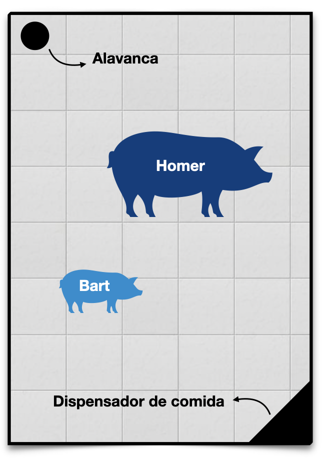

# Aula 6 – Introdução à Teoria dos Jogos 
**Teoria da Decisão – 2023.1**
Lucas Thevenard

---
<!-- 
paginate: true 
header: Aula 6 – Introdução à Teoria dos Jogos
footer: lucas.gomes@fgv.br | 28/03/2023
-->

# Respostas dos exercícios

---

### T1.1. Maximin
 

__ | EDM1 | EDM2 | EDM3 | EDM4 | EDM5
---|:----:|:----:|:----:|:----:|:----
A  | 20   | 50   | 0    | 120  | 50
B  | 0    | 140  | 10   | 30   | 50
C  | 0    | 20   | 80   | 100  | 35
D  | -100 | 0    | 20   | 30   | 200
E  | 50   | 90   | 0    | 70   | 20

---

### T1.1. Maximin
 

__ | EDM1 | EDM2 | EDM3 | EDM4 | EDM5
---|:----:|:----:|:----:|:----:|:----
A  | 20   | 50   | **0 ✶** | 120  | 50
B  | **0 ✶** | 140  | 10   | 30   | 50
C  | **0 ✶** | 20   | 80   | 100  | 35
D  | **-100 ✶** | 0 | 20   | 30   | 200
E  | 50   | 90   | **0 ✶** | 70   | 20

---

### T1.1. Maximin
 

__ | EDM1 | EDM2 | EDM3 | EDM4 | EDM5
---|:----:|:----:|:----:|:----:|:----
A  | 20   | 50   | ~~- 0 -~~ | 120  | 50
B  | ~~- 0 -~~ | 140  | 10   | 30   | 50
C  | ~~- 0 -~~ | 20   | 80   | 100  | 35
~~- D -~~ | ~~- -100 -~~ | ~~- 0 -~~ | ~~- 20 -~~ | ~~- 30 -~~ | ~~- 200 -~~
E  | 50   | 90   | ~~- 0 -~~ | 70   | 20

---

### T1.1. Maximin
 

__ | EDM1 | EDM2 | EDM3 | EDM4 | EDM5
---|:----:|:----:|:----:|:----:|:----
A  | **20 ✶** | 50   | ~~- 0 -~~ | 120  | 50
B  | ~~- 0 -~~ | 140  | **10 ✶** | 30   | 50
C  | ~~- 0 -~~ | **20 ✶** | 80   | 100  | 35
~~- D -~~ | ~~- -100 -~~ | ~~- 0 -~~ | ~~- 20 -~~ | ~~- 30 -~~ | ~~- 200 -~~
E  | 50   | 90   | ~~- 0 -~~ | 70   | **20 ✶**

---

### T1.1. Maximin
 

__ | EDM1 | EDM2 | EDM3 | EDM4 | EDM5
---|:----:|:----:|:----:|:----:|:----
A  | ~~- 20 -~~ | 50   | ~~- 0 -~~ | 120  | 50
~~- B -~~ | ~~- 0 -~~ | ~~- 140 -~~ | ~~- 10 -~~ | ~~- 30 -~~ | ~~- 50 -~~
C  | ~~- 0 -~~ | ~~- 20 -~~ | 80   | 100  | 35
~~- D -~~ | ~~- -100 -~~ | ~~- 0 -~~ | ~~- 20 -~~ | ~~- 30 -~~ | ~~- 200 -~~
E  | 50   | 90   | ~~- 0 -~~ | 70   | ~~- 20 -~~

---

### T1.1. Maximin
 

__ | EDM1 | EDM2 | EDM3 | EDM4 | EDM5
---|:----:|:----:|:----:|:----:|:----
A  | ~~- 20 -~~ | **50 ✶** | ~~- 0 -~~ | 120  | 50
~~- B -~~ | ~~- 0 -~~ | ~~- 140 -~~ | ~~- 10 -~~ | ~~- 30 -~~ | ~~- 50 -~~
C  | ~~- 0 -~~ | ~~- 20 -~~ | 80   | 100  | **35 ✶**
~~- D -~~ | ~~- -100 -~~ | ~~- 0 -~~ | ~~- 20 -~~ | ~~- 30 -~~ | ~~- 200 -~~
E  | **50 ✶** | 90   | ~~- 0 -~~ | 70   | ~~- 20 -~~

---

### T1.1. Maximin
 

__ | EDM1 | EDM2 | EDM3 | EDM4 | EDM5
---|:----:|:----:|:----:|:----:|:----
A  | ~~- 20 -~~ | ~~- 50 -~~ | ~~- 0 -~~ | 120  | 50
~~- B -~~ | ~~- 0 -~~ | ~~- 140 -~~ | ~~- 10 -~~ | ~~- 30 -~~ | ~~- 50 -~~
~~- C -~~ | ~~- 0 -~~ | ~~- 20 -~~ | ~~- 80 -~~ | ~~- 100 -~~ | ~~- 35 -~~
~~- D -~~ | ~~- -100 -~~ | ~~- 0 -~~ | ~~- 20 -~~ | ~~- 30 -~~ | ~~- 200 -~~
E  | ~~- 50 -~~ | 90   | ~~- 0 -~~ | 70   | ~~- 20 -~~

---

### T1.1. Maximin
 

__ | EDM1 | EDM2 | EDM3 | EDM4 | EDM5
---|:----:|:----:|:----:|:----:|:----
A  | ~~- 20 -~~ | ~~- 50 -~~ | ~~- 0 -~~ | 120  | **50 ✶**
~~- B -~~ | ~~- 0 -~~ | ~~- 140 -~~ | ~~- 10 -~~ | ~~- 30 -~~ | ~~- 50 -~~
~~- C -~~ | ~~- 0 -~~ | ~~- 20 -~~ | ~~- 80 -~~ | ~~- 100 -~~ | ~~- 35 -~~
~~- D -~~ | ~~- -100 -~~ | ~~- 0 -~~ | ~~- 20 -~~ | ~~- 30 -~~ | ~~- 200 -~~
E  | ~~- 50 -~~ | 90   | ~~- 0 -~~ | **70 ✶**   | ~~- 20 -~~

---

### T1.1. Maximin
 

__ | EDM1 | EDM2 | EDM3 | EDM4 | EDM5
---|:----:|:----:|:----:|:----:|:----
A  | ~~- 20 -~~ | ~~- 50 -~~ | ~~- 0 -~~ | 120  | **50 ✶**
~~- B -~~ | ~~- 0 -~~ | ~~- 140 -~~ | ~~- 10 -~~ | ~~- 30 -~~ | ~~- 50 -~~
~~- C -~~ | ~~- 0 -~~ | ~~- 20 -~~ | ~~- 80 -~~ | ~~- 100 -~~ | ~~- 35 -~~
~~- D -~~ | ~~- -100 -~~ | ~~- 0 -~~ | ~~- 20 -~~ | ~~- 30 -~~ | ~~- 200 -~~
**E ✶✶**  | ~~- 50 -~~ | 90   | ~~- 0 -~~ | **70 ✶**   | ~~- 20 -~~

#### Solução (Maximin): **Alternativa E**

---

### T1.2. Minimax
 

_ | EDM1 | EDM2 | EDM3 | EDM4 | EDM5
---|:----:|:----:|:----:|:----:|:----
A  | 20   | 50   | 0    | 120  | 50
B  | 0    | 140  | 10   | 30   | 50
C  | 0    | 20   | 80   | 100  | 35
D  | -100 | 0    | 20   | 30   | 200
E  | 50   | 90   | 0    | 70   | 20

---

### T1.2. Minimax
 

_ | EDM1 | EDM2 | EDM3 | EDM4 | EDM5
---|:----:|:----:|:----:|:----:|:----
A  | 50-20 | 140-50 | 80-0 | 120-120 | 200-50
B  | 50-0 | 140-140 | 80-10 | 120-30 | 200-50
C  | 50-0 | 140-20 | 80-80 | 120-100 | 200-35
D  | 50+100 | 140-0 | 80-20 | 120-30 | 200-200
E  | 50-50 | 140-90 | 80-0 | 120-70 | 200-20

---

### T1.2. Minimax
 

_ | EM1 | EM2 | EM3 | EM4 | EM5
---|:----:|:----:|:----:|:----:|:----
A  | 20   | 50   | 0    | 120  | 50
B  | 0    | 140  | 10   | 30   | 50
C  | 0    | 20   | 80   | 100  | 35
D  | -100 | 0    | 20   | 30   | 200
E  | 50   | 90   | 0    | 70   | 20

_ | EM1 | EM2 | EM3 | EM4 | EM5
---|:----:|:----:|:----:|:----:|:----
A  | 30 | 90 | 80 | 0 | 150
B  | 50 | 0 | 70 | 90 | 150
C  | 50 | 120 | 0 | 20 | 165
D  | 150 | 140 | 60 | 90 | 0
E  | 0 | 50 | 80 | 50 | 180

---

### T1.2. Minimax
 

_ | EM1 | EM2 | EM3 | EM4 | EM5
---|:----:|:----:|:----:|:----:|:----
A  | 20   | 50   | 0    | 120  | 50
B  | 0    | 140  | 10   | 30   | 50
C  | 0    | 20   | 80   | 100  | 35
D  | -100 | 0    | 20   | 30   | 200
E  | 50   | 90   | 0    | 70   | 20

_ | EM1 | EM2 | EM3 | EM4 | EM5
---|:----:|:----:|:----:|:----:|:----
A  | 30 | 90 | 80 | 0 | **150 ✶**
B  | 50 | 0 | 70 | 90 | **150 ✶**
C  | 50 | 120 | 0 | 20 | **165 ✶**
D  | **150 ✶** | 140 | 60 | 90 | 0
E  | 0 | 50 | 80 | 50 | **180 ✶**

---

### T1.2. Minimax
 

_  | EM1  | EM2  | EM3  | EM4  | EM5
---|:----:|:----:|:----:|:----:|:----
A  | 20   | 50   | 0    | 120  | 50
B  | 0    | 140  | 10   | 30   | 50
C  | 0    | 20   | 80   | 100  | 35
D  | -100 | 0    | 20   | 30   | 200
E  | 50   | 90   | 0    | 70   | 20

_ | EM1 | EM2 | EM3 | EM4 | EM5
---|:----:|:----:|:----:|:----:|:----
A  | 30 | 90 | 80 | 0 | ~~- 150 -~~
B  | 50 | 0 | 70 | 90 | ~~- 150 -~~
~~- C -~~  | ~~- 50 -~~ | ~~- 120 -~~ | ~~- 0 -~~ | ~~- 20 -~~ | ~~- 165 -~~
D  | ~~- 150 -~~ | 140 | 60 | 90 | 0
~~- E -~~  | ~~- 0 -~~ | ~~- 50 -~~ | ~~- 80 -~~ | ~~- 50 -~~ | ~~- 180 -~~

---

### T1.2. Minimax
 

_  | EM1  | EM2  | EM3  | EM4  | EM5
---|:----:|:----:|:----:|:----:|:----
A  | 20   | 50   | 0    | 120  | 50
B  | 0    | 140  | 10   | 30   | 50
C  | 0    | 20   | 80   | 100  | 35
D  | -100 | 0    | 20   | 30   | 200
E  | 50   | 90   | 0    | 70   | 20

_ | EM1 | EM2 | EM3 | EM4 | EM5
---|:----:|:----:|:----:|:----:|:----
A  | 30 | **90 ✶** | 80 | 0 | ~~- 150 -~~
B  | 50 | 0 | 70 | **90 ✶** | ~~- 150 -~~
~~- C -~~  | ~~- 50 -~~ | ~~- 120 -~~ | ~~- 0 -~~ | ~~- 20 -~~ | ~~- 165 -~~
D  | ~~- 150 -~~ | **140 ✶** | 60 | 90 | 0
~~- E -~~  | ~~- 0 -~~ | ~~- 50 -~~ | ~~- 80 -~~ | ~~- 50 -~~ | ~~- 180 -~~

---

### T1.2. Minimax
 

_ | EM1 | EM2 | EM3 | EM4 | EM5
---|:----:|:----:|:----:|:----:|:----
A  | 20   | 50   | 0    | 120  | 50
B  | 0    | 140  | 10   | 30   | 50
C  | 0    | 20   | 80   | 100  | 35
D  | -100 | 0    | 20   | 30   | 200
E  | 50   | 90   | 0    | 70   | 20

_ | EM1 | EM2 | EM3 | EM4 | EM5
---|:----:|:----:|:----:|:----:|:----
A  | 30 | ~~- 90 -~~ | 80 | 0 | ~~- 150 -~~
B  | 50 | 0 | 70 | ~~- 90 -~~ | ~~- 150 -~~
~~- C -~~  | ~~- 50 -~~ | ~~- 120 -~~ | ~~- 0 -~~ | ~~- 20 -~~ | ~~- 165 -~~
~~- D -~~  | ~~- 150 -~~ | ~~- 140 -~~ | ~~- 60 -~~ | ~~- 90 -~~ | ~~- 0 -~~
~~- E -~~  | ~~- 0 -~~ | ~~- 50 -~~ | ~~- 80 -~~ | ~~- 50 -~~ | ~~- 180 -~~

---

### T1.2. Minimax
 

_ | EM1 | EM2 | EM3 | EM4 | EM5
---|:----:|:----:|:----:|:----:|:----
A  | 20   | 50   | 0    | 120  | 50
B  | 0    | 140  | 10   | 30   | 50
C  | 0    | 20   | 80   | 100  | 35
D  | -100 | 0    | 20   | 30   | 200
E  | 50   | 90   | 0    | 70   | 20

_ | EM1 | EM2 | EM3 | EM4 | EM5
---|:----:|:----:|:----:|:----:|:----
A  | 30 | ~~- 90 -~~ | **80 ✶** | 0 | ~~- 150 -~~
B  | 50 | 0 | **70 ✶** | ~~- 90 -~~ | ~~- 150 -~~
~~- C -~~  | ~~- 50 -~~ | ~~- 120 -~~ | ~~- 0 -~~ | ~~- 20 -~~ | ~~- 165 -~~
~~- D -~~  | ~~- 150 -~~ | ~~- 140 -~~ | ~~- 60 -~~ | ~~- 90 -~~ | ~~- 0 -~~
~~- E -~~  | ~~- 0 -~~ | ~~- 50 -~~ | ~~- 80 -~~ | ~~- 50 -~~ | ~~- 180 -~~

---

### T1.2. Minimax
 

_ | EM1 | EM2 | EM3 | EM4 | EM5
---|:----:|:----:|:----:|:----:|:----
A  | 20   | 50   | 0    | 120  | 50
B  | 0    | 140  | 10   | 30   | 50
C  | 0    | 20   | 80   | 100  | 35
D  | -100 | 0    | 20   | 30   | 200
E  | 50   | 90   | 0    | 70   | 20

_ | EM1 | EM2 | EM3 | EM4 | EM5
---|:----:|:----:|:----:|:----:|:----
A  | 30 | ~~- 90 -~~ | **80 ✶** | 0 | ~~- 150 -~~
**B ✶✶**  | 50 | 0 | **70 ✶** | ~~- 90 -~~ | ~~- 150 -~~
~~- C -~~  | ~~- 50 -~~ | ~~- 120 -~~ | ~~- 0 -~~ | ~~- 20 -~~ | ~~- 165 -~~
~~- D -~~  | ~~- 150 -~~ | ~~- 140 -~~ | ~~- 60 -~~ | ~~- 90 -~~ | ~~- 0 -~~
~~- E -~~  | ~~- 0 -~~ | ~~- 50 -~~ | ~~- 80 -~~ | ~~- 50 -~~ | ~~- 180 -~~

#### Solução (Minimax): **Alternativa B**

---

### T1.3. Regra do Otimismo
 

_ | EM1 | EM2 | EM3 | EM4 | EM5
---|:----:|:----:|:----:|:----:|:----
A  | 20   | 50   | 0    | 120  | 50
B  | 0    | 140  | 10   | 30   | 50
C  | 0    | 20   | 80   | 100  | 35
D  | -100 | 0    | 20   | 30   | 200
E  | 50   | 90   | 0    | 70   | 20

$$a = 0,75$$
 

---

### T1.3. Regra do Otimismo
 

_ | EM1 | EM2 | EM3 | EM4 | EM5
---|:----:|:----:|:----:|:----:|:----
A  | 20   | 50   | 0    | 120  | 50
B  | 0    | 140  | 10   | 30   | 50
C  | 0    | 20   | 80   | 100  | 35
D  | -100 | 0    | 20   | 30   | 200
E  | 50   | 90   | 0    | 70   | 20

$$a = 0,75$$
 

$$V_A = (0,75 \times 120) + (0,25 \times 0) = 90$$
$$V_B = (0,75 \times 140) + (0,25 \times 0) = 105$$
$$V_C = (0,75 \times 100) + (0,25 \times 0) = 75$$
$$V_D = (0,75 \times 200) + (0,25 \times -100) = 125$$
$$V_E = (0,75 \times 90) + (0,25 \times 0) = 67,5$$

---

### T1.3. Regra do Otimismo
 

_ | EM1 | EM2 | EM3 | EM4 | EM5
---|:----:|:----:|:----:|:----:|:----
A  | 20   | 50   | 0    | 120  | 50
B  | 0    | 140  | 10   | 30   | 50
C  | 0    | 20   | 80   | 100  | 35
**D ✶✶** | -100 | 0    | 20   | 30   | 200
E  | 50   | 90   | 0    | 70   | 20

$$a = 0,75$$
 

$$V_A = (0,75 \times 120) + (0,25 \times 0) = 90$$
$$V_B = (0,75 \times 140) + (0,25 \times 0) = 105$$
$$V_C = (0,75 \times 100) + (0,25 \times 0) = 75$$
$$V_D = (0,75 \times 200) + (0,25 \times -100) = 125$$
$$V_E = (0,75 \times 90) + (0,25 \times 0) = 67,5$$

#### Solução (Otimismo): **Alternativa D**

---

### T1.4. Postulado da Razão Insuficiente
 

_ | EM1 | EM2 | EM3 | EM4 | EM5
---|:----:|:----:|:----:|:----:|:----
A  | 20   | 50   | 0    | 120  | 50
B  | 0    | 140  | 10   | 30   | 50
C  | 0    | 20   | 80   | 100  | 35
D  | -100 | 0    | 20   | 30   | 200
E  | 50   | 90   | 0    | 70   | 20

---

### T1.4. Postulado da Razão Insuficiente
 

_ | EM1 | EM2 | EM3 | EM4 | EM5
---|:----:|:----:|:----:|:----:|:----
A  | 20   | 50   | 0    | 120  | 50
B  | 0    | 140  | 10   | 30   | 50
C  | 0    | 20   | 80   | 100  | 35
D  | -100 | 0    | 20   | 30   | 200
E  | 50   | 90   | 0    | 70   | 20

  

$$V_A = 20 + 50 + 0 + 120 + 50 = 240$$
 

$$V_B = 0 + 140 + 10 + 30 + 50 = 230$$
 

$$V_C = 0 + 20 + 80 + 100 + 35 = 235$$
 

$$V_D = -100 + 0 + 20 + 30 + 200 = 150$$
 

$$V_E = 50 + 90 + 0 + 70 + 20 = 230$$

---

### T1.4. Postulado da Razão Insuficiente
 

_ | EM1 | EM2 | EM3 | EM4 | EM5
---|:----:|:----:|:----:|:----:|:----
**A ✶✶**  | 20   | 50   | 0    | 120  | 50
B  | 0    | 140  | 10   | 30   | 50
C  | 0    | 20   | 80   | 100  | 35
D  | -100 | 0    | 20   | 30   | 200
E  | 50   | 90   | 0    | 70   | 20

  

$$V_A = 20 + 50 + 0 + 120 + 50 = 240$$
 

$$V_B = 0 + 140 + 10 + 30 + 50 = 230$$
 

$$V_C = 0 + 20 + 80 + 100 + 35 = 235$$
 

$$V_D = -100 + 0 + 20 + 30 + 200 = 150$$
 

$$V_E = 50 + 90 + 0 + 70 + 20 = 230$$

#### Solução (Razão Insuficiente): **Alternativa A**

---

## Resultados da Tabela 1
- **Maximin**: Alternativa E
- **Minimax**: Alternativa B
- **Regra do Otimismo**: Alternativa D
- **Postulado da Razão Insuficiente**: Alternativa A

---

### T2.1. Maximin
 

__ | EDM1 | EDM2 | EDM3 | EDM4 | EDM5
---|:----:|:----:|:----:|:----:|:----
A  | -30  | 0    | 6    | 9    | 60
B  | 15   | 27   | 0    | 21   | 6
C  | 0    | 42   | 3    | 9    | 15
D  | 0    | 6    | 24   | 30   | 10
E  | 6    | 15   | 0    | 36   | 15

---

### T2.1. Maximin
 

__ | EDM1 | EDM2 | EDM3 | EDM4 | EDM5
---|:----:|:----:|:----:|:----:|:----
A  | **-30 ✶** | 0    | 6    | 9    | 60
B  | 15   | 27   | **0 ✶** | 21   | 6
C  | **0 ✶** | 42   | 3    | 9    | 15
D  | **0 ✶** | 6    | 24   | 30   | 10
E  | 6    | 15   | **0 ✶** | 36   | 15

---

### T2.1. Maximin
 

__ | EDM1 | EDM2 | EDM3 | EDM4 | EDM5
---|:----:|:----:|:----:|:----:|:----
~~- A -~~ | ~~- -30 -~~ | ~~- 0 -~~ | ~~- 6 -~~ | ~~- 9 -~~ | ~~- 60 -~~
B  | 15   | 27   | ~~- 0 -~~ | 21   | 6
C  | ~~- 0 -~~ | 42   | 3    | 9    | 15
D  | ~~- 0 -~~ | 6    | 24   | 30   | 10
E  | 6    | 15   | ~~- 0 -~~ | 36   | 15

---

### T2.1. Maximin
 

__ | EDM1 | EDM2 | EDM3 | EDM4 | EDM5
---|:----:|:----:|:----:|:----:|:----
~~- A -~~ | ~~- -30 -~~ | ~~- 0 -~~ | ~~- 6 -~~ | ~~- 9 -~~ | ~~- 60 -~~
B  | 15   | 27   | ~~- 0 -~~ | 21   | **6 ✶**
C  | ~~- 0 -~~ | 42   | **3 ✶** | 9    | 15
D  | ~~- 0 -~~ | **6 ✶**    | 24   | 30   | 10
E  | **6 ✶**    | 15   | ~~- 0 -~~ | 36   | 15

---

### T2.1. Maximin
 

__ | EDM1 | EDM2 | EDM3 | EDM4 | EDM5
---|:----:|:----:|:----:|:----:|:----
~~- A -~~ | ~~- -30 -~~ | ~~- 0 -~~ | ~~- 6 -~~ | ~~- 9 -~~ | ~~- 60 -~~
B  | 15   | 27   | ~~- 0 -~~ | 21   | ~~- 6 -~~
~~- C -~~ | ~~- 0 -~~ | ~~- 42 -~~ | ~~- 3 -~~ | ~~- 9 -~~ | ~~- 15 -~~
D  | ~~- 0 -~~ | ~~- 6 -~~ | 24   | 30   | 10
E  | ~~- 6 -~~ | 15   | ~~- 0 -~~ | 36   | 15

---

### T2.1. Maximin
 

__ | EDM1 | EDM2 | EDM3 | EDM4 | EDM5
---|:----:|:----:|:----:|:----:|:----
~~- A -~~ | ~~- -30 -~~ | ~~- 0 -~~ | ~~- 6 -~~ | ~~- 9 -~~ | ~~- 60 -~~
B  | **15 ✶** | 27   | ~~- 0 -~~ | 21 | ~~- 6 -~~
~~- C -~~ | ~~- 0 -~~ | ~~- 42 -~~ | ~~- 3 -~~ | ~~- 9 -~~ | ~~- 15 -~~
D  | ~~- 0 -~~ | ~~- 6 -~~ | 24   | 30   | **10 ✶**
E  | ~~- 6 -~~ | 15   | ~~- 0 -~~ | 36   | **15 ✶**

---

### T2.1. Maximin
 

__ | EDM1 | EDM2 | EDM3 | EDM4 | EDM5
---|:----:|:----:|:----:|:----:|:----
~~- A -~~ | ~~- -30 -~~ | ~~- 0 -~~ | ~~- 6 -~~ | ~~- 9 -~~ | ~~- 60 -~~
B  | ~~- 15 -~~ | 27   | ~~- 0 -~~ | 21 | ~~- 6 -~~
~~- C -~~ | ~~- 0 -~~ | ~~- 42 -~~ | ~~- 3 -~~ | ~~- 9 -~~ | ~~- 15 -~~
~~- D -~~ | ~~- 0 -~~ | ~~- 6 -~~ | ~~- 24 -~~ | ~~- 30 -~~ | ~~- 10 -~~
E  | ~~- 6 -~~ | 15   | ~~- 0 -~~ | 36   | ~~- 15 -~~

---

### T2.1. Maximin
 

__ | EDM1 | EDM2 | EDM3 | EDM4 | EDM5
---|:----:|:----:|:----:|:----:|:----
~~- A -~~ | ~~- -30 -~~ | ~~- 0 -~~ | ~~- 6 -~~ | ~~- 9 -~~ | ~~- 60 -~~
B  | ~~- 15 -~~ | 27   | ~~- 0 -~~ | **21 ✶** | ~~- 6 -~~
~~- C -~~ | ~~- 0 -~~ | ~~- 42 -~~ | ~~- 3 -~~ | ~~- 9 -~~ | ~~- 15 -~~
~~- D -~~ | ~~- 0 -~~ | ~~- 6 -~~ | ~~- 24 -~~ | ~~- 30 -~~ | ~~- 10 -~~
E  | ~~- 6 -~~ | **15 ✶** | ~~- 0 -~~ | 36   | ~~- 15 -~~

---

### T2.1. Maximin
 

__ | EDM1 | EDM2 | EDM3 | EDM4 | EDM5
---|:----:|:----:|:----:|:----:|:----
~~- A -~~ | ~~- -30 -~~ | ~~- 0 -~~ | ~~- 6 -~~ | ~~- 9 -~~ | ~~- 60 -~~
**B ✶✶** | ~~- 15 -~~ | 27   | ~~- 0 -~~ | **21 ✶** | ~~- 6 -~~
~~- C -~~ | ~~- 0 -~~ | ~~- 42 -~~ | ~~- 3 -~~ | ~~- 9 -~~ | ~~- 15 -~~
~~- D -~~ | ~~- 0 -~~ | ~~- 6 -~~ | ~~- 24 -~~ | ~~- 30 -~~ | ~~- 10 -~~
E  | ~~- 6 -~~ | **15 ✶** | ~~- 0 -~~ | 36   | ~~- 15 -~~

#### Solução (Maximin): **Alternativa B**

---

### T2.2. Minimax
 

__ | EDM1 | EDM2 | EDM3 | EDM4 | EDM5
---|:----:|:----:|:----:|:----:|:----
A  | -30  | 0    | 6    | 9    | 60
B  | 15   | 27   | 0    | 21   | 6
C  | 0    | 42   | 3    | 9    | 15
D  | 0    | 6    | 24   | 30   | 10
E  | 6    | 15   | 0    | 36   | 15

---

### T2.2. Minimax
 

__ | EDM1 | EDM2 | EDM3 | EDM4 | EDM5
---|:----:|:----:|:----:|:----:|:----
A  | 15+30 | 42-0  | 24-6  | 36-9  | 60-60
B  | 15-15 | 42-27 | 24-0  | 36-21 | 60-6
C  | 15-0  | 42-42 | 24-3  | 36-9  | 60-15
D  | 15-0  | 42-6  | 24-24 | 36-30 | 60-10
E  | 15-6  | 42-15 | 24-0  | 36-36 | 60-15

---

### T2.2. Minimax
 

_ | EM1 | EM2 | EM3 | EM4 | EM5
---|:----:|:----:|:----:|:----:|:----
A  | -30  | 0    | 6    | 9    | 60
B  | 15   | 27   | 0    | 21   | 6
C  | 0    | 42   | 3    | 9    | 15
D  | 0    | 6    | 24   | 30   | 10
E  | 6    | 15   | 0    | 36   | 15

_ | EM1 | EM2 | EM3 | EM4 | EM5
--|:---:|:---:|:---:|:---:|:----
A  | 45 | 42 | 18 | 25 | 0
B  | 0 | 15 | 24 | 15 | 54
C  | 15  | 0 | 21 | 27  | 45
D  | 15  | 36 | 0 | 6 | 50
E  | 9 | 27 | 24 | 0 | 45

---

### T2.2. Minimax
 

_ | EM1 | EM2 | EM3 | EM4 | EM5
---|:----:|:----:|:----:|:----:|:----
A  | -30  | 0    | 6    | 9    | 60
B  | 15   | 27   | 0    | 21   | 6
C  | 0    | 42   | 3    | 9    | 15
D  | 0    | 6    | 24   | 30   | 10
E  | 6    | 15   | 0    | 36   | 15

_ | EM1 | EM2 | EM3 | EM4 | EM5
--|:---:|:---:|:---:|:---:|:----
A  | **45 ✶** | 42 | 18 | 25 | 0
B  | 0 | 15 | 24 | 15 | **54 ✶**
C  | 15  | 0 | 21 | 27  | **45 ✶**
D  | 15  | 36 | 0 | 6 | **50 ✶**
E  | 9 | 27 | 24 | 0 | **45 ✶**

---

### T2.2. Minimax
 

_ | EM1 | EM2 | EM3 | EM4 | EM5
---|:----:|:----:|:----:|:----:|:----
A  | -30  | 0    | 6    | 9    | 60
B  | 15   | 27   | 0    | 21   | 6
C  | 0    | 42   | 3    | 9    | 15
D  | 0    | 6    | 24   | 30   | 10
E  | 6    | 15   | 0    | 36   | 15

_ | EM1 | EM2 | EM3 | EM4 | EM5
--|:---:|:---:|:---:|:---:|:----
A  | ~~- 45 -~~ | 42 | 18 | 25 | 0
~~- B -~~ | ~~- 0 -~~ | ~~- 15 -~~ | ~~- 24 -~~ | ~~- 15 -~~ | ~~- 54 -~~
C  | 15  | 0 | 21 | 27  | ~~- 45 -~~
~~- D -~~ | ~~- 15 -~~ | ~~- 36 -~~ | ~~- 0 -~~ | ~~- 6 -~~ | ~~- 50 -~~
E  | 9 | 27 | 24 | 0 | ~~- 45 -~~

---

### T2.2. Minimax
 

_ | EM1 | EM2 | EM3 | EM4 | EM5
---|:----:|:----:|:----:|:----:|:----
A  | -30  | 0    | 6    | 9    | 60
B  | 15   | 27   | 0    | 21   | 6
C  | 0    | 42   | 3    | 9    | 15
D  | 0    | 6    | 24   | 30   | 10
E  | 6    | 15   | 0    | 36   | 15

_ | EM1 | EM2 | EM3 | EM4 | EM5
--|:---:|:---:|:---:|:---:|:----
A  | ~~- 45 -~~ | **42 ✶✶** | 18 | 25 | 0
~~- B -~~ | ~~- 0 -~~ | ~~- 15 -~~ | ~~- 24 -~~ | ~~- 15 -~~ | ~~- 54 -~~
C  | 15  | 0 | 21 | **27 ✶✶** | ~~- 45 -~~
~~- D -~~ | ~~- 15 -~~ | ~~- 36 -~~ | ~~- 0 -~~ | ~~- 6 -~~ | ~~- 50 -~~
E  | 9 | **27 ✶✶** | 24 | 0 | ~~- 45 -~~

---

### T2.2. Minimax
 

_ | EM1 | EM2 | EM3 | EM4 | EM5
---|:----:|:----:|:----:|:----:|:----
A  | -30  | 0    | 6    | 9    | 60
B  | 15   | 27   | 0    | 21   | 6
C  | 0    | 42   | 3    | 9    | 15
D  | 0    | 6    | 24   | 30   | 10
E  | 6    | 15   | 0    | 36   | 15

_ | EM1 | EM2 | EM3 | EM4 | EM5
--|:---:|:---:|:---:|:---:|:----
A  | ~~- 45 -~~ | ~~- 42 -~~ | 18 | 25 | 0
~~- B -~~ | ~~- 0 -~~ | ~~- 15 -~~ | ~~- 24 -~~ | ~~- 15 -~~ | ~~- 54 -~~
C  | 15  | 0 | 21 | ~~- 27 -~~ | ~~- 45 -~~
~~- D -~~ | ~~- 15 -~~ | ~~- 36 -~~ | ~~- 0 -~~ | ~~- 6 -~~ | ~~- 50 -~~
E  | 9 | ~~- 27 -~~ | 24 | 0 | ~~- 45 -~~

---

### T2.2. Minimax
 

_ | EM1 | EM2 | EM3 | EM4 | EM5
---|:----:|:----:|:----:|:----:|:----
A  | -30  | 0    | 6    | 9    | 60
B  | 15   | 27   | 0    | 21   | 6
C  | 0    | 42   | 3    | 9    | 15
D  | 0    | 6    | 24   | 30   | 10
E  | 6    | 15   | 0    | 36   | 15

_ | EM1 | EM2 | EM3 | EM4 | EM5
--|:---:|:---:|:---:|:---:|:----
~~- A -~~ | ~~- 45 -~~ | ~~- 42 -~~ | ~~- 18 -~~ | ~~- 25 -~~ | ~~- 0 -~~
~~- B -~~ | ~~- 0 -~~ | ~~- 15 -~~ | ~~- 24 -~~ | ~~- 15 -~~ | ~~- 54 -~~
C  | 15  | 0 | **21 ✶** | ~~- 27 -~~ | ~~- 45 -~~
~~- D -~~ | ~~- 15 -~~ | ~~- 36 -~~ | ~~- 0 -~~ | ~~- 6 -~~ | ~~- 50 -~~
E  | 9 | ~~- 27 -~~ | **24 ✶** | 0 | ~~- 45 -~~

---

### T2.2. Minimax
 

_ | EM1 | EM2 | EM3 | EM4 | EM5
---|:----:|:----:|:----:|:----:|:----
A  | -30  | 0    | 6    | 9    | 60
B  | 15   | 27   | 0    | 21   | 6
C  | 0    | 42   | 3    | 9    | 15
D  | 0    | 6    | 24   | 30   | 10
E  | 6    | 15   | 0    | 36   | 15

_ | EM1 | EM2 | EM3 | EM4 | EM5
--|:---:|:---:|:---:|:---:|:----
~~- A -~~ | ~~- 45 -~~ | ~~- 42 -~~ | ~~- 18 -~~ | ~~- 25 -~~ | ~~- 0 -~~
~~- B -~~ | ~~- 0 -~~ | ~~- 15 -~~ | ~~- 24 -~~ | ~~- 15 -~~ | ~~- 54 -~~
**C ✶✶** | 15  | 0 | **21 ✶** | ~~- 27 -~~ | ~~- 45 -~~
~~- D -~~ | ~~- 15 -~~ | ~~- 36 -~~ | ~~- 0 -~~ | ~~- 6 -~~ | ~~- 50 -~~
E  | 9 | ~~- 27 -~~ | **24 ✶** | 0 | ~~- 45 -~~

#### Solução (Minimax): **Alternativa C**

---

### T2.3. Regra do Otimismo
 

_ | EM1 | EM2 | EM3 | EM4 | EM5
---|:----:|:----:|:----:|:----:|:----
A  | -30  | 0    | 6    | 9    | 60
B  | 15   | 27   | 0    | 21   | 6
C  | 0    | 42   | 3    | 9    | 15
D  | 0    | 6    | 24   | 30   | 10
E  | 6    | 15   | 0    | 36   | 15

$$a = 0,8$$
 

---

### T2.3. Regra do Otimismo
 

_ | EM1 | EM2 | EM3 | EM4 | EM5
---|:----:|:----:|:----:|:----:|:----
A  | -30  | 0    | 6    | 9    | 60
B  | 15   | 27   | 0    | 21   | 6
C  | 0    | 42   | 3    | 9    | 15
D  | 0    | 6    | 24   | 30   | 10
E  | 6    | 15   | 0    | 36   | 15

$$a = 0,8$$
 

$$V_A = (0,8 \times 60) + (0,2 \times -30) = 42$$
$$V_B = (0,8 \times 27) + (0,2 \times 0) = 21,6$$
$$V_C = (0,8 \times 42) + (0,2 \times 0) = 33,6$$
$$V_D = (0,8 \times 30) + (0,2 \times 0) = 24$$
$$V_E = (0,8 \times 36) + (0,2 \times 0) = 28,8$$

---

### T2.3. Regra do Otimismo
 

_ | EM1 | EM2 | EM3 | EM4 | EM5
---|:----:|:----:|:----:|:----:|:----
**A ✶✶** | -30  | 0    | 6    | 9    | 60
B  | 15   | 27   | 0    | 21   | 6
C  | 0    | 42   | 3    | 9    | 15
D  | 0    | 6    | 24   | 30   | 10
E  | 6    | 15   | 0    | 36   | 15

$$a = 0,8$$
 

$$V_A = (0,8 \times 60) + (0,2 \times -30) = 42$$
$$V_B = (0,8 \times 27) + (0,2 \times 0) = 21,6$$
$$V_C = (0,8 \times 42) + (0,2 \times 0) = 33,6$$
$$V_D = (0,8 \times 30) + (0,2 \times 0) = 24$$
$$V_E = (0,8 \times 36) + (0,2 \times 0) = 28,8$$

#### Solução (Otimismo): **Alternativa A**

---

### T2.4. Postulado da Razão Insuficiente
 

_ | EM1 | EM2 | EM3 | EM4 | EM5
---|:----:|:----:|:----:|:----:|:----
A  | -30  | 0    | 6    | 9    | 60
B  | 15   | 27   | 0    | 21   | 6
C  | 0    | 42   | 3    | 9    | 15
D  | 0    | 6    | 24   | 30   | 10
E  | 6    | 15   | 0    | 36   | 15

  

---

### T2.4. Postulado da Razão Insuficiente
 

_ | EM1 | EM2 | EM3 | EM4 | EM5
---|:----:|:----:|:----:|:----:|:----
A  | -30  | 0    | 6    | 9    | 60
B  | 15   | 27   | 0    | 21   | 6
C  | 0    | 42   | 3    | 9    | 15
D  | 0    | 6    | 24   | 30   | 10
E  | 6    | 15   | 0    | 36   | 15

  

$$V_A = -30 + 0 + 6 + 9 + 60 = 45$$
 

$$V_B = 15 + 27 + 0 + 21 + 6 = 69$$
 

$$V_C = 0 + 42 + 3 + 9 + 15 = 69$$
 

$$V_D = 0 + 6 + 24 + 30 + 10 = 70$$
 

$$V_E = 6 + 15 + 0 + 36 + 15 = 72$$

---

### T2.4. Postulado da Razão Insuficiente
 

_ | EM1 | EM2 | EM3 | EM4 | EM5
---|:----:|:----:|:----:|:----:|:----
A  | -30  | 0    | 6    | 9    | 60
B  | 15   | 27   | 0    | 21   | 6
C  | 0    | 42   | 3    | 9    | 15
D  | 0    | 6    | 24   | 30   | 10
**E ✶✶** | 6    | 15   | 0    | 36   | 15

  

$$V_A = -30 + 0 + 6 + 9 + 60 = 45$$
 

$$V_B = 15 + 27 + 0 + 21 + 6 = 69$$
 

$$V_C = 0 + 42 + 3 + 9 + 15 = 69$$
 

$$V_D = 0 + 6 + 24 + 30 + 10 = 70$$
 

$$V_E = 6 + 15 + 0 + 36 + 15 = 72$$

#### Solução (Razão Insuficiente): **Alternativa E**

---

## Resultados da Tabela 2
- **Maximin**: Alternativa B
- **Minimax**: Alternativa C
- **Regra do Otimismo**: Alternativa A
- **Postulado da Razão Insuficiente**: Alternativa E

---

### Exercício 2
 

__ | EDM1 | EDM2 | EDM3
---|:----:|:----:|:----:
A  | 100  | 200  | 350
B  | 350  | 100  | 200
C  | 100  | 200  | 350

#### Qual método pode produzir uma solução?

* Razão Insuficiente?

* Regra do Otimismo?

* Maximin?

* Minimax?

---

### Exercício 2
 

__ | EDM1 | EDM2 | EDM3
---|:----:|:----:|:----:
A  | 100  | 200  | 350
B  | 350  | 100  | 200
C  | 100  | 200  | 350

__ | EDM1 | EDM2 | EDM3
---|:----:|:----:|:----:
A  | 350 - 100 | 200 - 200 | 350 - 350
B  | 350 - 350 | 200 - 100 | 350 - 200
C  | 350 - 100 | 200 - 200 | 350 - 350

---

### Exercício 2
 

__ | EDM1 | EDM2 | EDM3
---|:----:|:----:|:----:
A  | 100  | 200  | 350
B  | 350  | 100  | 200
C  | 100  | 200  | 350

__ | EDM1 | EDM2 | EDM3
---|:----:|:----:|:----:
A  | 250 | 0 | 0
B  | 0 | 100 | 150
C  | 250 | 0 | 0

---

### Exercício 2
 

__ | EDM1 | EDM2 | EDM3
---|:----:|:----:|:----:
A  | 100  | 200  | 350
B  | 350  | 100  | 200
C  | 100  | 200  | 350

__ | EDM1 | EDM2 | EDM3
---|:----:|:----:|:----:
A  | **250 ✶** | 0 | 0
B  | 0 | 100 | **150 ✶**
C  | **250 ✶** | 0 | 0

---

### Exercício 2
 

__ | EDM1 | EDM2 | EDM3
---|:----:|:----:|:----:
A  | 100  | 200  | 350
B  | 350  | 100  | 200
C  | 100  | 200  | 350

__ | EDM1 | EDM2 | EDM3
---|:----:|:----:|:----:
A  | **250 ✶** | 0 | 0
**B ✶✶** | 0 | 100 | **150 ✶**
C  | **250 ✶** | 0 | 0

**Resposta: O método minimax é o único que oferece uma solução.**

---

### Exercício 3
 

__ | EDM1 | EDM2 | EDM3
---|:----:|:----:|:----:
A  | 92   | 140  | 35
B  | 70   | 70   | 70
C  | 155  | 84   | 0

#### Quais níveis mínimos de otimismo seriam necessários para escolhermos A ou C?

---

**Quais níveis mínimos de otimismo seriam necessários para escolhermos A ou C?**

 

$$V_A = 140a + 35(1 - a) = 140a + 35 - 35a = 105a + 35$$
 

$$V_B = 70a + 70(1-a) = 70(a + 1 - a) = 70$$
 

$$V_C = 155a + 0(1 - a) = 155a$$
 

---

**Quais níveis mínimos de otimismo seriam necessários para escolhermos A ou C?**

 

$$V_A = 105a + 35 \,\,\, , \,\,\, V_B = 70 \,\,\, , \,\,\, V_C = 155a$$
 

$$V_A > V_B \implies 105a + 35 > 70 \,\,\, , \,\,\, a > \frac{1}{3}$$
 

---

**Quais níveis mínimos de otimismo seriam necessários para escolhermos A ou C?**

 

$$V_A = 105a + 35 \,\,\, , \,\,\, V_B = 70 \,\,\, , \,\,\, V_C = 155a$$
 

$$V_A > V_B \implies 105a + 35 > 70 \,\,\, , \,\,\, a > \frac{1}{3}$$
 

$$V_A > V_C \implies 105a + 35 > 155a \,\,\, , \,\,\, a < \frac{7}{10}$$

---

## Roteiro da aula
- Críticas aos modelos de decisão sob condição de ignorância
- Introdução ao conceito de Jogos
- Primeiro método de solução: dominância

---

# 1. Críticas aos modelos de decisão sob condição de ignorância

---

## Quais são os principais problemas do método Maximin?

---

## Maximin
- Método extremamente conservador.
- Impede a consideração das melhores oportunidades de ganho.
- Não considera todas as alternativas.

 

__ | EDM1 | EDM2 
---|:----:|:----:
A  | 1.5  | 1.75      
B  | 1    | 900      

__ | EDM1 | EDM2 | EDM3 | ... | EDM99 | EDM100
---|:----:|:----:|:----:|:---:|:-----:|:------:
A  | 10   | 10   | 10   | ... | 10    | 10
B  | 9    | 20   | 20   | ... | 20    | 20

---

## Quais são os principais problemas do método Minimax?

---

## Minimax
- Ao contrário do maximin, neste método pode haver influência excessiva de alternativas melhores
 

__ | EDM1 | EDM2 
---|:----:|:----:
A  | 300  | 300      
B  | -100 | 900      

__ | EDM1 | EDM2 | EDM3 | ... | EDM99 | EDM100
---|:----:|:----:|:----:|:---:|:-----:|:------:
A  | 10   | 10   | 10   | ... | 10    | 10
B  | 20   | 5    | 5    | ... | 5     | 5

---

## Minimax
- Permutações dos mesmos resultados de uma alternativa de decisão entre os Estados do mundo podem levar a soluções diferentes.
 

__ | EDM1 | EDM2 | EDM3
---|:----:|:----:|:----:
A  |  0   | 1    | 3
B  |  0   | 1    | 3
C  |  3   | 0    | 1

EDM1 | EDM2 | EDM3
:---:|:----:|:----:
3    | 0    | 0
3    | 0    | 0
0    | 1    | 2

---

- A inclusão de uma alternativa que não é escolhida pode mudar a solução do problema.

__ | EDM1 | EDM2 | EDM3
---|:----:|:----:|:----:
A  | 0    | 10   | 4 
B  | 5    | 2    | 10

 

__ | EDM1 | EDM2 | EDM3
---|:----:|:----:|:----:
A  | 0    | 10   | 4 
B  | 5    | 2    | 10
C  | 10   | 5    | 1

EDM1 | EDM2 | EDM3
:---:|:----:|:----:
5    | 0    | 6
0    | 8    | 0

 

EDM1 | EDM2 | EDM3
:---:|:----:|:----:
10   | 0    | 6
5    | 8    | 0
0    | 5    | 9

---

## Minimax
- Ao contrário do maximin, neste método pode haver influência excessiva de alternativas melhores
- Permutações dos mesmos resultados de uma alternativa de decisão entre os Estados do mundo podem levar a soluções diferentes.
- A inclusão de uma alternativa que não é escolhida pode mudar a solução do problema.

---

## Quais são os principais problemas da Regra do Otimismo?

---

## Regra do Otimismo
- Necessidade de escolher o nível de otimismo (arbitrário).
- Considera apenas parte das opções.
- Pode se reverter em max-max ou maxmin:
  - Quando adotamos níveis de otimismo 1 ou 0;
  - Quando as melhores alternativas ou as piores são idênticas

 

__ | EDM1 | EDM2 | EDM3 | EDM4
---|:----:|:----:|:----:|:----:
A  | 0    | 1    | 1    | 11
B  | 0    | 10   | 10   | 10

__ | EDM1 | EDM2 | EDM3 | EDM4
---|:----:|:----:|:----:|:----:
A  | 10   | 9    | 9    | 1
B  | 10   | 2    | 2    | 2

---

## Quais são os principais problemas do Postulado da Razão Insuficiente?

---

## Postulado da Razão Insuficiente
- Presunção de que as alternativas são equiprováveis.
- Presume neutralidade entre os cenários equiprováveis: pode ser um tratamento inadequado de riscos muito altos.
 

__ | EDM1 | EDM2 | EDM3
---|:----:|:----:|:----:
A  | -200 | 150  | 150
B  | 0    | 45   | 45

---

## Conclusão geral sobre métodos de decisão racional sob condições de ignorância
* Todos os métodos enfrentam limitações.
  - Para utilizá-los é necessário entender qual método melhor se aplica ao problema analisado.
  - Sistema de votação dos métodos não funciona (pode incorrer no mesmo problema indicado por Arrow).

---

### Paradoxo de condorcet na composição de métodos

#### Vamos considerar, no exemplo a seguir, como os três métodos ordenariam as alternativas, tomadas duas a duas (considerando um nível de otimismo de 0,5).
 

__ | EDM1 | EDM2 | EDM3
---|:----:|:----:|:----:
A  | 1    | 14   | 13
B  | -1   | 17   | 11
C  | 0    | 20   | 6

Método   | A vs. B | B vs. C | A vs. C
---------|:-------:|:-------:|:----:
Maximin  | A       | C       | A
Minimax  | B       | B       | A
Otimismo | B       | C       | C

 

Chegamos a a um resultado que viola a transitividade, pois: $C \succ B \succ A \succ C$

---

## Conclusão geral sobre métodos de decisão racional sob condições de ignorância
- Todos os métodos enfrentam limitações.
  - Para utilizá-los é necessário entender qual método melhor se aplica ao problema analisado.
  - Sistema de votação dos métodos não funciona (pode incorrer no mesmo problema indicado por Arrow).
* Limites de racionalidade em casos de ignorância profunda.
  - Método maximin é o único que admite uma escala ordinal de preferências.
  - Problema das experiências transformativas não tem solução na literatura.

---

# 2. Introdução ao conceito de Jogos

---

## O que é um jogo?
* Interação estratégica entre os jogadores.
* Conceito de estratégia: antecipar ações/decisões alheias.
* Qual é a aplicabilidade desse conceito a fenômenos sociais e jurídicos?

---

## Formalização de um jogo
- Elementos estruturais mínimos
  - Jogadores
  - Estratégias (cursos de ação ou ‘jogadas')
  - Payoffs (para cada jogador e cada combinação de jogadas)

---

### Vamos Jogar: o jogo dos porquinhos

---

### Vamos Jogar: o jogo dos porquinhos

 

  
<h2 style="color: #058ED0">Bart</h2>

<h3 style="color: #003E7E">&nbsp;&nbsp;&nbsp;&nbsp;&nbsp;&nbsp;&nbsp;&nbsp; Homer</h3>

<table>

  <tr class="game action player2"> 
    <td></td>
    <td>Aciona</td>
    <td>Espera</td>
  </tr>
  <tr>
    <td class="game action player1"> Aciona &nbsp;</td>
    <td class="game">(&nbsp;
      1/3, 
      2/3
    &nbsp;)</td>
    <td class="game">(&nbsp;
      0, 
      1
    &nbsp;)</td>
  </tr>
  <tr>
    <td class="game action player1"> Espera &nbsp;</td>
    <td class="game">(&nbsp;
      2/3, 
      1/3
    &nbsp;)</td>
    <td class="game">(&nbsp;
      0, 
      0
    &nbsp;)</td>
  </tr>

</table>

---

### Solução: jogo dos porquinhos

 

  
<h2 style="color: #058ED0">Bart</h2>

<h3 style="color: #003E7E">&nbsp;&nbsp;&nbsp;&nbsp;&nbsp;&nbsp;&nbsp;&nbsp; Homer</h3>

<table>

  <tr class="game action player2"> 
    <td></td>
    <td>Aciona</td>
    <td>Espera</td>
  </tr>
  <tr>
    <td class="game action player1"> Aciona &nbsp;</td>
    <td class="game">(&nbsp;
      1/3, 
      2/3
    &nbsp;)</td>
    <td class="game">(&nbsp;
      0, 
      1
    &nbsp;)</td>
  </tr>
  <tr>
    <td class="game action player1"> Espera &nbsp;</td>
    <td class="game">(&nbsp;
      2/3, 
      1/3
    &nbsp;)</td>
    <td class="game">(&nbsp;
      0, 
      0
    &nbsp;)</td>
  </tr>

</table>

---

### Solução: jogo dos porquinhos

 

  
<h2 style="color: #058ED0">Bart</h2>

<h3 style="color: #003E7E">&nbsp;&nbsp;&nbsp;&nbsp;&nbsp;&nbsp;&nbsp;&nbsp; Homer</h3>

<table>

  <tr class="game action player2"> 
    <td></td>
    <td>Aciona</td>
    <td>Espera</td>
  </tr>
  <tr>
    <td class="game action player1"> Aciona &nbsp;</td>
    <td class="game">(&nbsp;
      1/3, 
      2/3
    &nbsp;)</td>
    <td class="game">(&nbsp;
      0, 
      1
    &nbsp;)</td>
  </tr>
  <tr>
    <td class="game action player1"> Espera &nbsp;</td>
    <td class="game">(&nbsp;
      2/3, 
      1/3
    &nbsp;)</td>
    <td class="game">(&nbsp;
      0, 
      0
    &nbsp;)</td>
  </tr>

</table>

---

### Solução: jogo dos porquinhos

 

  
<h2 style="color: #058ED0">Bart</h2>

<h3 style="color: #003E7E">&nbsp;&nbsp;&nbsp;&nbsp;&nbsp;&nbsp;&nbsp;&nbsp; Homer</h3>

<table>

  <tr class="game action player2"> 
    <td></td>
    <td>Aciona</td>
    <td>Espera</td>
  </tr>
  <tr>
    <td class="game action player1"> Aciona &nbsp;</td>
    <td class="game">(&nbsp;
      1/3, 
      2/3
    &nbsp;)</td>
    <td class="game">(&nbsp;
      0, 
      1
    &nbsp;)</td>
  </tr>
  <tr>
    <td class="game action player1"> Espera &nbsp;</td>
    <td class="game">(&nbsp;
      2/3, 
      1/3
    &nbsp;)</td>
    <td class="game">(&nbsp;
      0, 
      0
    &nbsp;)</td>
  </tr>

</table>

---

### Solução: jogo dos porquinhos

 

  
<h2 style="color: #058ED0">Bart</h2>

<h3 style="color: #003E7E">&nbsp;&nbsp;&nbsp;&nbsp;&nbsp;&nbsp;&nbsp;&nbsp; Homer</h3>

<table>

  <tr class="game action player2"> 
    <td></td>
    <td>Aciona</td>
    <td>Espera</td>
  </tr>
  <tr>
    <td class="game action player1"> Aciona &nbsp;</td>
    <td class="game">(&nbsp;
      1/3, 
      2/3
    &nbsp;)</td>
    <td class="game">(&nbsp;
      0, 
      1
    &nbsp;)</td>
  </tr>
  <tr>
    <td class="game action player1"> Espera &nbsp;</td>
    <td class="game">(&nbsp;
      2/3, 
      1/3
    &nbsp;)</td>
    <td class="game">(&nbsp;
      0, 
      0
    &nbsp;)</td>
  </tr>

</table>

---

### Solução: jogo dos porquinhos

 

  
<h2 style="color: #058ED0">Bart</h2>

<h3 style="color: #003E7E">&nbsp;&nbsp;&nbsp;&nbsp;&nbsp;&nbsp;&nbsp;&nbsp; Homer</h3>

<table>

  <tr class="game action player2"> 
    <td></td>
    <td>Aciona</td>
    <td>Espera</td>
  </tr>
  <tr>
    <td class="game action player1"> Aciona &nbsp;</td>
    <td class="game">(&nbsp;
      1/3, 
      2/3
    &nbsp;)</td>
    <td class="game">(&nbsp;
      0, 
      1
    &nbsp;)</td>
  </tr>
  <tr>
    <td class="game action player1"> Espera &nbsp;</td>
    <td class="game">(&nbsp;
      2/3, 
      1/3
    &nbsp;)</td>
    <td class="game">(&nbsp;
      0, 
      0
    &nbsp;)</td>
  </tr>

</table>

<b>Solução do Jogo</b>: (Espera, Aciona)

---

## Solução do jogo dos porquinhos
- **Solução**: (Espera, Aciona)
  - Importante: sempre indicamos a solução como um par de estratégias, na ordem dos jogados (jogador 1 nas linhas, jogador 2 nas colunas).
* Interações estratégicas podem ter resultados contra-intuitivos:
  * Bart "vence" o jogo, apesar de ser o mais fraco,
  * Insights interessantes para interações sociais,
  * Falta de alternativas pode levar a vantagens estratégicas.

---

# 3. Primeiro método de solução: dominância

---

## Dominância
* **Estratégias dominadas**: aquelas que nunca são preferíveis às demais, independente das ações do outro jogador.
* **Estratégia dominante**: sempre oferece o melhor resultado, ou seja, única estratégia que não é dominada.
* **Níveis de dominância**:
  * Dominância forte ou estrita: $A_i \succ B_i$, para todas as possíveis $i$ combinações de jogadas envolvendo $A$ e $B$.
  * Dominância fraca: $A_i \succsim B_i$, para todas as possíveis $i$ combinações de jogadas envolvendo $A$ e $B$. 

---

### Exemplo 1: equilíbrio de estratégias dominantes
 
<table>

  <tr class="game action player2"> 
    <td></td>
    <td>C</td>
    <td>D</td>
  </tr>
  <tr>
    <td class="game action player1">A</td>
    <td class="game">(&nbsp;
      4, 
      2
    &nbsp;)</td>
    <td class="game">(&nbsp;
      6, 
      3
    &nbsp;)</td>
  </tr>
  <tr>
    <td class="game action player1">B</td>
    <td class="game">(&nbsp;
      2, 
      4
    &nbsp;)</td>
    <td class="game">(&nbsp;
      5, 
      5
    &nbsp;)</td>
  </tr>

</table>

---

### Exemplo 1: equilíbrio de estratégias dominantes
 
<table>

  <tr class="game action player2"> 
    <td></td>
    <td>C</td>
    <td>D</td>
  </tr>
  <tr>
    <td class="game action player1">A</td>
    <td class="game">(&nbsp;
      4, 
      2
    &nbsp;)</td>
    <td class="game">(&nbsp;
      6, 
      3
    &nbsp;)</td>
  </tr>
  <tr>
    <td class="game action player1">B</td>
    <td class="game">(&nbsp;
      2, 
      4
    &nbsp;)</td>
    <td class="game">(&nbsp;
      5, 
      5
    &nbsp;)</td>
  </tr>

</table>

---

### Exemplo 1: equilíbrio de estratégias dominantes
 
<table>

  <tr class="game action player2"> 
    <td></td>
    <td>C</td>
    <td>D</td>
  </tr>
  <tr>
    <td class="game action player1">A</td>
    <td class="game">(&nbsp;
      4, 
      2
    &nbsp;)</td>
    <td class="game">(&nbsp;
      6, 
      3
    &nbsp;)</td>
  </tr>
  <tr>
    <td class="game action player1">B</td>
    <td class="game">(&nbsp;
      2, 
      4
    &nbsp;)</td>
    <td class="game">(&nbsp;
      5, 
      5
    &nbsp;)</td>
  </tr>

</table>

---

### Exemplo 1: equilíbrio de estratégias dominantes
 
<table>

  <tr class="game action player2"> 
    <td></td>
    <td>C</td>
    <td>D</td>
  </tr>
  <tr>
    <td class="game action player1">A</td>
    <td class="game">(&nbsp;
      4, 
      2
    &nbsp;)</td>
    <td class="game">(&nbsp;
      6, 
      3
    &nbsp;)</td>
  </tr>
  <tr>
    <td class="game action player1">B</td>
    <td class="game">(&nbsp;
      2, 
      4
    &nbsp;)</td>
    <td class="game">(&nbsp;
      5, 
      5
    &nbsp;)</td>
  </tr>
</table>

---

### Exemplo 1: equilíbrio de estratégias dominantes
 
<table>

  <tr class="game action player2"> 
    <td></td>
    <td>C</td>
    <td>D</td>
  </tr>
  <tr>
    <td class="game action player1">A</td>
    <td class="game">(&nbsp;
      4, 
      2
    &nbsp;)</td>
    <td class="game">(&nbsp;
      6, 
      3
    &nbsp;)</td>
  </tr>
  <tr>
    <td class="game action player1">B</td>
    <td class="game">(&nbsp;
      2, 
      4
    &nbsp;)</td>
    <td class="game">(&nbsp;
      5, 
      5
    &nbsp;)</td>
  </tr>
</table>

---

### Exemplo 1: equilíbrio de estratégias dominantes
 
<table>

  <tr class="game action player2"> 
    <td></td>
    <td>C</td>
    <td>D</td>
  </tr>
  <tr>
    <td class="game action player1">A</td>
    <td class="game">(&nbsp;
      4, 
      2
    &nbsp;)</td>
    <td class="game">(&nbsp;
      6, 
      3
    &nbsp;)</td>
  </tr>
  <tr>
    <td class="game action player1">B</td>
    <td class="game">(&nbsp;
      2, 
      4
    &nbsp;)</td>
    <td class="game">(&nbsp;
      5, 
      5
    &nbsp;)</td>
  </tr>
</table>

---

### Exemplo 1: equilíbrio de estratégias dominantes
 
<table>

  <tr class="game action player2"> 
    <td></td>
    <td>C</td>
    <td>D</td>
  </tr>
  <tr>
    <td class="game action player1">A</td>
    <td class="game">(&nbsp;
      4, 
      2
    &nbsp;)</td>
    <td class="game">(&nbsp;
      6, 
      3
    &nbsp;)</td>
  </tr>
  <tr>
    <td class="game action player1">B</td>
    <td class="game">(&nbsp;
      2, 
      4
    &nbsp;)</td>
    <td class="game">(&nbsp;
      5, 
      5
    &nbsp;)</td>
  </tr>
</table>

#### Solução: **(A, D)**

---

## Método do equilíbrio de estratégias dominantes
- Solução: **(A, D)**
- Método de solução: Identificamos a estratégia dominante de um jogador, quando ela existe, e presumimos que ele certamente optará por ela.
  - Em alguns casos, todos os jogadores têm estratégias dominantes (equilíbrio de estratégias dominantes).
  - Em outros casos, solucionando o jogo para parte dos jogadores, conseguimos prever a melhor resposta dos demais.

---

### Exemplo 2: eliminação iterada de estratégias dominadas
 

<table style="line-height: 120%;">

  <tr class="game action player2"> 
    <td></td>
    <td>D</td>
    <td>E</td>
    <td>F</td>
  </tr>
  <tr>
    <td class="game action player1">A</td>
    <td class="game">(&nbsp;
      13, 
      3
    &nbsp;)</td>
    <td class="game">(&nbsp;
      1, 
      4
    &nbsp;)</td>
    <td class="game">(&nbsp;
      7, 
      3
    &nbsp;)</td>
  </tr>
  <tr>
    <td class="game action player1">B</td>
    <td class="game">(&nbsp;
      4, 
      1
    &nbsp;)</td>
    <td class="game">(&nbsp;
      3, 
      3
    &nbsp;)</td>
    <td class="game">(&nbsp;
      6, 
      2
    &nbsp;)</td>
  </tr>
  <tr>
    <td class="game action player1">C</td>
    <td class="game">(&nbsp;
      -1, 
      9
    &nbsp;)</td>
    <td class="game">(&nbsp;
      2, 
      8
    &nbsp;)</td>
    <td class="game">(&nbsp;
      8, 
      -1
    &nbsp;)</td>
  </tr>
</table>

---

### Exemplo 2: eliminação iterada de estratégias dominadas
 

<table style="line-height: 120%;">

  <tr class="game action player2"> 
    <td></td>
    <td>D</td>
    <td>E</td>
    <td>F</td>
  </tr>
  <tr>
    <td class="game action player1">A</td>
    <td class="game">(&nbsp;
      13, 
      3
    &nbsp;)</td>
    <td class="game">(&nbsp;
      1, 
      4
    &nbsp;)</td>
    <td class="game">(&nbsp;
      7, 
      3
    &nbsp;)</td>
  </tr>
  <tr>
    <td class="game action player1">B</td>
    <td class="game">(&nbsp;
      4, 
      1
    &nbsp;)</td>
    <td class="game">(&nbsp;
      3, 
      3
    &nbsp;)</td>
    <td class="game">(&nbsp;
      6, 
      2
    &nbsp;)</td>
  </tr>
  <tr>
    <td class="game action player1">C</td>
    <td class="game">(&nbsp;
      -1, 
      9
    &nbsp;)</td>
    <td class="game">(&nbsp;
      2, 
      8
    &nbsp;)</td>
    <td class="game">(&nbsp;
      8, 
      -1
    &nbsp;)</td>
  </tr>
</table>

---

### Exemplo 2: eliminação iterada de estratégias dominadas
 

<table style="line-height: 120%;">

  <tr class="game action player2"> 
    <td></td>
    <td>D</td>
    <td>E</td>
    <td>F</td>
  </tr>
  <tr>
    <td class="game action player1">A</td>
    <td class="game">(&nbsp;
      13, 
      3
    &nbsp;)</td>
    <td class="game">(&nbsp;
      1, 
      4
    &nbsp;)</td>
    <td class="game">(&nbsp;
      7, 
      3
    &nbsp;)</td>
  </tr>
  <tr>
    <td class="game action player1">B</td>
    <td class="game">(&nbsp;
      4, 
      1
    &nbsp;)</td>
    <td class="game">(&nbsp;
      3, 
      3
    &nbsp;)</td>
    <td class="game">(&nbsp;
      6, 
      2
    &nbsp;)</td>
  </tr>
  <tr>
    <td class="game action player1">C</td>
    <td class="game">(&nbsp;
      -1, 
      9
    &nbsp;)</td>
    <td class="game">(&nbsp;
      2, 
      8
    &nbsp;)</td>
    <td class="game">(&nbsp;
      8, 
      -1
    &nbsp;)</td>
  </tr>
</table>

---

### Exemplo 2: eliminação iterada de estratégias dominadas
 

<table style="line-height: 120%;">

  <tr class="game action player2"> 
    <td></td>
    <td>D</td>
    <td>E</td>
    <td>F</td>
  </tr>
  <tr>
    <td class="game action player1">A</td>
    <td class="game">(&nbsp;
      13, 
      3
    &nbsp;)</td>
    <td class="game">(&nbsp;
      1, 
      4
    &nbsp;)</td>
    <td class="game">(&nbsp;
      7, 
      3
    &nbsp;)</td>
  </tr>
  <tr>
    <td class="game action player1">B</td>
    <td class="game">(&nbsp;
      4, 
      1
    &nbsp;)</td>
    <td class="game">(&nbsp;
      3, 
      3
    &nbsp;)</td>
    <td class="game">(&nbsp;
      6, 
      2
    &nbsp;)</td>
  </tr>
  <tr>
    <td class="game action player1">C</td>
    <td class="game">(&nbsp;
      -1, 
      9
    &nbsp;)</td>
    <td class="game">(&nbsp;
      2, 
      8
    &nbsp;)</td>
    <td class="game">(&nbsp;
      8, 
      -1
    &nbsp;)</td>
  </tr>
</table>

---

### Exemplo 2: eliminação iterada de estratégias dominadas
 

<table style="line-height: 120%;">

  <tr class="game action player2"> 
    <td></td>
    <td>D</td>
    <td>E</td>
    <td>F</td>
  </tr>
  <tr>
    <td class="game action player1">A</td>
    <td class="game">(&nbsp;
      13, 
      3
    &nbsp;)</td>
    <td class="game">(&nbsp;
      1, 
      4
    &nbsp;)</td>
    <td class="game">(&nbsp;
      7, 
      3
    &nbsp;)</td>
  </tr>
  <tr>
    <td class="game action player1">B</td>
    <td class="game">(&nbsp;
      4, 
      1
    &nbsp;)</td>
    <td class="game">(&nbsp;
      3, 
      3
    &nbsp;)</td>
    <td class="game">(&nbsp;
      6, 
      2
    &nbsp;)</td>
  </tr>
  <tr>
    <td class="game action player1">C</td>
    <td class="game">(&nbsp;
      -1, 
      9
    &nbsp;)</td>
    <td class="game">(&nbsp;
      2, 
      8
    &nbsp;)</td>
    <td class="game">(&nbsp;
      8, 
      -1
    &nbsp;)</td>
  </tr>
</table>

---

### Exemplo 2: eliminação iterada de estratégias dominadas
 

<table style="line-height: 120%;">

  <tr class="game action player2"> 
    <td></td>
    <td>D</td>
    <td>E</td>
    <td class="eliminated">F</td>
  </tr>
  <tr>
    <td class="game action player1">A</td>
    <td class="game">(&nbsp;
      13, 
      3
    &nbsp;)</td>
    <td class="game">(&nbsp;
      1, 
      4
    &nbsp;)</td>
    <td class="game eliminated">(&nbsp;
      7, 
      3
    &nbsp;)</td>
  </tr>
  <tr>
    <td class="game action player1">B</td>
    <td class="game">(&nbsp;
      4, 
      1
    &nbsp;)</td>
    <td class="game">(&nbsp;
      3, 
      3
    &nbsp;)</td>
    <td class="game eliminated">(&nbsp;
      6, 
      2
    &nbsp;)</td>
  </tr>
  <tr>
    <td class="game action player1">C</td>
    <td class="game">(&nbsp;
      -1, 
      9
    &nbsp;)</td>
    <td class="game">(&nbsp;
      2, 
      8
    &nbsp;)</td>
    <td class="game eliminated">(&nbsp;
      8, 
      -1
    &nbsp;)</td>
  </tr>
</table>

---

### Exemplo 2: eliminação iterada de estratégias dominadas
 

<table style="line-height: 120%;">

  <tr class="game action player2"> 
    <td></td>
    <td>D</td>
    <td>E</td>
    <td class="eliminated">F</td>
  </tr>
  <tr>
    <td class="game action player1">A</td>
    <td class="game">(&nbsp;
      13, 
      3
    &nbsp;)</td>
    <td class="game">(&nbsp;
      1, 
      4
    &nbsp;)</td>
    <td class="game eliminated">(&nbsp;
      7, 
      3
    &nbsp;)</td>
  </tr>
  <tr>
    <td class="game action player1">B</td>
    <td class="game">(&nbsp;
      4, 
      1
    &nbsp;)</td>
    <td class="game">(&nbsp;
      3, 
      3
    &nbsp;)</td>
    <td class="game eliminated">(&nbsp;
      6, 
      2
    &nbsp;)</td>
  </tr>
  <tr>
    <td class="game action player1">C</td>
    <td class="game">(&nbsp;
      -1, 
      9
    &nbsp;)</td>
    <td class="game">(&nbsp;
      2, 
      8
    &nbsp;)</td>
    <td class="game eliminated">(&nbsp;
      8, 
      -1
    &nbsp;)</td>
  </tr>
</table>

---

### Exemplo 2: eliminação iterada de estratégias dominadas
 

<table style="line-height: 120%;">

  <tr class="game action player2"> 
    <td></td>
    <td>D</td>
    <td>E</td>
    <td class="eliminated">F</td>
  </tr>
  <tr>
    <td class="game action player1">A</td>
    <td class="game">(&nbsp;
      13, 
      3
    &nbsp;)</td>
    <td class="game">(&nbsp;
      1, 
      4
    &nbsp;)</td>
    <td class="game eliminated">(&nbsp;
      7, 
      3
    &nbsp;)</td>
  </tr>
  <tr>
    <td class="game action player1">B</td>
    <td class="game">(&nbsp;
      4, 
      1
    &nbsp;)</td>
    <td class="game">(&nbsp;
      3, 
      3
    &nbsp;)</td>
    <td class="game eliminated">(&nbsp;
      6, 
      2
    &nbsp;)</td>
  </tr>
  <tr>
    <td class="game action player1">C</td>
    <td class="game">(&nbsp;
      -1, 
      9
    &nbsp;)</td>
    <td class="game">(&nbsp;
      2, 
      8
    &nbsp;)</td>
    <td class="game eliminated">(&nbsp;
      8, 
      -1
    &nbsp;)</td>
  </tr>
</table>

---

### Exemplo 2: eliminação iterada de estratégias dominadas
 

<table style="line-height: 120%;">

  <tr class="game action player2"> 
    <td></td>
    <td>D</td>
    <td>E</td>
    <td class="eliminated">F</td>
  </tr>
  <tr>
    <td class="game action player1">A</td>
    <td class="game">(&nbsp;
      13, 
      3
    &nbsp;)</td>
    <td class="game">(&nbsp;
      1, 
      4
    &nbsp;)</td>
    <td class="game eliminated">(&nbsp;
      7, 
      3
    &nbsp;)</td>
  </tr>
  <tr>
    <td class="game action player1">B</td>
    <td class="game">(&nbsp;
      4, 
      1
    &nbsp;)</td>
    <td class="game">(&nbsp;
      3, 
      3
    &nbsp;)</td>
    <td class="game eliminated">(&nbsp;
      6, 
      2
    &nbsp;)</td>
  </tr>
  <tr>
    <td class="game action player1">C</td>
    <td class="game">(&nbsp;
      -1, 
      9
    &nbsp;)</td>
    <td class="game">(&nbsp;
      2, 
      8
    &nbsp;)</td>
    <td class="game eliminated">(&nbsp;
      8, 
      -1
    &nbsp;)</td>
  </tr>
</table>

---

### Exemplo 2: eliminação iterada de estratégias dominadas
 

<table style="line-height: 120%;">

  <tr class="game action player2"> 
    <td></td>
    <td>D</td>
    <td>E</td>
    <td class="eliminated">F</td>
  </tr>
  <tr>
    <td class="game action player1">A</td>
    <td class="game">(&nbsp;
      13, 
      3
    &nbsp;)</td>
    <td class="game">(&nbsp;
      1, 
      4
    &nbsp;)</td>
    <td class="game eliminated">(&nbsp;
      7, 
      3
    &nbsp;)</td>
  </tr>
  <tr>
    <td class="game action player1">B</td>
    <td class="game">(&nbsp;
      4, 
      1
    &nbsp;)</td>
    <td class="game">(&nbsp;
      3, 
      3
    &nbsp;)</td>
    <td class="game eliminated">(&nbsp;
      6, 
      2
    &nbsp;)</td>
  </tr>
  <tr>
    <td class="game action player1 eliminated">C</td>
    <td class="game eliminated">(&nbsp;
      -1, 
      9
    &nbsp;)</td>
    <td class="game eliminated">(&nbsp;
      2, 
      8
    &nbsp;)</td>
    <td class="game eliminated">(&nbsp;
      8, 
      -1
    &nbsp;)</td>
  </tr>
</table>

---

### Exemplo 2: eliminação iterada de estratégias dominadas
 

<table style="line-height: 120%;">

  <tr class="game action player2"> 
    <td></td>
    <td>D</td>
    <td>E</td>
    <td class="eliminated">F</td>
  </tr>
  <tr>
    <td class="game action player1">A</td>
    <td class="game">(&nbsp;
      13, 
      3
    &nbsp;)</td>
    <td class="game">(&nbsp;
      1, 
      4
    &nbsp;)</td>
    <td class="game eliminated">(&nbsp;
      7, 
      3
    &nbsp;)</td>
  </tr>
  <tr>
    <td class="game action player1">B</td>
    <td class="game">(&nbsp;
      4, 
      1
    &nbsp;)</td>
    <td class="game">(&nbsp;
      3, 
      3
    &nbsp;)</td>
    <td class="game eliminated">(&nbsp;
      6, 
      2
    &nbsp;)</td>
  </tr>
  <tr>
    <td class="game action player1 eliminated">C</td>
    <td class="game eliminated">(&nbsp;
      -1, 
      9
    &nbsp;)</td>
    <td class="game eliminated">(&nbsp;
      2, 
      8
    &nbsp;)</td>
    <td class="game eliminated">(&nbsp;
      8, 
      -1
    &nbsp;)</td>
  </tr>
</table>

---

### Exemplo 2: eliminação iterada de estratégias dominadas
 

<table style="line-height: 120%;">

  <tr class="game action player2"> 
    <td></td>
    <td class="eliminated">D</td>
    <td>E</td>
    <td class="eliminated">F</td>
  </tr>
  <tr>
    <td class="game action player1">A</td>
    <td class="game eliminated">(&nbsp;
      13, 
      3
    &nbsp;)</td>
    <td class="game">(&nbsp;
      1, 
      4
    &nbsp;)</td>
    <td class="game eliminated">(&nbsp;
      7, 
      3
    &nbsp;)</td>
  </tr>
  <tr>
    <td class="game action player1">B</td>
    <td class="game eliminated">(&nbsp;
      4, 
      1
    &nbsp;)</td>
    <td class="game">(&nbsp;
      3, 
      3
    &nbsp;)</td>
    <td class="game eliminated">(&nbsp;
      6, 
      2
    &nbsp;)</td>
  </tr>
  <tr>
    <td class="game action player1 eliminated">C</td>
    <td class="game eliminated">(&nbsp;
      -1, 
      9
    &nbsp;)</td>
    <td class="game eliminated">(&nbsp;
      2, 
      8
    &nbsp;)</td>
    <td class="game eliminated">(&nbsp;
      8, 
      -1
    &nbsp;)</td>
  </tr>
</table>

---

### Exemplo 2: eliminação iterada de estratégias dominadas
 

<table style="line-height: 120%;">

  <tr class="game action player2"> 
    <td></td>
    <td class="eliminated">D</td>
    <td>E</td>
    <td class="eliminated">F</td>
  </tr>
  <tr>
    <td class="game action player1 eliminated">A</td>
    <td class="game eliminated">(&nbsp;
      13, 
      3
    &nbsp;)</td>
    <td class="game eliminated">(&nbsp;
      1, 
      4
    &nbsp;)</td>
    <td class="game eliminated">(&nbsp;
      7, 
      3
    &nbsp;)</td>
  </tr>
  <tr>
    <td class="game action player1">B</td>
    <td class="game eliminated">(&nbsp;
      4, 
      1
    &nbsp;)</td>
    <td class="game">(&nbsp;
      3, 
      3
    &nbsp;)</td>
    <td class="game eliminated">(&nbsp;
      6, 
      2
    &nbsp;)</td>
  </tr>
  <tr>
    <td class="game action player1 eliminated">C</td>
    <td class="game eliminated">(&nbsp;
      -1, 
      9
    &nbsp;)</td>
    <td class="game eliminated">(&nbsp;
      2, 
      8
    &nbsp;)</td>
    <td class="game eliminated">(&nbsp;
      8, 
      -1
    &nbsp;)</td>
  </tr>
</table>

#### Solução: **(B, E)**

---

## Método da eliminação iterada de estratégias dominadas
- Solução: **(B, E)**
- Forma de solução: Eliminamos gradualmente as estratégias de cada jogador que nunca seriam escolhidas.
- A cada passo descartamos as estratégias dominadas:
  - Se o jogador 1 tem uma estratégia dominada, eliminamos a respectiva linha.
  - Se o jogador 2 tem uma estratégia dominada, eliminamos a respectiva coluna.
  - Repetimos o processo até sobrar apenas um par de estratégias.