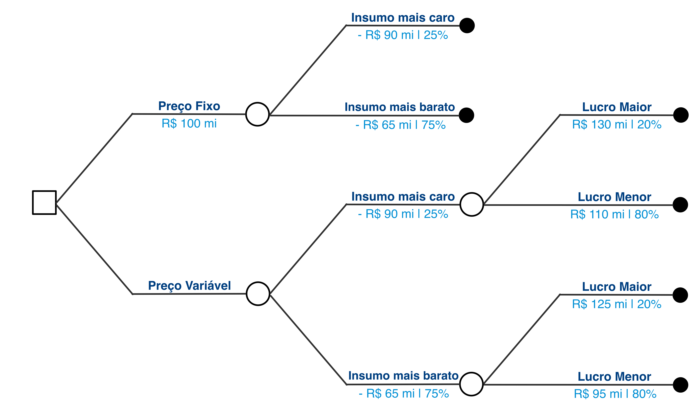
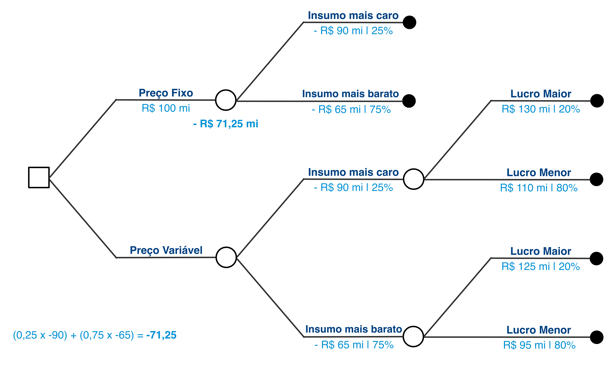
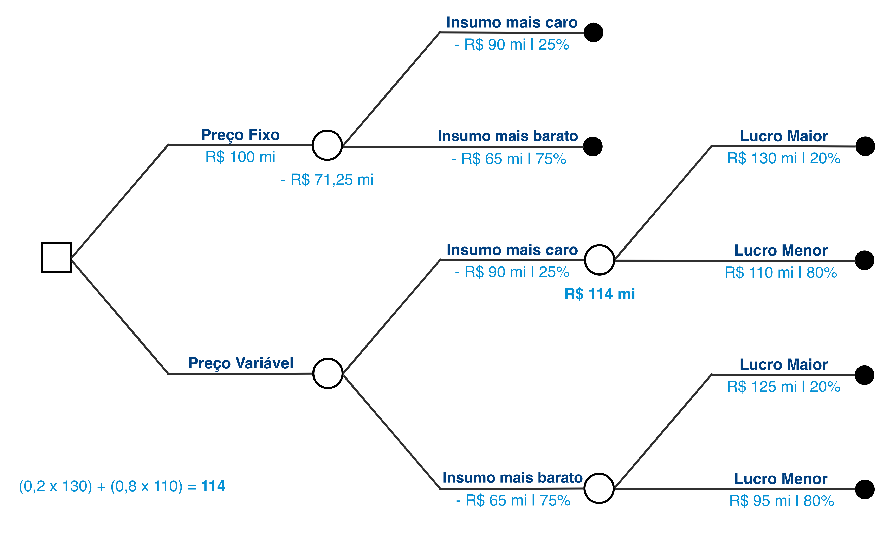
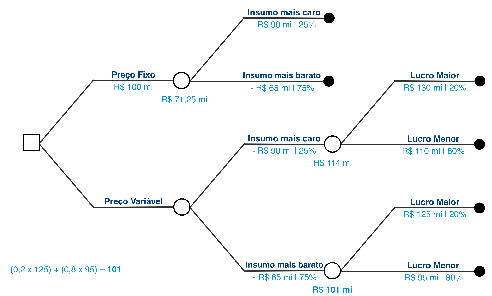
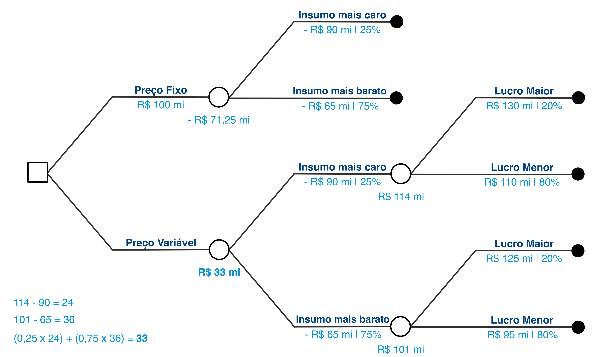
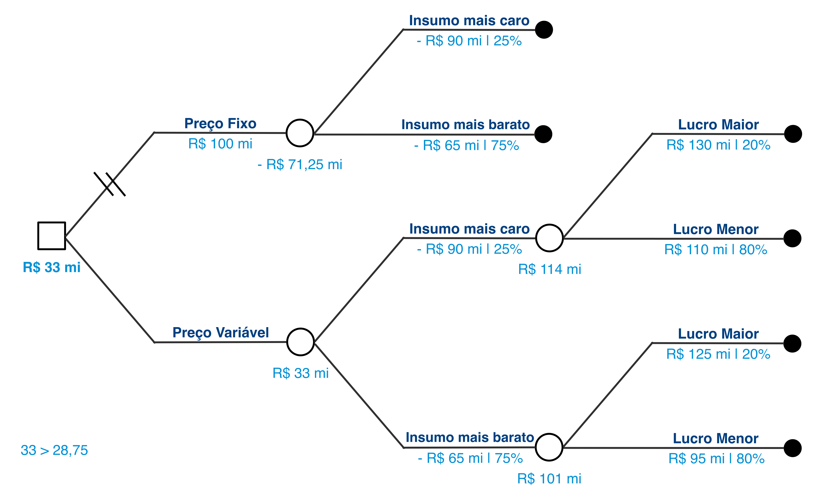

# Aula 7 - Cooperação, equilíbrio de Nash e jogos repetitivos
**Teoria da Decisão – 2023.1**
Lucas Thevenard

---
<!-- 
paginate: true 
header: Aula 7 - Cooperação, equilíbrio de Nash e jogos repetitivos
footer: lucas.gomes@fgv.br | 25/04/2023
-->

## Roteiro da aula
- Dilema dos prisioneiros
- O problema da cooperação
- Correção da prova

---

# 1. Dilema dos prisioneiros

---

## Dilema dos prisioneiros

- Dois empresários (Mike Batista e Nestor Doleró) são suspeitos de terem cometido o crime de corrupção ativa (art. 333 do CP: pena de até 12 anos de reclusão).
  - A polícia detêm evidências de que eles cometeram o crime de falsidade ideológica em documento particular (art. 299 do CP: até 3 anos de reculsão) além de inúmeros outros crimes menores.
  - A polícia separa os dois e oferece acordo de delação premiada para obter confissões pelo crime de corrupção. 

---

<b style="color: #058ED0;">Mike Batista</b>

<b style="color: #003E7E; text-align: center;">Nestor Doleró</b>

<table>
  <tr class="game action player2"> 
    <td></td>
    <td>Confessar</td>
    <td>Não Confessar</td>
  </tr>
  <tr>
    <td class="game action player1">Confessar</td>
    <td class="game">(&nbsp;
      -9, 
      -9
    &nbsp;)</td>
    <td class="game">(&nbsp;
      -4, 
      -15
    &nbsp;)</td>
  </tr>
  <tr>
    <td class="game action player1">Não confessar</td>
    <td class="game">(&nbsp;
      -15, 
      -4
    &nbsp;)</td>
    <td class="game">(&nbsp;
      -5, 
      -5
    &nbsp;)</td>
  </tr>
</table>

---

<b style="color: #058ED0;">Mike Batista</b>

<b style="color: #003E7E; text-align: center;">Nestor Doleró</b>

<table>
  <tr class="game action player2"> 
    <td></td>
    <td>Confessar</td>
    <td>Não Confessar</td>
  </tr>
  <tr>
    <td class="game action player1">Confessar</td>
    <td class="game">(&nbsp;
      -9, 
      -9
    &nbsp;)</td>
    <td class="game">(&nbsp;
      -4, 
      -15
    &nbsp;)</td>
  </tr>
  <tr>
    <td class="game action player1">Não confessar</td>
    <td class="game">(&nbsp;
      -15, 
      -4
    &nbsp;)</td>
    <td class="game">(&nbsp;
      -5, 
      -5
    &nbsp;)</td>
  </tr>
</table>

---

<b style="color: #058ED0;">Mike Batista</b>

<b style="color: #003E7E; text-align: center;">Nestor Doleró</b>

<table>
  <tr class="game action player2"> 
    <td></td>
    <td>Confessar</td>
    <td>Não Confessar</td>
  </tr>
  <tr>
    <td class="game action player1">Confessar</td>
    <td class="game">(&nbsp;
      -9, 
      -9
    &nbsp;)</td>
    <td class="game">(&nbsp;
      -4, 
      -15
    &nbsp;)</td>
  </tr>
  <tr>
    <td class="game action player1">Não confessar</td>
    <td class="game">(&nbsp;
      -15, 
      -4
    &nbsp;)</td>
    <td class="game">(&nbsp;
      -5, 
      -5
    &nbsp;)</td>
  </tr>
</table>

---

<b style="color: #058ED0;">Mike Batista</b>

<b style="color: #003E7E; text-align: center;">Nestor Doleró</b>

<table>
  <tr class="game action player2"> 
    <td></td>
    <td>Confessar</td>
    <td>Não Confessar</td>
  </tr>
  <tr>
    <td class="game action player1">Confessar</td>
    <td class="game">(&nbsp;
      -9, 
      -9
    &nbsp;)</td>
    <td class="game">(&nbsp;
      -4, 
      -15
    &nbsp;)</td>
  </tr>
  <tr>
    <td class="game action player1">Não confessar</td>
    <td class="game">(&nbsp;
      -15, 
      -4
    &nbsp;)</td>
    <td class="game">(&nbsp;
      -5, 
      -5
    &nbsp;)</td>
  </tr>
</table>

---

<b style="color: #058ED0;">Mike Batista</b>

<b style="color: #003E7E; text-align: center;">Nestor Doleró</b>

<table>
  <tr class="game action player2"> 
    <td></td>
    <td>Confessar</td>
    <td>Não Confessar</td>
  </tr>
  <tr>
    <td class="game action player1">Confessar</td>
    <td class="game">(&nbsp;
      -9, 
      -9
    &nbsp;)</td>
    <td class="game">(&nbsp;
      -4, 
      -15
    &nbsp;)</td>
  </tr>
  <tr>
    <td class="game action player1">Não confessar</td>
    <td class="game">(&nbsp;
      -15, 
      -4
    &nbsp;)</td>
    <td class="game">(&nbsp;
      -5, 
      -5
    &nbsp;)</td>
  </tr>
</table>

---

<b style="color: #058ED0;">Mike Batista</b>

<b style="color: #003E7E; text-align: center;">Nestor Doleró</b>

<table>
  <tr class="game action player2"> 
    <td></td>
    <td>Confessar</td>
    <td>Não Confessar</td>
  </tr>
  <tr>
    <td class="game action player1">Confessar</td>
    <td class="game">(&nbsp;
      -9, 
      -9
    &nbsp;)</td>
    <td class="game">(&nbsp;
      -4, 
      -15
    &nbsp;)</td>
  </tr>
  <tr>
    <td class="game action player1">Não confessar</td>
    <td class="game">(&nbsp;
      -15, 
      -4
    &nbsp;)</td>
    <td class="game">(&nbsp;
      -5, 
      -5
    &nbsp;)</td>
  </tr>
</table>

---

<b style="color: #058ED0;">Mike Batista</b>

<b style="color: #003E7E; text-align: center;">Nestor Doleró</b>

<table>
  <tr class="game action player2"> 
    <td></td>
    <td>Confessar</td>
    <td>Não Confessar</td>
  </tr>
  <tr>
    <td class="game action player1">Confessar</td>
    <td class="game">(&nbsp;
      -9, 
      -9
    &nbsp;)</td>
    <td class="game">(&nbsp;
      -4, 
      -15
    &nbsp;)</td>
  </tr>
  <tr>
    <td class="game action player1">Não confessar</td>
    <td class="game">(&nbsp;
      -15, 
      -4
    &nbsp;)</td>
    <td class="game">(&nbsp;
      -5, 
      -5
    &nbsp;)</td>
  </tr>
</table>

---

<b style="color: #058ED0;">Mike Batista</b>

<b style="color: #003E7E; text-align: center;">Nestor Doleró</b>

<table>
  <tr class="game action player2"> 
    <td></td>
    <td>Confessar*</td>
    <td>Não Confessar</td>
  </tr>
  <tr>
    <td class="game action player1">Confessar*</td>
    <td class="game">(&nbsp;
      -9, 
      -9
    &nbsp;)</td>
    <td class="game">(&nbsp;
      -4, 
      -15
    &nbsp;)</td>
  </tr>
  <tr>
    <td class="game action player1">Não confessar</td>
    <td class="game">(&nbsp;
      -15, 
      -4
    &nbsp;)</td>
    <td class="game">(&nbsp;
      -5, 
      -5
    &nbsp;)</td>
  </tr>
</table>

 

Solução: **( Confessar , Confessar )**

---

### Estrutura do Dilema dos Prisioneiros Simples
 

<table>
  <tr class="game action player2"> 
    <td></td>
    <td>Não Cooperar</td>
    <td>Cooperar</td>
  </tr>
  <tr>
    <td class="game action player1">Não Cooperar</td>
    <td class="game">(&nbsp;
      DB, 
      DB
    &nbsp;)</td>
    <td class="game">(&nbsp;
      TB, 
      WC
    &nbsp;)</td>
  </tr>
  <tr>
    <td class="game action player1">Cooperar</td>
    <td class="game">(&nbsp;
      WC, 
      TB
    &nbsp;)</td>
    <td class="game">(&nbsp;
      PO, 
      PO
    &nbsp;)</td>
  </tr>
</table>

**TB > PO > DB > WC**

TB - *tempting betrayal*
PO - *pareto optimal*
DB - *defensive betrayal*
WC - *worst-case cenario*

---

## Jogos e cooperação
* No dilema dos prisioneiros, os jogadores deixam de atingir a solução Pareto-eficiente.
* Situação do jogo gera incentivos contrários à cooperação.
* Implicações significativas para o pensamento social e econômico.

---

# 2. O problema da cooperação

---

> Sob que condições a cooperação pode emergir em um mundo de egoistas sem que exista uma autoridade central? Essa pergunta já intrigou a muitos, por um longo tempo. Sabemos que as pessoas não são anjos, que elas tendem a cuidar de si mesmas e dos seus em primeiro lugar. No entanto, também sabemos que a cooperação acontece e que a civilização se baseia nela. Mas, em situações em que cada indivíduo tem incentivos para agir de forma egoísta, como a cooperação pode surgir?
> A resposta que cada um de nós dá a essa pergunta tem um efeito fundamental sobre como pensamos e agimos em nossas relações sociais, políticas e econômicas com os demais. E as respostas que os outros dão têm também um efeito direto sobre o quanto eles estão dispostos a cooperar conosco.  
> Robert Axelrod, **The Evolution of Cooperation**

---

## Impossibilidade de cooperação

* **Jogos de soma zero**: competição estrita, os ganhos de um jogador representam perdas do outro jogador.
  - A soma de todos os payoffs do jogo é igual a zero.
* **Jogos de soma positiva/negativa**: possibilidade de cooperação, ainda que moderada, pois os payoffs não somam zero.
  - Possibilidade de que ambos os jogadores ganhem (ou deixem de perder).

---

<table>
  <tr class="game action player2"> 
    <td></td>
    <td>P</td>
    <td>I</td>
  </tr>
  <tr>
    <td class="game action player1">P</td>
    <td class="game">(&nbsp;
      1, 
      -1
    &nbsp;)</td>
    <td class="game">(&nbsp;
      -1, 
      1
    &nbsp;)</td>
  </tr>
  <tr>
    <td class="game action player1">I</td>
    <td class="game">(&nbsp;
      -1, 
      1
    &nbsp;)</td>
    <td class="game">(&nbsp;
      1, 
      -1
    &nbsp;)</td>
  </tr>
</table>

---

### Repetição de jogos e incentivos à cooperação

#### **Jogo 1**

<table>
  <tr class="game action player2"> 
    <td></td>
    <td>C</td>
    <td>NC</td>
  </tr>
  <tr>
    <td class="game action player1">C</td>
    <td class="game">(&nbsp;
      3, 
      3
    &nbsp;)</td>
    <td class="game">(&nbsp;
      1, 
      4
    &nbsp;)</td>
  </tr>
  <tr>
    <td class="game action player1">NC</td>
    <td class="game">(&nbsp;
      4, 
      1
    &nbsp;)</td>
    <td class="game">(&nbsp;
      2, 
      2
    &nbsp;)</td>
  </tr>
</table>

#### **Jogo 2**

<table>
  <tr class="game action player2"> 
    <td></td>
    <td>C</td>
    <td>NC</td>
  </tr>
  <tr>
    <td class="game action player1">C</td>
    <td class="game">(&nbsp;
      3, 
      3
    &nbsp;)</td>
    <td class="game">(&nbsp;
      1, 
      4
    &nbsp;)</td>
  </tr>
  <tr>
    <td class="game action player1">NC</td>
    <td class="game">(&nbsp;
      4, 
      1
    &nbsp;)</td>
    <td class="game">(&nbsp;
      2, 
      2
    &nbsp;)</td>
  </tr>
</table>

#### **Jogo 3**

<table>
  <tr class="game action player2"> 
    <td></td>
    <td>C</td>
    <td>NC</td>
  </tr>
  <tr>
    <td class="game action player1">C</td>
    <td class="game">(&nbsp;
      3, 
      3
    &nbsp;)</td>
    <td class="game">(&nbsp;
      1, 
      4
    &nbsp;)</td>
  </tr>
  <tr>
    <td class="game action player1">NC</td>
    <td class="game">(&nbsp;
      4, 
      1
    &nbsp;)</td>
    <td class="game">(&nbsp;
      2, 
      2
    &nbsp;)</td>
  </tr>
</table>

---

### Repetição de jogos e incentivos à cooperação

#### **Jogo 1**

<table>
  <tr class="game action player2"> 
    <td></td>
    <td>C</td>
    <td>NC</td>
  </tr>
  <tr>
    <td class="game action player1">C</td>
    <td class="game">(&nbsp;
      3, 
      3
    &nbsp;)</td>
    <td class="game">(&nbsp;
      1, 
      4
    &nbsp;)</td>
  </tr>
  <tr>
    <td class="game action player1">NC</td>
    <td class="game">(&nbsp;
      4, 
      1
    &nbsp;)</td>
    <td class="game">(&nbsp;
      2, 
      2
    &nbsp;)</td>
  </tr>
</table>

#### **Jogo 2**

<table>
  <tr class="game action player2"> 
    <td></td>
    <td>C</td>
    <td>NC</td>
  </tr>
  <tr>
    <td class="game action player1">C</td>
    <td class="game">(&nbsp;
      3, 
      3
    &nbsp;)</td>
    <td class="game">(&nbsp;
      1, 
      4
    &nbsp;)</td>
  </tr>
  <tr>
    <td class="game action player1">NC</td>
    <td class="game">(&nbsp;
      4, 
      1
    &nbsp;)</td>
    <td class="game">(&nbsp;
      2, 
      2
    &nbsp;)</td>
  </tr>
</table>

#### **Jogo 3**

<table>
  <tr class="game action player2"> 
    <td></td>
    <td>C</td>
    <td>NC</td>
  </tr>
  <tr>
    <td class="game action player1">C</td>
    <td class="game">(&nbsp;
      3, 
      3
    &nbsp;)</td>
    <td class="game">(&nbsp;
      1, 
      4
    &nbsp;)</td>
  </tr>
  <tr>
    <td class="game action player1">NC</td>
    <td class="game">(&nbsp;
      4, 
      1
    &nbsp;)</td>
    <td class="game">(&nbsp;
      2*, 
      2*
    &nbsp;)</td>
  </tr>
</table>

---

### Repetição de jogos e incentivos à cooperação

#### **Jogo 1**

<table>
  <tr class="game action player2"> 
    <td></td>
    <td>C</td>
    <td>NC</td>
  </tr>
  <tr>
    <td class="game action player1">C</td>
    <td class="game">(&nbsp;
      3, 
      3
    &nbsp;)</td>
    <td class="game">(&nbsp;
      1, 
      4
    &nbsp;)</td>
  </tr>
  <tr>
    <td class="game action player1">NC</td>
    <td class="game">(&nbsp;
      4, 
      1
    &nbsp;)</td>
    <td class="game">(&nbsp;
      2, 
      2
    &nbsp;)</td>
  </tr>
</table>

#### **Jogo 2**

<table>
  <tr class="game action player2"> 
    <td></td>
    <td>C</td>
    <td>NC</td>
  </tr>
  <tr>
    <td class="game action player1">C</td>
    <td class="game">(&nbsp;
      3, 
      3
    &nbsp;)</td>
    <td class="game">(&nbsp;
      1, 
      4
    &nbsp;)</td>
  </tr>
  <tr>
    <td class="game action player1">NC</td>
    <td class="game">(&nbsp;
      4, 
      1
    &nbsp;)</td>
    <td class="game">(&nbsp;
      2*, 
      2*
    &nbsp;)</td>
  </tr>
</table>

#### **Jogo 3**

<table>
  <tr class="game action player2"> 
    <td></td>
    <td>C</td>
    <td>NC</td>
  </tr>
  <tr>
    <td class="game action player1">C</td>
    <td class="game">(&nbsp;
      3, 
      3
    &nbsp;)</td>
    <td class="game">(&nbsp;
      1, 
      4
    &nbsp;)</td>
  </tr>
  <tr>
    <td class="game action player1">NC</td>
    <td class="game">(&nbsp;
      4, 
      1
    &nbsp;)</td>
    <td class="game">(&nbsp;
      2*, 
      2*
    &nbsp;)</td>
  </tr>
</table>

---

### Repetição de jogos e incentivos à cooperação

#### **Jogo 1**

<table>
  <tr class="game action player2"> 
    <td></td>
    <td>C</td>
    <td>NC</td>
  </tr>
  <tr>
    <td class="game action player1">C</td>
    <td class="game">(&nbsp;
      3, 
      3
    &nbsp;)</td>
    <td class="game">(&nbsp;
      1, 
      4
    &nbsp;)</td>
  </tr>
  <tr>
    <td class="game action player1">NC</td>
    <td class="game">(&nbsp;
      4, 
      1
    &nbsp;)</td>
    <td class="game">(&nbsp;
      2*, 
      2*
    &nbsp;)</td>
  </tr>
</table>

#### **Jogo 2**

<table>
  <tr class="game action player2"> 
    <td></td>
    <td>C</td>
    <td>NC</td>
  </tr>
  <tr>
    <td class="game action player1">C</td>
    <td class="game">(&nbsp;
      3, 
      3
    &nbsp;)</td>
    <td class="game">(&nbsp;
      1, 
      4
    &nbsp;)</td>
  </tr>
  <tr>
    <td class="game action player1">NC</td>
    <td class="game">(&nbsp;
      4, 
      1
    &nbsp;)</td>
    <td class="game">(&nbsp;
      2*, 
      2*
    &nbsp;)</td>
  </tr>
</table>

#### **Jogo 3**

<table>
  <tr class="game action player2"> 
    <td></td>
    <td>C</td>
    <td>NC</td>
  </tr>
  <tr>
    <td class="game action player1">C</td>
    <td class="game">(&nbsp;
      3, 
      3
    &nbsp;)</td>
    <td class="game">(&nbsp;
      1, 
      4
    &nbsp;)</td>
  </tr>
  <tr>
    <td class="game action player1">NC</td>
    <td class="game">(&nbsp;
      4, 
      1
    &nbsp;)</td>
    <td class="game">(&nbsp;
      2*, 
      2*
    &nbsp;)</td>
  </tr>
</table>

---

## A triste história dos incentivos à cooperação em jogos repetitivos 😧

* Se o número de repetições é finito, em tese sempre se aplicaria a mesma lógica. 
  - Os jogadores têm incentivos para desertar ao final do jogo, e acaba sendo mais vantajoso desertar o quanto antes, antecipando que o outro irá desertar também.
* Se o jogo é jogado por uma quantidade infinita de vezes, pode valer à pena cooperar. Mesmo nesse caso, a cooperação ainda dependeria:
  - da taxa de desconto dos jogadores e 
  - do tempo entre as repetições.

---

**Mas seres humanos de fato se comportam como a teoria da escolha racional prevê?**

---

**Mas seres humanos de fato se comportam como a teoria da escolha racional prevê?**

---

### Vamos tentar novamente...
 

<table>
  <tr class="game action player2"> 
    <td></td>
    <td>C</td>
    <td>NC</td>
  </tr>
  <tr>
    <td class="game action player1">C</td>
    <td class="game">(&nbsp;
      3, 
      3
    &nbsp;)</td>
    <td class="game">(&nbsp;
      1, 
      4
    &nbsp;)</td>
  </tr>
  <tr>
    <td class="game action player1">NC</td>
    <td class="game">(&nbsp;
      4, 
      1
    &nbsp;)</td>
    <td class="game">(&nbsp;
      2, 
      2
    &nbsp;)</td>
  </tr>
</table>

---

## Estratégias de incentivo à cooperação
* **Estratégia 'olho por olho’** (*tit for tat* strategy)
  - Comece cooperando
  - Em seguida, faça o que o outro jogador fez na jogada anterior
  - Não tente ser muito esperto
* **Estratégia impiedosa** (*grim* strategy)
  - Comece cooperando e continue enquanto o outro jogador também cooperar
  - Se o outro jogador furar a cooperação, nunca mais coopere

---

## Axelrod: cooperação em condições improváveis

* Guerra de trincheiras (1ª GM) – emergência do sistema “viva e deixe viver”.
  - Anistia espontânea: soldados deixavam de lutar para vencer e passavam a cooperar com o exército inimigo.
* Geoffrey Dugdale (capitão inglês): “Fiquei surpreso ao observar soldados alemães andando ao alcance de um tiro de rifle, em suas próprias linhas. Nossos homens pareciam não notar… Os dois lados evidentemente não sabiam que uma guerra estava acontecendo. Ambos os lados pareciam acreditar na política de ‘viva e deixe viver’".
* Tony Ashworth estudou o fenômeno e concluiu que TODAS as 57 linhas de trincheiras reproduziram o sistema do “viva e deixe viver”.

---

## Axelrod: cooperação em condições improváveis

- Emprego da estratégia tit for tat foi tão efetivo que os aliados tiveram que adotar políticas para tentar forçar o retorno ao conflito.
  - Espólios de guerra alemães (não funcionou)
  - Corpos de soldados abatidos
  - Retorno gradual aos conflitos, desilusão dos soldados com a guerra.

---

## Cooperação em jogos competitivos

- Por que seres humanos não se comportam como a teoria prevê?
  * Irracionalidade?
  * Um jogo social mais amplo?
  * Preferência pela cooperação (evolução da espécie)?

---

### Correção da prova

---

## Questão 1 – Contrato da Elon e da AsiMove

---

---

---

---

---

---

---

## Questão 2 – Dilema de Collingridge como um problema de decisão sob ignorância

---

### A) Maximin
 

_                 | Previsão incorreta | Previsão parc. correta | Previsão correta
------------------|:------------------:|:----------------------:|:-----------------:
Antes da adoção   | -10                | 30                     | 60
Adoção ampla      | 10                 | 20                     | 40
Após consolidação | 20                 | 20                     | 20

---

### A) Maximin
 

_                 | Previsão incorreta | Previsão parc. correta | Previsão correta
------------------|:------------------:|:----------------------:|:-----------------:
Antes da adoção   | **-10 ✶**          | 30                     | 60
Adoção ampla      | **10 ✶**           | 20                     | 40
Após consolidação | **20 ✶**           | 20                     | 20

---

### A) Maximin
 

_                        | Previsão incorreta | Previsão parc. correta | Previsão correta
-------------------------|:------------------:|:----------------------:|:-----------------:
Antes da adoção          | **-10 ✶**          | 30                     | 60
Adoção ampla             | **10 ✶**           | 20                     | 40
**Após consolidação ✶✶** | **20 ✶**           | 20                     | 20

#### Solução (Maximin): **"Após a tecnologia se consolidar"** 

---

### B) Minimax
 

_                 | Previsão incorreta | Previsão parc. correta | Previsão correta
------------------|:------------------:|:----------------------:|:-----------------:
Antes da adoção   | -10                | 30                     | 60
Adoção ampla      | 10                 | 20                     | 40
Após consolidação | 20                 | 20                     | 20

---

### B) Minimax
 

#### Tabela de Arrependimento

_                 | Previsão incorreta | Previsão parc. correta | Previsão correta
------------------|:------------------:|:----------------------:|:-----------------:
Antes da adoção   | 20 + 10            | 30 - 30                | 60 - 60
Adoção ampla      | 20 - 10            | 30 - 20                | 60 - 40
Após consolidação | 20 - 20            | 30 - 20                | 60 - 20

---

### B) Minimax 
 

#### Tabela de Arrependimento

_                 | Previsão incorreta | Previsão parc. correta | Previsão correta
------------------|:------------------:|:----------------------:|:-----------------:
Antes da adoção   | 30                 | 0                      | 0
Adoção ampla      | 10                 | 10                     | 20
Após consolidação | 0                  | 10                     | 40

---

### B) Minimax 
 

#### Tabela de Arrependimento

_                 | Previsão incorreta | Previsão parc. correta | Previsão correta
------------------|:------------------:|:----------------------:|:-----------------:
Antes da adoção   | **30 ✶**           | 0                      | 0
Adoção ampla      | 10                 | 10                     | **20 ✶**
Após consolidação | 0                  | 10                     | **40 ✶**

---

### B) Minimax 
 

#### Tabela de Arrependimento

_                   | Previsão incorreta | Previsão parc. correta | Previsão correta
--------------------|:------------------:|:----------------------:|:-----------------:
Antes da adoção     | **30 ✶**           | 0                      | 0
**Adoção ampla ✶✶** | 10                 | 10                     | **20 ✶**
Após consolidação   | 0                  | 10                     | **40 ✶**

#### Solução (Minimax): **"Quando a adoção se torna ampla"**

---

### C) Regra de otimismo

_                 | Previsão incorreta | Previsão parc. correta | Previsão correta
------------------|:------------------:|:----------------------:|:-----------------:
Antes da adoção   | -10                | 30                     | 60
Adoção ampla      | 10                 | 20                     | 40
Após consolidação | 20                 | 20                     | 20

---

### C) Regra de otimismo

_                 | Previsão incorreta | Previsão parc. correta | Previsão correta
------------------|:------------------:|:----------------------:|:-----------------:
Antes da adoção   | -10                | 30                     | 60
Adoção ampla      | 10                 | 20                     | 40
Após consolidação | 20                 | 20                     | 20

 

$$V_{Antes} = (0,2 \, \times \, 60) + (0,8 \, \times \, -10) = 12 - 8 = 4$$

$$V_{Ampla} = (0,2 \, \times \, 40) + (0,8 \, \times \, 10) = 8 + 8 = 16$$

$$V_{Consol} = (0,2 \, \times \, 20) + (0,8 \, \times \, 20) = 20$$

---

### C) Regra de otimismo

_                        | Previsão incorreta | Previsão parc. correta | Previsão correta
-------------------------|:------------------:|:----------------------:|:---------------:
Antes da adoção          | -10                | 30                     | 60
Adoção ampla             | 10                 | 20                     | 40
**Após consolidação ✶✶** | 20                 | 20                     | 20

 

$$V_{Antes} = (0,2 \, \times \, 60) + (0,8 \, \times \, -10) = 12 - 8 = 4$$

$$V_{Ampla} = (0,2 \, \times \, 40) + (0,8 \, \times \, 10) = 8 + 8 = 16$$

$$\color{Orange} V_{Consol} = (0,2 \, \times \, 20) + (0,8 \, \times \, 20) = 20$$

#### Solução (Otimismo): **"Após a tecnologia se consolidar"**

---

### D) Postulado da Razão Insuficiente

_                 | Previsão incorreta | Previsão parc. correta | Previsão correta
------------------|:------------------:|:----------------------:|:-----------------:
Antes da adoção   | -10                | 30                     | 60
Adoção ampla      | 10                 | 20                     | 40
Após consolidação | 20                 | 20                     | 20

---

### D) Postulado da Razão Insuficiente

_                 | Previsão incorreta | Previsão parc. correta | Previsão correta
------------------|:------------------:|:----------------------:|:-----------------:
Antes da adoção   | -10                | 30                     | 60
Adoção ampla      | 10                 | 20                     | 40
Após consolidação | 20                 | 20                     | 20

 

$$V_{Antes} = 30 + 60 - 10 = 80$$

$$V_{Ampla} = 10 + 20 + 40 = 70$$

$$V_{Consol} = 20 + 20 + 20 = 60$$

---

### D) Postulado da Razão Insuficiente

_                 | Previsão incorreta | Previsão parc. correta | Previsão correta
------------------|:------------------:|:----------------------:|:-----------------:
Antes da adoção   | -10                | 30                     | 60
Adoção ampla      | 10                 | 20                     | 40
Após consolidação | 20                 | 20                     | 20

 

$$\color{Orange}V_{Antes} = 30 + 60 - 10 = 80$$

$$V_{Ampla} = 10 + 20 + 40 = 70$$

$$V_{Consol} = 20 + 20 + 20 = 60$$

#### Solução (Otimismo): **"Antes da adoção ampla"**

---

### E) A = ?

_                   | Previsão incorreta | Previsão parc. correta | Previsão correta
--------------------|:------------------:|:----------------------:|:-----------------:
Antes da adoção     | -10                | 30                     | 60
**Adoção ampla ✶✶** | 10                 | 20                     | 40
Após consolidação   | 20                 | 20                     | 20

 

$$V_{Antes} = 60a + (1 - a)(-10) = 70a - 10$$
$$V_{Ampla} = 40a + (1 - a)(10) = 30a + 10$$
$$V_{Consol} = 20a + (1 - a)(20) = 20$$

---

$$V_{Ampla} > V_{Consol} \implies 30a + 10 > 20$$
$$30a > 10 \,\, , \,\, a > \frac{10}{30}$$
$$\color{Orange}a > \frac{1}{3}$$

 

$$V_{Ampla} > V_{Antes} \implies 30a + 10 > 70a - 10$$
$$20 > 40a \,\, , \,\, a < \frac{20}{40}$$
$$\color{Orange}a < \frac{1}{2}$$

---

### E) A = ?

_                   | Previsão incorreta | Previsão parc. correta | Previsão correta
--------------------|:------------------:|:----------------------:|:-----------------:
Antes da adoção     | -10                | 30                     | 60
**Adoção ampla ✶✶** | 10                 | 20                     | 40
Após consolidação   | 20                 | 20                     | 20

 

#### Solução (valores do nível de otimismo):
 

$$\color{RoyalBlue}\frac{1}{3} < a < \frac{1}{2}$$

---

## Questão 3: Solução do Jogo por dominância

---

<b style="color: #058ED0;">Jogador 1</b>

<b style="color: #003E7E; text-align: center;">Jogador 2</b>

<table>
  <tr class="game action player2"> 
    <td></td>
    <td>C</td>
    <td>D</td>
  </tr>
  <tr>
    <td class="game action player1">A</td>
    <td class="game">(&nbsp;
      8, 
      10
    &nbsp;)</td>
    <td class="game">(&nbsp;
      0, 
      12
    &nbsp;)</td>
  </tr>
  <tr>
    <td class="game action player1">B</td>
    <td class="game">(&nbsp;
      12, 
      6
    &nbsp;)</td>
    <td class="game">(&nbsp;
      2, 
      4
    &nbsp;)</td>
  </tr>
</table>

---

<b style="color: #058ED0;">Jogador 1</b>

<b style="color: #003E7E; text-align: center;">Jogador 2</b>

<table>
  <tr class="game action player2"> 
    <td></td>
    <td>C</td>
    <td>D</td>
  </tr>
  <tr>
    <td class="game action player1">A</td>
    <td class="game">(&nbsp;
      8, 
      10
    &nbsp;)</td>
    <td class="game">(&nbsp;
      0, 
      12
    &nbsp;)</td>
  </tr>
  <tr>
    <td class="game action player1">B</td>
    <td class="game">(&nbsp;
      12, 
      6
    &nbsp;)</td>
    <td class="game">(&nbsp;
      2, 
      4
    &nbsp;)</td>
  </tr>
</table>

---

<b style="color: #058ED0;">Jogador 1</b>

<b style="color: #003E7E; text-align: center;">Jogador 2</b>

<table>
  <tr class="game action player2"> 
    <td></td>
    <td>C</td>
    <td>D</td>
  </tr>
  <tr>
    <td class="game action player1">A</td>
    <td class="game">(&nbsp;
      8, 
      10
    &nbsp;)</td>
    <td class="game">(&nbsp;
      0, 
      12
    &nbsp;)</td>
  </tr>
  <tr>
    <td class="game action player1">B</td>
    <td class="game">(&nbsp;
      12, 
      6
    &nbsp;)</td>
    <td class="game">(&nbsp;
      2, 
      4
    &nbsp;)</td>
  </tr>
</table>

---

<b style="color: #058ED0;">Jogador 1</b>

<b style="color: #003E7E; text-align: center;">Jogador 2</b>

<table>
  <tr class="game action player2"> 
    <td></td>
    <td>C</td>
    <td>D</td>
  </tr>
  <tr>
    <td class="game action player1">A</td>
    <td class="game">(&nbsp;
      8, 
      10
    &nbsp;)</td>
    <td class="game">(&nbsp;
      0, 
      12
    &nbsp;)</td>
  </tr>
  <tr>
    <td class="game action player1">B</td>
    <td class="game">(&nbsp;
      12, 
      6
    &nbsp;)</td>
    <td class="game">(&nbsp;
      2, 
      4
    &nbsp;)</td>
  </tr>
</table>

---

<b style="color: #058ED0;">Jogador 1</b>

<b style="color: #003E7E; text-align: center;">Jogador 2</b>

<table>
  <tr class="game action player2"> 
    <td></td>
    <td>C</td>
    <td>D</td>
  </tr>
  <tr>
    <td class="game action player1 eliminated">A</td>
    <td class="game eliminated">(&nbsp;
      8, 
      10
    &nbsp;)</td>
    <td class="game eliminated">(&nbsp;
      0, 
      12
    &nbsp;)</td>
  </tr>
  <tr>
    <td class="game action player1">B</td>
    <td class="game">(&nbsp;
      12, 
      6
    &nbsp;)</td>
    <td class="game">(&nbsp;
      2, 
      4
    &nbsp;)</td>
  </tr>
</table>

---

<b style="color: #058ED0;">Jogador 1</b>

<b style="color: #003E7E; text-align: center;">Jogador 2</b>

<table>
  <tr class="game action player2"> 
    <td></td>
    <td>C</td>
    <td>D</td>
  </tr>
  <tr>
    <td class="game action player1 eliminated">A</td>
    <td class="game eliminated">(&nbsp;
      8, 
      10
    &nbsp;)</td>
    <td class="game eliminated">(&nbsp;
      0, 
      12
    &nbsp;)</td>
  </tr>
  <tr>
    <td class="game action player1">B</td>
    <td class="game">(&nbsp;
      12, 
      6
    &nbsp;)</td>
    <td class="game">(&nbsp;
      2, 
      4
    &nbsp;)</td>
  </tr>
</table>

---

<b style="color: #058ED0;">Jogador 1</b>

<b style="color: #003E7E; text-align: center;">Jogador 2</b>

<table>
  <tr class="game action player2"> 
    <td></td>
    <td>C</td>
    <td>D</td>
  </tr>
  <tr>
    <td class="game action player1">A</td>
    <td class="game">(&nbsp;
      8, 
      10
    &nbsp;)</td>
    <td class="game">(&nbsp;
      0, 
      12
    &nbsp;)</td>
  </tr>
  <tr>
    <td class="game action player1">B</td>
    <td class="game">(&nbsp;
      12, 
      6
    &nbsp;)</td>
    <td class="game">(&nbsp;
      2, 
      4
    &nbsp;)</td>
  </tr>
</table>

#### Solução: **( B, C )**

---

### OBS: Não use os valores para indicar sua resposta!
 
 

<table>
  <tr class="game action player2"> 
    <td></td>
    <td>C</td>
    <td>D</td>
  </tr>
  <tr>
    <td class="game action player1">A</td>
    <td class="game">(&nbsp;
      8, 
      8
    &nbsp;)</td>
    <td class="game">(&nbsp;
      10, 
      5
    &nbsp;)</td>
  </tr>
  <tr>
    <td class="game action player1">B</td>
    <td class="game">(&nbsp;
      10, 
      5
    &nbsp;)</td>
    <td class="game">(&nbsp;
      12, 
      4
    &nbsp;)</td>
  </tr>
</table>

---

## Questão 4 – Verdadeiro ou falso

R  | Afirmativa
---|:-------------
⛔ | A) O método Minimax é o único que admite a utilização de uma escala ordinal de preferências.
✅ | B) É comum criticar-se o pressuposto de equiprobabilidade assumido pelo Postulado da Razão Insuficiente, uma vez que essa condição seria, em si mesma, improvável.
⛔ | C) O método Maximin admite que a inclusão de uma nova alternativa que não é escolhida altere a decisão tomada.
⛔ | D) O Paradoxo de Condorcet ocorre quando um grupo de decisores ranqueiam coletivamente um conjunto de opções, dentre as quais uma é selecionada como a melhor opção, preferível às demais.

---

R  | Afirmativa
---|:-------------
✅ | E) A Regra de Otimismo-Pessimismo pode ser considerada uma generalização do método Maximin.
⛔ | F) O consequencialismo é uma teoria utilitarista utilizada pela Análise Econômica do Direito (AED) para analisar os efeitos econômicos das normas jurídicas.
✅ | G) O método Minimax admite que permutações de valores entre os estados do mundo produzam soluções distintas para o problema decisório, ainda que tenhamos nenhuma informação sobre a probabilidade dos estados do mundo.
✅ | H) A tentativa de fundamentar com rigor o processo de especificação de um problema decisório por meio da própria Teoria da Decisão nos levaria a infinitas decisões de ordens superiores (segunda ordem, terceira ordem, etc), impondo uma limitação lógica à possibilidade de fundamentação racional das nossas decisões.

---

## Questão 5 – estrutura de um argumento consequencialista e seus desafios

---

## Forma do argumento consequencialista

* **Ponto de vista**: A ação X é desejável
* **Porque**: A ação X produz a consequência Y (_afirmação empírica/positiva_)
* **E**: A consequência Y é desejável (_afirmação normativa_)
##### FETERIS, E. 2002. A pragma-dialectical approach of the analysis and evaluation of pragmatic argumentation in a legal context. Argumentation 16: 349–367, p. 355.

 

#### **OBS: Aula 1, slide 23**

---

## Componentes e dimensões dos args. consequencialistas
* **Dimensões**:
  * Positiva: quais são as consequências das alternativas de ação disponíveis?
  * Normativa: quais consequências são mais ou menos desejáveis?
* **Componentes**:
  * Alternativas de ação (dimensão positiva)
  * Consequências vinculadas às alternativas (dimensão positiva)
  * Relação de preferência entre as consequências (dimensão normativa)

 

#### **OBS: Aula 2, slide 17**

---

## Problemas da Dimensão Positiva
- Especificação de problemas decisórios
  - Identificação das alternativas de decisão
  - Identificação das possíveis consequências/eventualidades
- Desconhecimento do futuro: erros de prognose
- Cadeias de eventos e a falácia do efeito-dominó

 

#### **OBS: Aula 2, slide 19**

---

## Problemas da dimensão normativa
* Seleção dos critérios de valoração
* Definição do sentido concreto desses critérios
* Resolução de conflitos entre os critérios escolhidos

 

#### **OBS: Aula 2, slide 29**

---

## Questão extra

Como garantir resultados diversos das alternativas? Cada alternativa deve ter as características necessárias para "vencer" por um método, sem se tornar muito "forte" pelos os outros métodos.

- **Maximin**: Tem o maior menor valor (mas os demais podem ser baixos)
- **Minimax**: Tem um valor alto justamente no estado do mundo em que as demais têm valores baixos (gerando alto arrependimento para as demais).
- **Postulado da Razão Insuficiente**: Valores intermediários mais altos, que garantem a maior soma entre os estados do mundo.
- **Regra do Otimismo** Importa apenas o maior e o menor valor (comparar com a alternativa que venceu o minimax). Escolher o nível de otimismo adequado.
