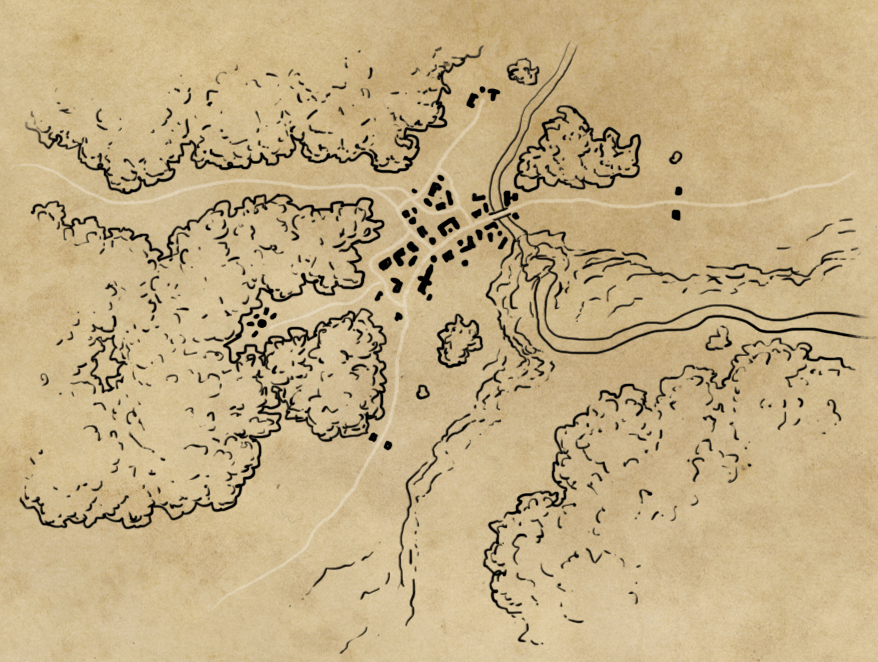

# Aula 8 – O problema da coordenação 
**Teoria da Decisão – 2023.1**
Lucas Thevenard

---
<!-- 
paginate: true 
header: Aula 8 – O problema da coordenação
footer: lucas.gomes@fgv.br | 02/05/2023
-->

### Correção dos Exercícios

---

## Exercício 1.1

"Em um caso envolvendo possíveis danos por erro médico no valor de R$ 200.000,00, o autor e o réu podem contratar assistentes técnicos especializados (por honorários de R$25.000,00) para auxiliá-los com a preparação da perícia. Se apenas uma das partes utilizar assistente, ela terá uma vantagem no processo, e sua probabilidade de ganhar a causa será de 70%. Por outro lado, tanto se ambas contratam assistente como ou se ambas não o contratam, as chances de sucesso de cada uma permanecem equivalentes (cada parte terá 50% de chance de ganhar a causa). Ambas as partes são neutras em relação ao risco."

---

## OBS: Construindo um jogo...
- Identificar os jogadores
- Identificar todas as estratégias de cada jogador
- Avaliar cada par de estratégias dos jogadores com cuidado

---

## Exercício 1.1 – Elementos básicos

* Quem são os jogadores? 
  * Autor e Réu.
* Quais sãos as estratégias do autor e do réu? 
  * Contratar o assistente técnico, ou não contratar o assistente técnico.

---

## Exercício 1.1 – Avaliação dos payoffs

- Se ambos contratam:
  * Qual é o payoff do autor da ação?
    * (0,5 x 200) - 25 = 75
  * Qual é o payoff do réu da ação?
    * (0,5 x -200) - 25 = -125

---

### Exercício 1.1 – Jogo
 

<b style="color: #058ED0;">Autor</b>

<b style="color: #003E7E; text-align: center;">Réu</b>

<table>
  <tr class="game action player2"> 
    <td></td>
    <td>Contrata</td>
    <td>Não contrata</td>
  </tr>
  <tr>
    <td class="game action player1" style="width: 180px;">Contrata</td>
    <td class="game">(&nbsp;
      75, 
      -125
    &nbsp;)</td>
    <td class="game">(&nbsp;
      ?, 
      ?
    &nbsp;)</td>
  </tr>
  <tr>
    <td class="game action player1">Não contrata</td>
    <td class="game">(&nbsp;
      ?, 
      ?
    &nbsp;)</td>
    <td class="game">(&nbsp;
      ?, 
      ?
    &nbsp;)</td>
  </tr>
</table>

---

## Exercício 1.1 – Avaliação dos payoffs

- Se o autor contrata, mas o réu não contrata:
  * Qual é o payoff do autor da ação?
    * (0,7 x 200) - 25 = 115
  * Qual é o payoff do réu da ação?
    * 0,7 x -200 = -140

---

### Exercício 1.1 – Jogo
 

<b style="color: #058ED0;">Autor</b>

<b style="color: #003E7E; text-align: center;">Réu</b>

<table>
  <tr class="game action player2"> 
    <td></td>
    <td>Contrata</td>
    <td>Não contrata</td>
  </tr>
  <tr>
    <td class="game action player1" style="width: 180px;">Contrata</td>
    <td class="game">(&nbsp;
      75, 
      -125
    &nbsp;)</td>
    <td class="game">(&nbsp;
      115, 
      -140
    &nbsp;)</td>
  </tr>
  <tr>
    <td class="game action player1">Não contrata</td>
    <td class="game">(&nbsp;
      ?, 
      ?
    &nbsp;)</td>
    <td class="game">(&nbsp;
      ?, 
      ?
    &nbsp;)</td>
  </tr>
</table>

---

## Exercício 1.1 – Avaliação dos payoffs

- Se o autor não contrata, mas o réu contrata:
  * Qual é o payoff do autor da ação?
    * 0,3 x 200 = 60
  * Qual é o payoff do réu da ação?
    * (0,3 x -200) - 25 = -85

---

### Exercício 1.1 – Jogo
 

<b style="color: #058ED0;">Autor</b>

<b style="color: #003E7E; text-align: center;">Réu</b>

<table>
  <tr class="game action player2"> 
    <td></td>
    <td>Contrata</td>
    <td>Não contrata</td>
  </tr>
  <tr>
    <td class="game action player1" style="width: 180px;">Contrata</td>
    <td class="game">(&nbsp;
      75, 
      -125
    &nbsp;)</td>
    <td class="game">(&nbsp;
      115, 
      -140
    &nbsp;)</td>
  </tr>
  <tr>
    <td class="game action player1">Não contrata</td>
    <td class="game">(&nbsp;
      60, 
      -85
    &nbsp;)</td>
    <td class="game">(&nbsp;
      ?, 
      ?
    &nbsp;)</td>
  </tr>
</table>

---

## Exercício 1.1 – Avaliação dos payoffs

- Se nenhum dos dois contrata:
  * Qual é o payoff do autor da ação?
    * 0,5 x 200 = 100
  * Qual é o payoff do réu da ação?
    * 0,5 x -200 = -100

---

### Exercício 1.1 – Jogo
 

<b style="color: #058ED0;">Autor</b>

<b style="color: #003E7E; text-align: center;">Réu</b>

<table>
  <tr class="game action player2"> 
    <td></td>
    <td>Contrata</td>
    <td>Não contrata</td>
  </tr>
  <tr>
    <td class="game action player1" style="width: 180px;">Contrata</td>
    <td class="game">(&nbsp;
      75, 
      -125
    &nbsp;)</td>
    <td class="game">(&nbsp;
      115, 
      -140
    &nbsp;)</td>
  </tr>
  <tr>
    <td class="game action player1">Não contrata</td>
    <td class="game">(&nbsp;
      60, 
      -85
    &nbsp;)</td>
    <td class="game">(&nbsp;
      100, 
      -100
    &nbsp;)</td>
  </tr>
</table>

---

### Exercício 1.1 – Jogo
 

<b style="color: #058ED0;">Autor</b>

<b style="color: #003E7E; text-align: center;">Réu</b>

<table>
  <tr class="game action player2"> 
    <td></td>
    <td>Contrata</td>
    <td>Não contrata</td>
  </tr>
  <tr>
    <td class="game action player1" style="width: 180px;">Contrata</td>
    <td class="game">(&nbsp;
      75, 
      -125
    &nbsp;)</td>
    <td class="game">(&nbsp;
      115, 
      -140
    &nbsp;)</td>
  </tr>
  <tr>
    <td class="game action player1">Não contrata</td>
    <td class="game">(&nbsp;
      60, 
      -85
    &nbsp;)</td>
    <td class="game">(&nbsp;
      100, 
      -100
    &nbsp;)</td>
  </tr>
</table>

---

### Exercício 1.1 – Jogo
 

<b style="color: #058ED0;">Autor</b>

<b style="color: #003E7E; text-align: center;">Réu</b>

<table>
  <tr class="game action player2"> 
    <td></td>
    <td>Contrata</td>
    <td>Não contrata</td>
  </tr>
  <tr>
    <td class="game action player1" style="width: 180px;">Contrata</td>
    <td class="game">(&nbsp;
      75, 
      -125
    &nbsp;)</td>
    <td class="game">(&nbsp;
      115, 
      -140
    &nbsp;)</td>
  </tr>
  <tr>
    <td class="game action player1">Não contrata</td>
    <td class="game">(&nbsp;
      60, 
      -85
    &nbsp;)</td>
    <td class="game">(&nbsp;
      100, 
      -100
    &nbsp;)</td>
  </tr>
</table>

---

### Exercício 1.1 – Jogo
 

<b style="color: #058ED0;">Autor</b>

<b style="color: #003E7E; text-align: center;">Réu</b>

<table>
  <tr class="game action player2"> 
    <td></td>
    <td>Contrata</td>
    <td>Não contrata</td>
  </tr>
  <tr>
    <td class="game action player1" style="width: 180px;">Contrata</td>
    <td class="game">(&nbsp;
      75, 
      -125
    &nbsp;)</td>
    <td class="game">(&nbsp;
      115, 
      -140
    &nbsp;)</td>
  </tr>
  <tr>
    <td class="game action player1">Não contrata</td>
    <td class="game">(&nbsp;
      60, 
      -85
    &nbsp;)</td>
    <td class="game">(&nbsp;
      100, 
      -100
    &nbsp;)</td>
  </tr>
</table>

---

### Exercício 1.1 – Jogo
 

<b style="color: #058ED0;">Autor</b>

<b style="color: #003E7E; text-align: center;">Réu</b>

<table>
  <tr class="game action player2"> 
    <td></td>
    <td>Contrata</td>
    <td>Não contrata</td>
  </tr>
  <tr>
    <td class="game action player1" style="width: 180px;">Contrata</td>
    <td class="game">(&nbsp;
      75, 
      -125
    &nbsp;)</td>
    <td class="game">(&nbsp;
      115, 
      -140
    &nbsp;)</td>
  </tr>
  <tr>
    <td class="game action player1">Não contrata</td>
    <td class="game">(&nbsp;
      60, 
      -85
    &nbsp;)</td>
    <td class="game">(&nbsp;
      100, 
      -100
    &nbsp;)</td>
  </tr>
</table>

---

### Exercício 1.1 – Jogo
 

<b style="color: #058ED0;">Autor</b>

<b style="color: #003E7E; text-align: center;">Réu</b>

<table>
  <tr class="game action player2"> 
    <td></td>
    <td>Contrata</td>
    <td>Não contrata</td>
  </tr>
  <tr>
    <td class="game action player1" style="width: 180px;">Contrata</td>
    <td class="game">(&nbsp;
      75, 
      -125
    &nbsp;)</td>
    <td class="game">(&nbsp;
      115, 
      -140
    &nbsp;)</td>
  </tr>
  <tr>
    <td class="game action player1">Não contrata</td>
    <td class="game">(&nbsp;
      60, 
      -85
    &nbsp;)</td>
    <td class="game">(&nbsp;
      100, 
      -100
    &nbsp;)</td>
  </tr>
</table>

---

### Exercício 1.1 – Jogo
 

<b style="color: #058ED0;">Autor</b>

<b style="color: #003E7E; text-align: center;">Réu</b>

<table>
  <tr class="game action player2"> 
    <td></td>
    <td>Contrata</td>
    <td>Não contrata</td>
  </tr>
  <tr>
    <td class="game action player1" style="width: 180px;">Contrata</td>
    <td class="game">(&nbsp;
      75, 
      -125
    &nbsp;)</td>
    <td class="game">(&nbsp;
      115, 
      -140
    &nbsp;)</td>
  </tr>
  <tr>
    <td class="game action player1">Não contrata</td>
    <td class="game">(&nbsp;
      60, 
      -85
    &nbsp;)</td>
    <td class="game">(&nbsp;
      100, 
      -100
    &nbsp;)</td>
  </tr>
</table>

---

### Exercício 1.1 – Jogo
 

<b style="color: #058ED0;">Autor</b>

<b style="color: #003E7E; text-align: center;">Réu</b>

<table>
  <tr class="game action player2"> 
    <td></td>
    <td>Contrata</td>
    <td>Não contrata</td>
  </tr>
  <tr>
    <td class="game action player1" style="width: 180px;">Contrata</td>
    <td class="game">(&nbsp;
      75, 
      -125
    &nbsp;)</td>
    <td class="game">(&nbsp;
      115, 
      -140
    &nbsp;)</td>
  </tr>
  <tr>
    <td class="game action player1">Não contrata</td>
    <td class="game">(&nbsp;
      60, 
      -85
    &nbsp;)</td>
    <td class="game">(&nbsp;
      100, 
      -100
    &nbsp;)</td>
  </tr>
</table>

#### Solução: **( Contrata, Contrata )**

---

<h1 style="font-size: 400%;">🤔</h1>

## Esse jogo é um equilíbrio de Nash?

<h4 style="font-size: 150%; color: white;"> Sim!</h4>

---

<h1 style="font-size: 400%;">🤔</h1>

## Esse jogo é um equilíbrio de Nash?

<h4 style="font-size: 150%;"> Sim!</h4>

---

## Exercício 1.2

Thiago e Rafaela se conheceram por intermédio de um amigo comum e imediatamente se aproximaram. Embora ainda não tenham de fato iniciado um relacionamento amoroso, os dois se interessaram um pelo outro e gostariam de se conhecer melhor. Apesar disso, eles não compartilham os mesmos interesses. Thiago, amante das artes, quer ir a uma exposição de pintura pós-moderna, ao passo que Rafaela não quer perder o jogo do seu time no Maracanã. Para ambos os piores cenários consistem em não conseguirem combinar algo juntos. O payoff de ambos será 0 caso façam sozinhos o programa que preferem e -1 caso façam sozinhos o programa de que gostam menos. Na hipótese de ambos irem à exposição de arte, Thiago receberia um payoff de 4 e Rafaela um payoff de 1. Na hipótese de ambos irem ao Maracanã, Thiago receberia um payoff de 1 e Rafaela um payoff de 4.

---

## Exercício 1.2 – Elementos básicos

* Quem são os jogadores? 
  - Rafaela e Thiago.
* Quais sãos as estratégias de Rafaela e Thiago? 
  - Ir à exposição, ir ao Maracanã.

---

## Exercício 1.2 – Payoffs

- Pares de payoffs de Rafaela (Jogador 1) e Thiago (Jogador 2):
  - ( Maracanã, Maracanã ) : Rafaela ganha 4, Thiago ganha 1
  - ( Maracanã, Exposição ) : Os dois ganham 0
  - ( Exposição, Maracanã ) : Os dois ganham -1
  - ( Exposição, Exposição ) : Rafaela ganha 1, Thiago ganha 4

---

### Exercício 1.2

<b style="color: #058ED0;">Rafaela</b>

<b style="color: #003E7E; text-align: center;">Thiago</b>

<table>
  <tr class="game action player2"> 
    <td></td>
    <td>Maracanã</td>
    <td>Exposição</td>
  </tr>
  <tr>
    <td class="game action player1" style="width: 180px;">Maracanã</td>
    <td class="game">(&nbsp;
      4, 
      1
    &nbsp;)</td>
    <td class="game">(&nbsp;
      0, 
      0
    &nbsp;)</td>
  </tr>
  <tr>
    <td class="game action player1">Exposição</td>
    <td class="game">(&nbsp;
      -1, 
      -1
    &nbsp;)</td>
    <td class="game">(&nbsp;
      1, 
      4
    &nbsp;)</td>
  </tr>
</table>

---

### Exercício 1.2

<b style="color: #058ED0;">Rafaela</b>

<b style="color: #003E7E; text-align: center;">Thiago</b>

<table>
  <tr class="game action player2"> 
    <td></td>
    <td>Maracanã</td>
    <td>Exposição</td>
  </tr>
  <tr>
    <td class="game action player1" style="width: 180px;">Maracanã</td>
    <td class="game">(&nbsp;
      4, 
      1
    &nbsp;)</td>
    <td class="game">(&nbsp;
      0, 
      0
    &nbsp;)</td>
  </tr>
  <tr>
    <td class="game action player1">Exposição</td>
    <td class="game">(&nbsp;
      -1, 
      -1
    &nbsp;)</td>
    <td class="game">(&nbsp;
      1, 
      4
    &nbsp;)</td>
  </tr>
</table>

---

### Exercício 1.2

<b style="color: #058ED0;">Rafaela</b>

<b style="color: #003E7E; text-align: center;">Thiago</b>

<table>
  <tr class="game action player2"> 
    <td></td>
    <td>Maracanã</td>
    <td>Exposição</td>
  </tr>
  <tr>
    <td class="game action player1" style="width: 180px;">Maracanã</td>
    <td class="game">(&nbsp;
      4, 
      1
    &nbsp;)</td>
    <td class="game">(&nbsp;
      0, 
      0
    &nbsp;)</td>
  </tr>
  <tr>
    <td class="game action player1">Exposição</td>
    <td class="game">(&nbsp;
      -1, 
      -1
    &nbsp;)</td>
    <td class="game">(&nbsp;
      1, 
      4
    &nbsp;)</td>
  </tr>
</table>

---

### Exercício 1.2

<b style="color: #058ED0;">Rafaela</b>

<b style="color: #003E7E; text-align: center;">Thiago</b>

<table>
  <tr class="game action player2"> 
    <td></td>
    <td>Maracanã</td>
    <td>Exposição</td>
  </tr>
  <tr>
    <td class="game action player1" style="width: 180px;">Maracanã</td>
    <td class="game">(&nbsp;
      4, 
      1
    &nbsp;)</td>
    <td class="game">(&nbsp;
      0, 
      0
    &nbsp;)</td>
  </tr>
  <tr>
    <td class="game action player1">Exposição</td>
    <td class="game">(&nbsp;
      -1, 
      -1
    &nbsp;)</td>
    <td class="game">(&nbsp;
      1, 
      4
    &nbsp;)</td>
  </tr>
</table>

---

### Exercício 1.2

<b style="color: #058ED0;">Rafaela</b>

<b style="color: #003E7E; text-align: center;">Thiago</b>

<table>
  <tr class="game action player2"> 
    <td></td>
    <td>Maracanã</td>
    <td>Exposição</td>
  </tr>
  <tr>
    <td class="game action player1" style="width: 180px;">Maracanã</td>
    <td class="game">(&nbsp;
      4, 
      1
    &nbsp;)</td>
    <td class="game">(&nbsp;
      0, 
      0
    &nbsp;)</td>
  </tr>
  <tr>
    <td class="game action player1">Exposição</td>
    <td class="game">(&nbsp;
      -1, 
      -1
    &nbsp;)</td>
    <td class="game">(&nbsp;
      1, 
      4
    &nbsp;)</td>
  </tr>
</table>

---

### Exercício 1.2

<b style="color: #058ED0;">Rafaela</b>

<b style="color: #003E7E; text-align: center;">Thiago</b>

<table>
  <tr class="game action player2"> 
    <td></td>
    <td>Maracanã</td>
    <td>Exposição</td>
  </tr>
  <tr>
    <td class="game action player1" style="width: 180px;">Maracanã</td>
    <td class="game">(&nbsp;
      4, 
      1
    &nbsp;)</td>
    <td class="game">(&nbsp;
      0, 
      0
    &nbsp;)</td>
  </tr>
  <tr>
    <td class="game action player1">Exposição</td>
    <td class="game">(&nbsp;
      -1, 
      -1
    &nbsp;)</td>
    <td class="game">(&nbsp;
      1, 
      4
    &nbsp;)</td>
  </tr>
</table>

---

### Exercício 1.2

<b style="color: #058ED0;">Rafaela</b>

<b style="color: #003E7E; text-align: center;">Thiago</b>

<table>
  <tr class="game action player2"> 
    <td></td>
    <td>Maracanã</td>
    <td>Exposição</td>
  </tr>
  <tr>
    <td class="game action player1" style="width: 180px;">Maracanã</td>
    <td class="game">(&nbsp;
      4, 
      1
    &nbsp;)</td>
    <td class="game">(&nbsp;
      0, 
      0
    &nbsp;)</td>
  </tr>
  <tr>
    <td class="game action player1">Exposição</td>
    <td class="game">(&nbsp;
      -1, 
      -1
    &nbsp;)</td>
    <td class="game">(&nbsp;
      1, 
      4
    &nbsp;)</td>
  </tr>
</table>

---

### Exercício 1.2

<b style="color: #058ED0;">Rafaela</b>

<b style="color: #003E7E; text-align: center;">Thiago</b>

<table>
  <tr class="game action player2"> 
    <td></td>
    <td>Maracanã</td>
    <td>Exposição</td>
  </tr>
  <tr>
    <td class="game action player1" style="width: 180px;">Maracanã</td>
    <td class="game">(&nbsp;
      4, 
      1
    &nbsp;)</td>
    <td class="game">(&nbsp;
      0, 
      0
    &nbsp;)</td>
  </tr>
  <tr>
    <td class="game action player1">Exposição</td>
    <td class="game">(&nbsp;
      -1, 
      -1
    &nbsp;)</td>
    <td class="game">(&nbsp;
      1, 
      4
    &nbsp;)</td>
  </tr>
</table>

#### Solução: **{ (Maracanã, Maracanã), (Exposição, Exposição) }**

---

### 1.2. É um dilema dos prisioneiros?
#### **Não!**

---

## Exercício 1.3

Duas empresas competidoras em um mercado decidem se irão elevar artificialmente seus preços para obter lucros mais altos. Caso ambas as empresas decidam aumentar seus preços em comum acordo e se mantenham fiéis ao acordado, elas obterão, cada uma, um lucro de R$ 80 milhões. Caso ambas as empresas não cumpram o acordado e decidam baixar seus preços se tornando mais competitivas, elas obterão um lucro, cada uma, de R$ 60 milhões. Caso apenas uma delas decida baixar o preço, traindo o acordado com a outra empresa, a empresa que pratica o preço mais baixo conseguirá dominar o mercado, obtendo um lucro de R$ 100 milhões, ao passo que sua rival será expulsa do mercado, obtendo lucro zero.

---

## Exercício 1.3 – Elementos básicos

* Quem são os jogadores? 
  - Empresa A e Empresa B.
* Quais sãos as estratégias das empresas? 
  - Coopera (pratica o preço mais alto acordado), Não cooperam (reduz o preço para tentar roubar o mercado).

---

## Exercício 1.3 – Payoffs

- Pares de payoffs de Empresa A (Jogador 1) e Empresa B (Jogador 2):
  - ( Coopera, Coopera ) : Ambas as empresa obtêm 80 milhões. 
  - ( Coopera, Não Coopera ) : Empresa A ganha 0, a Empresa B ganha 100 milhões.
  - ( Não Coopera, Coopera ) : Empresa A ganha 100 milhões, a Empresa B ganha 0.
  - ( Não Coopera, Não Coopera ) : Ambas as empresas ganham 60 milhões.

---

### Exercício 1.3

<b style="color: #058ED0;">Empresa A</b>

<b style="color: #003E7E; text-align: center;">Empresa B</b>

<table>
  <tr class="game action player2"> 
    <td></td>
    <td>Coopera</td>
    <td>Não coopera</td>
  </tr>
  <tr>
    <td class="game action player1" style="width: 180px;">Coopera</td>
    <td class="game">(&nbsp;
      80, 
      80
    &nbsp;)</td>
    <td class="game">(&nbsp;
      0, 
      100
    &nbsp;)</td>
  </tr>
  <tr>
    <td class="game action player1">Não coopera</td>
    <td class="game">(&nbsp;
      100, 
      0
    &nbsp;)</td>
    <td class="game">(&nbsp;
      60, 
      60
    &nbsp;)</td>
  </tr>
</table>

---

### Exercício 1.3

<b style="color: #058ED0;">Empresa A</b>

<b style="color: #003E7E; text-align: center;">Empresa B</b>

<table>
  <tr class="game action player2"> 
    <td></td>
    <td>Coopera</td>
    <td>Não coopera</td>
  </tr>
  <tr>
    <td class="game action player1" style="width: 180px;">Coopera</td>
    <td class="game">(&nbsp;
      80, 
      80
    &nbsp;)</td>
    <td class="game">(&nbsp;
      0, 
      100
    &nbsp;)</td>
  </tr>
  <tr>
    <td class="game action player1">Não coopera</td>
    <td class="game">(&nbsp;
      100, 
      0
    &nbsp;)</td>
    <td class="game">(&nbsp;
      60, 
      60
    &nbsp;)</td>
  </tr>
</table>

---

### Exercício 1.3

<b style="color: #058ED0;">Empresa A</b>

<b style="color: #003E7E; text-align: center;">Empresa B</b>

<table>
  <tr class="game action player2"> 
    <td></td>
    <td>Coopera</td>
    <td>Não coopera</td>
  </tr>
  <tr>
    <td class="game action player1" style="width: 180px;">Coopera</td>
    <td class="game">(&nbsp;
      80, 
      80
    &nbsp;)</td>
    <td class="game">(&nbsp;
      0, 
      100
    &nbsp;)</td>
  </tr>
  <tr>
    <td class="game action player1">Não coopera</td>
    <td class="game">(&nbsp;
      100, 
      0
    &nbsp;)</td>
    <td class="game">(&nbsp;
      60, 
      60
    &nbsp;)</td>
  </tr>
</table>

---

### Exercício 1.3

<b style="color: #058ED0;">Empresa A</b>

<b style="color: #003E7E; text-align: center;">Empresa B</b>

<table>
  <tr class="game action player2"> 
    <td></td>
    <td>Coopera</td>
    <td>Não coopera</td>
  </tr>
  <tr>
    <td class="game action player1" style="width: 180px;">Coopera</td>
    <td class="game">(&nbsp;
      80, 
      80
    &nbsp;)</td>
    <td class="game">(&nbsp;
      0, 
      100
    &nbsp;)</td>
  </tr>
  <tr>
    <td class="game action player1">Não coopera</td>
    <td class="game">(&nbsp;
      100, 
      0
    &nbsp;)</td>
    <td class="game">(&nbsp;
      60, 
      60
    &nbsp;)</td>
  </tr>
</table>

---

### Exercício 1.3

<b style="color: #058ED0;">Empresa A</b>

<b style="color: #003E7E; text-align: center;">Empresa B</b>

<table>
  <tr class="game action player2"> 
    <td></td>
    <td>Coopera</td>
    <td>Não coopera</td>
  </tr>
  <tr>
    <td class="game action player1" style="width: 180px;">Coopera</td>
    <td class="game">(&nbsp;
      80, 
      80
    &nbsp;)</td>
    <td class="game">(&nbsp;
      0, 
      100
    &nbsp;)</td>
  </tr>
  <tr>
    <td class="game action player1">Não coopera</td>
    <td class="game">(&nbsp;
      100, 
      0
    &nbsp;)</td>
    <td class="game">(&nbsp;
      60, 
      60
    &nbsp;)</td>
  </tr>
</table>

---

### Exercício 1.3

<b style="color: #058ED0;">Empresa A</b>

<b style="color: #003E7E; text-align: center;">Empresa B</b>

<table>
  <tr class="game action player2"> 
    <td></td>
    <td>Coopera</td>
    <td>Não coopera</td>
  </tr>
  <tr>
    <td class="game action player1" style="width: 180px;">Coopera</td>
    <td class="game">(&nbsp;
      80, 
      80
    &nbsp;)</td>
    <td class="game">(&nbsp;
      0, 
      100
    &nbsp;)</td>
  </tr>
  <tr>
    <td class="game action player1">Não coopera</td>
    <td class="game">(&nbsp;
      100, 
      0
    &nbsp;)</td>
    <td class="game">(&nbsp;
      60, 
      60
    &nbsp;)</td>
  </tr>
</table>

---

### Exercício 1.3

<b style="color: #058ED0;">Empresa A</b>

<b style="color: #003E7E; text-align: center;">Empresa B</b>

<table>
  <tr class="game action player2"> 
    <td></td>
    <td>Coopera</td>
    <td>Não coopera</td>
  </tr>
  <tr>
    <td class="game action player1" style="width: 180px;">Coopera</td>
    <td class="game">(&nbsp;
      80, 
      80
    &nbsp;)</td>
    <td class="game">(&nbsp;
      0, 
      100
    &nbsp;)</td>
  </tr>
  <tr>
    <td class="game action player1">Não coopera</td>
    <td class="game">(&nbsp;
      100, 
      0
    &nbsp;)</td>
    <td class="game">(&nbsp;
      60, 
      60
    &nbsp;)</td>
  </tr>
</table>

---

### Exercício 1.3

<b style="color: #058ED0;">Empresa A</b>

<b style="color: #003E7E; text-align: center;">Empresa B</b>

<table>
  <tr class="game action player2"> 
    <td></td>
    <td>Coopera</td>
    <td>Não coopera</td>
  </tr>
  <tr>
    <td class="game action player1" style="width: 180px;">Coopera</td>
    <td class="game">(&nbsp;
      80, 
      80
    &nbsp;)</td>
    <td class="game">(&nbsp;
      0, 
      100
    &nbsp;)</td>
  </tr>
  <tr>
    <td class="game action player1">Não coopera</td>
    <td class="game">(&nbsp;
      100, 
      0
    &nbsp;)</td>
    <td class="game">(&nbsp;
      60, 
      60
    &nbsp;)</td>
  </tr>
</table>

#### Solução: **( Não coopera, Não coopera )**

---

### 1.3. É um dilema dos prisioneiros?
#### **Sim!**

---

### Exercício 2 – Jogo 1
 

<table>
  <tr class="game action player2"> 
    <td></td>
    <td>C</td>
    <td>D</td>
  </tr>
  <tr>
    <td class="game action player1" style="width: 180px;">A</td>
    <td class="game">(&nbsp;
      -9, 
      -9
    &nbsp;)</td>
    <td class="game">(&nbsp;
      4, 
      0
    &nbsp;)</td>
  </tr>
  <tr>
    <td class="game action player1">B</td>
    <td class="game">(&nbsp;
      0, 
      4
    &nbsp;)</td>
    <td class="game">(&nbsp;
      1, 
      1
    &nbsp;)</td>
  </tr>
</table>

---

### Exercício 2 – Jogo 1
 

<table>
  <tr class="game action player2"> 
    <td></td>
    <td>C</td>
    <td>D</td>
  </tr>
  <tr>
    <td class="game action player1" style="width: 180px;">A</td>
    <td class="game">(&nbsp;
      -9, 
      -9
    &nbsp;)</td>
    <td class="game">(&nbsp;
      4, 
      0
    &nbsp;)</td>
  </tr>
  <tr>
    <td class="game action player1">B</td>
    <td class="game">(&nbsp;
      0, 
      4
    &nbsp;)</td>
    <td class="game">(&nbsp;
      1, 
      1
    &nbsp;)</td>
  </tr>
</table>

---

### Exercício 2 – Jogo 1
 

<table>
  <tr class="game action player2"> 
    <td></td>
    <td>C</td>
    <td>D</td>
  </tr>
  <tr>
    <td class="game action player1" style="width: 180px;">A</td>
    <td class="game">(&nbsp;
      -9, 
      -9
    &nbsp;)</td>
    <td class="game">(&nbsp;
      4, 
      0
    &nbsp;)</td>
  </tr>
  <tr>
    <td class="game action player1">B</td>
    <td class="game">(&nbsp;
      0, 
      4
    &nbsp;)</td>
    <td class="game">(&nbsp;
      1, 
      1
    &nbsp;)</td>
  </tr>
</table>

---

### Exercício 2 – Jogo 1
 

<table>
  <tr class="game action player2"> 
    <td></td>
    <td>C</td>
    <td>D</td>
  </tr>
  <tr>
    <td class="game action player1" style="width: 180px;">A</td>
    <td class="game">(&nbsp;
      -9, 
      -9
    &nbsp;)</td>
    <td class="game">(&nbsp;
      4, 
      0
    &nbsp;)</td>
  </tr>
  <tr>
    <td class="game action player1">B</td>
    <td class="game">(&nbsp;
      0, 
      4
    &nbsp;)</td>
    <td class="game">(&nbsp;
      1, 
      1
    &nbsp;)</td>
  </tr>
</table>

---

### Exercício 2 – Jogo 1
 

<table>
  <tr class="game action player2"> 
    <td></td>
    <td>C</td>
    <td>D</td>
  </tr>
  <tr>
    <td class="game action player1" style="width: 180px;">A</td>
    <td class="game">(&nbsp;
      -9, 
      -9
    &nbsp;)</td>
    <td class="game">(&nbsp;
      4, 
      0
    &nbsp;)</td>
  </tr>
  <tr>
    <td class="game action player1">B</td>
    <td class="game">(&nbsp;
      0, 
      4
    &nbsp;)</td>
    <td class="game">(&nbsp;
      1, 
      1
    &nbsp;)</td>
  </tr>
</table>

---

### Exercício 2 – Jogo 1
 

<table>
  <tr class="game action player2"> 
    <td></td>
    <td>C</td>
    <td>D</td>
  </tr>
  <tr>
    <td class="game action player1" style="width: 180px;">A</td>
    <td class="game">(&nbsp;
      -9, 
      -9
    &nbsp;)</td>
    <td class="game">(&nbsp;
      4, 
      0
    &nbsp;)</td>
  </tr>
  <tr>
    <td class="game action player1">B</td>
    <td class="game">(&nbsp;
      0, 
      4
    &nbsp;)</td>
    <td class="game">(&nbsp;
      1, 
      1
    &nbsp;)</td>
  </tr>
</table>

---

### Exercício 2 – Jogo 1
 

<table>
  <tr class="game action player2"> 
    <td></td>
    <td>C</td>
    <td>D</td>
  </tr>
  <tr>
    <td class="game action player1" style="width: 180px;">A</td>
    <td class="game">(&nbsp;
      -9, 
      -9
    &nbsp;)</td>
    <td class="game">(&nbsp;
      4, 
      0
    &nbsp;)</td>
  </tr>
  <tr>
    <td class="game action player1">B</td>
    <td class="game">(&nbsp;
      0, 
      4
    &nbsp;)</td>
    <td class="game">(&nbsp;
      1, 
      1
    &nbsp;)</td>
  </tr>
</table>

#### Solução: **{ (A, D), (B, C) }**

---

### Exercício 2 – Jogo 2
 

<table>
  <tr class="game action player2"> 
    <td></td>
    <td>C</td>
    <td>D</td>
  </tr>
  <tr>
    <td class="game action player1" style="width: 180px;">A</td>
    <td class="game">(&nbsp;
      5, 
      10
    &nbsp;)</td>
    <td class="game">(&nbsp;
      8, 
      8
    &nbsp;)</td>
  </tr>
  <tr>
    <td class="game action player1">B</td>
    <td class="game">(&nbsp;
      7, 
      4
    &nbsp;)</td>
    <td class="game">(&nbsp;
      1, 
      3
    &nbsp;)</td>
  </tr>
</table>

---

### Exercício 2 – Jogo 2
 

<table>
  <tr class="game action player2"> 
    <td></td>
    <td>C</td>
    <td>D</td>
  </tr>
  <tr>
    <td class="game action player1" style="width: 180px;">A</td>
    <td class="game">(&nbsp;
      5, 
      10
    &nbsp;)</td>
    <td class="game">(&nbsp;
      8, 
      8
    &nbsp;)</td>
  </tr>
  <tr>
    <td class="game action player1">B</td>
    <td class="game">(&nbsp;
      7, 
      4
    &nbsp;)</td>
    <td class="game">(&nbsp;
      1, 
      3
    &nbsp;)</td>
  </tr>
</table>

---

### Exercício 2 – Jogo 2
 

<table>
  <tr class="game action player2"> 
    <td></td>
    <td>C</td>
    <td>D</td>
  </tr>
  <tr>
    <td class="game action player1" style="width: 180px;">A</td>
    <td class="game">(&nbsp;
      5, 
      10
    &nbsp;)</td>
    <td class="game">(&nbsp;
      8, 
      8
    &nbsp;)</td>
  </tr>
  <tr>
    <td class="game action player1">B</td>
    <td class="game">(&nbsp;
      7, 
      4
    &nbsp;)</td>
    <td class="game">(&nbsp;
      1, 
      3
    &nbsp;)</td>
  </tr>
</table>

---

### Exercício 2 – Jogo 2
 

<table>
  <tr class="game action player2"> 
    <td></td>
    <td>C</td>
    <td>D</td>
  </tr>
  <tr>
    <td class="game action player1" style="width: 180px;">A</td>
    <td class="game">(&nbsp;
      5, 
      10
    &nbsp;)</td>
    <td class="game">(&nbsp;
      8, 
      8
    &nbsp;)</td>
  </tr>
  <tr>
    <td class="game action player1">B</td>
    <td class="game">(&nbsp;
      7, 
      4
    &nbsp;)</td>
    <td class="game">(&nbsp;
      1, 
      3
    &nbsp;)</td>
  </tr>
</table>

---

### Exercício 2 – Jogo 2
 

<table>
  <tr class="game action player2"> 
    <td></td>
    <td>C</td>
    <td>D</td>
  </tr>
  <tr>
    <td class="game action player1" style="width: 180px;">A</td>
    <td class="game">(&nbsp;
      5, 
      10
    &nbsp;)</td>
    <td class="game">(&nbsp;
      8, 
      8
    &nbsp;)</td>
  </tr>
  <tr>
    <td class="game action player1">B</td>
    <td class="game">(&nbsp;
      7, 
      4
    &nbsp;)</td>
    <td class="game">(&nbsp;
      1, 
      3
    &nbsp;)</td>
  </tr>
</table>

---

### Exercício 2 – Jogo 2
 

<table>
  <tr class="game action player2"> 
    <td></td>
    <td>C</td>
    <td>D</td>
  </tr>
  <tr>
    <td class="game action player1" style="width: 180px;">A</td>
    <td class="game">(&nbsp;
      5, 
      10
    &nbsp;)</td>
    <td class="game">(&nbsp;
      8, 
      8
    &nbsp;)</td>
  </tr>
  <tr>
    <td class="game action player1">B</td>
    <td class="game">(&nbsp;
      7, 
      4
    &nbsp;)</td>
    <td class="game">(&nbsp;
      1, 
      3
    &nbsp;)</td>
  </tr>
</table>

---

### Exercício 2 – Jogo 2
 

<table>
  <tr class="game action player2"> 
    <td></td>
    <td>C</td>
    <td>D</td>
  </tr>
  <tr>
    <td class="game action player1" style="width: 180px;">A</td>
    <td class="game">(&nbsp;
      5, 
      10
    &nbsp;)</td>
    <td class="game">(&nbsp;
      8, 
      8
    &nbsp;)</td>
  </tr>
  <tr>
    <td class="game action player1">B</td>
    <td class="game">(&nbsp;
      7, 
      4
    &nbsp;)</td>
    <td class="game">(&nbsp;
      1, 
      3
    &nbsp;)</td>
  </tr>
</table>

---

### Exercício 2 – Jogo 2
 

<table>
  <tr class="game action player2"> 
    <td></td>
    <td>C</td>
    <td>D</td>
  </tr>
  <tr>
    <td class="game action player1" style="width: 180px;">A</td>
    <td class="game">(&nbsp;
      5, 
      10
    &nbsp;)</td>
    <td class="game">(&nbsp;
      8, 
      8
    &nbsp;)</td>
  </tr>
  <tr>
    <td class="game action player1">B</td>
    <td class="game">(&nbsp;
      7, 
      4
    &nbsp;)</td>
    <td class="game">(&nbsp;
      1, 
      3
    &nbsp;)</td>
  </tr>
</table>

---

### Exercício 2 – Jogo 2
 

<table>
  <tr class="game action player2"> 
    <td></td>
    <td>C</td>
    <td>D</td>
  </tr>
  <tr>
    <td class="game action player1" style="width: 180px;">A</td>
    <td class="game">(&nbsp;
      5, 
      10
    &nbsp;)</td>
    <td class="game">(&nbsp;
      8, 
      8
    &nbsp;)</td>
  </tr>
  <tr>
    <td class="game action player1">B</td>
    <td class="game">(&nbsp;
      7, 
      4
    &nbsp;)</td>
    <td class="game">(&nbsp;
      1, 
      3
    &nbsp;)</td>
  </tr>
</table>

#### Solução: **(B, C)**

---

### Exercício 2 – Jogo 3
 

<b style="color: #058ED0;">Jogador 1</b>

<b style="color: #003E7E; text-align: center;">Jogador 2</b>

<table>
  <tr class="game action player2"> 
    <td></td>
    <td>C</td>
    <td>D</td>
  </tr>
  <tr>
    <td class="game action player1" style="width: 180px;">A</td>
    <td class="game">(&nbsp;
      5, 
      7
    &nbsp;)</td>
    <td class="game">(&nbsp;
      11, 
      4
    &nbsp;)</td>
  </tr>
  <tr>
    <td class="game action player1">B</td>
    <td class="game">(&nbsp;
      9, 
      8
    &nbsp;)</td>
    <td class="game">(&nbsp;
      3, 
      9
    &nbsp;)</td>
  </tr>
</table>

---

### Exercício 2 – Jogo 3
 

<table>
  <tr class="game action player2"> 
    <td></td>
    <td>C</td>
    <td>D</td>
  </tr>
  <tr>
    <td class="game action player1" style="width: 180px;">A</td>
    <td class="game">(&nbsp;
      5, 
      7
    &nbsp;)</td>
    <td class="game">(&nbsp;
      11, 
      4
    &nbsp;)</td>
  </tr>
  <tr>
    <td class="game action player1">B</td>
    <td class="game">(&nbsp;
      9, 
      8
    &nbsp;)</td>
    <td class="game">(&nbsp;
      3, 
      9
    &nbsp;)</td>
  </tr>
</table>

---

### Exercício 2 – Jogo 3
 

<table>
  <tr class="game action player2"> 
    <td></td>
    <td>C</td>
    <td>D</td>
  </tr>
  <tr>
    <td class="game action player1" style="width: 180px;">A</td>
    <td class="game">(&nbsp;
      5, 
      7
    &nbsp;)</td>
    <td class="game">(&nbsp;
      11, 
      4
    &nbsp;)</td>
  </tr>
  <tr>
    <td class="game action player1">B</td>
    <td class="game">(&nbsp;
      9, 
      8
    &nbsp;)</td>
    <td class="game">(&nbsp;
      3, 
      9
    &nbsp;)</td>
  </tr>
</table>

---

### Exercício 2 – Jogo 3
 

<table>
  <tr class="game action player2"> 
    <td></td>
    <td>C</td>
    <td>D</td>
  </tr>
  <tr>
    <td class="game action player1" style="width: 180px;">A</td>
    <td class="game">(&nbsp;
      5, 
      7
    &nbsp;)</td>
    <td class="game">(&nbsp;
      11, 
      4
    &nbsp;)</td>
  </tr>
  <tr>
    <td class="game action player1">B</td>
    <td class="game">(&nbsp;
      9, 
      8
    &nbsp;)</td>
    <td class="game">(&nbsp;
      3, 
      9
    &nbsp;)</td>
  </tr>
</table>

---

### Exercício 2 – Jogo 3
 

<table>
  <tr class="game action player2"> 
    <td></td>
    <td>C</td>
    <td>D</td>
  </tr>
  <tr>
    <td class="game action player1" style="width: 180px;">A</td>
    <td class="game">(&nbsp;
      5, 
      7
    &nbsp;)</td>
    <td class="game">(&nbsp;
      11, 
      4
    &nbsp;)</td>
  </tr>
  <tr>
    <td class="game action player1">B</td>
    <td class="game">(&nbsp;
      9, 
      8
    &nbsp;)</td>
    <td class="game">(&nbsp;
      3, 
      9
    &nbsp;)</td>
  </tr>
</table>

---

### Exercício 2 – Jogo 3
 

<table>
  <tr class="game action player2"> 
    <td></td>
    <td>C</td>
    <td>D</td>
  </tr>
  <tr>
    <td class="game action player1" style="width: 180px;">A</td>
    <td class="game">(&nbsp;
      5, 
      7
    &nbsp;)</td>
    <td class="game">(&nbsp;
      11, 
      4
    &nbsp;)</td>
  </tr>
  <tr>
    <td class="game action player1">B</td>
    <td class="game">(&nbsp;
      9, 
      8
    &nbsp;)</td>
    <td class="game">(&nbsp;
      3, 
      9
    &nbsp;)</td>
  </tr>
</table>

---

### Exercício 2 – Jogo 3
 

<table>
  <tr class="game action player2"> 
    <td></td>
    <td>C</td>
    <td>D</td>
  </tr>
  <tr>
    <td class="game action player1" style="width: 180px;">A</td>
    <td class="game">(&nbsp;
      5, 
      7
    &nbsp;)</td>
    <td class="game">(&nbsp;
      11, 
      4
    &nbsp;)</td>
  </tr>
  <tr>
    <td class="game action player1">B</td>
    <td class="game">(&nbsp;
      9, 
      8
    &nbsp;)</td>
    <td class="game">(&nbsp;
      3, 
      9
    &nbsp;)</td>
  </tr>
</table>

---

### Exercício 2 – Jogo 3
 

<table>
  <tr class="game action player2"> 
    <td></td>
    <td>C</td>
    <td>D</td>
  </tr>
  <tr>
    <td class="game action player1" style="width: 180px;">A</td>
    <td class="game">(&nbsp;
      5, 
      7
    &nbsp;)</td>
    <td class="game">(&nbsp;
      11, 
      4
    &nbsp;)</td>
  </tr>
  <tr>
    <td class="game action player1">B</td>
    <td class="game">(&nbsp;
      9, 
      8
    &nbsp;)</td>
    <td class="game">(&nbsp;
      3, 
      9
    &nbsp;)</td>
  </tr>
</table>

#### Resposta: **Sem solução por equilíbrio de Nash em estratégias puras.**

---

## Roteiro da Aula
- O problema da coordenação
- Jogos clássicos de coordenação
- Introdução ao conceito de estratégias mistas

---

# 1. O problema da coordenação

---

> (...) há uma forte tentação de descrever uma situação como um Dilema dos Prisioneiros porque isso torna o problema suscetível a uma solução jurídica incontroversa. Este trabalho, no entanto, descreve os benefícios que podemos obter quando resistimos a essa tentação, quando abrimos nossos olhos para mais da teoria dos jogos do que apenas aquele único truque, não importa um quão engenhoso ele seja. Problemas de coordenação são comuns e importantes para o Direito, e há muito mais a ser aprendido usando exemplos simples para analisá-los. 
> **Richard H. McAdams**. Beyond the Prisioner’s Dilemma: Coordination, Game Theory, and the Law

---

## Aplicabilidade de insights da Teoria dos Jogos ao Direito
- **Richard H. McAdams** – banalização do Dilema dos Prisioneiros no Direito
  * Solução simples: apenas 1 equilíbrio.
  * Previsão clara do comportamento dos jogadores,
  * Ótimo de Pareto bem definido e diferente da solução de equilíbrio: a solução jurídica também é clara

---

> Ao contrário do Dilema dos Prisioneiros, jogos de coordenação descrevem situações envolvendo desigualdades, revelam como a cultura e a história afetam poderosamento o comportamento e demonstram o poder expressivo do Direito. Esses jogos oferecem insights únicos para a compreensão de barganhas, Direito Constitucional, estabilidade democrática, Direito Internacional, definição de standards, regulação do trânsito, normas de propriedade, papéis de gênero e movimentos sociais. Cientistas políticos, economistas, filósofos e apenas alguns teóricos do Direito começaram a explorar essas questões.
> **Richard H. McAdams**. Beyond the Prisioner’s Dilemma: Coordination, Game Theory, and the Law

---

## Da cooperação à coordenação

* Quando falamos de cooperação na aula passada, assumimos a existência de apenas uma alternativa de ação conjunta que maximizaria o resultado final para os jogadores.
* Coordenação é um conceito mais amplo que envolve um problema adicional de seleção quando há mais de uma alternativa para se atingir o resultado pretendido conjuntamente.
  - **Exemplo**: prisioneiros precisam coordenar seus álibis.

---

---

# 2. Jogos clássicos de coordenação

---

## Jogos Clássicos de Coordenação

- Jogo de pura coordenação (Pure Coordination Game – PC)
- Jogo da batalha dos sexos (Battle of the Sexes – BOS)
- Jogo da caça ao veado (Stag Hunt Game – SH)
- Jogo da galinha (Chicken Game or Hawk-Dove Game – HD)

---

### Jogo de pura coordenação
 

<table>
  <tr class="game action player2"> 
    <td></td>
    <td>C</td>
    <td>D</td>
  </tr>
  <tr>
    <td class="game action player1" style="width: 100px;">A</td>
    <td class="game">(&nbsp;
      0, 
      0
    &nbsp;)</td>
    <td class="game">(&nbsp;
      10, 
      10
    &nbsp;)</td>
  </tr>
  <tr>
    <td class="game action player1">B</td>
    <td class="game">(&nbsp;
      10, 
      10
    &nbsp;)</td>
    <td class="game">(&nbsp;
      0, 
      0
    &nbsp;)</td>
  </tr>
</table>

---

### Jogo de pura coordenação
 

<b style="color: #058ED0;">Microsoft</b>

<b style="color: #003E7E; text-align: center;">Acer</b>

<table>
  <tr class="game action player2"> 
    <td></td>
    <td>Tech A</td>
    <td>Tech B</td>
  </tr>
  <tr>
    <td class="game action player1" style="width: 180px;">Tech A</td>
    <td class="game">(&nbsp;
      10, 
      10
    &nbsp;)</td>
    <td class="game">(&nbsp;
      0, 
      0
    &nbsp;)</td>
  </tr>
  <tr>
    <td class="game action player1">Tech B</td>
    <td class="game">(&nbsp;
      0, 
      0
    &nbsp;)</td>
    <td class="game">(&nbsp;
      10, 
      10
    &nbsp;)</td>
  </tr>
</table>

---

### Jogo de pura coordenação
 

<b style="color: #058ED0;">Microsoft</b>

<b style="color: #003E7E; text-align: center;">Acer</b>

<table>
  <tr class="game action player2"> 
    <td></td>
    <td>Tech A</td>
    <td>Tech B</td>
  </tr>
  <tr>
    <td class="game action player1" style="width: 180px;">Tech A</td>
    <td class="game">(&nbsp;
      10, 
      10
    &nbsp;)</td>
    <td class="game">(&nbsp;
      0, 
      0
    &nbsp;)</td>
  </tr>
  <tr>
    <td class="game action player1">Tech B</td>
    <td class="game">(&nbsp;
      0, 
      0
    &nbsp;)</td>
    <td class="game">(&nbsp;
      10, 
      10
    &nbsp;)</td>
  </tr>
</table>

---

### Jogo de pura coordenação
 

<b style="color: #058ED0;">Microsoft</b>

<b style="color: #003E7E; text-align: center;">Acer</b>

<table>
  <tr class="game action player2"> 
    <td></td>
    <td>Tech A</td>
    <td>Tech B</td>
  </tr>
  <tr>
    <td class="game action player1" style="width: 180px;">Tech A</td>
    <td class="game">(&nbsp;
      10, 
      10
    &nbsp;)</td>
    <td class="game">(&nbsp;
      0, 
      0
    &nbsp;)</td>
  </tr>
  <tr>
    <td class="game action player1">Tech B</td>
    <td class="game">(&nbsp;
      0, 
      0
    &nbsp;)</td>
    <td class="game">(&nbsp;
      10, 
      10
    &nbsp;)</td>
  </tr>
</table>

---

### Jogo de pura coordenação
 

<b style="color: #058ED0;">Microsoft</b>

<b style="color: #003E7E; text-align: center;">Acer</b>

<table>
  <tr class="game action player2"> 
    <td></td>
    <td>Tech A</td>
    <td>Tech B</td>
  </tr>
  <tr>
    <td class="game action player1" style="width: 180px;">Tech A</td>
    <td class="game">(&nbsp;
      10, 
      10
    &nbsp;)</td>
    <td class="game">(&nbsp;
      0, 
      0
    &nbsp;)</td>
  </tr>
  <tr>
    <td class="game action player1">Tech B</td>
    <td class="game">(&nbsp;
      0, 
      0
    &nbsp;)</td>
    <td class="game">(&nbsp;
      10, 
      10
    &nbsp;)</td>
  </tr>
</table>

---

### Jogo de pura coordenação
 

<b style="color: #058ED0;">Microsoft</b>

<b style="color: #003E7E; text-align: center;">Acer</b>

<table>
  <tr class="game action player2"> 
    <td></td>
    <td>Tech A</td>
    <td>Tech B</td>
  </tr>
  <tr>
    <td class="game action player1" style="width: 180px;">Tech A</td>
    <td class="game">(&nbsp;
      10, 
      10
    &nbsp;)</td>
    <td class="game">(&nbsp;
      0, 
      0
    &nbsp;)</td>
  </tr>
  <tr>
    <td class="game action player1">Tech B</td>
    <td class="game">(&nbsp;
      0, 
      0
    &nbsp;)</td>
    <td class="game">(&nbsp;
      10, 
      10
    &nbsp;)</td>
  </tr>
</table>

---

### Jogo de pura coordenação
 

<b style="color: #058ED0;">Microsoft</b>

<b style="color: #003E7E; text-align: center;">Acer</b>

<table>
  <tr class="game action player2"> 
    <td></td>
    <td>Tech A</td>
    <td>Tech B</td>
  </tr>
  <tr>
    <td class="game action player1" style="width: 180px;">Tech A</td>
    <td class="game">(&nbsp;
      10, 
      10
    &nbsp;)</td>
    <td class="game">(&nbsp;
      0, 
      0
    &nbsp;)</td>
  </tr>
  <tr>
    <td class="game action player1">Tech B</td>
    <td class="game">(&nbsp;
      0, 
      0
    &nbsp;)</td>
    <td class="game">(&nbsp;
      10, 
      10
    &nbsp;)</td>
  </tr>
</table>

---

### Jogo de pura coordenação
 

<b style="color: #058ED0;">Microsoft</b>

<b style="color: #003E7E; text-align: center;">Acer</b>

<table>
  <tr class="game action player2"> 
    <td></td>
    <td>Tech A</td>
    <td>Tech B</td>
  </tr>
  <tr>
    <td class="game action player1" style="width: 180px;">Tech A</td>
    <td class="game">(&nbsp;
      10, 
      10
    &nbsp;)</td>
    <td class="game">(&nbsp;
      0, 
      0
    &nbsp;)</td>
  </tr>
  <tr>
    <td class="game action player1">Tech B</td>
    <td class="game">(&nbsp;
      0, 
      0
    &nbsp;)</td>
    <td class="game">(&nbsp;
      10, 
      10
    &nbsp;)</td>
  </tr>
</table>

#### Equilíbrios: **{ (Tech A, Tech A), (Tech B, Tech B) }**

---

## Jogo de pura coordenação
 

* Os jogadores não se importam com a solução, desde que ela seja a mesma.
* Modelagem que explica a utilidade das convenções sociais.
* O problema é a identificação da solução coordenada. Ambos podem querer coordenar, mas se o jogo é simultâneo, podem equivocar-se a respeito da conduta do outro jogador.
* O Direito interfere nesses casos para definir a regra a ser seguida (sobretudo quando a não coordenação possui riscos expressivos):
  - Exemplo: legislação de trânsito vs. padrões e normas técnicas em geral (bitola ferroviária, USB, etc).

---

### Jogo da Batalha dos Sexos
 

<table>
  <tr class="game action player2"> 
    <td></td>
    <td>C</td>
    <td>D</td>
  </tr>
  <tr>
    <td class="game action player1" style="width: 100px;">A</td>
    <td class="game">(&nbsp;
      1, 
      1
    &nbsp;)</td>
    <td class="game">(&nbsp;
      3, 
      2
    &nbsp;)</td>
  </tr>
  <tr>
    <td class="game action player1">B</td>
    <td class="game">(&nbsp;
      2, 
      3
    &nbsp;)</td>
    <td class="game">(&nbsp;
      0, 
      0
    &nbsp;)</td>
  </tr>
</table>

---

### Jogo da Batalha dos Sexos
 

<b style="color: #058ED0;">Robin</b>

<b style="color: #003E7E; text-align: center;">Ted</b>

<table>
  <tr class="game action player2"> 
    <td></td>
    <td>Hockey</td>
    <td>Casa Show</td>
  </tr>
  <tr>
    <td class="game action player1" style="width: 180px;">Hockey</td>
    <td class="game">(&nbsp;
      40, 
      10
    &nbsp;)</td>
    <td class="game">(&nbsp;
      0, 
      0
    &nbsp;)</td>
  </tr>
  <tr>
    <td class="game action player1">Casa Show</td>
    <td class="game">(&nbsp;
      -10, 
      -10
    &nbsp;)</td>
    <td class="game">(&nbsp;
      10, 
      40
    &nbsp;)</td>
  </tr>
</table>

---

### Jogo da Batalha dos Sexos
 

<b style="color: #058ED0;">Robin</b>

<b style="color: #003E7E; text-align: center;">Ted</b>

<table>
  <tr class="game action player2"> 
    <td></td>
    <td>Hockey</td>
    <td>Casa Show</td>
  </tr>
  <tr>
    <td class="game action player1" style="width: 180px;">Hockey</td>
    <td class="game">(&nbsp;
      40, 
      10
    &nbsp;)</td>
    <td class="game">(&nbsp;
      0, 
      0
    &nbsp;)</td>
  </tr>
  <tr>
    <td class="game action player1">Casa Show</td>
    <td class="game">(&nbsp;
      -10, 
      -10
    &nbsp;)</td>
    <td class="game">(&nbsp;
      10, 
      40
    &nbsp;)</td>
  </tr>
</table>

---

### Jogo da Batalha dos Sexos
 

<b style="color: #058ED0;">Robin</b>

<b style="color: #003E7E; text-align: center;">Ted</b>

<table>
  <tr class="game action player2"> 
    <td></td>
    <td>Hockey</td>
    <td>Casa Show</td>
  </tr>
  <tr>
    <td class="game action player1" style="width: 180px;">Hockey</td>
    <td class="game">(&nbsp;
      40, 
      10
    &nbsp;)</td>
    <td class="game">(&nbsp;
      0, 
      0
    &nbsp;)</td>
  </tr>
  <tr>
    <td class="game action player1">Casa Show</td>
    <td class="game">(&nbsp;
      -10, 
      -10
    &nbsp;)</td>
    <td class="game">(&nbsp;
      10, 
      40
    &nbsp;)</td>
  </tr>
</table>

---

### Jogo da Batalha dos Sexos
 

<b style="color: #058ED0;">Robin</b>

<b style="color: #003E7E; text-align: center;">Ted</b>

<table>
  <tr class="game action player2"> 
    <td></td>
    <td>Hockey</td>
    <td>Casa Show</td>
  </tr>
  <tr>
    <td class="game action player1" style="width: 180px;">Hockey</td>
    <td class="game">(&nbsp;
      40, 
      10
    &nbsp;)</td>
    <td class="game">(&nbsp;
      0, 
      0
    &nbsp;)</td>
  </tr>
  <tr>
    <td class="game action player1">Casa Show</td>
    <td class="game">(&nbsp;
      -10, 
      -10
    &nbsp;)</td>
    <td class="game">(&nbsp;
      10, 
      40
    &nbsp;)</td>
  </tr>
</table>

---

### Jogo da Batalha dos Sexos
 

<b style="color: #058ED0;">Robin</b>

<b style="color: #003E7E; text-align: center;">Ted</b>

<table>
  <tr class="game action player2"> 
    <td></td>
    <td>Hockey</td>
    <td>Casa Show</td>
  </tr>
  <tr>
    <td class="game action player1" style="width: 180px;">Hockey</td>
    <td class="game">(&nbsp;
      40, 
      10
    &nbsp;)</td>
    <td class="game">(&nbsp;
      0, 
      0
    &nbsp;)</td>
  </tr>
  <tr>
    <td class="game action player1">Casa Show</td>
    <td class="game">(&nbsp;
      -10, 
      -10
    &nbsp;)</td>
    <td class="game">(&nbsp;
      10, 
      40
    &nbsp;)</td>
  </tr>
</table>

---

### Jogo da Batalha dos Sexos
 

<b style="color: #058ED0;">Robin</b>

<b style="color: #003E7E; text-align: center;">Ted</b>

<table>
  <tr class="game action player2"> 
    <td></td>
    <td>Hockey</td>
    <td>Casa Show</td>
  </tr>
  <tr>
    <td class="game action player1" style="width: 180px;">Hockey</td>
    <td class="game">(&nbsp;
      40, 
      10
    &nbsp;)</td>
    <td class="game">(&nbsp;
      0, 
      0
    &nbsp;)</td>
  </tr>
  <tr>
    <td class="game action player1">Casa Show</td>
    <td class="game">(&nbsp;
      -10, 
      -10
    &nbsp;)</td>
    <td class="game">(&nbsp;
      10, 
      40
    &nbsp;)</td>
  </tr>
</table>

---

### Jogo da Batalha dos Sexos
 

<b style="color: #058ED0;">Robin</b>

<b style="color: #003E7E; text-align: center;">Ted</b>

<table>
  <tr class="game action player2"> 
    <td></td>
    <td>Hockey</td>
    <td>Casa Show</td>
  </tr>
  <tr>
    <td class="game action player1" style="width: 180px;">Hockey</td>
    <td class="game">(&nbsp;
      40, 
      10
    &nbsp;)</td>
    <td class="game">(&nbsp;
      0, 
      0
    &nbsp;)</td>
  </tr>
  <tr>
    <td class="game action player1">Casa Show</td>
    <td class="game">(&nbsp;
      -10, 
      -10
    &nbsp;)</td>
    <td class="game">(&nbsp;
      10, 
      40
    &nbsp;)</td>
  </tr>
</table>

---

### Jogo da Batalha dos Sexos
 

<b style="color: #058ED0;">Robin</b>

<b style="color: #003E7E; text-align: center;">Ted</b>

<table>
  <tr class="game action player2"> 
    <td></td>
    <td>Hockey</td>
    <td>Casa Show</td>
  </tr>
  <tr>
    <td class="game action player1" style="width: 180px;">Hockey</td>
    <td class="game">(&nbsp;
      40, 
      10
    &nbsp;)</td>
    <td class="game">(&nbsp;
      0, 
      0
    &nbsp;)</td>
  </tr>
  <tr>
    <td class="game action player1">Casa Show</td>
    <td class="game">(&nbsp;
      -10, 
      -10
    &nbsp;)</td>
    <td class="game">(&nbsp;
      10, 
      40
    &nbsp;)</td>
  </tr>
</table>

#### Equilíbrios: **{ (Hockey, Hockey), (Casa Show, Casa Show) }**

---

## Jogo da Batalha dos Sexos
* Cooperação gera resultados mais vantajosos para ambos.
* No entanto, surge um problema distributivo, pois os equilíbrios são desiguais entre os jogadores.
  - Possibilidade de disputas.
* O Direito torna-se mais relevante para sinalizar a coordenação apropriada. 
  - Essa escolha envolve o favorecimento de um jogador em relação ao outro.

---

### Jogo da Caça ao Veado
 

<table>
  <tr class="game action player2"> 
    <td></td>
    <td>C</td>
    <td>D</td>
  </tr>
  <tr>
    <td class="game action player1" style="width: 100px;">A</td>
    <td class="game">(&nbsp;
      2, 
      2
    &nbsp;)</td>
    <td class="game">(&nbsp;
      0, 
      1
    &nbsp;)</td>
  </tr>
  <tr>
    <td class="game action player1">B</td>
    <td class="game">(&nbsp;
      1, 
      0
    &nbsp;)</td>
    <td class="game">(&nbsp;
      1, 
      1
    &nbsp;)</td>
  </tr>
</table>

---

### Jogo da Caça ao Veado
 

<b style="color: #058ED0;">Katniss</b>

<b style="color: #003E7E; text-align: center;">Peeta</b>

<table>
  <tr class="game action player2"> 
    <td></td>
    <td>Veado</td>
    <td>Lebre</td>
  </tr>
  <tr>
    <td class="game action player1" style="width: 180px;">Veado</td>
    <td class="game">(&nbsp;
      5, 
      5
    &nbsp;)</td>
    <td class="game">(&nbsp;
      0, 
      2
    &nbsp;)</td>
  </tr>
  <tr>
    <td class="game action player1">Lebre</td>
    <td class="game">(&nbsp;
      2, 
      0
    &nbsp;)</td>
    <td class="game">(&nbsp;
      2, 
      2
    &nbsp;)</td>
  </tr>
</table>

---

### Jogo da Caça ao Veado
 

<b style="color: #058ED0;">Katniss</b>

<b style="color: #003E7E; text-align: center;">Peeta</b>

<table>
  <tr class="game action player2"> 
    <td></td>
    <td>Veado</td>
    <td>Lebre</td>
  </tr>
  <tr>
    <td class="game action player1" style="width: 180px;">Veado</td>
    <td class="game">(&nbsp;
      5, 
      5
    &nbsp;)</td>
    <td class="game">(&nbsp;
      0, 
      2
    &nbsp;)</td>
  </tr>
  <tr>
    <td class="game action player1">Lebre</td>
    <td class="game">(&nbsp;
      2, 
      0
    &nbsp;)</td>
    <td class="game">(&nbsp;
      2, 
      2
    &nbsp;)</td>
  </tr>
</table>

---

### Jogo da Caça ao Veado
 

<b style="color: #058ED0;">Katniss</b>

<b style="color: #003E7E; text-align: center;">Peeta</b>

<table>
  <tr class="game action player2"> 
    <td></td>
    <td>Veado</td>
    <td>Lebre</td>
  </tr>
  <tr>
    <td class="game action player1" style="width: 180px;">Veado</td>
    <td class="game">(&nbsp;
      5, 
      5
    &nbsp;)</td>
    <td class="game">(&nbsp;
      0, 
      2
    &nbsp;)</td>
  </tr>
  <tr>
    <td class="game action player1">Lebre</td>
    <td class="game">(&nbsp;
      2, 
      0
    &nbsp;)</td>
    <td class="game">(&nbsp;
      2, 
      2
    &nbsp;)</td>
  </tr>
</table>

---

### Jogo da Caça ao Veado
 

<b style="color: #058ED0;">Katniss</b>

<b style="color: #003E7E; text-align: center;">Peeta</b>

<table>
  <tr class="game action player2"> 
    <td></td>
    <td>Veado</td>
    <td>Lebre</td>
  </tr>
  <tr>
    <td class="game action player1" style="width: 180px;">Veado</td>
    <td class="game">(&nbsp;
      5, 
      5
    &nbsp;)</td>
    <td class="game">(&nbsp;
      0, 
      2
    &nbsp;)</td>
  </tr>
  <tr>
    <td class="game action player1">Lebre</td>
    <td class="game">(&nbsp;
      2, 
      0
    &nbsp;)</td>
    <td class="game">(&nbsp;
      2, 
      2
    &nbsp;)</td>
  </tr>
</table>

---

### Jogo da Caça ao Veado
 

<b style="color: #058ED0;">Katniss</b>

<b style="color: #003E7E; text-align: center;">Peeta</b>

<table>
  <tr class="game action player2"> 
    <td></td>
    <td>Veado</td>
    <td>Lebre</td>
  </tr>
  <tr>
    <td class="game action player1" style="width: 180px;">Veado</td>
    <td class="game">(&nbsp;
      5, 
      5
    &nbsp;)</td>
    <td class="game">(&nbsp;
      0, 
      2
    &nbsp;)</td>
  </tr>
  <tr>
    <td class="game action player1">Lebre</td>
    <td class="game">(&nbsp;
      2, 
      0
    &nbsp;)</td>
    <td class="game">(&nbsp;
      2, 
      2
    &nbsp;)</td>
  </tr>
</table>

---

### Jogo da Caça ao Veado
 

<b style="color: #058ED0;">Katniss</b>

<b style="color: #003E7E; text-align: center;">Peeta</b>

<table>
  <tr class="game action player2"> 
    <td></td>
    <td>Veado</td>
    <td>Lebre</td>
  </tr>
  <tr>
    <td class="game action player1" style="width: 180px;">Veado</td>
    <td class="game">(&nbsp;
      5, 
      5
    &nbsp;)</td>
    <td class="game">(&nbsp;
      0, 
      2
    &nbsp;)</td>
  </tr>
  <tr>
    <td class="game action player1">Lebre</td>
    <td class="game">(&nbsp;
      2, 
      0
    &nbsp;)</td>
    <td class="game">(&nbsp;
      2, 
      2
    &nbsp;)</td>
  </tr>
</table>

---

### Jogo da Caça ao Veado
 

<b style="color: #058ED0;">Katniss</b>

<b style="color: #003E7E; text-align: center;">Peeta</b>

<table>
  <tr class="game action player2"> 
    <td></td>
    <td>Veado</td>
    <td>Lebre</td>
  </tr>
  <tr>
    <td class="game action player1" style="width: 180px;">Veado</td>
    <td class="game">(&nbsp;
      5, 
      5
    &nbsp;)</td>
    <td class="game">(&nbsp;
      0, 
      2
    &nbsp;)</td>
  </tr>
  <tr>
    <td class="game action player1">Lebre</td>
    <td class="game">(&nbsp;
      2, 
      0
    &nbsp;)</td>
    <td class="game">(&nbsp;
      2, 
      2
    &nbsp;)</td>
  </tr>
</table>

---

### Jogo da Caça ao Veado
 

<b style="color: #058ED0;">Katniss</b>

<b style="color: #003E7E; text-align: center;">Peeta</b>

<table>
  <tr class="game action player2"> 
    <td></td>
    <td>Veado</td>
    <td>Lebre</td>
  </tr>
  <tr>
    <td class="game action player1" style="width: 180px;">Veado</td>
    <td class="game">(&nbsp;
      5, 
      5
    &nbsp;)</td>
    <td class="game">(&nbsp;
      0, 
      2
    &nbsp;)</td>
  </tr>
  <tr>
    <td class="game action player1">Lebre</td>
    <td class="game">(&nbsp;
      2, 
      0
    &nbsp;)</td>
    <td class="game">(&nbsp;
      2, 
      2
    &nbsp;)</td>
  </tr>
</table>

#### Equilíbrios: **{ (Veado, Veado), (Lebre, Lebre) }**

---

## Jogo da Caça ao Veado

> "(...) Eis como os homens puderam, insensivelmente, adquirir uma idéia grosseira dos compromissos mútuos e da vantagem de os cumprir, mas somente na medida em que podia exigi-lo o interesse presente e sensível; porque a previdência nada era para eles; e, longe de se ocuparem com um porvir afastado, nem mesmo pensavam no dia seguinte. Se se tratava de pegar um veado, cada qual sentia bem que, para isso, devia ficar no seu posto; mas, se uma lebre passava ao alcance de algum, é preciso não duvidar de que a perseguia sem escrúpulos e, uma vez alcançada a sua presa, não lhe importava que faltasse a dos companheiros." **Jean-Jacques Rousseau**. Discurso sobre a Origem e os Fundamentos da Desigualdade entre os Homens.

---

## Jogo da Caça ao Veado
* Há uma equilíbrio mais vantajoso, mas ele pode não ser atingido, pois cada jogador pode obter um payoff mínimo com certeza sem coordenar sua ação com o outro.
* Problema do risco e da necessidade de confiança na ação dos demais para obter o melhor resultado.
  * Risco sistêmico nos setores securitário e bancário.

---

### Jogo da Galinha
 

<table>
  <tr class="game action player2"> 
    <td></td>
    <td>C</td>
    <td>D</td>
  </tr>
  <tr>
    <td class="game action player1" style="width: 100px;">A</td>
    <td class="game">(&nbsp;
      0, 
      0
    &nbsp;)</td>
    <td class="game">(&nbsp;
      3, 
      1
    &nbsp;)</td>
  </tr>
  <tr>
    <td class="game action player1">B</td>
    <td class="game">(&nbsp;
      1, 
      3
    &nbsp;)</td>
    <td class="game">(&nbsp;
      2, 
      2
    &nbsp;)</td>
  </tr>
</table>

---

### Jogo da Galinha
 

<b style="color: #058ED0;">Dom</b>

<b style="color: #003E7E; text-align: center;">Deckard</b>

<table>
  <tr class="game action player2"> 
    <td></td>
    <td>Reto</td>
    <td>Desvia</td>
  </tr>
  <tr>
    <td class="game action player1" style="width: 180px;">Reto</td>
    <td class="game">(&nbsp;
      -10, 
      -10
    &nbsp;)</td>
    <td class="game">(&nbsp;
      10, 
      0
    &nbsp;)</td>
  </tr>
  <tr>
    <td class="game action player1">Desvia</td>
    <td class="game">(&nbsp;
      0, 
      10
    &nbsp;)</td>
    <td class="game">(&nbsp;
      5, 
      5
    &nbsp;)</td>
  </tr>
</table>

---

### Jogo da Galinha
 

<b style="color: #058ED0;">Dom</b>

<b style="color: #003E7E; text-align: center;">Deckard</b>

<table>
  <tr class="game action player2"> 
    <td></td>
    <td>Reto</td>
    <td>Desvia</td>
  </tr>
  <tr>
    <td class="game action player1" style="width: 180px;">Reto</td>
    <td class="game">(&nbsp;
      -10, 
      -10
    &nbsp;)</td>
    <td class="game">(&nbsp;
      10, 
      0
    &nbsp;)</td>
  </tr>
  <tr>
    <td class="game action player1">Desvia</td>
    <td class="game">(&nbsp;
      0, 
      10
    &nbsp;)</td>
    <td class="game">(&nbsp;
      5, 
      5
    &nbsp;)</td>
  </tr>
</table>

---

### Jogo da Galinha
 

<b style="color: #058ED0;">Dom</b>

<b style="color: #003E7E; text-align: center;">Deckard</b>

<table>
  <tr class="game action player2"> 
    <td></td>
    <td>Reto</td>
    <td>Desvia</td>
  </tr>
  <tr>
    <td class="game action player1" style="width: 180px;">Reto</td>
    <td class="game">(&nbsp;
      -10, 
      -10
    &nbsp;)</td>
    <td class="game">(&nbsp;
      10, 
      0
    &nbsp;)</td>
  </tr>
  <tr>
    <td class="game action player1">Desvia</td>
    <td class="game">(&nbsp;
      0, 
      10
    &nbsp;)</td>
    <td class="game">(&nbsp;
      5, 
      5
    &nbsp;)</td>
  </tr>
</table>

---

### Jogo da Galinha
 

<b style="color: #058ED0;">Dom</b>

<b style="color: #003E7E; text-align: center;">Deckard</b>

<table>
  <tr class="game action player2"> 
    <td></td>
    <td>Reto</td>
    <td>Desvia</td>
  </tr>
  <tr>
    <td class="game action player1" style="width: 180px;">Reto</td>
    <td class="game">(&nbsp;
      -10, 
      -10
    &nbsp;)</td>
    <td class="game">(&nbsp;
      10, 
      0
    &nbsp;)</td>
  </tr>
  <tr>
    <td class="game action player1">Desvia</td>
    <td class="game">(&nbsp;
      0, 
      10
    &nbsp;)</td>
    <td class="game">(&nbsp;
      5, 
      5
    &nbsp;)</td>
  </tr>
</table>

---

### Jogo da Galinha
 

<b style="color: #058ED0;">Dom</b>

<b style="color: #003E7E; text-align: center;">Deckard</b>

<table>
  <tr class="game action player2"> 
    <td></td>
    <td>Reto</td>
    <td>Desvia</td>
  </tr>
  <tr>
    <td class="game action player1" style="width: 180px;">Reto</td>
    <td class="game">(&nbsp;
      -10, 
      -10
    &nbsp;)</td>
    <td class="game">(&nbsp;
      10, 
      0
    &nbsp;)</td>
  </tr>
  <tr>
    <td class="game action player1">Desvia</td>
    <td class="game">(&nbsp;
      0, 
      10
    &nbsp;)</td>
    <td class="game">(&nbsp;
      5, 
      5
    &nbsp;)</td>
  </tr>
</table>

---

### Jogo da Galinha
 

<b style="color: #058ED0;">Dom</b>

<b style="color: #003E7E; text-align: center;">Deckard</b>

<table>
  <tr class="game action player2"> 
    <td></td>
    <td>Reto</td>
    <td>Desvia</td>
  </tr>
  <tr>
    <td class="game action player1" style="width: 180px;">Reto</td>
    <td class="game">(&nbsp;
      -10, 
      -10
    &nbsp;)</td>
    <td class="game">(&nbsp;
      10, 
      0
    &nbsp;)</td>
  </tr>
  <tr>
    <td class="game action player1">Desvia</td>
    <td class="game">(&nbsp;
      0, 
      10
    &nbsp;)</td>
    <td class="game">(&nbsp;
      5, 
      5
    &nbsp;)</td>
  </tr>
</table>

---

### Jogo da Galinha
 

<b style="color: #058ED0;">Dom</b>

<b style="color: #003E7E; text-align: center;">Deckard</b>

<table>
  <tr class="game action player2"> 
    <td></td>
    <td>Reto</td>
    <td>Desvia</td>
  </tr>
  <tr>
    <td class="game action player1" style="width: 180px;">Reto</td>
    <td class="game">(&nbsp;
      -10, 
      -10
    &nbsp;)</td>
    <td class="game">(&nbsp;
      10, 
      0
    &nbsp;)</td>
  </tr>
  <tr>
    <td class="game action player1">Desvia</td>
    <td class="game">(&nbsp;
      0, 
      10
    &nbsp;)</td>
    <td class="game">(&nbsp;
      5, 
      5
    &nbsp;)</td>
  </tr>
</table>

---

### Jogo da Galinha
 

<b style="color: #058ED0;">Dom</b>

<b style="color: #003E7E; text-align: center;">Deckard</b>

<table>
  <tr class="game action player2"> 
    <td></td>
    <td>Reto</td>
    <td>Desvia</td>
  </tr>
  <tr>
    <td class="game action player1" style="width: 180px;">Reto</td>
    <td class="game">(&nbsp;
      -10, 
      -10
    &nbsp;)</td>
    <td class="game">(&nbsp;
      10, 
      0
    &nbsp;)</td>
  </tr>
  <tr>
    <td class="game action player1">Desvia</td>
    <td class="game">(&nbsp;
      0, 
      10
    &nbsp;)</td>
    <td class="game">(&nbsp;
      5, 
      5
    &nbsp;)</td>
  </tr>
</table>

#### Equilíbrios: **{ (Reto, Desvia), (Desvia, Reto) }**

---

## Jogo da Galinha
* A solução mais segura para ambos não é um equilíbrio, pois nela há incentivos para que um jogador deixe de desviar, obtendo o maior payoff para si.
* Espera-se ver equilíbrios em que um segue reto e outro desvia. Mas quem vai arriscar e quem vai ceder?
  - Na hipótese de falha de coordenação, em que ambos seguem reto, o pior resultado para ambos é atingido.
* Modelagem muito útil para problemas de barganha agressiva.
  - Exemplos na política internacional, em questões de segurança etc.

---

## Resumindo: 4 jogos de coordenação pura
- Coordenação pura
- Batalha dos sexos
- Caça do veado
- Jogo da Galinha

---

## Coordenação 
* Coordenação pode ser um problema trivial: jogo de coordenação pura
  - Nesses casos o Direito em regra não precisa intervir, salvo em casos excepcionais.
  - Normas Técnicas e Padrões Industriais: regulação ‘soft’.

---

## Coordenação
- Em outros casos, a Coordenação também pode não ser trivial:
  - SH – necessidade de conter o risco para que a coordenação possa ocorrer.
  - HD – dilema de otimização, falha de coordenação pode levar ao pior resultado.
  - BOS – coordenação desejada por ambos, mas desigual (possibilidade de disputas).

---

## Coordenação

* Modela questões distributivas que são relevantes porque o Direito se preocupa com desigualdades sociais;
  - BOS e HD – desigualdade de resultados entre os jogadores.
* A coordenação envolve a seleção do equilíbrio preferido a partir de algum ponto de referência (teoria do ponto focal)
  - Abre espaço para questões como cultura, história, preferências éticas etc.
* O poder expressivo do Direito pode contribuir para o equacionamento de problemas de coordenação.

---

## Mais alguns exemplos – Batalha dos Sexos
- **Divórcios**: Em casos de divórcio, os casais muitas vezes enfrentam desacordos sobre como dividir os ativos, como a casa da família, poupanças e investimentos. Essas disputas podem ser modeladas como um jogo da Batalha dos Sexos, onde ambos os cônjuges preferem receber uma parcela maior dos ativos, mas têm opiniões diferentes sobre quais ativos são mais valiosos. 
* **Conceito mais geral**: quaisquer disputas envolvendo divisões de recursos em que as partes não avaliam todos os ativos da mesma maneira. 

---

## Mais alguns exemplos – Batalha dos Sexos
- **Barganhas Coletivas**: Em disputas envolvendo barganhas coletivas, o jogo da Batalha dos Sexos pode ser usado para modelar as preferências das partes interessadas que têm interesses conflitantes. Por exemplo, uma comunidade pode estar dividida sobre a construção de um novo shopping center, com alguns residentes preferindo que ele seja construído perto de suas casas, enquanto outros preferem que ele seja localizado mais longe. 
* Outros exemplos: a reparação de danos ambientais que envolvem uma coletividade de pessoas afetadas, ou a recuperação judicial de uma empresa com diversos credores.

---

## Mais alguns exemplos – Jogo da Caça ao Veado
- **Coordenação em Acordos Legais**: No direito contratual, as partes precisam cooperar para alcançar acordos mutuamente benéficos. O jogo da Caça ao Veado pode ser usado para modelar os desafios que surgem quando as partes tentam coordenar suas ações diante da incerteza. Por exemplo, duas empresas podem querer colaborar em uma joint venture, mas cada uma pode estar insegura se a outra cumprirá seus compromissos. O jogo da Caça ao Veado destaca a importância da confiança e comunicação para alcançar o resultado desejado.

---

## Mais alguns exemplos – Jogo da Caça ao Veado
- **Corrida aos bancos**: ocorre quando um grande número de clientes de um banco tenta retirar seus depósitos simultaneamente, por medo de que o banco possa falir. Isso pode acontecer quando há rumores ou preocupações sobre a solidez financeira do banco. Se todos os depositantes mantivessem a confiança no banco e não retirassem seus depósitos, o banco provavelmente permaneceria solvente e todos estariam em uma situação mais estável financeiramente (o resultado "veado" no jogo da Caça ao Veado). No entanto, se alguns depositantes começam a retirar seus depósitos e outros seguem o exemplo, o banco pode enfrentar problemas de liquidez e, em última instância, falir, resultando em perdas para os depositantes que não conseguiram retirar seus fundos a tempo (o resultado "lebre").

---

## Mais alguns exemplos – Jogo da Galinha
- **Solução Pacífica de Conflitos**: O jogo do Galinha pode ser usado para modelar a dinâmica entre partes opostas em uma disputa legal. Ambas as partes podem se envolver em um jogo de "galinha", ameaçando ir a julgamento, a menos que a outra parte recue e ofereça um acordo mais favorável. Esse jogo de alto risco pode resultar em um resultado mutuamente destrutivo (um julgamento custoso e demorado) se nenhuma das partes estiver disposta a ceder. 

---

## Mais alguns exemplos – Jogo da Galinha
- **Direito Internacional**: O jogo da Galinha também pode ser aplicado a conflitos internacionais, onde os países podem ter interesses conflitantes e incentivos para lutar ou negociar. Por exemplo, em uma guerra comercial, um país pode escolher aumentar o conflito e impor mais tarifas, enquanto o outro país pode optar por negociar e buscar uma solução diplomática. 

---

# 3. Introdução ao conceito de estratégias mistas

---

<b style="color: #058ED0;">Par</b>

<b style="color: #003E7E; text-align: center;">Ímpar</b>

<table>
  <tr class="game action player2"> 
    <td></td>
    <td>0</td>
    <td>1</td>
  </tr>
  <tr>
    <td class="game action player1" style="width: 80px;">0</td>
    <td class="game">(&nbsp;
      5, 
      0
    &nbsp;)</td>
    <td class="game">(&nbsp;
      0, 
      5
    &nbsp;)</td>
  </tr>
  <tr>
    <td class="game action player1">1</td>
    <td class="game">(&nbsp;
      0, 
      5
    &nbsp;)</td>
    <td class="game">(&nbsp;
      5, 
      0
    &nbsp;)</td>
  </tr>
</table>

### Estratégias mistas
* Como jogar par ou ímpar?
* Por que não devemos sempre jogar 0 ou sempre jogar 1.
* Seria desejável jogar 1 em 75% dos casos? Por que?

---

## Estratégias mistas
- **Par ou ímpar**: nenhum jogador deve utilizar uma estratégia com mais frequência que a outra (mais de 50% das vezes).
  * A situação em que cada jogador utiliza cada estratégia em 50% dos casos é considerada um equilíbrio de Nash.
  * Cada jogador, nesse caso, está dando sua melhor resposta ao outro.
    - Qualquer mudança nas distribuições seria instável pois os jogadores teriam incentivos para mudar suas estratégias.
  * Chamamos esse tipo de equilíbrio de **"estratégias mistas"** pois cada jogador não usa apenas uma estratégia. Mais de uma estratégia é usada, cada uma em uma certa proporção de casos (distribuição de probabilidades).

---

## Estratégias mistas
* Nem sempre a distribuição de probabilidades será 50% para cada jogador.
  - Como calcular o equilíbrio em estratégias mistas em casos menos triviais que o jogo de par ou ímpar? (...)
* Jogos podem possuir simultaneamente equilíbrios em estratégias puras e equilíbrios em estratégias mistas.
  - Exemplo: o jogo da galinha também possui um equilíbrio em estratégias mistas.

---

## Obs: Cooperação + Coordenação
 

<table style="line-height: 120%;">

  <tr class="game action player2"> 
    <td>&nbsp;&nbsp;&nbsp;&nbsp;&nbsp;&nbsp;&nbsp;&nbsp;&nbsp;&nbsp;</td>
    <td>D</td>
    <td>E</td>
    <td>F</td>
  </tr>
  <tr>
    <td class="game action player1"> A &nbsp;</td>
    <td class="game">(&nbsp;
      3, 
      2
    &nbsp;)</td>
    <td class="game">(&nbsp;
      1, 
      1
    &nbsp;)</td>
    <td class="game">(&nbsp;
      0, 
      4
    &nbsp;)</td>
  </tr>
  <tr>
    <td class="game action player1"> B &nbsp;</td>
    <td class="game">(&nbsp;
      1, 
      1
    &nbsp;)</td>
    <td class="game">(&nbsp;
      2, 
      3
    &nbsp;)</td>
    <td class="game">(&nbsp;
      0, 
      4
    &nbsp;)</td>
  </tr>
  <tr>
    <td class="game action player1"> C &nbsp;</td>
    <td class="game">(&nbsp;
      4, 
      0
    &nbsp;)</td>
    <td class="game">(&nbsp;
      4, 
      0
    &nbsp;)</td>
    <td class="game">(&nbsp;
      1, 
      1
    &nbsp;)</td>
  </tr>

</table>