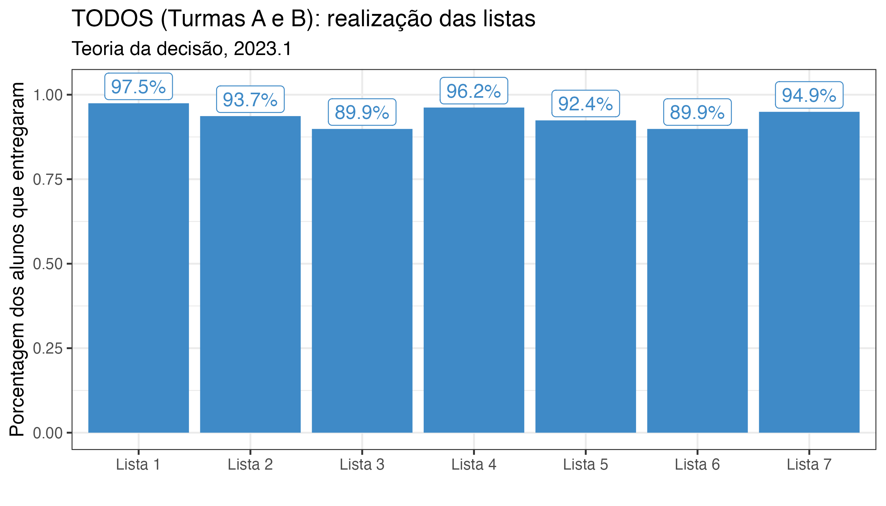
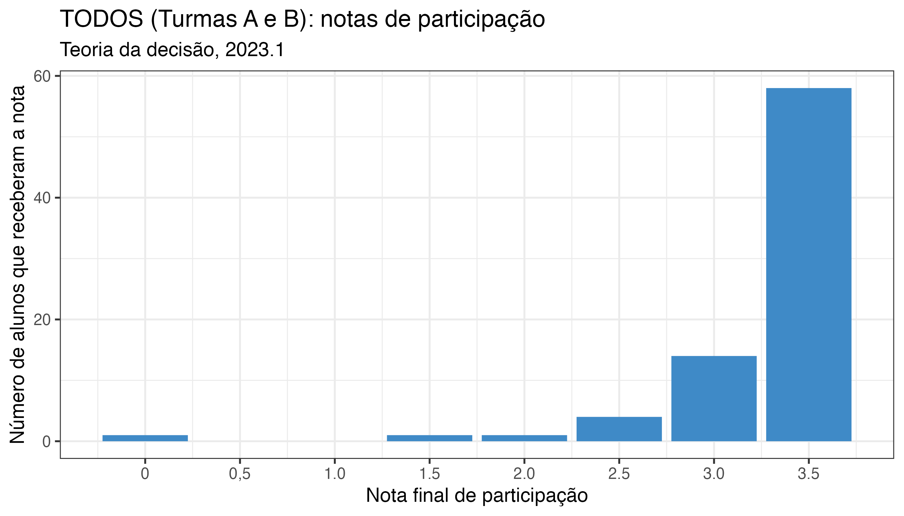
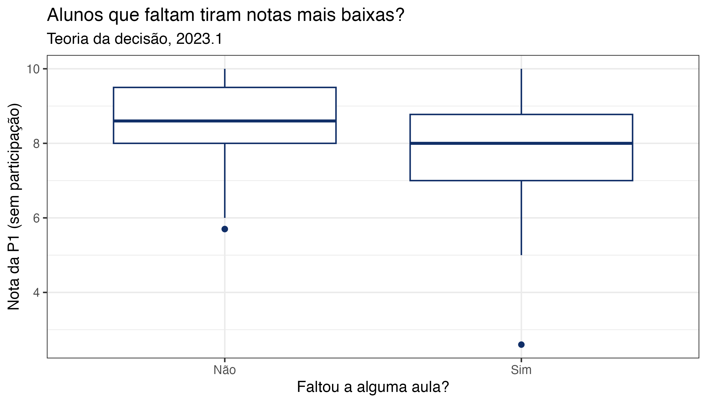
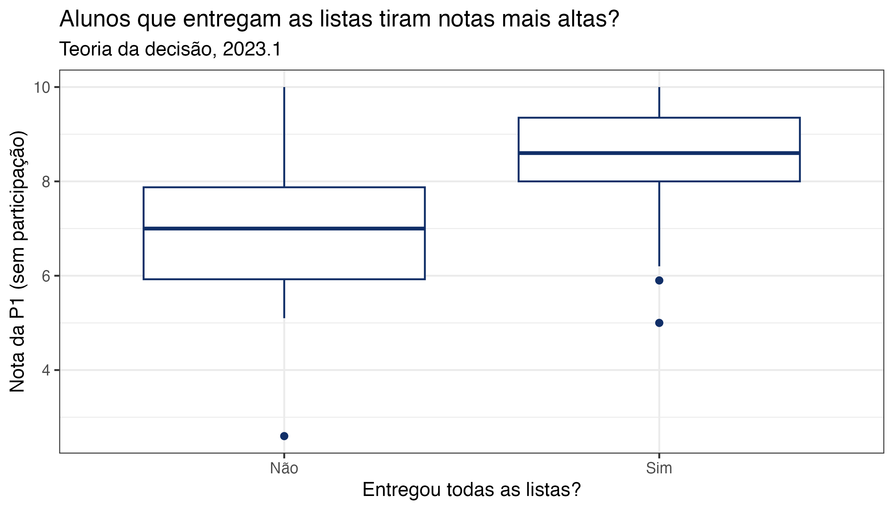

# Aula 13 – Quais são as consequências do consequencialismo jurídico?
**Teoria da Decisão – 2023.1**
Lucas Thevenard

---
<!-- 
paginate: true 
header: Aula 13 – Quais são as consequências do consequencialismo jurídico?
footer: lucas.gomes@fgv.br | 06/06/2023
-->

## Roteiro de aula

- Tom Scott: Money
- Vermeule: 3 estratégias de interpretação
- Prova, participação, aula de revisão

---

# Tom Scott: Money

---

<iframe width="1120" height="630" src="https://www.youtube.com/embed/FJSI7QTAt_o" title="YouTube video player" frameborder="0" allow="accelerometer; autoplay; clipboard-write; encrypted-media; gyroscope; picture-in-picture; web-share" allowfullscreen></iframe>

<a style="color: purple;" href="https://www.youtube.com/watch?v=FJSI7QTAt_o">Money: five youtubers, five games, $10k</a>

---

## Money
- **Jogo 1**: Platonia Dilemma
- **Jogo 2**: Unique Bid Auction
- **Jogo 3**: Public Goods Game
- **Jogo 4**: Pick a Prize
- **Jogo 5**: Ultimatum Game

---

# Vermeule: 3 estratégias de interpretação

---

## O problema do refeitório
- 20 estações com comidas típicas, qual escolher.
* **M**, **O** e **S** escolhem de formas diferentes:
  * **M** vasculha todas exaustivamente, até encontrar aquela que considera a melhor.
  * **O** decide sortear 5 estações aleatoriamente e testá-las para escolher a melhor.
  * **S** decide provar apenas até achar uma que seja boa o suficiente.
  * Quem são **M**, **O** e **S**?
    * **M**aximização, **O**timização e **S**atisfação: três estratégias decisórias.

---

## Estratégias decisórias
* **Maximização**: escolher a ação cujas consequências sejam as melhores para o problema em questão (definindo-se 'melhores' de acordo com algum valor).
* **Otimização**: escolher a melhor ação tendo em vista restrições práticas, levando em conta os custos diretos e custos de oportunidade do processo decisório.
* **Satisfação**: escolher qualquer ação cujos resultados sejam considerados "bons o suficiente" para a resolução do problema.

---

## Uma crítica ao modelo "simplista" da maximização

> Of course no maximizer really considers all things. M wil eventually choose a meal, rather then spending an infinite amount of time evaluating micro-features of the alteinatives. Yet M may spend far more time and effort on th/local choice than would be justified from a second-order, globally maximizing perspective.
> Vermeule, A. **Three strategies of interpretation**, p. 7.

---

## Decisões sob perspectiva estática e dinâmica
- Em um contexto decisório estático em que sabemos as informações relevantes sobre as alternativas, faz sentido não utilizar a maximização?
  * Nesse caso, por que não escolher a solução ótima? 
    - Ela atenderá também às outras duas regras!
* Otimização e satisfação fazem mais sentido em contextos dinâmicos.
  * Na maior parte dos problemas decisórios reais o conjunto de alternativas é, em si, resultado de uma escolha prévia.
  * **Maximização de segunda ordem**: otimização e satisfação não garantem o melhor resultado em uma decisão isolada, mas podem produzir melhores resultados para uma sequência de decisões.

---

## Virtudes dos princípios e das regras

> Maximizing is the ultimate standard: the maximizer does what is best, all things considered, taking into account the totality of the circumstances relevant to the local decision at hand. Optimizing and satisficing strategies both appeal to the higher-order virtues of rules, to the idea that a decisionmaker who takes into account less than the full set of considerations that bear on a particular decision may for a range of reasons do better, over a whole array of decisions, than does the simpleminded maximizer.
> Vermeule, A. **Three strategies of interpretation**, p. 6.

---

## Regra de parada
- Critério importante para decisões reais que demandam busca por informações para delimitar e avaliar as alternativas.
* Otimização vs. Satisfação: diferentes regras de parada
  * **Otimização**: pára quando o benefício marginal esperado da informação se torna inferior ao custo marginal da busca.
  * **Satisfação**: pára quando uma opção "boa o suficiente" é encontrada. 

---

## Maximização, otimização e satisfação como estratégias interpretativas
*  **Otimização**: evitar custos decisórios e erros de interpretação.
*  **Satisfação**: evitar "perfeccionismos localizados" que não contemplam de forma mais geral o problema.
* Dois exemplos:
  * **Intencionalismo**: histórico legislativo e a regra do significado claro (*plain meaning rule*).
  *  **Textualismo**: abordagem "holística" ou fechamento interpretativo ao analisar textos legais.

---

> In the statutory arena, the Court has at times adopted a strong presumption of textual coherence across whole statutes, on the view that textual similarities and differences across provisions are at least presumptively significant. Justice Scalia's opinion for the Court in West Virginia University Hospitals v. Casey goes even further, suggesting that interpreters should treat the whole U.S. Code as though terms are used consistently across statutes. In constitutional interpretation, Akhil Amar defends an "intratextualist" view that makes extensive use of comparisons across clauses, even to the point of insisting that words appearing in widely separated contexts be given similar meanings.
> Vermeule, A. **Three strategies of interpretation**, p. 13.

---

## Interpretações sistemática e integrativa
> Juarez Freitas coloca em realce que a «interpretação sistemática tem por objeto o sistema jurídico na sua condição de totalidade axiológica» (I), alertando para a circunstância de que «qualquer norma singular só se esclarece plenamente na totalidade das normas, dos valores e dos princípios» (2). A autêntica exegese sempre constitui, para além dos atomismos, «uma aplicação do Direito em sua totalidade» (3), isto é, do Direito como «rede axiológica e hierarquizada de princípios gerais e tópicos, de normas e de valores jurídicos» (4).
> Pasqualini, Alexandre. **Sobre a interpretação sistemática do Direito**, p. 95.

---

> Ele [o intérprete] deve, antes de tudo, referir-se às concepções dominantes na consciência social da época em que a norma foi instituída e, assim, descobrir a avaliação legislativa imanente e latente nela; além disso, deve levar em conta as modificações de orientações normativas acrescidas no ambiente em que a norma teve vigor: somente assim terá condições de entendê-la e aplicá-la segundo o seu espírito. O nexo imanente entre esclarecimento e desenvolvimento integrativo configura este último, pelo menos em linha de princípio, como um processo de auto-integração: auto-integração essa que a ordem jurídica exige, e à qual devem prover, em razão do seu ofício, os órgãos da jurisdição. Para a missão de tais órgãos, opera-se, junto à aplicação do direito e por meio da interpretação, a indispensável auto-integração da ordem jurídica.
> Betti, Emilio. **Interpretação da lei e dos atos jurídicos: teoria geral e dogmática**, p. 52-53.

---

## Otimização ou satisfação?
- Ao otimizar, como saber o valor da próxima informação?
  * Um problema contextual, mas não fundacional.
    - Há situações em que temos como saber se vale à pena continuar buscando alternativas, sobretudo em tarefas semelhantes.
* O que constitui um nível satisfatório e por que nos contentamos com ele?
  *  Novamente depende do contexto.
     - Há casos em que o nível de aspiração é bem determinado por forças exógenas (refeitório), ao passo que em outros casos o processo é endógeno.
* Não há uma opção necessariamente melhor, do contexto decisório (avaliação dos custos informacionais, delimitação das alternativas e potencial de ganhos ou perdas).

---

## Por que insistimos em maximizar?
- **Motivação auto-interessada**: Argumento conspiratório de Jeremy Bentham.
* **Externalização de custos**: Argumento econômico de Peter Schuck, maximizadores não arcam integralmente com os custos da complexidade decisória.
* **Desconsideração de custos de oportunidade**: Argumento cognitivo elaborado pelo próprio Vermeule, custos diretos são mais evidentes do que custos de oportunidade.
  * **Força distorciva dos casuísmos (heurística de saliência)**: Peso desproporcional atribuído a casos específicos mais apelativos.

---

> (...) second-order interpretive strategies suffer from the distorting force of particulars. Maximizers will always be able to point to lurid examples in which second-order strategies produce suboptimal results, even if second-order strategies are best from some overall perspective. Such examples pack a strong rhetorical punch (...)

> I conclude with some mixed notes of pessimism and optimism. If simpleminded local maximizing is intellectually untenable, it is also remarkably persistent in the theory and practice of legal interpretation (...) 

##### *Vemeule, A. **Three strategies of interpretation**, p. 21.*

---

## Consequencialismo de 'segunda-ordem'
- Quais são as consequências do consequencialismo jurídico?
  - Juízes devem frequentemente tomar decisões que maximizam valores ou objetivos sociais?
  - A análise de consequências concretas deve fazer parte da prática usual dos tribunais?
- **Sunstein**: O formalismo deve ser defendido empiricamente?

---

# Prova, participação, aula de revisão

---

---

---

---

---

## Sobre a prova (P2)
- Prova escrita, presencial e sem consulta a nenhum material.
- 5 questões:
  - 1 retirada diretamente das listas
  - 1 de V ou F (com justificativa)

### Cálculo da Nota
 

$$N_1 = (0,8 * P_1) + L$$
$$N_2 = (0,8 * P_2) + L$$
 

$$NF = \frac{N_1 + N_2}{2}$$

