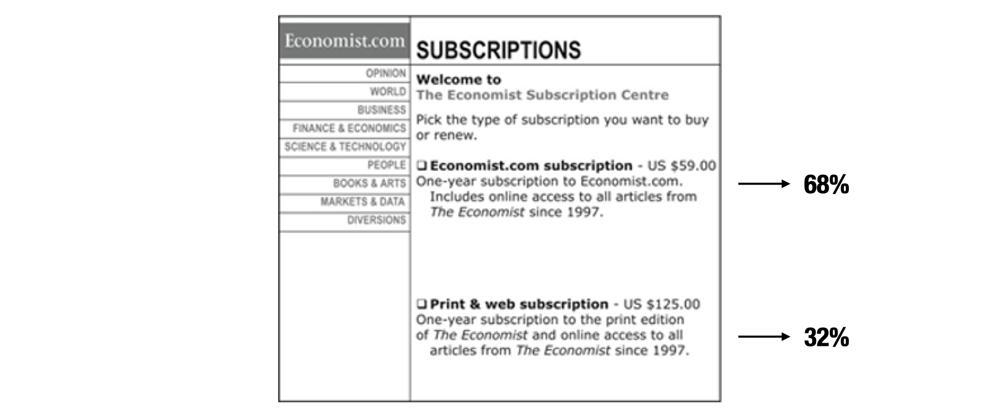
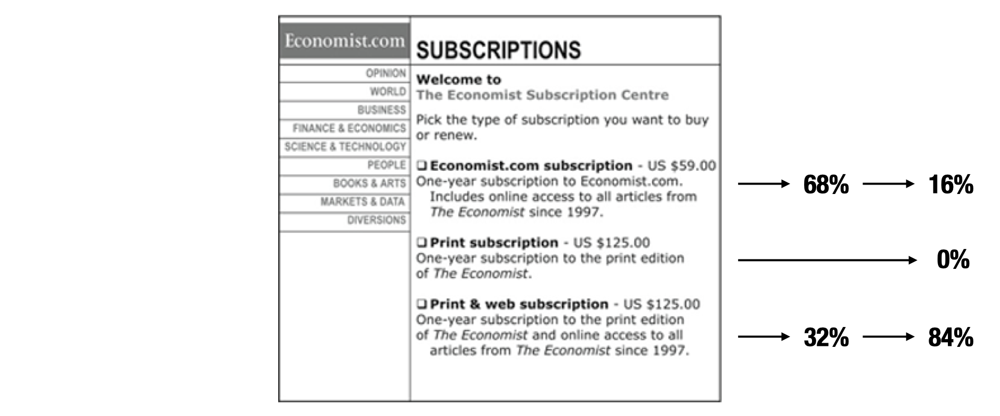
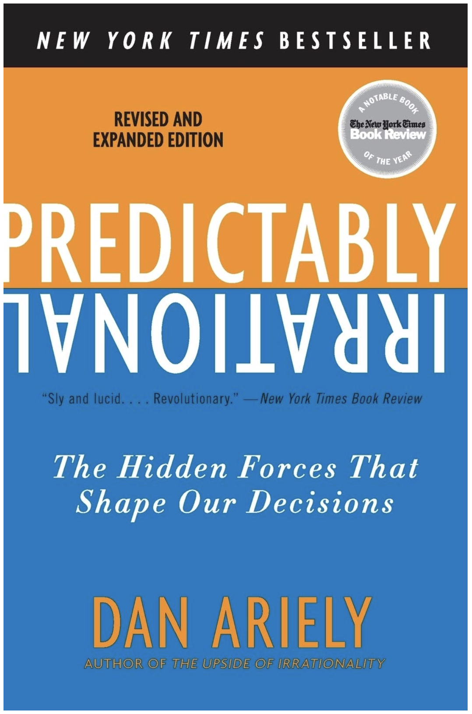
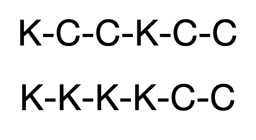
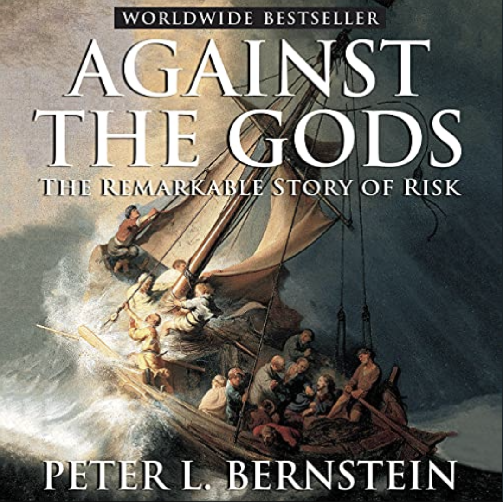
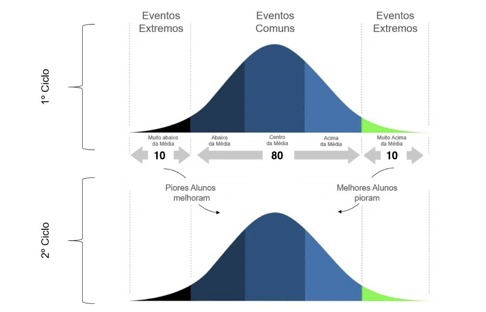

# Aula 11 – Vieses e heurísticas em julgamentos sob condição de incerteza
**Teoria da Decisão – 2024.1**
Lucas Thevenard

---
<!-- 
paginate: true 
header: Aula 11 – Vieses e heurísticas em julgamentos sob condição de incerteza
footer: lucas.gomes@fgv.br | 28/05/2024
-->

## Roteiro de Aula
- Racionalidade Limitada
- Heurísticas e vieses comportamentais
- Julgamentos sob condições de incerteza
  * Representatividade
  * Disponibilidade
  * Ancoragem

---

# 1. Racionalidade Limitada

---

## Herbert Simon – Racionalidade Limitada

- Simon ganhou o Nobel de Economia (1978) por ter desenvolvido o conceito de **racionalidade limitada** ('Bounded Rationality').
* Pesquisas com especialistas buscam entender como indivíduos de fato tomam decisões relevantes (divergências da teoria da escolha racional).

##### Simon, H. A. (1955). A behavioral model of rational choice. The quarterly journal of economics, 69(1), 99-118.
##### Simon, H. A. (1972). Theories of bounded rationality. Decision and organization, 1(1), 161-176.

---

## O conceito de racionalidade

- A teoria da escolha racional presume racionalidade perfeita. 
  - **Racionalidade Perfeita**: indivíduos tomam decisões que maximizam sua utilidade esperada.
- Presunção pouco realista em cenários reais.

---

## Conceito de Racionalidade Limitada
- Reconhece limitações da humanas que impõem altos custos à racionalidade
  * Limitação de foco e atenção
  * Limitação computacional
  * Limitações informacionais
* Sunstein, Jolls e Thaler: Homo aeconomicus VS. Pessoas reais
  - Racionalidade limitada
  - Auto-interesse limitado
  - Força de vontade limitada

---

### Dan Ariely – Preferências relativas

---

### Dan Ariely – Preferências relativas

---

### Dan Ariely – Preferências relativas

---

### Dan Ariely – Preferências relativas

---

### Dan Ariely – Preferências relativas

---

## Implicações da Racionalidade Limitada

* O melhor modelo para tomada de decisões humanas em contextos econômicos e organizacionais não pode basear-se em racionalidade perfeita
  * Mudança de racionalidade absoluta para racionalidade relativa
  * O processo de tomada de decisão é 'satisfatório' (satisfacing) em vez de 'otimizador' (optimizing)
  * Explica fenômenos como heurísticas, viéses e regras práticas na tomada de decisão
* **Racionalidade Limitada na Economia Moderna e Psicologia**
  - O conceito influenciou a Economia Comportamental, a Psicologia Cognitiva e a Teoria Organizacional

---

# 2. Heurísticas e vieses comportamentais

---

---

---

## Kahneman: prevalência do sistema 1
- Detectar que um objeto está mais distante que outro. 
- Orientar-se em relação à fonte de um som repentino.
- Completar a expressão “pão com...”
- Fazer “cara de aversão” ao ver uma foto horrível.
- Detectar hostilidade em uma voz.
- Responder 2+2=?
- Ler palavras em grandes cartazes.
- Compreender sentenças simples.

---

## Kahneman: prevalência do sistema 2
- Manter-se no lugar para o tiro de largada numa corrida.
- Concentrar-se na voz de determinada pessoa em uma sala cheia e barulhenta.
- Procurar uma mulher de cabelos brancos.
- Sondar a memória para identificar um som surpreendente.
- Manter uma velocidade de caminhada mais rápida do que o natural para você.
- Contar as ocorrências da letra a numa página de texto.
- Dizer a alguém seu número de telefone.
- Preencher um formulário de imposto.

---

## Origem da distinção entre sistema 1 e sistema 2
- Michael Posner e Charles Snyder – Teoria do controle cognitivo:
  - Posner, M. I., & Snyder, C. R. R. (2004). Attention and Cognitive Control. In D. A. Balota & E. J. Marsh (Eds.), Cognitive psychology: Key readings (pp. 205–223). Psychology Press. 
- Tentativa de distinguir objetivamente processos automáticos e controlados
-  Posteriormente, Keith Stanovich e Richard West cunharam as expressões "Sistema 1" e "Sistema 2"
   -  Stanovich, K. E., & West, R. F. (2000). Individual differences in reasoning: Implications for the rationality debate? Behavioral and Brain Sciences, 23(5), 645-665.

---

## Processos automáticos (Posner & Snyder)
- São desencadeados involuntariamente;
- Requerem apenas uma pequena quantidade de recursos cognitivos;
- Não podem ser interrompidos voluntariamente; e
- Acontecem inconscientemente.

---

## Processos controlados (Posner & Snyder)
- São desencadeados intencionalmente;
- Requerem uma quantidade considerável de recursos cognitivos;
- Podem ser interrompidos voluntariamente; e
- Acontecem conscientemente.

---

## Compreensão crítica teoria 
- **John Bargh**: A maior parte dos processos cognitivos não satisfazem às quatro condições estabelecidas (nem automáticos, nem controlados)

## Erros/simplificações comuns
- Ideia de que os sistemas estão representados em nossa estrutura cerebral
- Ideia de que o sistema 1 antecede o sistema 2
- Ideia de que o sistema 1 é responsável por vieses, enquanto o sistema 2 produz decisões racionais

---

## Heurísticas e vieses comportamentais:
* Heurísticas são “atalhos mentais” que adotamos para simplificar certos processos mentais.
* Em alguns casos, esses ‘atalhos’ geram desvios cognitivos sistemáticos com efeitos adversos sobre forma como seres humanos se comportam em geral, os chamados **vieses comportamentais**.
* O estudo de vieses pode ser relevante porque, por afetarem consistentemente o comportamento humano, esses desvios geram **consequências sociais relevantes**.

---

## O sistema 1 é um vilão?

- Heurísticas são irracionais?
- Por que precisamos de “2 formas de pensar”?

---

### IMPORTANTE
### Heurísticas ≠ Vieses!
 

* Heurísticas são necessárias e eficientes, na medida em que reduzem custos cognitivos permitindo que decisões e análises complexas sejam simplificadas.
* Vieses ocorrem, excepcionalmente, quando heurísticas falham de forma previsível, levando a erros sistemáticos de julgamento.

---

## Estudos comportamentais e o Direito

* **Regulação**: Comportamentos previsivelmente irracionais podem ser antecipados e considerados na formulação de políticas públicas.
  * Pode ser necessário intervir em situações em que agentes econômicos se beneficiam sistematicamente de vieses cognitivos dos indivíduos.
  * **Consequencialismo**: as reais consequências de uma decisão podem depender de desvios comportamentais. Como prever comportamentos reais?

---

[Projeto Adoce: Acordos após ingestão de Dextrose Observados em Conciliações Judiciais (processuais) e Extrajudiciais (pré-processuais).](https://amaerj.org.br/wp-content/uploads/2019/10/Projeto-Adoce.pdf)

---

# 3. Julgamentos sob condições de incerteza

---

## Três tipos de heurísticas em julgamentos sob condição de incerteza

- O que são heurísticas de representatividade?

---

## Três tipos de heurísticas em julgamentos sob condição de incerteza

- **Heurísticas de representatividade**
  - Qual é a probabilidade que o evento/objeto A pertença à classe ou processo B?

---

## Três tipos de heurísticas em julgamentos sob condição de incerteza

- O que são heurísticas de representatividade?
- O que são heurísticas de disponibilidade?

---

## Três tipos de heurísticas em julgamentos sob condição de incerteza

- **Heurísticas de representatividade**
  - Qual é a probabilidade que o evento/objeto A pertença à classe ou processo B?
- **Heurísticas de disponibilidade**
  - Qual é a frequência com a qual certo tipo de evento ocorre? Qual é a plausibilidade de um evento em particular?

---

## Três tipos de heurísticas em julgamentos sob condição de incerteza

- O que são heurísticas de representatividade?
- O que são heurísticas de disponibilidade?
- O que são heurísticas de ancoragem?

---

## Três tipos de heurísticas em julgamentos sob condição de incerteza

- **Heurísticas de representatividade**
  - Qual é a probabilidade que o evento/objeto A pertença à classe ou processo B?
- **Heurísticas de disponibilidade**
  - Qual é a frequência com a qual certo tipo de evento ocorre? Qual é a plausibilidade de um evento em particular?
- **Heurísticas de ancoragem**
  - Qual é o valor de A, dado o valor B?

---

## Probabilidades condicionais (Bayes)
- Existe um teste que identifica se uma pessoa tem uma doença genética. O teste tem uma acurácia de 80%.
  - Em 20% dos casos positivos ele dá falso negativo.
  - Em 20% dos casos negativos ele dá falso positivo.
-  Você recebe positivo no teste. É provável que você esteja doente?
* E se a doença genética atinge 5% da população?
  - Para testar, vamos construir um exemplo de uma população com 300 pessoas.

---

---

---

## Falácia bayesiana – Exemplo
* 300 indivíduos na população.
  * Têm a doença (5%): 15
    * Verdadeiro positivo (80%): 12
    * Falso negativo (20%): 3
  * Não têm a doença (95%): 285
    * Verdadeiro negativo (80%): 228
    * Falso positivo (20%): 57
* **Chances de o positivo ser verdadeiro**: verdadeiros positivos / total de positivos
  - $\frac{12}{(57+12)} = \frac{12}{69} \approx 17,4\%$

---

## Representatividade

> "Steve é muito tímido e retraído, invariavelmente prestativo, mas com pouco interesse nas pessoas ou no mundo real. De índole dócil e organizada, tem necessidade de ordem e estrutura, e uma paixão pelo detalhe. Há maior probabilidade de Steve ser um bibliotecário ou um fazendeiro?"

* A maior parte dos entrevistados responderam que Steve era um bibliotecário, ainda que haja 20x mais fazendeiros do que bibliotecários nos Estados Unidos.
* Viés decorrente da desconsideração das probabilidades antecedentes quando fazemos um julgamento.

---

## Representatividade

- Engenheiro ou advogado?

> Analise, a seguir, a descrição de um profissional (Dick) retirado aleatoriamente de um grupo contendo 20 pessoas, sendo 6 delas engenheiros e o restante advogados. Indique qual considera ser a chance de Dick ser um advogado ou um engenheiro.
> ...
> "Dick é um homem de 30 anos de idade. É casado e não tem filhos. Um homem de grande capacidade e elevada motivação, promete ser muito bem-sucedido em sua área. Ele é estimado pelos colegas."

---

## Representatividade

- Engenheiro ou advogado?
  - Qual foi a probabilidade atribuída pelos participantes?
* Descrição destinada a não favorecer nenhum resultado. 
  - **Resultado**: diversos participantes escolheram 50% de Dick ser engenheiro ou advogado, mesmo com a informação de que apenas 30% eram engenheiros.

---

### Representatividade:
### Qual é a probabilidade que o evento ou objeto A pertença à classe ou processo B?
 

---

## Representatividade

* Imagine um vaso cheio de bolas, das quais 2/3 são de uma cor e 1/3 de outra.
  * O indivíduo A tirou 5 bolas do vaso, e descobriu que 4 eram vermelhas e 1 era branca.
  * O indivíduo B tirou 20 bolas e descobriu que 12 eram vermelhas e 8 eram brancas.
* Qual dos dois indivíduos deve se sentir mais confiante de que o vaso não contém 2/3 de bolas brancas? 
  * A maior parte das pessoas acha que A deveria estar mais confiante, quando na verdade B deveria estar mais confiante.

---

## Representatividade – Tamanho amostral
- O caso das bolas mostra que as pessoas consideram menos provável uma prevalência de bolas brancas quando a proporção de vermelhas é maios.
  - Indivíduo A: 80% de vermelhas
  - Indivíduo B: 60% de vermelhas
- No entanto, ao fazerem essa análise **desconsideram o tamanho da amostra utilizada**.
  - 20 bolas pelo indivíduo B, ou seja, 4x mais do que o indivíduo A

---

## Representatividade
- Observe três notas de um aluno, selecionadas ao acaso de seu boletim, a seguir:
  - **Aluno A**:
    - 8,0
    - 8,0
    - 8,0
  - **Aluno B**:
    - 7,0
    - 8,2
    - 8,8
- Quão fácil é prever o CR de cada aluno? Qual é o mais previsível?

---

## Representatividade – validade
- **Ilusão de validade**: nível excessivamente alto de confiança em padrões repetitivos.
- **Problema**: observações redundantes ou correlacionadas têm menos importância do que observações independentes.

---

## Representatividade
- Você está observando a roleta em um casino. Você nota que sairam casas pretas nas últimas 5 rodadas da roleta. 
- O que é mais provável de sair na próxima rodada, preto ou vermelho?
* Problema conhecido: falácia do jogador.
  - Seres humanos erram sistematicamente ao lidar com probabilidades. 

---

## Representatividade
- Considere lances sucessivos de uma moeda para obter cara (K) ou coroa (C), qual das sequências a seguir é mais provável?

* Ambas têm a mesma chance de ocorrer: $\frac{1}{2^6}=\frac{1}{64}$

---

### Problema de Monty Hall (apresentador)

---

---

### Regressão à Média
- Efeito disciplinar, ou tendência estatística natural?

---

## Heurística de representatividade
- Insensibilidade a probabilidades antecedentes
- Insensibilidade ao tamanho amostral
- Insensibilidade à previsibilidade
- Ilusão de validade
- Erros de probabilidade
- Desconsideração da regressão à média

---

## Disponibilidade
- O que é mais perigoso?

---

## Disponibilidade
- Do que as pessoas têm mais medo?

---

## Disponibilidade – recuperabilidade
- Listas de celebridades divididas entre homens e mulheres.
- Após a leitura, era perguntado se a lista possuía mais homens ou mais mulheres.
* Na lista em que os homens eram celebridades mais conhecidas, a maior parte dos participantes achou que havia mais homens, mesmo quando o oposto era verdade.
* Na lista em que as mulheres eram as celebridades mais famosas, o contrário ocorreu.

---

## Disponibilidade – ajuste de busca
- Perguntou-se o que era mais comum: palavras que iniciam com uma certa letra (b, r, a, etc) ou que têm aquela letra na terceira posição.
* Dificuldade de se fazer buscas mentais por palavras que têm uma letra na terceira posição.
* Resultado: entrevistados respondiam que palavras iniciando com aquela letra eram mais comuns, mesmo nos casos em que isso não se verifica em língua inglesa (r ou k, por exemplo).

---

## Disponibilidade – imaginabilidade
- Estimativas de quantos comitês de k membros podem ser escolhidos entre 10 pessoas, sendo 2 ≥ k ≥ 8.
- Para calcular, devemos usar a fórmula de combinações:

$$\binom{10}{k} = \frac{10!}{k!(10-k)!}$$

* Essa operação atinge o seu valor máximo para k = 5, chegando a 252 comitês distintos. Mas em que casos você acha que os participantes previram mais combinações possíveis?
  * As pessoas estimaram menos combinações possíveis para os menores valores de k.

---

## Disponibilidade – correlação ilusória ou associativa
- Quando existem poucos fatores associados, ou associações pouco significativas, é provável que elas sejam sobredimensionadas.
* Exemplo: teste do ‘desenhe um humano’. Pessoas fazem previsões precipitadas sobre doenças mentais com base no teste.
  * Reconstrução do ‘folclore clínico’ que existiu no passado no laboratório. 
* Obs: Cesare Lombroso e a teoria do ‘homem delinquente’.

---

## Heurística de disponibilidade
- Vieses de recuperabilidade de ocorrências.
- Vieses devido a ajustes de busca.
- Vieses de imaginabilidade.
- Correlação ilusória ou associativa.

---

## Ancoragem
- Dois grupos de estudantes do colegial estimaram, em 5 segundos, uma expressão numérica que foi escrita no quadro-negro.
  * O primeiro grupo estimou o produto de:
    - $8 \times 7 \times 6 \times 5 \times 4 \times 3 \times 2 \times 1$
  * O segundo grupo estimou o produto de:
    - $1 \times 2 \times 3 \times 4 \times 5 \times 6 \times 7 \times 8$
  * A estimativa mediana para a sequência ascendente foi 512, enquanto a estimativa mediana para a sequência descendente foi 2.250. 
    - **Ajuste insuficiente**: A resposta correta é 40.320.

---

## Ancoragem
- Experimento pedia para participantes estimarem o número de países africanos que fazem parte da ONU.
  - Um grupo partia de 10 e subia de 5 em 5
  - Um grupo partia de 65 e descia de 5 em 5
* Qual foram as estimativas médias de cada grupo?
  * Grupo que partiu de 10: média estimada de 25 países
  * Grupo que partiu de 65: média estimada de 45 países
* Referência de partida, quando há ajustes sucessivos de valoração, tende a gerar um efeito sobre o resultado final.

---

## Ancoragem
- O que é mais provável?
  * (i) extrair uma bola de gude vermelha de um saco contendo 50% de bolas vermelhas e 50% de bolas brancas; 
  * (ii) extrair uma bola de gude vermelha sete vezes em sucessão de um saco contendo 90% de bolas vermelhas e 10% de bolas brancas; e 
  * (iii) extrair uma bola vermelha pelo menos uma vez em sete tentativas sucessivas de um saco contendo 10% de bolas vermelhas e 90% de bolas brancas.
* (i) 50%; (ii) 48%; (iii) 52%
  - Participantes preferiram apostar em (ii) do que em (i) e em (i) do que em (iii).

---

## Ancoragem - disjunção / conjunção de eventos
- **Viés**: as pessoas tendem a superestimar a probabilidade de eventos conjuntivos e a subestimar a probabilidade de eventos disjuntivos. 

---

## Ancoragem - disjunção / conjunção de eventos
* **Problema do planejamento**: realizar uma tarefa complexa exige a avaliação de uma sequência de passos necessários (evento conjuntivo). 
  - Tendemos a superestimar a probabilidade de sucesso do plano.
* **Problema do risco**: Riscos de acidentes podem envolver cenários em que diversas medidas de seguranças concomitantes devem ser garantidas, pois se apenas uma delas falhar há o acidente (evento disjuntivo).
  -  Tendemos a subestimar riscos nesses casos.

---

## Heurística de Ancoragem
- Ajuste insuficiente.
- Avaliação de eventos conjuntivos e disjuntivos.

---

## Recapitulando: Julgamentos sob incerteza
* **Heurísticas de representatividade**
  * Qual é a probabilidade que o evento/objeto A pertença à classe ou processo B?
* **Heurísticas de disponibilidade**
  * Qual é a frequência com a qual certo tipo de evento ocorre? Qual é a plausibilidade de um evento em particular?
* **Heurísticas de ancoragem**
  * Qual é o valor de A, dado o valor B?